# 英国 19 大金融科技和保险科技公司

> 原文：<https://www.stxnext.com/blog/top-fintech-insurtech-companies-uk/>

 金融科技和保险科技的垂直业务在英国正以令人难以置信的速度增长。仅在 2021 年，金融科技行业就吸引了创纪录的116 亿美元的投资——接近欧洲所有投资的一半。

这种快速增长在很大程度上可以归功于该国世界级的人才、有利于商业的法规以及容易获得的资本。有了这种结合，英国是各种形式和规模的金融企业的天作之合。

在本文中，我们将重点介绍 19 家最令人兴奋的英国金融科技和保险科技公司，它们值得我们在未来密切关注。请继续阅读，了解我们的名单上有哪些组织！ 

#### 1。 [革命](https://www.revolut.com/)

*   **成立时间:2015 年**

*   **总部:伦敦**

*   **跟随革命号** [**领英**](https://www.linkedin.com/company/revolut/)

Revolut 由 Nik Storonsky 和 Vlad Yatsenko 创建，是一家 neo 银行，它让超过 2000 万个人和 95 万家企业能够通过一个应用程序管理他们的支出。

2021 年，该公司获得了由软银愿景基金 2 和老虎环球共同牵头的 8 亿美元 E 轮融资，使其总估值达到 330 亿美元，成为英国最有价值的金融科技公司。

Revolut 首席执行官尼古拉·斯托龙斯基(Nikolay Storonsky)在谈到这笔资金时表示，这笔投资将进一步推动该公司“建立一个全球金融超级应用程序，使客户能够通过单一平台管理他们的所有金融需求”的使命。

#### 2。 [睿智](https://wise.com/)

*   **成立时间:2011 年**

*   **总部:伦敦**

*   **跟随智者上** [**领英**](https://www.linkedin.com/company/wiseaccount/)

Wise 以前的 Transferwise 是一个跨境支付平台，允许企业和个人在国际上发送、支出和接收资金。

Skype 校友 Taavet Hinrikus 和德勤校友 Kristo krmann 对向海外汇款的成本感到沮丧，他们决定创造一种更有效的汇款方式。

如今，Wise 服务已在 80 多个国家提供，支持 54 种不同的货币，包括罗马尼亚列伊(RON)和波兰兹罗提(PLN)。

Wise 已经从硅谷银行和 Index Ventures 等投资者那里筹集了 13 亿美元的资金。2021 年，这家金融科技巨头成为伦敦证券交易所的上市公司。

#### 3。 [文三银行](https://monzo.com/)

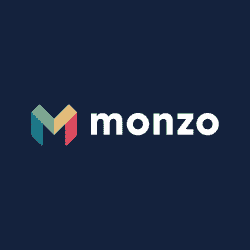

*   **成立时间:2015 年**

*   **总部:伦敦**

*   **跟随文三银行上** [**领英**](https://www.linkedin.com/company/monzo-bank/)

蒙索银行“肩负着让钱为所有人服务的使命。”他们为英国和美国的 600 多万用户提供数字银行解决方案，如贷款、即时支付、储蓄和收据跟踪。

Monzo 已经从腾讯、Accel 和 Y Combinator 等投资者那里筹集了 11 亿美元的资金。截至 2021 年，这家金融科技公司的估值为45 亿美元。

#### 4。 [八哥银行](https://www.starlingbank.com/)

*   **成立时间:2014 年**

*   **总部:伦敦**

*   **跟随八哥银行上** [**领英**](https://www.linkedin.com/company/starlingbank/)

由安妮·博登创立的斯特林银行是英国第一家数字银行。他们还四次获得最佳英国银行奖。

Starling 提供各种消费者账户(个人账户和联名账户)以及企业账户，并提供当天设置、零月费和易于使用的会计工具。

此外，他们还提供移动银行应用程序，附带即时支出和收入通知、无海外费用或 24/7 客户支持等额外服务。

2022 年，这家金融科技初创公司推出了他们的小型企业预算工具。这个工具允许 Starling 的客户从储蓄空间自动支付直接借记和长期订单。客户也可以直接从他们的账户设置自动支付。

斯特林银行致力于绿色银行和碳中和。2021 年，该公司成为 TechZero 的创始成员，tech zero 是一个致力于应对气候危机的英国科技公司气候行动组织。

#### 5。

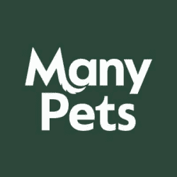

*   **成立时间:2017 年**

*   **总部:伦敦**

*   **关注许多宠物上**[**LinkedIn**](https://www.linkedin.com/company/manypets/)

ManyPets 由史蒂文·孟德尔和盖·伊法利创立，是一家屡获殊荣的宠物保险公司，为全球 50，000 只猫和狗提供保险。

许多宠物客户享受高达 15，000 英镑的兽医费用。他们还可以获得每周 7 天、每天 24 小时的免费视频电话和多宠物折扣。

该公司被评为 2021 年年度宠物保险提供商。他们还获得了 2022 年 Moneyfacts 消费者奖。  #### 6。 [等于金钱](https://equalsmoney.com/)

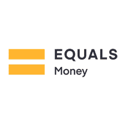

*   **成立时间:2007 年**

*   **总部:伦敦**

*   **追随等于金钱上的** [**领英**](https://www.linkedin.com/company/equalsmoney/)

Equals Money 使企业能够有效地管理现金流，并在全球范围内快速转移资金，因此他们可以更快地扩大规模。它们支持 140 多种货币的国际支付，还提供:

1.  多币种商业账户
2.  费用管理和预算
3.  实体和虚拟公司卡

Equals Money 是 Equals Group 的子公司，Equals Group 是一家在伦敦证券交易所上市的公司。

#### 7 .。 [阿拉伯式资产管理](https://www.arabesque.com/)

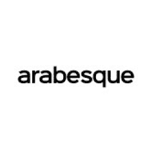

*   **成立时间:2013 年**

*   **总部:伦敦**

*   **跟随阿拉贝斯克上** [**领英**](https://www.linkedin.com/company/arabesque-group/)

Arabesque Asset Management 是一家金融科技公司，投资于定位于长期财务成功的公司。

他们使用人工智能来识别可持续的股票，降低投资风险，并为其投资组合中的公司创造更高的投资回报率。

Arabesque Asset Management 是 Arabesque Group 的子公司，Arabesque Group 是一家全球金融科技公司，其核心服务涵盖投资、咨询和人工智能支持的商业分析。

#### 8。[Zilch](https://www.zilch.com/uk/)

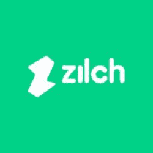

*   **成立时间:2018 年**

*   **总部:维多利亚**

*   **关注 Zilch 上的** [**LinkedIn 上的**](https://www.linkedin.com/company/payzilch/)

Zilch 是一家总部位于英国的 BNPL 金融科技公司。他们提供移动支付解决方案，人们可以通过该方案在接受万事达卡的电子商务网站上进行零利率购物，这些网站包括亚马逊、易贝、ASOS、John Lewis 和乐购。

当 Zilch 客户到达电子商务网站的数字收银台时，他们只需要支付一件商品价格的 25%——其余的可以在六周内支付。如果他们一次付清所有的钱，他们会得到 2%的现金返还！

难怪这家金融科技公司在不到四年的时间里成功获得了 200 多万客户。

Zilch 已经从高斯风险投资公司、DMG 风险投资公司和 Ventura Capital 等投资者那里筹集了 3.893 亿美元的资金。该公司目前估值为 20 亿美元。

#### 9。 [上标](https://gosuperscript.com/)

*   **成立时间:2015 年**

*   **总部:伦敦**

*   **跟随上标上** [**领英**](https://www.linkedin.com/company/superscript-insurance/)

Superscript 以前称为 Digital Risks 为英国的中小型企业提供灵活的基于订阅的保险。

他们提供完全可定制的保险范围，从公共责任保险到个人意外保险，适合 1000 多种业务类型。

2021 年，A 轮保险科技公司成为电商巨头亚马逊的唯一英国保险合作伙伴。

#### 10。

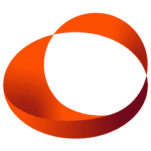

*   **成立时间:2015 年**

*   **总部:伦敦**

*   **跟随 PremFina 上**[**LinkedIn**](https://www.linkedin.com/company/premfina-limited/)

 **PremFina 由 Bundeep Singh Rangar 创立，致力于让每个人都能负担得起、灵活地获得保险。

作为一家保险费金融科技公司，他们为保险公司及其客户提供直接借记支付设施。

该公司已经从一系列科技投资者那里筹集了 3600 万美元的资金，其中包括 Molten Ventures 和 Rakuten Capital。**  **#### 11。 [小枝](https://twigcard.com/)

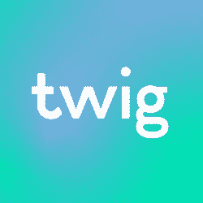

*   **成立时间:2021 年**

*   **总部:大伦敦**

*   **跟着小枝上** [**领英**](https://www.linkedin.com/company/twigofficial/)

Twig 是一个 Web 3.0 绿色支付基础设施，允许人们交易二手家居用品，如衣服。

这个过程既快又简单。一旦你上传了你想要出售的物品，你会得到一个即时报价，如果你接受，你会立即收到你的钱！

他们的目标是帮助人们减少碳足迹，过上更可持续的生活，造福我们的星球。作为 Twig 客户，您还可以获得一个免费的在线支付银行账户和一张在店内购物的借记卡。

#### 12。 [克鲁银行](https://www.kroo.com/)

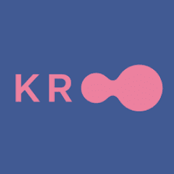

*   **成立时间:2016 年**

*   **总部:伦敦**

*   **跟随克鲁银行上** [**领英**](https://www.linkedin.com/company/getkroo/)

Kroo Bank 提供了一种更简单的方式来管理朋友间的开销。设置 Kroo 帐户是免费的，一旦你将你的朋友添加到应用程序中，你就可以跟踪费用，查看未付款项，或汇款。

据 CrunchBase 报道，“Kroo 已经在五轮融资中筹集了 7150 万美元。他们的最新资金是在 2022 年 5 月 31 日从 B 轮融资中筹集的。”

#### 13。 [米西佩](https://mishipay.com/)

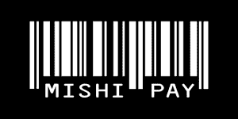

*   **成立时间:2015 年**

*   **总部:伦敦**

*   **关注 MishiPay 上的** [**LinkedIn 上的**](https://www.linkedin.com/company/mishipay/)

MishiPay 为零售企业提供先进的扫描结账解决方案。购物者可以扫描商品的条形码，然后用他们的智能手机支付，又快又简单！

正如一位客户在 G2 的评论中所说，“作为第一次使用 MishiPay 的用户，它给我留下的印象是它支持手机上的网络浏览器。我扫描二维码就能瞬间使用。它允许我在扫描新商品后显示总额，从而控制预算。”

据报道，使用 MishiPay 的企业结账率提高了 87%,节省了员工 9 个小时的时间。

#### 14。[Xelix](https://xelix.com/)

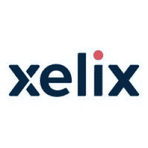

*   **成立时间:2016 年**

*   **总部:伦敦**

*   **跟随 Xelix 上**[**LinkedIn**](https://www.linkedin.com/company/xelix./)

Xelix 正在提供人工智能解决方案，以帮助企业消除常见的支付错误，如不准确的销售税、向错误的供应商转账或重复支付。

像 McBride、Springer Nature 和 Wilko 这样的公司依靠 Xelix 使他们的应付账款流程高效无误。

#### 15。 [乘哩](https://www.bymiles.co.uk/) 乘哩

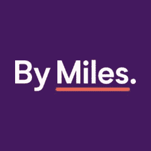

*   **成立时间:2016 年**

*   **总部:哈默史密斯**

*   **循着里程上** [**领英**](https://www.linkedin.com/company/bymiles/)

2021 年，英国的汽车保险费用上涨了 6%—从 522 英镑涨到 554 英镑。谢天谢地，像 By Miles 这样的保险科技初创公司正在为司机提供更灵活的汽车保险政策，以帮助他们省钱。

在按里程支付的情况下，你是按里程支付汽车保险的——字面意思。公司收取固定的年费来支付你停车时的费用。除此之外，你只需支付每月的行驶里程。

不出所料，顾客们爱不释手！一位 Trustpilot 用户说，“虽然我不常开车，但我过去常常为保险支付很多钱。到目前为止，迈尔斯是我找到的最好的东西；我开多少付多少，一个月大概 2 到 4 英镑。”

在 2019 年和 2020 年的保险选择奖中，By Miles 被评为英国最佳汽车保险提供商和最佳保险应用。

#### 16。 [哈比](https://hubbinsure.com/)

*   **成立时间:2019 年**

*   **总部:格拉斯哥**

*   **跟随老公上** [**领英**](https://www.linkedin.com/company/hubbinsure/)

Hubb 让企业买卖保险变得更加容易。他们使用人工智能来分析产品，确保公司拥有满足其需求的最有价值的保险。

insurtech 卓越的产品和服务获得了多项奖项和提名，包括:

1.  2022 年全球科技创业公司
2.  2022 年度金融科技创业公司
3.  格拉斯哥 2022 年度创业公司
4.  2022 年年度颠覆者决赛
5.  2022 年度最佳新人决赛

#### 17。 [遗赠](https://bequest.com/)

*   **成立时间:2019 年**

*   **总部:伦敦**

*   **跟随遗赠上** [**领英**](https://www.linkedin.com/company/bequestlife/)

由詹姆斯·巴克利-索普创立的 Bequest 是一家保险技术公司，提供每月 4 英镑起的平价人寿保险。

顾客可以选择他们想要多少，以及他们想要封面持续多长时间。遗赠会根据这些因素收取固定的保费。这个过程是完全透明的，没有隐藏的费用。

他们还有一个反应超级迅速的支持团队，随时准备提供您需要的所有答案。

#### 18。 [基塔](https://www.kita.earth)

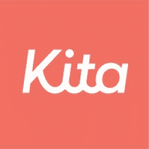

*   **成立时间:2021 年**

*   **总部:伦敦**

*   **跟随基塔上** [**领英**](https://www.linkedin.com/company/kitaearth/)

基塔是“世界上第一家碳保险公司”这意味着他们为碳排放解决方案提供保险。

随着风险的降低，这些支持气候变化的公司可以扩大业务规模，创造更大的影响，并加速实现去碳化世界。

2022 年 5 月，Kita 从 Insurtech Gateway 筹集了 35 万英镑的种子前资金。

#### 19。[Rnwl](https://rnwl.co/)

*   **成立时间:2020 年**

*   **总部:剑桥**

*   **跟随 Rnwl 上**[**LinkedIn**](https://www.linkedin.com/company/rnwl/)

Rnwl 是一个一体化的保险管理应用程序，允许您无缝地跟踪您的所有保险，并有效地管理它们。

作为一名 Rnwl 用户，您将获得最佳的保险交易和续保提醒，外加一键经纪人联系选项。

#### 关于英国前 19 家金融科技和保险科技公司的最终想法

看到英国金融科技领域的增长速度，确实令人兴奋。每天，肩负不同使命的公司涌现出来，提供实用而有价值的解决方案。

然而，这仅仅是个开始——这个行业还有很多未开发的潜力，我们迫不及待地想看看未来会发生什么！

在 STX Next，我们始终关注那些试图用革命性产品改变世界的新兴企业。看看我们整理的其他一些类似的列表:

*   [2022 年英国 9 家最具创新性的金融科技初创公司](/blog/most-innovative-uk-fintech-startups/)
*   [2021 年 Paytech:改变支付市场的十大+英国公司](/blog/uk-paytech-companies/)
*   [使用 Python 的 9 大英国公司](/blog/top-9-noteworthy-uk-companies-using-python/)

您是否正在寻找一双额外的手来帮助您为您的组织开启新的机会并实现您的业务目标？我们可以在这方面提供帮助，无论你的垂直行业是 [金融科技和保险科技](/services/fintech-development/) 还是 [任何其他行业](/services/) 。

你所要做的就是 [给我们写封短信](/hire-us) ，我们会马上回复你的！**