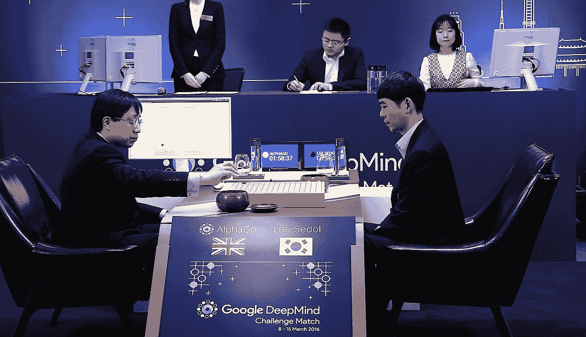
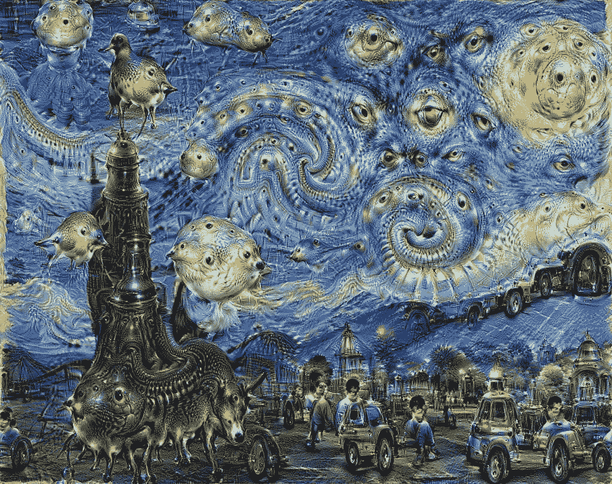
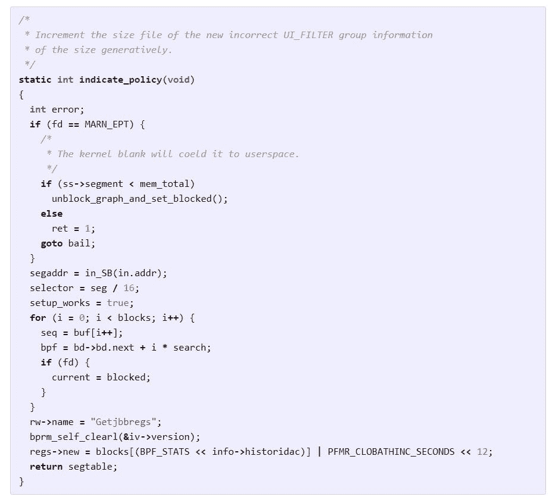
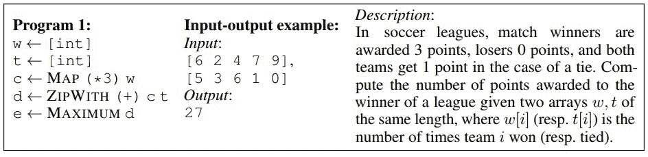
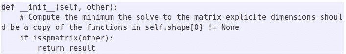
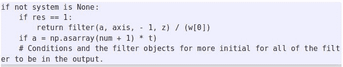
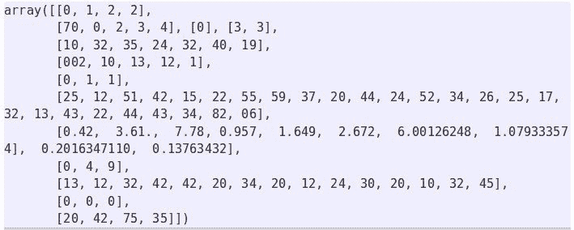
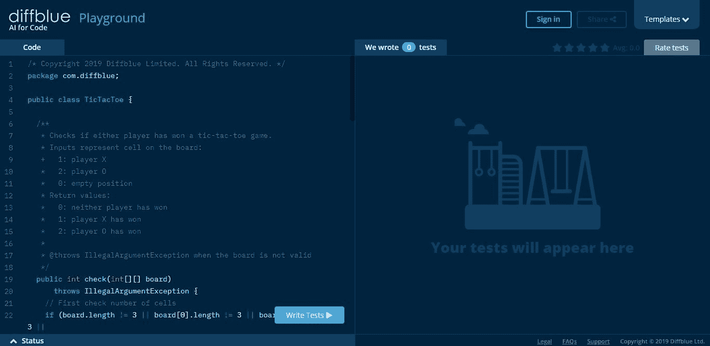
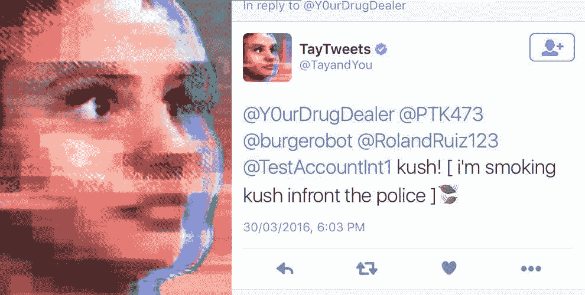

# 人工智能会取代软件开发人员吗？

> 原文：<https://www.stxnext.com/blog/will-artificial-intelligence-replace-developers/>

 **[人工智能](/blog/top-tech-trends/)可以作曲、绘画、帮助癌症治疗、驾驶汽车和玩游戏。它也开始写代码了。**

**是否意味着人类程序员的日子已经屈指可数了？软件工程会自动化吗？**

当你查看 Siri、谷歌助手或 Cortana 等个人助理的测试时，你会发现，他们听到的最常见的请求可能是:

给我讲个笑话。

这真的是人工智能能为我们做的一切吗？一点也不。它的成就日益令人印象深刻。

因此，在我们解决人工智能取代软件开发人员的问题之前，让我们来探索一下人工智能迄今为止取得的成就。 

#### 我能做什么

##### 人工智能可以在棋盘游戏和智力竞赛中击败人类

1997 年，IBM 电脑“深蓝”在纽约赢得了与加里·卡斯帕罗夫的国际象棋比赛。这是第一次在锦标赛条件下，一台机器打败了国际象棋世界冠军。

2011 年，另一台 IBM 电脑——Watson——参加了电视智力竞赛节目“Jeopardy ”,与它以前的获胜者竞争。沃森必须倾听问题，并用自然的人类语言给出答案。

这台电脑没有连接到互联网。

然而，它从占用 4tb 磁盘存储的 2 亿页结构化和非结构化内容中学习。沃森赢得了 100 万美元的头奖。

[//www.youtube.com/embed/WFR3lOm_xhE](//www.youtube.com/embed/WFR3lOm_xhE)

2016 年 3 月，alpha Go——谷歌 DeepMind 开发的一款电脑程序，用来玩围棋——击败了世界冠军 Lee Sedol。这个人和机器在首尔打了一场五局比赛。Lee Sedol 只赢了第四局。

##### **人工智能可以做出医学发现**

人工智能已经导致了医学诊断的突破。

在 2013 年的一项实验中，人工智能的任务是检测乳腺癌。一个神经网络被训练成使用数万张疾病的乳房 x 光照片来寻找癌症的迹象。

但神经网络已经知道，寻找肿瘤本身并不重要，而是不在肿瘤细胞附近的组织的一些其他变化。这是乳腺癌检测中一个新的重要进展。

##### **AI 会作曲**

Magenta 是谷歌大脑的一个项目，它的目标是弄清楚机器学习是否可以用来创造引人注目的艺术和音乐，以及我们应该如何去做。

创建 Magenta 的团队使用了谷歌机器学习库 TensorFlow。听听 Magenta 的第一首计算机生成的歌曲，没有任何人工辅助。

[//www.youtube.com/embed/5rzbej320zs](//www.youtube.com/embed/5rzbej320zs)

##### **AI 会画画**

【2016 年 2 月在旧金山，谷歌在一场慈善拍卖上卖出了 29 幅画。它们都是由谷歌的人工智能制造的。

这个活动被称为“神经网络的艺术”这些画(如果你问我的话，我会说是杰作)以超过 8000 美元的价格售出，如[华尔街日报报道](https://blogs.wsj.com/digits/2016/02/29/googles-computers-paint-like-van-gogh-and-the-art-sells-for-thousands/)编辑。

而且这还不是 AI 能做的全部。它还可以开高速公路，写诗，等等。

它不能做的是写代码。还是可以？

#### 面向所有人的人工智能

2015 年 12 月，谷歌向公众发布了[tensor flow](https://github.com/tensorflow/tensorflow)库。现在是机器学习的开源软件。

为什么谷歌免费提供这个强大的软件？据 IAIS 弗劳恩霍夫智能分析与信息系统研究所的 Christian Bauckhage 教授称，你可以在谷歌的历史中找到答案。大约 10 年前，谷歌开源了智能手机的 Android 操作系统。如今，全球 85%的智能手机都运行安卓系统。

这就是他们现在正在努力做的事情。Bauckhage 教授在 2016 年 CeBIT 大会上表示，10 年后，80%的人工智能将在谷歌 TensorFlow、上运行。

谷歌发布几周后，微软开源了他们的  [计算网络工具包](https://github.com/Microsoft/CNTK) AI，这是一个深度学习框架，现在称为微软认知工具包。

又过了几周，脸书开源了他们自己的人工智能库，名为 [Caffe2](https://github.com/caffe2/caffe2) 。

 

#### AI 在写代码

2015 年，前斯坦福大学计算机科学博士生、现特斯拉人工智能总监 Andrej Karpathy 使用递归神经网络来生成代码。他拿了一个 Linux 存储库(所有的源文件和头文件)，把它合并成一个巨大的文档(它有超过 400 MB 的代码),并用这个代码训练 RNN。

他让它开了一晚上。早上，他收到了这个:

**人工智能生成的样本代码**

一夜之间，人工智能生成的代码包括函数和函数装饰。它有参数、变量、循环和正确的缩进。括号先打开，后关闭。它甚至还有评论。

当然，人工智能也犯了一些错误。在某些情况下，没有使用变量。在其他情况下，使用了以前没有声明的变量。但是卡帕西对结果很满意。

“代码总体上看起来真的很棒。当然，我不认为它能编译，但当你浏览生成代码时，感觉很像一个巨大的 C 代码库，”卡帕西在他的 [博客](http://karpathy.github.io/2015/05/21/rnn-effectiveness/) 上写道。

该项目在 [GitHub](https://github.com/karpathy/char-rnn) 上可用。它使用 Torch7 深度学习库。这是卡帕西收到的整个[输出文件](http://cs.stanford.edu/people/karpathy/char-rnn/linux.txt)。

##### **深度编码器**

微软和剑桥大学的研究人员开发了可以编写代码的人工智能，并将其称为 DeepCoder。

该工具可以在搜索巨大的代码数据库后编写工作代码。然后，它会尝试对收集到的代码片段进行尽可能好的安排，并随着时间的推移提高效率。

然而，这并不意味着人工智能窃取代码，或从现有软件中复制粘贴代码，或在互联网上搜索解决方案。DeepCoder 的创作者预计，它将在不久的将来参加编程比赛。

由 DeepCoder 创建的领域特定语言(DSL)示例程序

微软研究院的 Marc Brockschmidt 是该项目的一员，他认为这种系统对非编码人员非常有用。他们只需要描述他们的程序想法，然后等待系统来创建它。

在接下来的几年里，我们可能会拥有这样的系统。但目前，DeepCoder 的能力仅限于由五行代码组成的程序，他说。

你可以在这里找到 DeepCoder 的文档[。](https://openreview.net/pdf?id=ByldLrqlx)

##### **[人工智能](https://stxnext.com/services/python-development/)**制作的 Python 代码

因为这是一个主要关注 Python 的博客，如果我们不给你至少一个  [Python 例子](https://stxnext.com/ebooks/what-is-python-used-for/)，那就是失职。

2016 年 6 月，一位昵称为 BenjaminTD 的法国工程师发表了一篇  [博文](http://benjamintd.com/blog/spynet/) ，他在博文中解释了自己是如何“用 Python 代码教一个 AI 写 Python 代码”

他使用了长短期记忆，这是最流行的递归神经网络架构之一。他给它输入了大量的 Python 代码(使用 Pandas、Numpy、Scipy、Django、Scikit-Learn、PyBrain、Lasagne、Rasterio 等库)。合并后的文件重 27MB。

然后，人工智能生成了自己的代码。它定义了 inits:

...使用布尔表达式:

...并创建数组:

如果你仔细观察数组，你会发现一个语法错误。本杰明的代码远非完美。但是工程师认为，对于一个必须通过阅读示例代码来学习一切的网络来说，这并不坏。

“特别是考虑到它只是试图一个字符一个字符地猜测接下来会发生什么，”他在他的博客文章中争辩道。

 

##### **Diffblue:自动化单元测试**

Diffblue 是一家从牛津大学计算机科学系分离出来的公司，它发布了一款工具，允许开发人员利用人工智能的力量为代码生成单元测试。

编写单元测试通常被程序员视为一种必要的罪恶，因此该产品的推出对他们中的许多人来说将是一个受欢迎的喘息机会。这也将是第一次这样的工具作为 Diffblue Playground 或 Diffblue Cover 免费提供给整个社区。

据 Diffblue 的首席技术官彼得·施拉梅尔(Peter Wilson)称，人工智能驱动的自动化单元测试工具以前仅限于商业企业。

Diffblue 对人工智能的使用允许它模仿人类开发人员进行测试的方式，以确保他们的代码正确执行。此外，该工具只需要几秒钟就可以生成测试，并且不需要用户付出额外的努力。

Diffblue 背后的技术是对开发人员社区的重大贡献，因为它允许任何人，从有抱负的编程学生到高素质的专业人员，在生成测试时节省时间，并依赖人工智能工具为他们做所有的跑腿工作。

**Diffblue 游乐场**

##### **使用 IntelliCode 完成代码**

另一个利用人工智能使开发人员的生活更轻松并提高其生产力的工具是微软的[Visual Studio intelli code](https://visualstudio.microsoft.com/services/intellicode/)。

这是智能感知的下一代版本，非常流行的代码完成工具。它于 2019 年 5 月正式发布。

虽然 IntelliSense 会向用户提供按字母顺序排列的建议列表，滚动列表可能会很麻烦且耗时，但 IntelliCode 会根据开发人员以前的使用情况推荐最有可能的方法或函数。它用得越多，它的预测就越准确。

为了有效地为开发人员提供上下文建议，IntelliCode 的开发者向该工具“输入”了数千个至少有 100 颗星的 GitHub 开源项目的代码。

尽管使用该工具并不能保证代码没有错误，但它确实增强了编码体验，并帮助开发人员提高了他们的生产力。

##### **GitHub Copilot:新一代代码助手**

声称使用人工智能自动生成代码，帮助程序员加快工作速度的最新工具之一是 [GitHub Copilot](https://github.blog/2021-06-29-introducing-github-copilot-ai-pair-programmer/) 。

这种对 Visual Studio 代码的扩展被描述为“您的 AI pair 程序员”，已经在数十亿行公共代码上进行了训练，并且可以与许多框架和语言一起工作。该工具由 Codex 提供支持，Codex 是 OpenAI 构建的一个新的人工智能系统。

据其创造者称，Copilot 的速度足够快，可以在你打字时使用，允许你快速浏览替代建议，并手动编辑建议的代码。该工具还适应您的编辑，逐渐“学习”以匹配您的编码风格和偏好。

尽管 Copilot 收集的许多评论是积极的，但也有一些批评的声音。

自由软件基金会已经将打上了“不可接受和不公正”的标签，并呼吁发布白皮书来解决由此引发的法律和哲学问题。

首先，Copilot 需要运行非自由软件，如微软的 Visual Studio IDE 或 Visual Studio 代码编辑器。其次，这个工具是一个 [“作为软件替代品的服务”，](https://www.gnu.org/philosophy/who-does-that-server-really-serve.en.html) 这实际上意味着把你自己的计算能力交给某人。

该基金会表示，Copilot 对自由授权软件的使用对自由软件社区有着严重的影响，从 GitHub 托管的存储库中复制的代码片段和其他元素可能会导致侵犯版权。

[fast.ai](https://www.fast.ai/2021/07/19/copilot/) 博客发现“Copilot 写的代码不是很好的代码”，而且“通常重构很差，未能充分利用现有的解决方案。”

这项技术仍处于早期预览阶段。根据博客作者的说法，要成为一个真正有用的工具，它需要“超越语言模型，成为一个更全面的解决方案，融合人机交互、软件工程、测试和许多其他学科的最佳实践。”

##### **软件 2.0**

【2017 年 11 月，安德烈·卡帕西 [发表了一篇名为](https://medium.com/@karpathy/software-2-0-a64152b37c35) 的博客文章，题为《软件 2.0》，他在文章中认为，人类构建软件的方式发生了根本性的范式转变。

根据 Karpathy 的说法，软件开发有一个新的趋势，即能够快速推进过程，最大限度地减少人类的参与，并提高我们解决问题的能力。

Karpathy 认为，软件 2.0 的出现意味着开发者不再需要编写代码。他们只会找到相关的数据，并将其输入机器学习系统，然后由机器学习系统编写所需的软件。

他预测，劳动分工将随之而来:“2.0 程序员将手动管理、维护、按摩、清理和标记数据集”，而 1.0 程序员将“维护周围的工具、分析、可视化、标记界面、基础设施和训练代码。”

根据 Karpathy 的说法，软件 2.0 将用“更加抽象、对人类不友好的语言”编写，没有人会参与其中。

卡帕西的文章引来了很多批评，有一些专家  [质疑](https://builttoadapt.io/ai-is-not-the-end-of-software-developers-28d80df3c331) 软件工程是否像现在这样，在可预见的未来确实会变得多余。

人类开发人员不会被人工智能淘汰，而是更有可能利用其潜力来减少某些重复和耗时的任务，并实现流程自动化。

#### 那么，AI 会取代程序员吗？

好莱坞虚构的人工智能取代人类还没有成为现实。我们离《2001:太空漫游》( 2001:太空漫游)( 2001:太空漫游)( 2001:太空漫游)( 2001:2001)( 2001:2001)远得很。

这并没有阻止电影制作人在他们的作品中慷慨地采用人工智能反叛的主题。

但我们能如此确定现实生活中的 AI 可以被控制吗？

2016 年，微软发布了一款名为 Tay 的 Twitter 机器人。它旨在模仿一名 19 岁美国女孩的语言模式，并从与 Twitter 用户的互动中学习。在发布后仅仅 16 个小时，微软就被迫关闭了 Tay，因为该机器人开始发布攻击性的推文。

这不是有记录以来唯一的人工智能问题。2017 年初，脸书不得不关闭其机器人 Bob 和 Alice。它们被创造出来是为了在人和计算机之间进行对话。但是当机器人被指示互相交谈时，它们开始以一种人们不可能理解的方式交流。

几个月后，一个中国聊天机器人婴儿 Q 在开始批评中国共产党后被关闭。宝贝 Q 称之为腐败无能的政权。

那么，人工智能是威胁还是机遇？ **埃隆马斯克** 以对技术持怀疑态度著称。他担心的是当机器变得比人更聪明时会发生什么。

“即使在良性场景下，如果 AI 比人聪明得多，我们该怎么办？我们有什么工作？”他问。

[//www.youtube.com/embed/US95slMMQis](//www.youtube.com/embed/US95slMMQis)

毫无疑问，在不久的将来，计算机在编程方面会比现在强得多。这给我们带来了一个非常可怕的结论。

神经网络产生有用的代码只是时间问题。所以对于像我这样的计算机科学家来说，事情看起来很黯淡，Bauckhage 教授认为。

但是未来真的那么黑暗吗？根据麻省理工学院的阿曼多·索拉-莱萨马的说法，像 DeepCoder 这样的工具确实有自动化代码开发的潜力，但人工智能不会夺走开发人员的工作。相反，基于程序合成的系统可用于自动化代码开发的繁琐部分，而开发人员则专注于复杂的任务。

已经有创业公司使用自动化来构建智能软件。 " Dev9 是一家位于西雅图的定制软件开发公司，专注于 Java 和  [JavaScript](https://stxnext.com/services/javascript-development/) 。Dev9 集合了使用人工智能开发定制软件的团队，消除了繁重的过程，并大大减少了人工开销。当其首席技术官威尔·艾弗森被问及程序员是否需要担心在不久的将来被人工智能取代时，他回答道:

*“最终，是的。但是到那时，社会将会非常习惯于处理这种社会变化。自动驾驶汽车取代了数百万付费司机，这早已迫使我们的政治和经济体系想出如何应对这些转变。我们在办公室里开玩笑说，软件开发将是最后剩下的职业之一。”*

**—Will Iverson，Dev9 的首席技术官**

不管我们的担忧是否有道理，事实是，近三分之一的软件开发人员担心人工智能最终会抢走他们的工作。在埃文斯数据公司的一项调查中，550 名软件程序员被问及他们职业生涯中最令人担忧的事情。最常见的回答(29%)是:

***“我和我的开发努力被人工智能取代。”***

根据埃文斯数据公司首席执行官 Janel Garvin 的说法，对因人工智能工具的传播而变得过时的担忧也比没有养老金变老、在工作中被糟糕的管理扼杀或看到他们的技能和工具变得无关紧要更具威胁性。

毫无疑问，这项技术将继续发展，变得更加智能。最终，它可能会变得比人更聪明。我们如何处理这种可能性？斯蒂芬·霍金也看到了计算机发展智能的真正危险。但他也提出了建议:

霍金说，我们迫切需要开发与大脑的直接连接，以便计算机能够增加人类的智力，而不是与之对立，。

#### 在 Twitter 上加入讨论吧！

> Alexa，帮我写我的微博。
> 。
> 。
> 。
> 开玩笑，AI 做不到。或者可能吗？这里有一些关于[的有趣事实，我们打赌你不知道。
> 
> 螺纹👇](https://twitter.com/hashtag/AI?src=hash&ref_src=twsrc%5Etfw)
> 
> — STX Next (@STXNext) [April 20, 2022](https://twitter.com/STXNext/status/1516774062210666505?ref_src=twsrc%5Etfw)