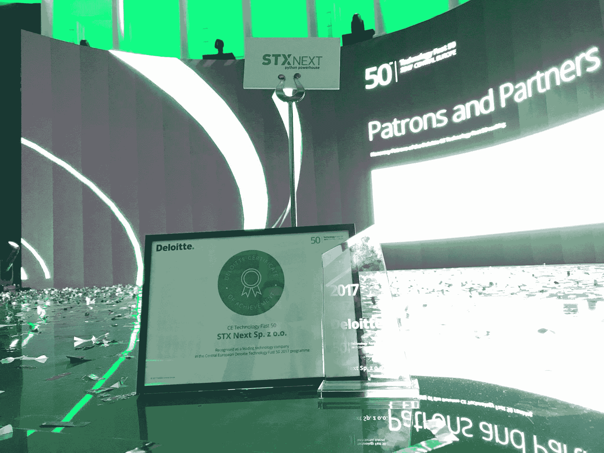

# STX 接下来被列入德勤中欧技术 50 强

> 原文：<https://www.stxnext.com/blog/stx-next-listed-among-deloitte-technology-fast-50-central-europe>

 **S** TX 接下来在 [德勤科技 50 强中欧](https://www2.deloitte.com/content/campaigns/ce/technology/fast-50/fast-50-central-europe.html) 排名上排名第 36。这使得欧洲最大的 Python 软件公司成为该地区发展最快的科技公司之一。 

#### 关于德勤科技 50 强中欧排名

今年是这一声望很高的排名的第 28 届。2017 年，300 家科技公司申请了这一排名，其中名列前茅的公司跻身中欧发展最快的 50 家科技公司。

前几年值得注意的波兰获奖者包括负责巫师游戏传奇的工作室  [CD Projekt](https://www.cdprojekt.com/) 。

今年中欧前 50 强中，有 19 家是波兰公司。排名最高的波兰公司位列第三。今年排名第一的公司是  [Kiwi](https://www.kiwi.com/) ，一家提供便捷航班搜索引擎的捷克公司，增长了 7，165%。

#### STX Next 在德勤排名中的成功

**STX Next 以 408%的增长在今年的技术快速 50 CE 排名中排名第 36 位。** 这标志着 Python 软件之家第一次申请排名，结果受到公司人的热捧。

这个排名证明了 STX Next 一个才华横溢的团队所做的大量辛勤工作。随着我们继续快速增长，我预计我们将在未来几年继续在这个名单上。在我们的最新阶段，我们在全球范围内扩展了我们的软件开发服务，重点是欧洲、亚洲和北美。

STX Next 国际合作主管马修·哈里斯(Matthew Harris)

#### 来自德勤技术 50 强中欧盛会的见解

STX 随后派出两名代表参加了在华沙举行的德勤科技 50 强庆典:Jakub(你友好的社区集客营销专家)和 Christian Mendoza，业务发展助理。他们从活动中回来，留下了深刻的印象，并被新的见解所鼓舞。

也许我们最喜欢的春晚语录来自[UXPin](https://www.uxpin.com/)的首席执行官马辛特雷德。Marcin 在晚会期间上台讲述了他的公司在硅谷的成功，并分享了他从美国引进的一句话:

*企业家睡得像婴儿。他们每隔 2 小时就醒来哭喊* 。

[UXPin](https://www.uxpin.com/)的首席执行官马尔钦·特雷德

晚会上的演讲围绕着波兰的大背景及其在该地区的角色。活动期间解决的问题包括“在更广泛的技术领域，波兰能为自己打造什么品牌？”以及“我们什么时候能看到第一批波兰独角兽和德西科恩斯？”

#### 关于 STX 接下来

STX Next 是欧洲最大的 Python 软件公司，提供一系列的  [软件开发服务](https://stxnext.com/services/)。该公司不断扩大的服务组合包括 Python 和 JS 开发、移动开发、产品设计、软件测试和 DevOps。

STX Next 在市场上已有 12 年的历史，完成了 100 多个项目，现有 150 多名开发人员，它愿意与世界各地的客户建立新的技术合作伙伴关系。

