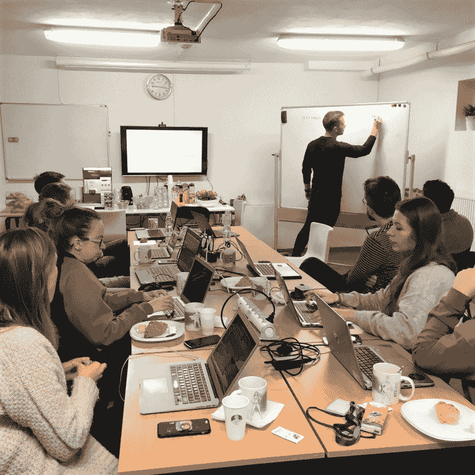

# 如何在 2 天内成为一名 Python 程序员？

> 原文：<https://www.stxnext.com/blog/how-become-python-programmer-2-days/>

 在一个经验丰富的软件公司的博客上找到一篇关于编程入门的文章，可能会让你大吃一惊。

但并不是所有人都以程序员的身份加入 STX Next，今天我想从一个初级集客营销专员的角度分享一下我学习 Python 的经历。

因此，如果你是这个行业的新手，并且你想了解编程研讨会是什么样子，这篇文章完全适合你。

或者，如果您是一名开发人员，并且您想从非程序员的角度了解掌握 Python 基础知识的整个过程，那么也请继续阅读。我希望它将带你踏上记忆之旅，让你想起自己在编程方面卑微的起点。

通过阅读这篇文章，你会发现:

*   为什么 IT 公司的销售和营销团队至少应该知道编码的基本知识；
*   研讨会前的准备工作是什么样的；
*   在没有任何先验知识的情况下，你能在两天内完成多少 Python 编程；
*   学习(即使是在周末)是多么有趣啊！ 

#### 销售和营销团队需要学习如何编码吗？

你可能会问的第一个问题是:

“销售和营销团队真的需要学习如何编码吗？”

“他们只是在销售服务和推广公司，”你可能会这么想。乍一看，他们似乎没有必要去  [学习编码](https://www.ukwebhostreview.com/learn-to-code-for-free)。但是相信我，团队中的所有角色都需要一些技术知识来获得结果。

以我的角色为例。接下来我负责 STX 的社交媒体频道。甚至当我只是试图在 Twitter 或 LinkedIn 上关注行业讨论和对话时，**如果没有编程知识，我就无法参与讨论。试着想象一个场景，你想和社交媒体用户互动，但你不知道他们在说什么！**

另一方面，当你从事销售工作时，你应该非常了解你的产品。在这种情况下，我们用于项目的技术知识是必不可少的。当你在技术层面上熟悉潜在客户面临的问题以及你提出的解决方案时，与他们沟通会容易得多。  **你了解的越多，你就越可靠**——而信任是这个行业最重要的因素之一。

出于上述原因，也出于纯粹的好奇，我们的团队决定扩展他们在编程方面的知识。从 STX Next 的第一天起，我们就听说“Python 很容易学，而且非常有逻辑性。”这次我们想，“好吧，让我们来测试一下。”

#### 很高的期望

我必须承认，我们对即将到来的研讨会感到非常兴奋。我们采取的第一步是创建一个我们想要涵盖的主题列表。名单越来越长，因为每个人都在添加新的想法。

最终，我们得出的结果与学生用 Python 教材的目录非常相似。值得一提的是，通常这样的课程至少持续半年。我们的团队应该有两天的研讨会。

我们让我们的想象力自由驰骋，我们设想在这两天里我们将创建一个应用程序。 我们没有具体说明我们想创建什么样的应用，但我们的愿望肯定是很高的。我们的目标是星星！

不幸的是，我们的梦想最终遇到了现实。当我们的 Python 老师 Mateusz 看到我们的列表时，他说，“哇，如果我们能在两天内教会人们所有这些，我们就能把开发人员从街上抓起来！”

结果是，经过两天的理论和实践 Python 研讨会，我们的团队无法创建一个专业的应用程序。修卡，我知道。但是我们仍然很乐观，因为 Mateusz 承诺我们至少可以创造一个电脑游戏。

#### 准备

你不能忘记组织研讨会是一项艰巨的任务。这不仅仅是创建一个会议议程。有很多问题，如找到一个地方，安排食物，小吃，冷热饮料。这些研讨会是我们发起的，所以我们决定帮助我们的办公室助理组织这次活动。

当然，这不是我们举办的第一次 Python 活动。你可能听说过 Python Has Power 或 STX Next 举办的其他黑客马拉松(如果没有，你可以随时 [关注我们的脸书活动](https://www.facebook.com/pg/StxNext/events/) 了解我们即将举办的活动)。但是我们的研讨会肯定是到目前为止 Python 所拥有的最基础的 Power 活动。我们大多数人完全是新手。

我们都为活动的组织做出了贡献，但真正将周末带到另一个水平的是我们的业务开发人员 Marta。多亏了她，我们不仅享受了编程的美好体验，还体验了各种烹饪的感觉。

玛尔塔为我们安排了来自世界各地的菜肴。早餐时，我们可以享用法式羊角面包、法棍面包和不同种类的奶酪。周六，我们尝试了不同种类的意大利披萨。周日，我们可以想象自己去中国旅行，因为那里有美味的点心饺子。

事实上，我敢打赌，如果没有玛尔塔，甚至安排简单的小吃都很困难。我想我在和她一起工作时观察到的她的组织能力不仅在销售过程中是完美的。她可以轻松地从事一份活动经理的替代职业。

#### 让我们开始编码吧！

好了，我已经讨论了为什么销售和营销人员需要知道如何编码，并告诉了你我们的烹饪经验，但现在是时候谈谈要点了！

对我们大多数人来说，研讨会是我们第一次有机会用 Python 编码。库巴是个例外，因为他已经在 [Codecademy](https://www.codecademy.com/) 上尝试了 Python 课程。这大概也是他先于小组完成最后任务的原因。奥尔加也是最好的学生之一，她上过皮拉迪斯的课程(祝贺奥尔加)。

我们通过回顾一些理论开始了研讨会，这主要是提醒我们前端和后端之间的区别，并回顾 Python 的主要特性。

在简短的理论部分之后，我们开始使用 [PyCharm](https://www.jetbrains.com/pycharm/) IDE 练习最流行的功能。我必须说这个程序很容易使用，而且速度也快了不少。你可以说我被……迷住了？

但我个人最喜欢的是友好的气氛，这种气氛让我们可以提问(甚至是非常愚蠢的问题),并专注于更复杂的问题。

作为程序员新手，我们周日的最后一项任务是创建一个战舰游戏！当然，面对这样一个具体的任务让我们兴奋不已，甚至激发了我们竞争的一面。我们都在尽力创造最好的战舰版本——我仍然相信我的版本是最酷的。

#### 我学到了什么

参加完研讨会后，我意识到 Python 是一个真正透明的工具，因为即使作为初学者，所有的功能对我来说都非常清楚。我还发现学起来挺容易的。我最喜欢这种编程语言的一点是，你可以只用几行代码就做出惊人的事情。过去我有机会用其他语言编码，与它们相比，我认为 Python 的最大优势是它的清晰性。

经过这个周末我也意识到 **编码并不是“黑魔法”** 我想编程就像世界上大多数事情一样，是关于实践的:如果你每天都做，你会变得越来越好。

总而言之，这对我来说是一次很棒的经历，我坚信我会继续我的编码之旅。谁知道呢，也许将来我会用 Python 开发一个应用程序来分析我的营销数据？

* * *

我有没有提到我接下来要负责 STX 的社交媒体渠道？所以，如果你喜欢这篇文章，如果你能在 [【脸书】](https://facebook.com/StxNext/) 、[LinkedIn](https://www.linkedin.com/company/stx-next-python-experts)和  [Twitter](https://twitter.com/STXNext) 上关注我们，你就帮了我一个大忙。 当你这么做的时候，你可以  [帮我接近 Quora 上的 400 名粉丝](https://www.quora.com/profile/Patrycja-Okowicka)。 多谢一串！

