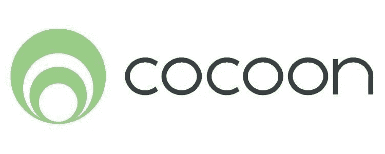
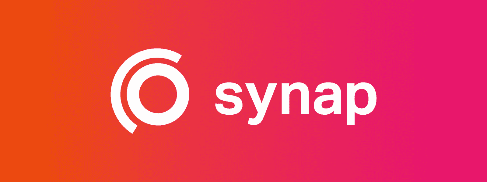
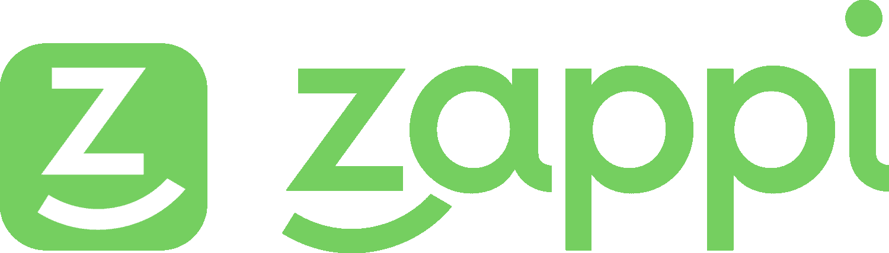
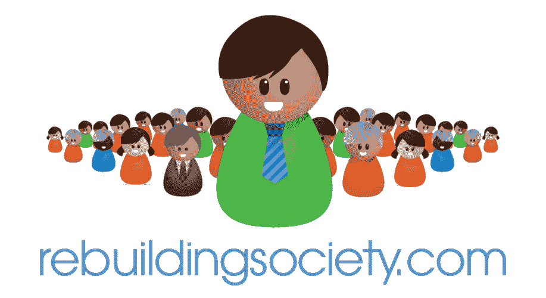
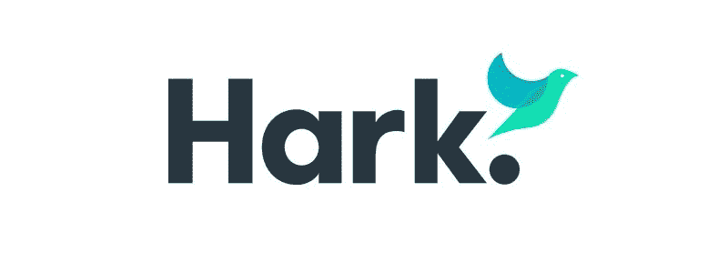
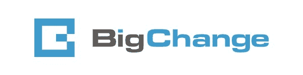

# 你应该知道的 6 个伟大的利兹创业公司

> 原文：<https://www.stxnext.com/blog/great-leeds-startups/>

 管理和交付软件项目并不是一项简单的任务，尤其是当这个项目是一个的创业项目时。

STX Next 的服务交付主管玛西恩·扎巴瓦下周将去利兹会见我们的一个客户——一家初创公司。

考虑到这一点，我们请他对利兹市内及周边一些最有前途的新兴公司发表评论。

因为他是这份工作的最佳候选人，所以他很乐意为你写这篇文章。

* * *

无论是伦敦、纽约还是东京，创业行业在全世界都蓬勃发展。

但你知道的，不是吗？

你可能不知道的是，大城市并不是创业行动发生的唯一地方。还有许多隐藏的宝石可能还没有出现在你的雷达上，尽管它们应该出现。

利兹就是这样一颗创业的宝石。

这是为什么呢？

根据科技之国的这份报告  [，从 2011 年到 2016 年，利兹经历了 138%的数字商业诞生增长，截至 2016 年成立了 168 家创业公司，截至 2017 年 GVA 达到 13 亿。](https://technation.io/insights/report-2018/leeds/)

此外，  [利兹榜单将这座城市](https://leeds-list.com/discussion/why-leeds-is-one-of-the-most-exciting-digital-hubs-in-the-uk/) “称为英国最令人兴奋的数字中心之一。”除了将利兹的成功归因于科技行业的普遍繁荣，他们还提请人们注意这座城市未来巨大的增长潜力。

考虑到这些，我觉得为你整理一份利兹最令人兴奋的 6 家创业公司的名单是很容易的，你可以密切关注。

我选择了以下行业的代表:  **消费电子、电子学习、员工招聘、金融服务、信息技术和服务、计算机软件。** 

#### 1.茧

[https://cocoon.life/](https://cocoon.life/)

##### 他们是谁？

Cocoon 自 2014 年以来一直从事消费电子产品交易。

经过 4 轮融资，他们总共筹集了 710 万美元。

##### 他们是做什么的？

这家初创公司提供了一个智能家居安全系统——这是世界上第一个，也是独一无二的。

Cocoon 结合了各种尖端技术来检测您家中的异常活动，并不断学习如何更好地保护它。它通过将高质量视频直接发送到您的手机，在出现问题时提醒您。

包含在一个单一的领域，所有的茧需要工作的是权力和互联网连接。广角摄像机还可以让你随时随地检查你的家。

##### 他们为什么伟大？

创业的想法是因为创始人希望简化和统一家庭安全，认为传统的方式过于复杂和昂贵。

Cocoon 的创建是为了通过使用一种既直观又智能的设备来使人们的家庭更加安全。

STX Next 公司的产品战略顾问和创业专家 pawejurdeczka 对 Cocoon 有这样的评价:

> “很难否认 Cocoon 为客户提供的价值，但我们不要忘记他们背后也有强大的融资历史。这家 insurtech 初创公司通过 Indiegogo 众筹，在 4 天内筹集了超过 10 万美元。Aviva Ventures 看到了高增长潜力，并在推出后不久就对其进行了投资。创始人之一丹·康伦(Dan Conlon)分别以 400 万美元和 1100 万美元的价格出售了他之前的两家公司。总而言之，我会密切关注 Cocoon 的下一步行动。”

##### **我对蚕茧的想法**

我们家园的命运已经注定；他们会连接起来，变得“聪明”

毫无疑问，这是一代人的变化。很快，我们每一个人都将别无选择，只能面对这样的挑战:浏览所有备选方案，选择正确的方案，并学习如何操作它们。

上一代人见证了洗碗机和烤箱从过于复杂的机器变成解决实际问题的简单而有用的物品。这种变化在技术能力方面并不激进，但在用户体验方面。现在，Cocoon 在家庭安全方面也做了同样的事情。

但请放心，这是好消息。这正是我们的家园和家庭所需要的，即使我们还没有意识到这一点。

#### 2.突触

[https://synap.ac/](https://synap.ac/)

##### 他们是谁？

Synap 是一个电子学习平台，由詹姆斯·古普塔和奥迈尔·瓦伊亚尼于 2015 年创立。

2017 年，多产的 North 将它们列为值得关注的 30 家北方科技公司之一。

他们在三轮融资中筹集了 200，900 英镑。

##### 他们是做什么的？

Synap 将先进的学习技术(如主动阐述、交叉练习或间隔重复)融入到一个独特的平台中，该平台不仅为学生设计，也为业余爱好者和专业人士设计。

该产品的目标是促进各个层次的学习，让你在更短的时间内学到更多，同时保留更多的信息，而不是忘记大部分信息。

此外，他们努力使这个过程直观有趣，并鼓励与朋友和同事分享经验。

##### 他们为什么伟大？

Synap 的想法源于其两位创始人试图找到学生时代问题的解决方案:尽可能多、尽可能快地学习。

他们开发了一种方法来帮助他们更有效地获取新信息。最终，这成为了 Synap 的早期版本，与他们的同事分享，这样他们也可以学得更好。

没过多久，这款应用就像病毒一样传播开来，开始在各个教育层面使用。这让创始人意识到他们正在解决许多人的真正需求。因此，曾经是个人项目的项目现在正在变成一个世界级的教育平台。

##### **我对 Synap 的看法**

像 Duolingo 这样利用记忆和学习技术的应用程序取得了巨大成功，这无疑表明了对更快学习新事物的工具的明确需求。

Synap 专注于一件特别的事情——测验——并且尽可能地做好它。在电子学习领域，他们是一家值得效仿的公司。

#### 3.扎皮

[https://www.wearezappi.com/](https://www.wearezappi.com/)

##### 他们是谁？

Zappi 是利兹创业公司中一个令人兴奋的新成员，他们甚至还不到一年。

该公司由安德鲁·拉霍尔特和大卫·斯图尔特于 2018 年 1 月创立，从事人员配置和招聘。

##### 他们是做什么的？

扎皮的领域是教育。具体来说，他们着眼于寻找临时教师。

创始人注意到，学校经常需要临时教师，但很少足够早地发现这一点，这使得寻找替代品的过程充满压力，效率低下。

扎皮决定改变这种状况。

他们的应用程序允许学校在需要时随时联系临时教师。学校马上就知道哪些老师有空，所以他们不会浪费时间去找那些忙碌的老师。

教师可以使用该应用程序更轻松地记录教学时间，并更快地获得报酬。Zappi 让这一切天衣无缝。

##### 他们为什么伟大？

Zappi 在我们心中有着特殊的地位，因为它是我们自己开发的产品。我本人参加了 Sprint 评审，并经常与项目的产品负责人/Scrum Master Anna smolińska 交谈。

我请安娜解释一下，在她看来，为什么 STX Next 如此喜欢为 Zappi 工作。这是她不得不说的:

> “我们整个团队都渴望马上开始 Zappi 的工作，因为这个项目是为了帮助普通人解决一个特定的问题。尽管该产品的目标群体很小，但我们可以看出这是一个需要填补的利基市场。我们喜欢合作的另一个原因是，Zappi 对他们想要实现的目标有一个清晰的愿景，但对如何实现目标持开放态度。他们没有拒绝我们的建议，而是欣然接受。”

从我们的角度来看，正是这种致力于让世界变得更好、改善普通人生活的承诺，让 Zappi 脱颖而出。

Zappi 的产品设计团队负责人 Marcin Siemieński 描述了他为他们工作的经历:

> Zappi 从一开始就选择将产品设计融入到流程中，这让我们可以一起塑造最初的愿景、界面概念和流程。因为他们乐于将挑战留给我们，而不是提供现成的解决方案，所以我们能够在每一步中最大限度地利用我们的专业知识。与客户的沟通也无可厚非——我们没有浪费时间，并获得了完成工作所需的所有信息。”

我们正在积极改进 Zappi，使它尽可能实用和有用。

##### **我对 Zappi 的看法**

扎皮完美地抓住了我们时代的时代精神。

通过提供一个聪明的、利用技术的解决方案，他们努力从根本上改善我们处理日常问题的方式——在这种情况下，就是教育。

对于任何一所学校的封面经理来说，一个精心策划的教师数据库，以及对其招聘和薪酬的掌控感，都是梦想成真。教师也将从一个成熟、方便、灵活的就业市场中受益匪浅，这个市场是专门为教育需求量身定制的。

但最重要的是，Zappi 旨在为孩子们提供有技能且值得信赖的专业人士。教我们孩子的人有能力把他们塑造成未来的成年人。你真的不能给这样的价值贴上价格标签。

#### 4.重建协会

[https://www.rebuildingsociety.com/](https://www.rebuildingsociety.com/)

##### 他们是谁？

RebuildingSociety 由 Daniel Rajkumar 于 2012 年创立，是一家金融服务公司。

他们于 2017 年 2 月获得 FCA 授权，并于 2017 年 5 月成为 ISA 经理。

##### 他们是做什么的？

RebuildingSociety 是一个在线的点对点借贷平台。他们的使命是将信誉良好、有道德的企业与寻求更健康、更好投资回报的个人投资者联系起来。

与其他平台不同，这些平台利用有限的知识或信息促进被动交易，这家初创公司倡导“金融行动主义”，认为有目的的负责任的贷款服务于整个社会。

##### 他们为什么伟大？

RebuildingSociety 通过绕过银行向个人对个人贷款机构提供快速资金渠道，帮助他们做出明智的财务决策。

他们安排的商业贷款实际上是为了支持各种形式和规模的公司和企业的发展，这要归功于整个贷方社区。

##### **我对重建社会的想法**

点对点借贷是一个非常强大的概念。

与众筹一样，它已经彻底改变了公司管理财务的方式。对于试图筹集资金的初创公司来说尤其如此。

在 Brewdog 的朋克股票最近取得成功后，他们筹集了超过 6500 万英镑的资金，越来越多的英国人肯定会对这类投资感兴趣。

趋势就在这里，而且正在上升。RebuildingSociety 在正确的时间处于正确的位置，应该抓住这个机会。

#### 5.听

[https://harksys.com/](https://harksys.com/)

##### 他们是谁？

Hark 是一家信息技术和服务初创公司，成立于 2016 年。

##### 他们是做什么的？

Hark 平台是一个全面的监控系统，可与您现有的基础设施协同工作。该平台旨在通过直观的软件实时监控、存储和分析您最重要的数据。

该技术是基于云的无线技术，将硬件和软件无缝连接，既符合行业标准，又兼容所有数据类型。

##### 他们为什么伟大？

根据他们的网站，“哈克的任务是建立创新的硬件和软件解决方案，以补救现实世界的挑战。”我认为这完美地描述了创业的全部。

Hark 目前正被用于生命科学、医疗保健、贸易、制药、制造等许多领域。

##### **我对哈克的看法**

Hark 是一家雄心勃勃的初创公司。

至少可以说，构建硬件和软件以将物理世界与大数据、自动化和人工智能的力量联系起来是一项挑战。不过，回报是巨大的，他们肯定知道这一点。

只有一个问题仍然存在:Hark 能够在智能城市市场上与西门子这样的大公司或像 Estimote 这样年轻的老牌公司竞争吗？

#### 6.大变革

[https://www.bigchangeapps.com/](https://www.bigchangeapps.com/)

##### 他们是谁？

BigChange 是一家计算机软件创业公司，成立于 2012 年。

2017 年，他们在德勤英国科技 50 强中排名第 25 位。

他们在一轮种子基金中总共筹集了 170 万美元。

##### 他们是做什么的？

BigChange 承诺为规划、调度和管理您的移动工作人员提供全面的一体化解决方案。

通过将您的后台办公室、移动工作人员和客户整合在一起，他们有望改变您公司管理所有移动工作人员和运营的方式。

##### 他们为什么伟大？

BigChange 专为各种规模和行业的企业而设计，可在您需要时提供全天候支持。

他们的基础设施创新、可靠且易于使用。额外的好处是，你可以在自己的设备上运行它。

##### **我对大变革的看法**

一段时间以来，传统公司一直渴望获得数字企业所享有的流程可见性水平。

好处显而易见:控制您的数据，从数据中学习，然后改进您的运营方式。不幸的是，“数字化”往往是企业和大实体的专有名词。

BigChange 旨在通过将数字化的力量带给各种类型的企业来改变这种情况，无论其规模如何。

对于我们这些精通技术的极客来说，这在一定程度上可以通过利用 ProcessPlan、Xero 和 OmniFocus 等多种 SaaS 服务来实现。但对于不太熟悉数字技术世界的人来说，独自集成过多的独立平台(彼此之间，以及与员工之间)是一场名副其实的噩梦。

幸运的是，BigChange 是来拯救世界的。他们提供的一体化解决方案有可能使数字化无处不在。

#### 最后的想法

我们的业务发展总监 Matthew Harris 对利兹的未来表示乐观:

> ***“尽管许多本地初创公司往往被更大的科技巨头所掩盖，如 [Rockstar Games](https://www.rockstargames.com/) 或 [Sky Betting and Gaming](https://www.skybetcareers.com/) ，利兹是一个新兴的数字中心，也是初创公司游戏中的一颗新星。”***

我完全同意。

* * *

感谢阅读我的文章！在 STX Next，我们像关注大公司一样关注初创公司，所以为我们的博客写这篇文章绝对是一种乐趣。

你觉得我的单子怎么样？这些创业公司中有哪些特别吸引你的眼球？你知道有哪些利兹的创业公司应该在名单上，但是没有？

欢迎给我写信，我一定会回复你的。

或者更好的是，如果你 10 月 18 日碰巧在利兹，为什么不直接联系我并安排一次快速会面呢？我非常乐意和你坐下来讨论管理和交付你的软件项目。

