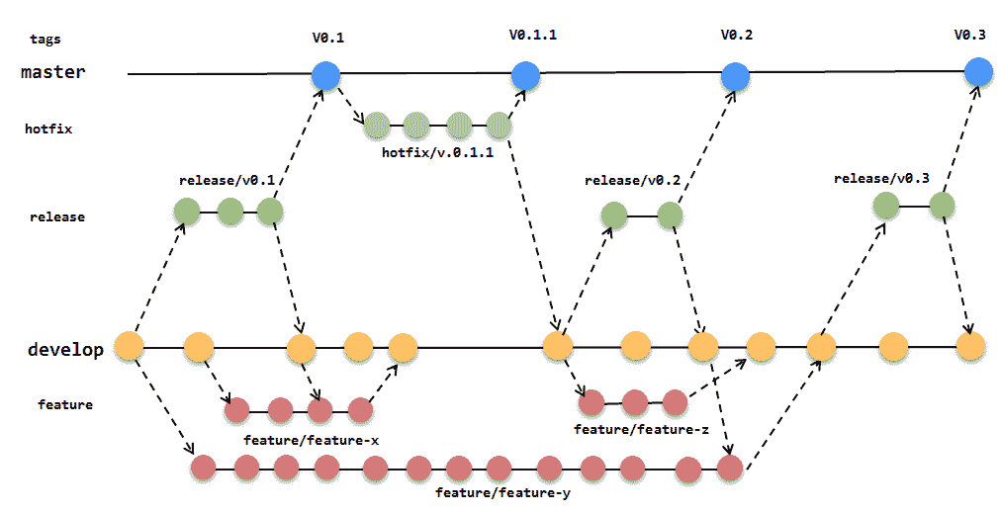
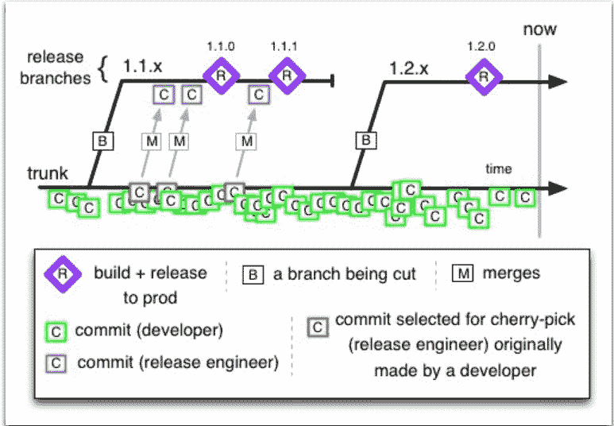
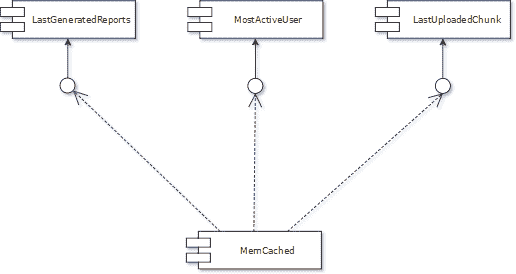
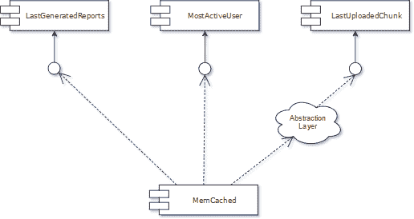
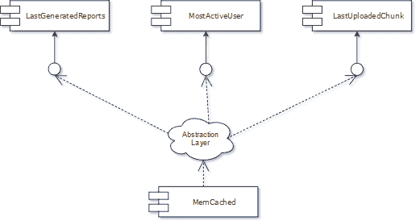
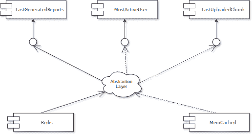
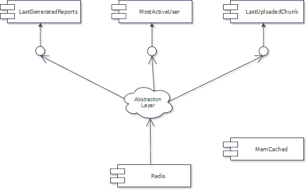
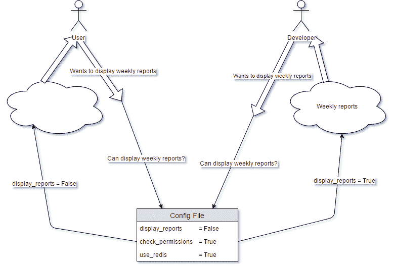
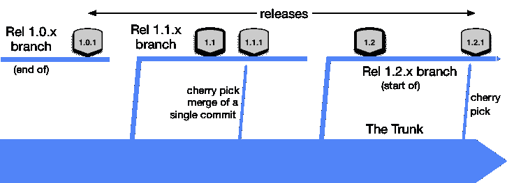

# 逃离合并地狱:为什么我更喜欢基于主干的开发而不是特性分支和 GitFlow

> 原文：<https://www.stxnext.com/blog/escape-merge-hell-why-i-prefer-trunk-based-development-over-feature-branching-and-gitflow>

 你有没有看过一个开发工作流程，然后想， " 一定有更好的方法来做这个 " ？我知道我有。

我最近在 STX Next 做了一个关于基于主干的开发的演讲，我想和你们分享一些我作为开发人员的日常工作方法。

与我的团队一起，我们在我想在本文中提出的系统中工作了几个月——每天我们都发现这个新工作流程的额外好处。

我们不是唯一的。像脸书和谷歌这样的公司已经成功地在他们的项目中采用了基于主干的开发。

如何利用基于主干的开发，如何实现它？请继续阅读，寻找答案。 

#### 特色分支开发(又名 GitFlow)

在我们开始详细介绍基于主干的开发规则之前，让我们看一下它的对应部分:特性分支开发，也称为 GitFlow 模型。

开发产品的经典方法是为我们关注的每个功能创建一个新的分支，并维护这个分支，直到我们可以将它与主线合并。

同时，我们必须检查一个热修复分支，解决合并冲突，记住我们的分支，等等。

功能分支开发工作流程如下图所示。

##### 合并地狱的单程票

上面你看到的是  **只是一个开发人员的工作流程示例。**

如果我们的公司发展到 100 名开发人员，你能想象我们会有多少分支机构吗？

如果团队数量增长到 100 个会发生什么？

可能会有持续的融合发展。任何合并通常都会以冲突告终。

换句话说，  **你将面临合并地狱。**

没有人喜欢合并冲突。当发生这种情况时，一个人需要同时关注他/她的代码部分和另一个开发人员的代码。

#### 基于主干的开发

合并地狱有救了。但是改变需要一些时间。

[基于主干的开发](https://trunkbaseddevelopment.com/) 拒绝任何特性分支、热修复分支、并行发布分支。只有一个分支可供开发人员使用——主干。

**这种新方法依赖于 4 个简单的规则:**

1.  有一个分支叫做 " 主干 " ，开发者直接提交，
2.  一个发布经理可以创建发布分支，但是没有人可以承诺这些分支，
3.  开发人员尽可能经常地提交小的更改，
4.  提交应该被审查和测试，并且不能破坏主线。

看看下面这张图。开发人员在 " 主干 " 分支上执行尽可能多的提交。每一次提交都是代码的一小部分，例如一个带有单元测试的函数或方法(绿色方块)。

在某些时候，当主干分支包含了我们想要的每一个特性，一个人从主干中创建了一个新的发布分支。这样的人被称为发布经理或者发布工程师。

**https://paulhammant.com/2013/04/05/what-is-trunk-based-development/**

#### 开发人员工作中的典型案例

在我们的工作中，有一些典型的案例如:

*   规划一个新功能，
*   创建新功能，
*   修复生产中的错误，
*   代码审查，
*   测试，
*   合并/解决冲突，
*   还有喝咖啡:)

让我们在基于主干的开发环境中仔细看看所有这些。

 

##### **1。规划新功能**

在我看来，这个案例是我们作为开发者工作中最重要的部分。在我们开始编码之前，我们应该考虑这个特性将如何影响我们系统中的其他模块。我们应该估计这个任务有多复杂，以及我们需要什么来完成它(信息、知识、测试用例或其他资源)。在我的计划会议上，我总是问:

*   我们能把这个故事/专题分成更小的任务吗？
*   我们可以平行于团队开发这个故事/功能吗？
*   我们必须写什么来完成这个特性中的每一个更小的任务？

回答这些问题有助于在我的脑海中想象一个特性的代码是什么样子的(类、对象、函数等等)。我所有的队友都知道我的任务中会发生什么。

信息共享是未来成功和快速代码审查的关键之一(请记住，您将尽可能频繁地提交)。您只审查代码，而不是它的用法、上下文或解决方案的架构。

规划会议在基于主干的开发中极其重要。它有助于协调工作，允许信息共享，并且是快速代码评审的一个很好的介绍。

##### **2。创建新特征**

在计划之后，我们的板上应该充满了任务。它们应该很小，并能很好地描述新特性。

现在，我们必须记住，我们编写的每一段代码都应该经过良好的测试，这是在您的工作中引入 TDD 的一个很好的机会。

这个过程中有一个核心规则——**每天部署一个新的提交到 trunk】。**这在两个方面帮助了我们:

*   它是进步的象征，
*   它可以防止任何可能的合并冲突。

因此，让我们试着想象一个典型的使用基于主干的开发方法的开发人员的一天。

早上，第一件事将是从源/主干获取并在本地创建一个  **分支** (创建它不是强制性的，它取决于您的持续集成和审查过程)。现在我们应该考虑如何创建一个尽可能小的提交，它包含一个特性的工作部分。

还有，记住 **没有提交就可以断主线** (主干分支)。从历史的每一点来看，一个发布经理应该能够创建一个发布分支。为了确保这一点，我们不能交付任何未完成特性的代码，并允许用户输入它。

我提出了两个巧妙的技术来帮助解决这些问题: **抽象分支** 和 **特征标志。**

##### a)通过抽象进行分支

当开发人员必须替换组件时，这种技术非常有用。假设在我们的系统中，有一个 Memcached 实例作为缓存管理器。一切进展顺利，越来越多的客户端(接口)使用了缓存，今天我们有一个类似下图的情况。

在我们的系统中，只有 3 个组件依赖于 Memcached，但实际上，组件的数量可能会很大。

**第一步是在一个客户端(例如 LastUploadedChunk)和 Memcached 之间创建一个抽象层** (请记住，在日常提交中，我们不能破坏主干)。

下图说明了目前的情况。

如果我们的主干仍然没问题，我们可以更进一步，将所有客户端移到抽象层。当我们这样做时，我们有机会通过在客户端和抽象层之间实现测试来提高代码的单元测试覆盖率。

现在，我们可以选择其中一个客户端，并开始使用新的缓存功能。我们仍将使用相同的抽象层，但是以两种方式。

首先，对于所选的客户机，我们开发新的特性，同时，旧的组件(Memcached)支持其余的客户机。通过这种方式，我们将仍然让主干为我们的客户工作，没有任何区别，为发布做好准备，但是我们将能够开发新的特性。

主要问题是如何创建一条仅用于开发的路线。我们可以使用一个简单的“if”语句或者更优雅的语句，比如一个 **特征标志** (下一节将详细介绍这种技术)。

在下图中，我们选择了“LastGeneratedReports”组件进行开发。

在这个最复杂的步骤之后(我的意思是创建新的特性并将其与一个客户机连接)，我们已经准备好了与 Redis 一起工作的编写良好的组件。

因此，下一个明显的步骤将是删除临时路由(通过一个 " if " 语句或一个“特性标志”来实现)，并将 Redis 与其余的客户端连接起来。

同样，记住关键点是尽可能少的提交——最好的方法是每个客户端一次提交。

这就差不多结束了。现在我们可以删除过时的“Memcached”组件及其所有单元测试。我们也可以移除抽象层，尽管这不是必须的，而且在我看来，离开抽象层在将来会很有用。

综上所述， **分支通过抽象手法** 可以用几个简单的 步骤:

1.  使用旧组件为一个客户机创建一个抽象层。
2.  重定向所有客户端以使用抽象层。
3.  只为一个客户机创建一个新组件，并通过抽象层将它们连接起来。
4.  开发新组件并测试它。
5.  重定向抽象层，只使用新的组件。
6.  拆下旧部件。

有了这种技术，我们可以很容易地用新的组件替换过时的组件，而不会破坏主干线路。

##### b)特征标志

在基于主干的开发中经常使用的第二种技术叫做 **特征标志** **。**

特性分支开发的一个最常见的论点是，一些特性的开发时间超过一天，经过多次提交，即使它们是为一个版本设计的。

那么，你如何将它与 TBD 融合在一起呢？

我们经常遇到这个问题，特性标志是处理这个问题的一个方便的工具。这种方法的基本思想是创建一个配置文件(或数据库表),其中包含一组具有唯一名称的标志。

在这样的文件中，所有待定特性都有自己的标志。配置文件最简单的例子是一个简单的映射(字典)或一个具有静态成员的对象。

在更大的项目中，我们可以将这些标志存储在数据库中，甚至可以使用一个外部库来简化这个过程(在本文的末尾可以找到相关链接)。

使用特性标志最常见的情况是处理用户界面。我们只是切换特征的可见性。有时，我们可以在代码中添加一个简单的 " if " 语句，或者，在更高级的情况下，以更优雅的方式，我们可以使用装饰器或生成器(在 [Python](/services/python-development/) 中)。

我们检查标志的点叫做 **拨动点** **。**一切被“隐藏”在“if”后面的东西被称为 **一个 toggle test 。**

关于切换点和特征标志通常只有一个规则。我们应该尽可能保持最少数量的切换点，以确保新功能被正确隐藏。

让我们想象一个场景，我们开发一个生成报告的网页。我们可能在页面上的很多地方显示每周报告，但是，如果只有一个链接重定向到有报告的页面，我们的切换测试应该完全隐藏这个链接。换句话说，我们应该将最少数量的切换测试与一个标志相关联。

情况描述如下图。

另一个关于特性标志的流行问题是关于发布测试的。我们应该对所有可能的旗帜组合进行测试，还是只对其中的一些组合进行测试？对于集成测试，只检查两个场景就足够了:

*   检查预期在下一个版本中出现的所有特性的开关是否打开，
*   检查所有开关是否打开，即使在未完成的特征中。

一个重要的标志:一个好的做法是 **去掉已经完成并在生产中使用的特征标志** **。**如果我们跳过这一步，将来我们会有许多奇怪的旗帜，没有人会记得是谁介绍了它们，何时以及它们展示或隐藏了什么。

总而言之，我们可以用几个步骤来介绍特征标志技术:

1.  在配置文件或数据库中创建新标志。
2.  在旗帜后面隐藏新功能。
3.  只要需要，就开发新特性(它仍然被标志所覆盖)。
4.  为当前版本准备一个标志列表。
5.  从配置文件/数据库中删除生产中的特征标志。

##### **3。修复生产中的错误**

它发生了。在一个发布分支中发现一个 bug 是令人难过的，但也是可能的。从开发人员的角度来看，我们  **不能直接提交给发布分支。**没人能做到。

然而，我们能做的是在主干分支上找到 bug，并尝试通过一个额外的提交在主线上修复它。

注意主线和发布分支包含相同的代码(或者相似的代码),所以在主干上重现发布分支的任何失败都不是问题。

在提交之后，我们将把提交 id 发送给一个发布经理，他或她将把它精选到发布分支(在下一节中有更多的介绍)。

##### **4。代码审查**

正如科里·豪斯曾经说过的:“代码就像幽默。当你不得不解释它的时候——这是不好的。”

遵循这条规则，对代码清晰性的最好判断将是代码评审(或同行评审)。

你还记得吗，在基于主干的开发中，我们只用一个函数或方法进行小规模的提交，我们和团队一起计划所有的特性。太好了！所以结论只能是一个:任何检讨都是小菜一碟。

您的团队已经很好地描述了该特性，并且您已经计划了应该如何完成它。这意味着每天你的团队都会产生一些需要审查的提交——只是一些需要你注意的小的提交。

一开始听起来可能不太好，但实际上你做得很快——一个函数和测试。更重要的是，在计划之后，您熟悉所有特性的上下文，所以基本上您将只检查代码的技术方面。

作为评论者，你每天最多有15 分钟的时间。仅此而已。

##### **5。测试**

TBD 的这一方面相当简单。我们必须用测试来覆盖我们的特性。测试有两种可能性。

在第一种情况下，我们为新创建的方法或函数交付单元测试。记住，单元测试应该只覆盖被测试的函数，其他函数应该是 stub 或者 mock。

另一组测试涵盖了集成过程。在某种程度上，我们可能会编写使用独立模块中的函数的代码。这种连接也应该进行测试。

现在，让我们试着从测试人员的角度来看待测试。我们有一堆标志，所以我们可以很容易地打开和关闭一个功能。这是一个向我们公司介绍 A/B 测试的好机会。

##### **6。合并和解决冲突**

只有一个分支，没有其他分支，所以没有合并。没有合并就等于没有合并冲突。这是基于主干的开发的最大好处之一。

 

#### 发布经理的典型案例

**发布经理** 在基于主干的开发中起着特定的作用。这是唯一可以创建发布分支并在产品中修复 bug 的人(或一组人)。

发布经理只有两个职责:

*   创建新的发布分支，
*   挑选一个可能的修补程序。

让我们更深入地看看这些行动。

##### **1。创建新版本...**

...分支。

我有意跳过了章节标题中的分支一词。为什么？

在基于主干的开发中，有两种选择来正确地创建发布。选择应该基于发布的频率。

**对于很少向客户交付新特性的公司** (每月一次或更少)，一个发布经理应该为每个次要版本创建一个发布分支。

最好让一个发布分支长时间保持活跃，因为在一个 bug 的情况下，客户不能等待一个月或更长时间来修复。这样，我们可以很容易地在 release 分支上增加一个带有精选补丁的版本。

基于主干的开发支持 **语义版本** (关于这个主题的精彩文章，请查看源代码部分)。这种情况在下图中被形象化了。

**https://trunkbaseddevelopment.com/branch-for-release/**

**发布节奏非常高的团队** **，**则相反，不需要发布分支。这就是为什么我没有在上面的标题中包括“分支机构”。他们可以使用主干来执行释放。团队经常使用提交 id 或时间戳作为发布版本。

使用一种版本控制机制，比如标签，可能也是一个好主意。bug 可以作为正常功能处理，在主干上修复。这样，释放变得非常快。下面是一个流程示例。

**https://trunkbaseddevelopment.com/release-from-trunk/**

##### **2。精选修补程序**

基于主干的开发的最重要的规则之一是:直接提交到主线。这意味着在发布时出现 bug 的情况下，我们不能将变更推入发布分支。

因此，修复 bug 的正确方法是在主干上重现它，然后在主分支上也执行一个修复，之后发布经理可以将这个提交选择为发布——这就是我们所说的精选。

为什么不直接提交到发布分支，然后合并到主干中呢？

首先，正如我们所知，基于主干的开发的主要优势之一是没有合并地狱。如果我们将来自发布分支的合并引入主线，我们将会有合并冲突。

第二，您可能会忘记合并它，然后在下一个版本中会有一个回归。

#### 摘要

基于主干的开发并不是一个新的想法，但它最近越来越受欢迎。随着主要 IT 公司的项目使用 TBD 方法获得牵引力，现在是您在您的公司引入基于主干的开发的大好时机。

让我们总结一下如何从中受益:

1.  **TBD 将你从合并地狱中拯救出来。**
2.  TBD 支持最好的开发实践，包括功能规划、提交小的变更和编写向后兼容的代码。
3.  与使用功能分支相比，TBD 创造了更快部署新功能的机会。
4.  从长远来看，小的提交可以帮助你将大的整体应用拆分成简洁的服务。

就我个人而言，我不认为我会回去。

如果您想了解更多关于基于主干的开发，请不要犹豫，看看参考书目，以便进一步阅读。如果您[在此](/contact/)给我们写信，我们也很乐意回答您的任何问题。

更多文章，别忘了 **订阅我们的简讯。**

感谢阅读！

#### 来源

*   [基于主干的开发](https://trunkbaseddevelopment.com/)
*   什么是基于主干的开发？
*   [通过部署管道实现基于主干的开发](https://www.thoughtworks.com/insights/blog/enabling-trunk-based-development-deployment-pipelines)
*   [抽象分支](https://www.branchbyabstraction.com/)
*   [马丁·福勒的抽象分支](https://www.martinfowler.com/bliki/BranchByAbstraction.html)
*   [特征标志](http://featureflags.io/)
*   [马丁·福勒的专题切换](https://martinfowler.com/bliki/FeatureToggle.html)
*   [皮特·霍奇森的特色旗帜](https://martinfowler.com/articles/feature-toggles.html)
*   [同行评审的 11 个成熟实践](https://www.ibm.com/developerworks/rational/library/11-proven-practices-for-peer-review/)
*   [语义版本化](https://semver.org/)

