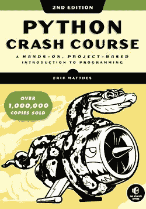
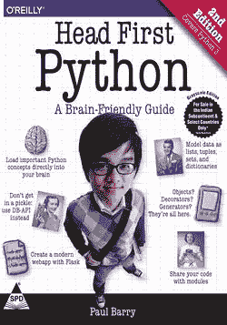
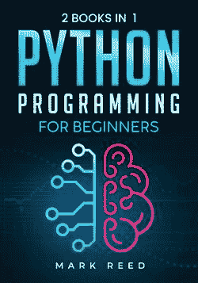
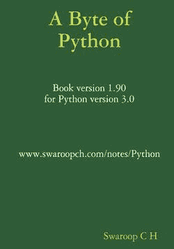
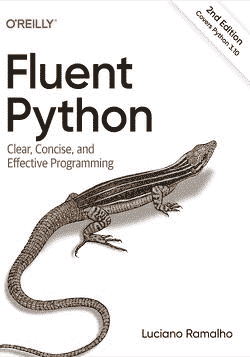
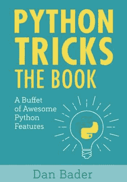
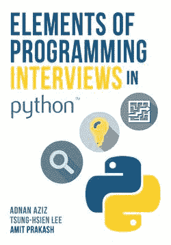
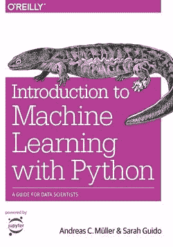
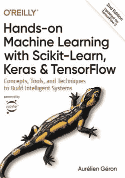
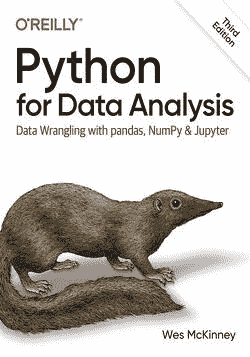

# 10 本最佳 Python 书籍

> 原文：<https://www.stxnext.com/blog/best-python-books/>

 [Python 是一种令人难以置信的强大编程语言](/services/python-development/) 。由于它的多功能性和简单性，它继续吸引着开发人员的兴趣，无论是新的还是有经验的。

你是其中之一吗？如果是的话，你来对地方了。

由于这种语言的受欢迎程度没有下降的迹象，Python 编程的机会总是在增加。 [Python 被广泛应用于各种领域](/what-is-python-used-for/) ，从 [web 开发](/services/web-development/)[数据科学](/services/data-engineering/) ，以及 [机器学习](/services/machine-learning/) 到 [游戏设计](/blog/python-for-game-development/) 。

难怪越来越多的人决定学习这门语言。然而，随着各种资源的丰富，找到有用的学习材料并不容易。这可能会令人沮丧。

不过，不要担心，我们是来帮忙的。

无论您是开始学习 Python 的新手，还是希望将您的技能提升到更高水平的有经验的开发人员，或者可能是希望激励您的团队的技术领导者——我们为您找到了最好的 Python 书籍。

在本文中，我们将列出广受好评的最新 Python 书籍，以及它们值得您花费时间的原因。不管你的经验水平如何，我们将看看它们如何帮助你发展技能，促进你的职业发展。我们的列表包括适合初学者的入门书籍，也包括适合更高级程序员的书籍。 

#### 面向初学者的顶级 Python 书籍

##### 1.Python 速成班，第二版:基于项目的编程入门

*   **出版日期:** 2019 年，2023 年 1 月第三版
*   特色:有趣的动手项目，简单的语言
*   **价格:** $22
*   **在哪里可以拿到书:** [点击这里](https://www.amazon.com/Python-Crash-Course-2nd-Edition/dp/1593279280/ref=sr_1_1?crid=3G9PCM0R0J743&keywords=Python+Crash+Course%2C&qid=1667425824&qu=eyJxc2MiOiIwLjAwIiwicXNhIjoiMC4wMCIsInFzcCI6IjAuMDAifQ%3D%3D&sprefix=python+crash+course%2C%2Caps%2C363&sr=8-1)

从世界上最畅销的 Python 书籍之一开始(销量超过 100 万册！)， *Python 速成课程*是关于 Python 编程的快速入门指南。

对于那些以前完全没有编程知识的人来说，这是一个极好的选择，但是那些想要提高技能的人也会发现它很有用。

这本书被巧妙地分成两部分。第一篇带您了解基本的 Python 元素和数据结构，并花一些时间进行代码测试和调试。另一方面，第二部分通过三个具有挑战性但很酷的项目来测试你的知识:创建一个受*太空入侵者*启发的街机游戏，matplotlib 中的数据可视化，以及一个简单的应用程序 [Django](/services/django-development/) 。

##### 2.保罗·巴里的《第一个 Python，第二版:大脑友好指南》

*   **发布日期:** 2016
*   **与众不同之处:**引人入胜的视觉形式、有趣的多感官学习体验、简洁实用
*   **价格:**50 美元
*   **在哪里可以拿到书:** [点击这里](https://www.amazon.com/Head-First-Python-Brain-Friendly-Guide/dp/1491919531/ref=sr_1_fkmr0_1?crid=1H0W5IIKTCS4F&keywords=Head+First+Python%2C+2nd+Edition%3A+A+B&qid=1667425786&qu=eyJxc2MiOiItMC4wMSIsInFzYSI6IjAuMDAiLCJxc3AiOiIwLjAwIn0%3D&s=books&sprefix=head+first+python%2C+2nd+edition+a+b%2Cstripbooks-intl-ship%2C180&sr=1-1-fkmr0)

如果你不想读又长又重的文章，这本书很适合你。其视觉上独特的格式，丰富的插图，不仅使复杂的主题更容易掌握，而且让你在整个学习过程中参与和娱乐。你肯定不会觉得无聊。

这本书涵盖了从 Python 编程基础到使用内置函数和数据结构的所有内容。你可以期待发人深省的问题，以及具有挑战性但可行的任务，帮助你记住新知识。

除此之外，它以使用微框架 [Flask](/blog/flask-vs-django-comparison/) 构建一个 web 应用程序的单一项目结束。如果您是从零开始使用 Python，但是已经有一些编程经验，请选择它。

##### 3. *Python 初学者编程:二本合一——通过实践练习快速学习 Python 编程的终极循序渐进指南*,作者 Mark Reed

*   出版日期: 2022 年
*   **与众不同之处:**内容清晰、信息量大、易于理解
*   **价格:** $20
*   **在哪里可以拿到书:** [点击这里](https://www.amazon.com/Python-Programming-Beginners-Step-Step/dp/B0B7QPFY8K/ref=sr_1_1?crid=3JFGGABL2PF8&keywords=Python+Programming+for+Beginners%3A+2+Books+in+1%E2%80%93The&qid=1667425759&qu=eyJxc2MiOiItMC4wMiIsInFzYSI6IjAuMDAiLCJxc3AiOiIwLjAwIn0%3D&sprefix=python+programming+for+beginners+2+books+in+1+the+%2Caps%2C285&sr=8-1)

无论你是非程序员还是已经熟悉编程，这都是帮助你迈出 Python 第一步并从中获得最大收益的另一本好书。它提供了它在标题中承诺的东西:一步一步地以快速简单的方式学习 Python 的指南。

我们真正喜欢这本两卷本的书是因为它在理论和实践之间提供了恰当的平衡。虽然第一本书提供了明确而有趣的解释，但第二本书可以作为一个练习册，巩固你到目前为止所学到的东西。此外，该指南的互动性质使其成为一种有趣而有效的学习体验。

#### 免费初级 Python 书籍

##### 4.*一个字节的 Python 由* Swaroop C.H。

*   发布日期: 2013 年
*   与众不同之处:良好的开端，定期更新，可靠，简洁，免费
*   **价格:**免费
*   **在哪里可以拿到书:** [点击这里](https://python.swaroopch.com/)

你正在寻找一个温和的，没有废话的，快速的免费 Python 介绍吗？你不会找到比*一个字节的 Python 更好的了！虽然这不是一个明确的指南，但它让你对 Python 编程有了一个总体的了解，我们认为它绝对值得一试。*

考虑到 Python 的复杂性，这本书被分成一系列的小节，涵盖了该语言的大部分特性。每个主题后面都有一个编码示例，整个布局结构良好，易于理解。

我们不得不提到，GitHub 上提供了完整的代码，尽管这本书是在 2013 年出版的，但内容会定期更新——这也是尝试这个简短指南的两个原因。

#### 最佳高级 Python 书籍

##### 5.卢西亚诺·拉马尔霍的《流畅的 Python:清晰、简洁、有效的编程》第二版

*   出版日期: 2022 年
*   独特之处:清晰的例子，作者有趣的见解，历史背景，友好的风格
*   价格: $45
*   **在哪里可以拿到书:** [点击这里](https://www.amazon.com/Fluent-Python-Concise-Effective-Programming/dp/1492056359/ref=sr_1_1?crid=3T80NBRHFB8VV&keywords=fluent+python&qid=1667425677&qu=eyJxc2MiOiIxLjkwIiwicXNhIjoiMS41NyIsInFzcCI6IjEuNjIifQ%3D%3D&sprefix=fluent+%2Caps%2C196&sr=8-1)

对于所有希望将技能提升到更高水平的中高级开发人员来说, *Fluent Python* 是必读书。不过，请记住，在你决定拿起这本书之前，你需要掌握这门语言的工作知识——新手可能很难理解。

尽管这是一篇厚厚的文章，但它是一本很棒的书。它教你如何更 python 化地思考，写出更短、更快、更易读的代码。作者重点关注数据模型和结构、面向对象的习惯用法和元编程，以及越来越受欢迎的机器学习介绍。

所有这些都是以一种随意和用户友好的方式编写的，这只会使阅读过程更加愉快。

##### 6. *Python 技巧:令人敬畏的 Python 特性自助餐*作者 Dan Bader

*   **发布日期:** 2017 年
*   独特之处:有趣的版式、实用的技巧、轻松迷人的风格
*   **价格:** $30
*   **在哪里可以拿到书:** [点击这里](https://www.amazon.com/Python-Tricks-Buffet-Awesome-Features/dp/1775093301/ref=sr_1_1?crid=1SSHC6HXUXI6I&keywords=Python+Tricks%3A+A+Buffet+of+Awesome+P&qid=1667425645&qu=eyJxc2MiOiItMC4wMSIsInFzYSI6IjAuMDAiLCJxc3AiOiIwLjAwIn0%3D&sprefix=python+tricks+a+buffet+of+awesome+p%2Caps%2C183&sr=8-1)

另一本提升你技能的有价值的书是 *Python 技巧。*顾名思义，这是一个有用的技巧和窍门的汇编，为您提供了该语言更高级方面的全面介绍。

在这里你不会发现过度解释——作者保持一切简短实用。他提供了足够的背景细节来很好地解释事情，并帮助您发现 Python 的最佳实践和惯用代码的威力。

这本书将让你对 Python 的内部工作有更深的理解，并让你快速成为一个更自信、更有效的 Python 爱好者。

##### 7.Adnan Aziz、Tsung-Hsien Lee 和 Amit Prakash 撰写的《Python 编程访谈的要素:内部人员指南》

*   **发布日期:** 2016
*   **有何特别之处:**现实生活中的编码面试问题，超级有用的例子和技巧
*   **价格:** $35
*   **在哪里可以拿到书:** [点击这里](https://www.amazon.com/Elements-Programming-Interviews-Python-Insiders/dp/1537713949/ref=sr_1_1?crid=2TGLDVMSJA215&keywords=Elements+of+Programming+Interviews+in+Python&qid=1667425618&qu=eyJxc2MiOiIxLjI2IiwicXNhIjoiMC44OSIsInFzcCI6IjAuNzUifQ%3D%3D&sprefix=elements+of+programming+interviews+in+python%2Caps%2C178&sr=8-1)

你有没有想过在一家成功的科技公司工作，但一想到要进行技术面试，你就不寒而栗？或者，也许你正在努力解决一个本可以在几分钟内解决的面试问题？如果是的话，这是一本适合你的书。如果没有，读一读还是值得的，因为你会学到很多东西。

除了展示 300 个真实世界的计算问题以及详细的解决方案，它还为你提供了非技术性的面试技巧。一旦你掌握了本书涵盖的所有问题，你将更容易在编程面试中胜出，并且你将提高你的 Python 技能。

##### 8.*Python 机器学习简介:数据科学家指南*作者 Andreas Müller 和 Sarah Guido

*   **发布日期:** 2016
*   独特之处:强大的 ML 概念基础、易于理解的语言、实践方法
*   **价格:**50 美元
*   **在哪里可以拿到书:** [点击这里](https://www.amazon.com/Introduction-Machine-Learning-Python-Scientists/dp/1449369413/ref=sr_1_1?crid=1D25PGNCUN8OJ&keywords=Introduction+to+Machine+Learning+with+Python&qid=1667425582&qu=eyJxc2MiOiIxLjE3IiwicXNhIjoiMC43MyIsInFzcCI6IjAuODYifQ%3D%3D&sprefix=introduction+to+machine+learning+with+python%2Caps%2C177&sr=8-1)

随着越来越多的组织使用机器学习作为他们的应用程序和项目的组成部分，任何对将 Python 知识与 ML 专业知识联系起来感兴趣的人都应该仔细看看这个标题。

与其他 Python 书籍不同，这本书以相对易于理解的形式向您提供了对 ML 和数据科学的坚实介绍，教您如何构建自己的机器学习解决方案和算法。

阅读完本文后，您不仅会成为一名熟练的 Scikit-Learn 用户，还会知道如何编写干净的面向机器的代码，使用图算法，并将它们应用于数据压缩问题。然而，如果你想更深入地了解 ML 的复杂性，可以看看下面的书。

##### 9.使用 Scikit-Learn、Keras 和 TensorFlow 进行机器学习:构建智能系统的概念、工具和技术，第二版作者 Aurélien Géron

*   **出版日期:** 2019 年，第三版于 2022 年 11 月出版
*   **与众不同之处:**令人惊叹的图形，细节与实用性之间的完美平衡，涵盖了大量的 ML 领域
*   **价格:** $57
*   **在哪里可以拿到书:** [点击这里](https://www.amazon.com/Hands-Machine-Learning-Scikit-Learn-TensorFlow/dp/1492032646/ref=sr_1_2?crid=2J2UDY1ZRSGDF&keywords=Hands-On+Machine+Learning+with+Scikit-Learn%2C+Keras%2C+and+TensorFlow%3A+Concepts%2C+Tools%2C&qid=1667425507&qu=eyJxc2MiOiIwLjU4IiwicXNhIjoiMC4wMCIsInFzcCI6IjAuMDAifQ%3D%3D&sprefix=hands-on+machine+learning+with+scikit-learn%2C+keras%2C+and+tensorflow+concepts%2C+tools%2C%2Caps%2C174&sr=8-2)

任何使用 Python 学习机器的人都应该考虑阅读这本书。这是一个很好的资源，可以让你对构建机器学习模型的概念和工具有一个直观的理解。你所需要的只是一些扎实的编程经验。

这本书分为两部分。第一部分涵盖了机器学习的基础知识，带您通过 Scikit-Learn 亲自动手编写代码。在第二部分，您将通过 Keras 和 TensorFlow 全面了解人工神经网络和深度学习。

我们喜欢这本书是因为它结合了大量的理论及其应用，使用了具体的例子，并且以友好的风格写成。

##### 10.用于数据分析的 Python:与熊猫、NumPy 和 Jupyter 的数据争论，第三版作者 Wes McKinney

*   出版日期: 2022 年
*   **有何特别之处:** 穿插示例和精彩的代码片段，真实世界的数据分析问题
*   **价格:**50 美元
*   **在哪里可以拿到书:** [点击这里](https://www.amazon.com/Python-Data-Analysis-Wrangling-Jupyter/dp/109810403X/ref=sr_1_1?crid=3456E53FX0DVT&keywords=Python+for+Data+Analysis%3A+Data+Wrangling+with+Pandas%2C+NumPy%2C+and+Jupyter%2C+3rd+edition+by+Wes+McKinney&qid=1667425471&qu=eyJxc2MiOiIwLjY2IiwicXNhIjoiMC4wMCIsInFzcCI6IjAuMDAifQ%3D%3D&sprefix=python+for+data+analysis+data+wrangling+with+pandas%2C+numpy%2C+and+jupyter%2C+3rd+edition+by+wes+mckinney%2Caps%2C159&sr=8-1)

如果数据科学激发了你的兴趣，并且你想更深入地探索这个主题，那么就去读这本书吧——这是为更高级的开发人员准备的另一本书。*用于数据分析的 Python*对于刚接触数据科学的有经验的程序员来说是理想的，尽管刚接触 Python 的分析师可能也会发现它是一个有用的信息源。

这本实践指南包含了在 Python 中操作、处理、清理和处理数据的完整说明。阅读后，您将了解如何解决数据分析问题，这要归功于书中包含的实际案例研究，以及了解 pandas、NumPy 和 Jupyter 的最新版本。

我们真诚地推荐它作为任何想成为数据分析师或数据科学家的人的免费工具。

#### 关于 10 本顶级 Python 书籍的最终想法

不言而喻，Python 是世界上最流行和发展最快的编程语言之一。它的特别之处在于它可以用于几乎任何软件开发应用程序，因为它简单、灵活、可靠。

考虑到这一点，每年有大量的人选择它就不足为奇了。然而，开始用 Python 编程就像获得任何其他技能一样:你需要合适的资源来引导你朝着正确的方向前进。选择合适的书可能很难，尤其是当你被这么多选择包围时，所以…

这就是你想要的——值得一读的顶级 Python 书籍。我们查阅了大量的书籍，只选择了那些强烈推荐的和最新的。无论您是刚刚开始用 Python 进行编码的冒险，还是想要更深入地挖掘更高级的概念，您肯定会在这里找到您想要的东西。

如果您想了解更多关于 Python 的知识，请查看这些资源，因为您可能会发现它们很有用:

*   [11 大 Python 简讯](/blog/top-python-newsletters/)
*   [让你开始学习 Python 的 14 大博客](/blog/top-10-blogs-python/)
*   [如何学习 Python:顶级网站和课程，从初学者到专业](/blog/learn-python-top-sites-courses/)

感谢您阅读我们最喜欢的 Python 书籍列表。我们希望您会发现它们很有趣并且有帮助。如有任何问题，欢迎随时 [联系我们](/hire-us) 。我们拥有 [17 年以上的经验](/services/python-development/) ，我们将非常乐意与您分享我们的知识。