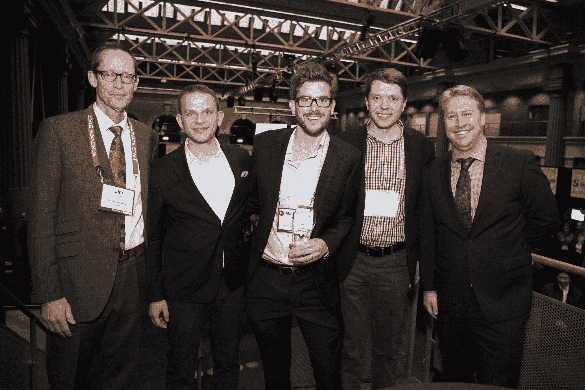
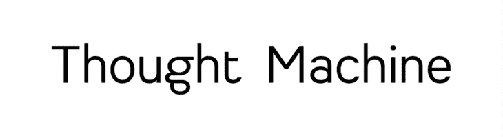
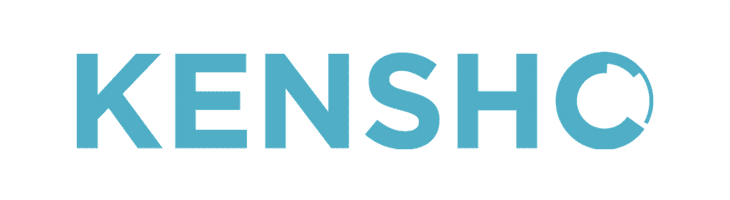
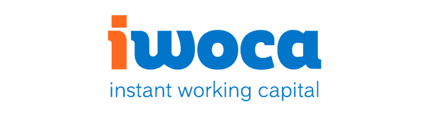
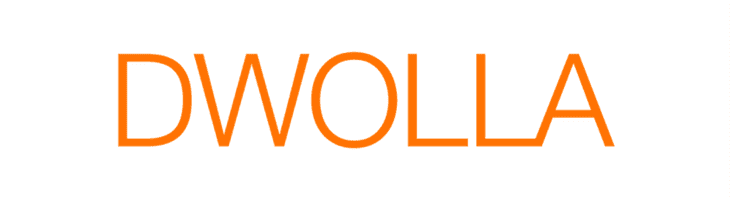
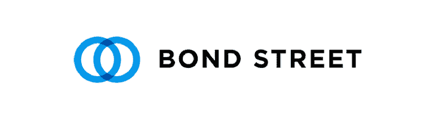
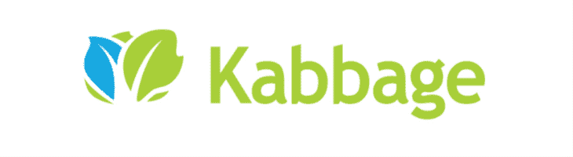
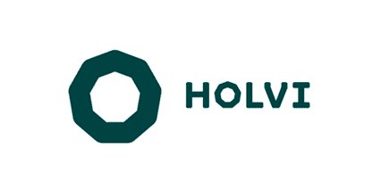

# 将 Python 纳入其技术堆栈的前 17 家金融科技公司

> 原文：<https://www.stxnext.com/blog/top-15-fintech-companies-include-python-their-tech-stack/>

 在金融科技领域，你不能盲目飞行。

对于您选择的技术组合来说尤其如此。你不想因为缺乏适当的研究而在竞争中落后。

或者你只是对金融科技公司的顶级解决方案感到好奇。  [Python](https://stxnext.com/services/python-js-development) 在这个行业是一个很好的选择——但是具体是哪些公司使用它呢？

我们的列表涵盖了在其技术堆栈中使用[【Python](https://stxnext.com/ebooks/what-is-python-used-for/)的 17 大金融科技。 

#### 使用 Python 了解金融科技

促使我创建这个列表的是我自己对金融科技的兴趣，以及对 Python 已经在这个行业中脱颖而出的有趣观察。

在 2015 年和 2016 年，我以与会者(EXEC，MoneyConf)和演讲人(FinovateEurope，Money20/20 Europe，Wolves Summit 等)的身份参加了许多 fintech 会议。).在这些会议上，我见到了一些业内领先的高管，包括一些你会在下面的列表中找到的公司。

当时，我正代表 Valuto，一家新兴的 P2P 货币兑换和支付初创公司，是一家更大的波兰金融科技公司的一部分。

虽然 Valuto 后来加入了 Finovate 毕业生的行列，进入了金融科技的墓地——被关闭或被收购——但下面列出的公司成功克服了所有困难，将该行业推向了新的高度。

你会发现这个名单上的许多人也是从  [到](http://finovate.com/)的。如果你感兴趣，他们首次亮相的链接在他们的文章中，主要来自 Finovate 网站。

**Michał Czekalski, Łukasz Olek, and Matthew Harris—FinovateEurope 2016 “Best of Show” Award**

#### 什么是 fintech？为什么增长，增长速度有多快？

由于其  **的高增长潜力和无尽的颠覆性创新的可能性，金融科技，或人们普遍创造的“金融科技”，已经成为初创公司的时尚产业。**

事实上，根据普华永道的数据，  **超过 1500 亿美元将在未来 3 到 5 年内投资于金融科技公司。**

#### 目前哪些行业分支正在被 fintech 创业公司颠覆？

金融科技公司正在影响广泛的垂直行业，例如:

*   **【账户管理】，**
*   **【借贷与融资】**
*   **付款处理，**
*   **规定，**
*   **资本市场。**

这些公司之所以对小型和大型企业如此有吸引力，是因为它们有能力满足客户的需求。

#### 在其技术堆栈中使用 Python 的顶级金融科技公司

您可能想知道，“这如何适用于 Python，Matthew？”

好吧，如果你读了我之前的文章  [，你就会知道 Python 正在成为这些斗志昂扬的初创公司的后台技术选择。](/blog/why-python-should-be-technology-choice-your-fintech/)

需要证明吗？以下是 17 家最大的金融科技公司，它们强调 Python 是其技术堆栈中的必备工具。

##### 1) Zopa

*   **总部**:英国伦敦
*   **成立** : 2005 年
*   **亮点** : 自推出以来，总放贷额已达 24.6 亿(Q2 2017)
*   **Finovate:**[Finovate 2008—Zopa](http://finovate.com/videos/finovatestartup-2008-zopa/)

##### **关于**

P2P 贷款机构 Zopa 省去了银行和其他中间人，允许贷款人和借款人直接交易。从 10 笔开始，Zopa 将其客户的投资分散到多笔贷款中。这意味着没有客户拥有超过 1%的贷方投资。个人能借的最大额度是 25000(不包括手续费)。

2018 年初，Zopa 成为第一个借贷额突破 30 亿的消费者点对点借贷平台。在监管机构对传统 P2P 贷款不断增加的压力下，Zopa 已经筹集了 4400 万美元，以帮助推出其数字挑战者银行。这家世界上最古老的 P2P 贷款机构早在 2016 年就申请了银行牌照。

##### **技术堆栈**

想知道  [Zopa](https://zopa.recruitee.com/o/software-engineer-python--java) 如何看待 Python 作为他们当前技术堆栈的一部分，这是 C#、Python 和 Java 的混合？

“我们坚定地致力于将 Python 作为我们技术堆栈中的一种关键语言，并对未来制定了宏伟的计划。我们在 Python 团队中使用 Flask、 [Django](/services/django-development/) 、RabbitMQ、Pandas、Celery 和 Postgres。我们的数据科学团队已经建立了自己的机器学习堆栈，建立在 scikit-learn 和 keras 等工具的基础上，我们正在大力参与其中。”

你有它；他们是粉丝。

##### 2)思想机器

*   **总部**:英国伦敦
*   **成立** : 2014 年
*   **亮点** : ThoughtMachine 在短短两年多的时间里，已经规模化到 50 人

##### **关于**

由前谷歌工程师保罗·泰勒创建的 ThoughtMachine 是 Vault OS 的创造者:一个利用最新技术，如云基础设施和区块链，创建银行操作系统的平台，允许银行维护分类账。

Vault OS 预计将使银行能够扩展到数百万客户，而无需维护昂贵的内部数据中心，因为它在云中作为软件即服务运行(SaaS)。

SaaS 的目标是那些希望摆脱困扰其行业的遗留技术，并从头开始建立新银行的金融机构。

在过去的两年里，超过 50 名工程师在这个平台上工作(大部分是秘密进行的)。

##### **技术堆栈**

根据  [Siftery](https://siftery.com/) 的说法，ThoughtMachine 的技术栈包括 Python。根据该公司的 stack overflow 描述，他们是“JavaScript的粉丝，尤其是 ES6，他们用它和 React 一起构建前端。在那之后，[他们]在[他们的]服务器上混合了 Python 和 Java(当然是 8 个),在[他们的]核心数据库下面是 Cassandra。”

##### 3)罗宾汉

*   **总部** : 加州帕洛阿尔托
*   **成立** : 2013 年
*   **亮点** : 拥有超过 200 万用户，估值 13 亿美元

##### **关于**

根据英国民间传说《洛克斯利的罗宾》(Robin of Locksley)， [Robinhood](https://www.robinhood.com/) 不像从富人那里偷东西那么过分，但手机应用允许普通人买卖股票——通常只提供给富人——而不收取交易费。该应用允许用户以零经纪费交易股票，千禧一代似乎是罗宾汉受欢迎的主要驱动力。

今年 4 月，这家总部位于帕洛阿尔托的公司在 C 轮融资中筹集了 1.1 亿美元。

零费用股票交易应用程序在 2018 年初增加了新的加密货币功能，允许美国 5 个州的用户买卖比特币和以太坊。

##### **技术堆栈**

如果你错过了，请回到我的技术库资源( [Siftery](https://siftery.com/) )。)，我们将 Python 视为服务器端语言，将 Django 视为构建 app 时使用的框架。

如果我们看看他们目前的招聘信息，这一点得到了证实:“Python/Django 和 go 是主要的语言和框架选择。”

##### 4) Kensho

*   **总部** : 马萨诸塞州剑桥
*   **成立** : 2013 年
*   **亮点**:2017 年 2 月获得 5000 万美元 B 轮融资
*   **Finovate**:[FinovateEurope 2015—ken sho](http://finovate.com/videos/finovateeurope-2014-kensho/)

##### **关于**

估值约 5 亿美元， [Kensho](https://www.kensho.com/) 是一家数据分析和  [机器学习公司](https://stxnext.com/services/machine-learning/) 为投资专业人士创造分析工具。该公司使用自然语言处理(人工智能的一个子集)来查询数百万份文件，并推断出有用的信息，这些信息可以回答用简单英语提出的复杂金融问题。

Kensho 的团队成立于 2013 年，由麻省理工学院和哈佛大学组成，包括 iPhone 工程团队的七名原始成员之一，以及哈佛有史以来最年轻的参赛者之一。

##### **技术堆栈**

鉴于其创始人的集体智慧，任何申请 Kensho 工作的工程师都必须有出色的记录。职位空缺要求开发人员拥有 Python 以及 Pandas、Numpy、scikit-learn、Django、Flask 和 Celery 的经验。

##### 5)库存点

*   **总部** : 澳洲悉尼
*   **成立** : 2013 年
*   **亮点**:2017 年 5 月获得 220 万美元 B 轮融资

##### **关于**

这家总部位于悉尼的公司的目标是为大众提供专业的财富管理。该公司自夸其产品为客户提供了不复杂的金融术语、更少的文书工作和更大的透明度，这在当今的财富管理行业并不常见。

根据全球咨询公司 A.T. Kearney 的数据，在 2022 年之前，robo-advisors 管理的资产将每年增长 68%，达到 2.2 万亿美元。这对澳大利亚发展最快的数字投资顾问公司 Stockspot 来说是个好兆头。

##### **技术堆栈**

Stockspot 的技术栈包括前端的 ReactJS 和后端的 Python 和 Django。

##### 6)新型商业金融

*   **总部**:英国伦敦
*   **创办**:2016 年 T5
*   **亮点**:6 个月推出 3 款产品

##### **关于**

Newable Business Finance (NBF)是 Newable 和 Liberis 的合资企业。该公司向英国各地的成长型企业提供 2.6 万至 15 万英镑的可负担贷款。

虽然企业可以直接申请，NBF 也与金融经纪人，顾问，商业银行，律师和会计师合作。它的过程是快速和公平的，这意味着你总是知道你的立场，重要的资金在他们需要的时候到达他们的手中。

公司 6 个月已经推出了 3 款产品，那段时间贷款达到 700 万(提前两个月)。

##### **技术堆栈**

该公司的技术栈包括 Python 3.6 和 Flask。我们怎么知道？  [我们帮助建造的](https://stxnext.com/portfolio/newable/)。

##### 七)岩手

*   **总部**:英国伦敦
*   **成立** : 2012 年
*   **亮点** : 去年团队人数翻了一番，达到 90+人

##### **关于**

自成立以来，[Instant Working Capital](https://www.iwoca.co.uk/small-business-loans/)(Iwoca)已经在 18，000 笔交易中贷出了超过 2 亿英镑，支持了英国、波兰、西班牙和德国的 7，500 多家企业。

该公司为小企业提供了一种新型的信贷工具，允许这些企业利用以前只有大企业才能利用的机会。

[据 Euromoney](https://www.euromoney.com/article/b13vqcgbws3qqy/fintech-incumbents-and-disruptors-all-want-a-piece-of-iwoca) 报道，这一领先的金融科技目前正在挑战该行业的现有者和颠覆者。

##### **技术堆栈**

据该公司称，它建立在当前 15 人(2017 年 7 月)的工程团队基础上，涵盖前端、后端和分析。那么他们的偏好是什么呢？全栈 Python 工程师:“我们用 Python 和 Django。”

##### 8)菲戈

*   **总部**:德国汉堡
*   **创办**:2012 年 T5
*   **亮点** : 欧洲首家“银行服务提供商”
*   **Finovate**:[FinovateEurope 2013](https://www.youtube.com/watch?v=-YSuwUsq6nM)

##### **关于**

虽然我知道有更多的德国 fintechs 在使用 Python，但显然 Figo 是我们列表中的首选。Figo 成立于 2012 年，它使其合作伙伴能够通过银行应用编程接口连接到 3，100 多家银行和金融机构。使用 Figo 的银行客户现在可以在登录他们的网上银行后使用他们在其他银行的账户和存款。

该公司的“银行即服务”平台将现代服务连接到德国和奥地利超过 5500 万个在线银行账户。

##### **技术堆栈**

Siftery 表示，Figo 的堆栈包括 Python/Django:“下一代金融服务的骨干一直在寻找 Python/Django 开发人员加入他们的内部团队。”

##### 9)确认

*   **总部** : 加州三藩市
*   **创办**:2012 年 T5
*   **亮点**:2016 年 4 月获得 1 亿美元 D 轮融资

##### **关于**

由麦克斯·拉夫琴(PayPal 创始首席技术官)创立的 [Affirm](https://www.affirm.com/) 的目标是通过在销售点向消费者提供分期贷款，让银行业变得更负责任、更容易获得。

该公司让消费者以合理的价格在几个月内分期付款，增加了在线零售商的转化率和购买量。

据 TechCrunch(2017 年 7 月)报道，消费贷款初创公司  [目前已经签约了 1000 多家商户](https://techcrunch.com/2017/07/20/affirm-now-has-1000-retail-partners/)。

##### **技术堆栈**

Affirm 的后端软件工程师需要具备动态类型语言(主要是 Python)方面的专业知识，以及在 web 应用程序框架中开发系统的经验。在内部，他们使用烧瓶。

##### 10)争夺

*   **总部** : 德克萨斯奥斯汀
*   **创办** : 2008
*   **亮点** : 截至 2017 年 9 月，在 C 轮融资中筹集了 1310 万美元

##### **关于**

[Vyze](http://vyze.com/) 是一家面向零售商和制造商的领先金融科技公司。通过在同一屋檐下结合全面的贷款供应、技术和支持，Vyze 使企业能够向其客户提供更满意的融资体验，无论他们何时何地购物。

Vyze 原名 NewComLink，于 2017 年 8 月筹集了 1310 万美元的 C 轮资金，使他们的总资金达到 4800 万美元。

##### **技术堆栈**

Vyze 的服务建立在 Python 和 Django 以及 Angular、Jenkins 和 Docker 等其他技术之上。  [你可以在这里看到他们的全部科技筹码](https://stxnext.com/portfolio/vyze/)。

##### 11)条纹

*   **总部** : 加州三藩市
*   **发射** : 2011 年
*   **亮点** : 截止 2018 年，创始人只有 27、29 岁

##### **关于**

感受到接受在线支付的痛苦后， [Stripe](https://stripe.com/) 的爱尔兰创始人帕特里克和约翰·科利森从他们在爱尔兰农村的家中出发，创建了一个软件平台，允许商家通过他们的网站接受支付。

该软件允许企业插入网站和应用程序，与信用卡和银行系统实时连接，从而接收付款。

该产品目前已被其他硅谷成功企业使用，如 Lyft、脸书和 DoorDash 等。

爱尔兰创立的独角兽公司目前每年在 25 个国家处理数十亿美元的资金。

##### **技术堆栈**

根据 Siftery 和招聘信息，Ruby、Scala，当然还有 Python。

##### 12)德沃拉

*   **总部** : 衣阿华州得梅因
*   **创办** : 2008
*   **亮点** : 自成立以来募集超过 5400 万
*   **Finovate**:[Finovate 2011—Dwolla](http://finovate.com/videos/finovatespring-2011-dwolla/)(首次参赛发射)

##### **关于**

我有幸在 2016 年的 MoneyConf 上见到了创始人 Ben Milne。他的初创公司 [Dwolla](https://www.dwolla.com/) 既与美国各地的银行竞争，也与它们合作，使用软件以较低的费用提供支付和资金转账(即 ACH 交易)。

Dwolla 的客户使用品牌或白标 API 来即时验证银行账户、转移支付和保持余额；或者将资金直接转入银行账户和银行帐号。

今年早些时候，Dwolla 获得了一轮 1200 万美元的融资，这将帮助这家科技公司的员工人数增加近一倍。

##### **技术堆栈**

Dwolla 的平台工程师使用编程语言构建系统，如  [Scala、JavaScript、C#和 Python](https://siftery.com/company/dwolla) 。

##### 13)文莫

****

*   **总部** : 纽约纽约
*   **成立** : 2009 年
*   **高亮**:2013 年被 PayPal 以 8 亿美元收购
*   **Finovate**:[Finovate 2013—Venmo](http://finovate.com/videos/finovatespring-2013-braintree/)

##### **关于**

金融科技初创公司 Venmo 转型为社交媒体网络，为人们(主要是千禧一代)提供了一种简单的支付或分摊账单的方式。用户必须链接信用卡、借记卡或支票账户才能发送或接收付款——类似于 PayPal。

Venmo 于 2013 年被 PayPal 以 8 亿美元的价格从 Braintree 收购，2017 年在 Q2 处理了 80 亿美元的支付。

##### **技术堆栈**

Venmo 的后端工程师需要有“使用 MySQL、MongoDB、Python 等技术大规模开发后端系统的经验。”对 Siftery 的快速一瞥证实了这一点，也将 Django 抛入其中。

##### 14)邦德街

*   **总部** : 纽约纽约
*   **创办**:2013 年 T5
*   **突出显示** : 在另类投资者中提供最广泛的贷款规模(从 1 万美元到 100 万美元)

##### **关于**

作为一种新兴的金融科技， [Bond Street](https://bondstreet.com/) 正在改变小企业通过技术、数据和设计获得贷款的方式。该公司最近与全球银行投资公司 Jefferies 续签了贷款购买协议，允许高达 3 亿美元的贷款购买。

这将允许 Bond Street 将其贷款范围从 5 万至 50 万美元扩大到 1 万至 100 万美元。

##### **技术堆栈**

申请 Bond Street 的数据科学家预计将在使用 R 和 Python 的协作环境中工作。Siftery 让我们更进了一步，展示了 Django 是这家初创公司技术堆栈的一部分。

##### 15)卡巴吉

*   **总部** : 乔治亚州亚特兰大
*   **创办**:2009 年 T5
*   **突出显示** : 计划于 2019 年在亚洲推出服务，如果不是更早的话
*   **Finovate**:[Finovate 2010—Kabbage](http://finovate.com/videos/finovatespring-2010-kabbage/)

##### **关于**

Kabbage 是一家总部位于亚特兰大的初创公司，业务遍及北美和欧洲，为小企业提供在线贷款。

Kabbage 成立于 2009 年，向大银行出售其技术，大银行反过来降低贷款成本并向小企业主提供信贷。截至 2017 年 Q2 奥运会，Kabbage 拥有约 115，000 名客户，并提供了 35 亿美元的贷款。

2017 年 8 月，Kabbage 宣布从日本科技集团软银集团(SoftBank Group)筹集了 2.5 亿美元的股权融资。

##### **技术堆栈**

机器学习 Kabbage 的工程师被期望“拥有很强的软件工程和多种语言的编程技能”该公司的招聘人员特别挑选了一种语言(不用猜):Python。Siftery 列出了 Python 和 Django 框架。

##### 16) Qonto

*   **总部** : 法国巴黎法兰西岛
*   **创办** : 2016
*   **亮点**:公司于 2017 年 6 月融资€1000 万

##### **关于**

Qonto 于 2017 年 7 月推出了其商业银行应用，旨在为企业实现 N26 为个人所做的一切。每月支付€9 英镑，企业主就能收到一张万事达卡(Mastercard)，这是一个在 IBAN 开立的法国活期账户，可以接收付款，还能管理转账和借记。

截至 2017 年 12 月，该服务已在法国注册了超过 5000 家企业。展望未来，该服务计划与许多其他金融科技解决方案集成，如 Stripe、PayPal、iZettle 和 Kantox。此外，该公司计划在 2019 年初向其他欧盟国家进行区域扩张。敬请期待！

要了解更多信息，请查看对联合创始人兼首席执行官亚历山大·普罗特的采访 。

##### **技术堆栈**

Qonto 的数据团队工程申请人会得到以下描述:

“作为数据团队的一员，您将加入一个由实验人员组成的团队，致力于使我们的功能更加智能，并建立一个强大且可扩展的欺诈管理系统。我们的主要堆栈是 Python(我们对任何强大的东西都非常开放)。我们的团队非常敬业，以结果为导向(他们喜欢尽可能多地将东西投入生产)。”

##### 17)金库

*   **总部**:芬兰赫尔辛基
*   **创办**:2011 年 T5
*   **亮点**:2016 年 8 月被西班牙银行集团 BBVA 收购
*   **Finovate**:[FinovateEurope 2013—Holvi](http://finovate.com/videos/finovateeurope-2013-holvi/)

##### **关于**

Holvi 是一家总部位于芬兰的金融科技初创公司，最近被西班牙银行集团 BBVA 收购。Holvi 成立于 2011 年，除了传统的银行平台之外，还为中小企业主提供丰富的服务。面向中小企业的服务包括:在线销售平台、现金流跟踪和发票。

尽管 Holvi 被 BBVA 收购，但业务继续作为独立服务运营，两个实体共享想法、知识和支持。Holvi 是由芬兰金融监管局(FIN-FSA)许可和监管的授权支付机构。

##### **技术堆栈**

Holvi 以自己是一家现代科技公司而自豪。根据 Holvi 的说法，他们的代码“运行在 Python 上，我们的开发人员开始影响我们开发的一切。就这么简单，无需维护传统系统。”

Holvi 开发人员在 Python/Django、PostgreSQL、Git、单元测试和 Debian GNU/Linux 方面经验丰富。

#### 您的反馈

感谢您花时间通读这份清单。

你认为还有其他重要的金融科技应该包括在内吗？欢迎在评论中提及！

我们将在此验证并添加它，或者将其包含在我们的下一个列表中。

#### 进一步阅读

如果这对你来说还不够，看看我的文章[8 insur Tech Companies with Python in the Tech Stack](/blog/2018/02/07/7-insurtech-companies-python-their-tech-stack-and-why-its-fit)——以及为什么它是合适的。

要了解更多关于 Python 对金融科技公司的优势，请务必阅读我以前的文章:  [为什么 Python 应该是你的金融科技的技术选择](http://bit.ly/pythonforfintech)。

如果你对金融科技以外的垂直行业感兴趣，看看我们的  [客户组合](https://stxnext.com/portfolio/)。你会看到零售、制药、运输甚至人工智能领域的公司——都在使用 Python 作为他们软件的主干。

要第一个了解我们的最新文章，请不要忘记使用右边的表格(或在手机上向下滚动)订阅我们的时事通讯。

