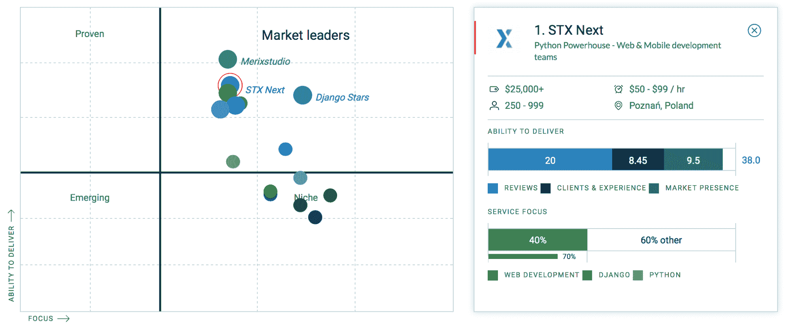

# STX 接下来庆祝 2019 年离合器顶级开发商的位置

> 原文：<https://www.stxnext.com/blog/stx-next-among-top-developers-clutch/>

 我们分享像这样的成就已经成为一种传统。

我们很高兴地报告，我们被 Clutch.co 评为 2019 年最佳 Python & [Django](/services/django-development/) 开发者，这是每月有超过 100，000 名买家使用的领先 B2B 服务在线排名。

虽然我们确实也提供 JavaScript 开发人员、[React Native](https://stxnext.com/services/mobile-development/)专家、手动和自动  [测试人员](https://stxnext.com/services/software-testing/)、[devo PS](https://stxnext.com/services/devops/)工程师和我们的产品设计团队、  **Python 仍然是我们构建软件的核心。**

凭借 14 年的经验，我们可以为所有行业的客户提供全栈 web 开发和跨平台移动应用解决方案。

我们认为  [沟通](https://www.forbes.com/sites/elenabajic/2017/12/27/why-communicating-vision-is-the-single-most-important-thing-you-can-do/#76f8c76d1e64) 在开始新项目时是最重要的。众所周知，伟大的软件在编写第一行代码之前就已经开始了。这就是为什么我们从探索研讨会、UX/用户界面、网页平面设计和  [对您的业务需求的深入分析](https://stxnext.com/services/product-design/)开始我们的开发流程。

**所有这些，加上我们对交付的每个项目的主人翁意识，使我们在离合器平台上的顶级 [Python 开发者](https://clutch.co/developers/python-django)中赢得了#1 公司的称号。** 对于我们的团队来说，这是一个非常激动人心的消息，听到我们的努力和奉献得到了回报，我们非常高兴！

“Clutch 仍然是 B2B 评级和评论的权威。对于 STX Next 的我们来说，第三方的独立评论对于在下一次网络或软件开发中寻找合作伙伴的公司来说是无价的。这是对那些脱颖而出的供应商的巨大认可。”

马修·哈里斯，业务发展总监

我们在 2019 年前 15 名 Python 和 Django 开发者中排名第一，这让我们有机会进入离合器独特的领导者矩阵，如下图所示。

离合器领导者矩阵提供了特定行业或地区中表现最佳的公司的广泛视图。每个领导者矩阵都考虑了公司的“交付能力”和“关注度”交付能力包括公司的客户评论、过去的工作、市场占有率和享有盛誉的奖项。专注是一家公司在特定服务中的专业化水平。我们公司作为市场领导者的地位意味着我们已经收到了客户的强烈反馈，并高度关注所需的服务。

除了 Clutch 在领导者矩阵中对公司的战略定位之外，对公司简介的核实评论也是在做出招聘决定之前评估公司服务的一个很好的工具。Clutch 网站上的评论对于维护我们企业的声誉和尽可能改进我们的工作至关重要。我们非常感谢我们工作的完整性反映在我们个人资料的积极反馈中。  **到目前为止，我们已经积累了近 50 条评论，并取得了 4.8(5 颗星)的总体排名。**

我们令人印象深刻的评论和总体评级为我们赢得了离合器的附属网站，“清单”和“视觉对象”的认可。

清单是一种业务资源，它通过操作指南和行业报告来帮助企业识别和解决他们的业务挑战。在他们 2019 年的报告中，他们将我们列入了他们的 100 强软件开发公司，引用了我们的工作质量和我们作为一个团队的效率。我们很高兴成为他们网站上最优秀的网站开发者之一，并希望我们的行业好评和客户评论  [向潜在客户展示我们的价值](https://blog.man.digital/poznan-software-house)。

尽管赞誉和可靠的评论很有帮助，但我们也明白在评判一家公司时，需要看到一些实实在在的东西。这就是为什么我们更愿意让我们的作品自己说话。我们收录了一些我们在视觉对象方面的最佳作品，为开发人员、设计师和其他服务提供商提供了一个向潜在客户展示其作品的空间。Visual Objects 还将 STX Next 列入了他们网站上的  [顶级开发商](https://visualobjects.com/web-development/top-web-developers) 的 2019 年清单中。

我们很高兴与您分享这些成就，并感谢离合器和我们所有满意的客户的反馈。  **我们的服务范围很广，但最终 STX Next 擅长一件事:将您的想法转化为成功的数字产品。** 如果您想了解更多信息，请随时查看我们的 Clutch 页面或  [联系我们](https://stxnext.com/contact-us/) ！

