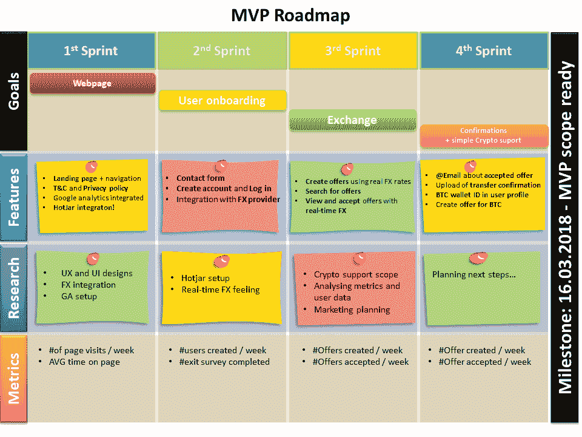
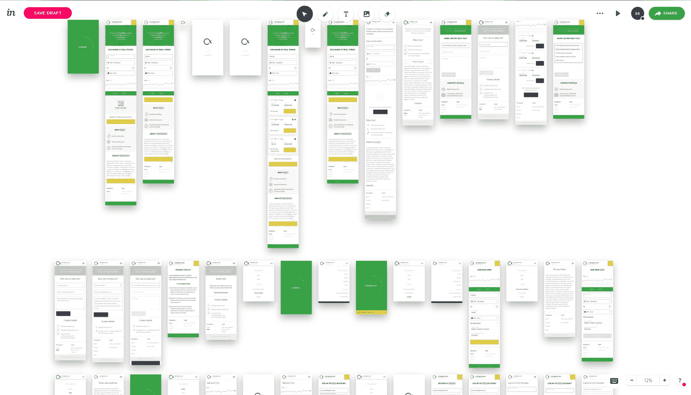
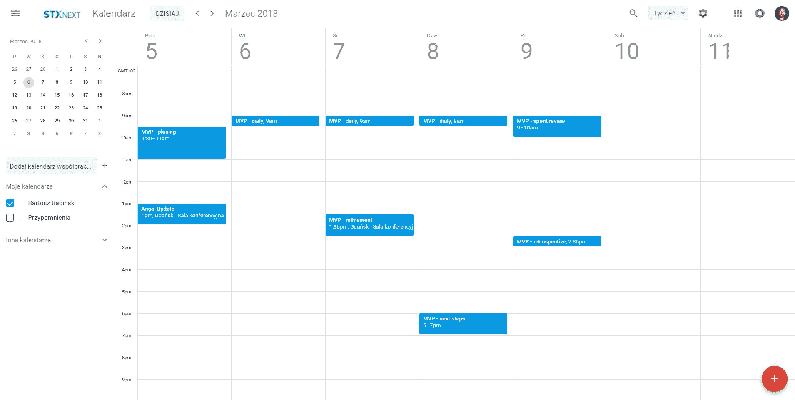
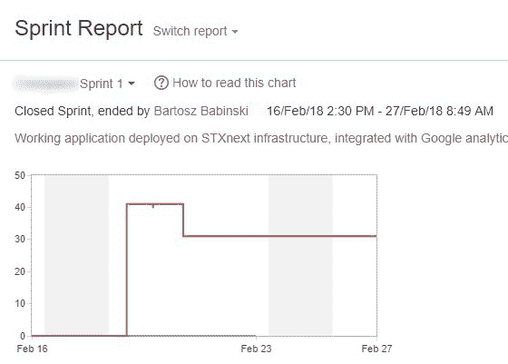
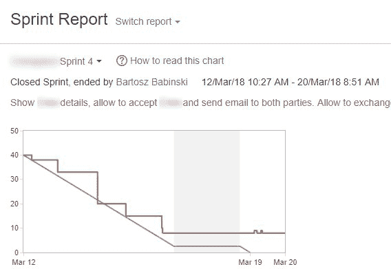

# 5x5:在 5 周内构建成功的最小可行产品的 5 个技巧

> 原文：<https://www.stxnext.com/blog/5x5-5-tips-building-successful-minimum-viable-product-5-weeks/>

 时光飞逝，不是吗？

前一年你有了一个商业想法，第二年你把你的产品卖给亚马逊或苹果，赚了一大笔钱——我的意思是，一大笔钱。这就是为什么  **速度** 如此重要；你需要  **快速移动，快速出货，****快速验证。**

考虑到这一点，让我们来谈谈**最低可行产品，或者更具体地说，在 5 周内建立一个成功的产品。**

 **我知道你要说什么:

“5 周对于打造一个 MVP 来说是相当长的时间。你应该在 1 周内完成。”

当然，但有时你想建立的不仅仅是一个整洁的联系表格和产品兴趣调查。你可以向投资者展示你的想法，向一些风险投资基金推销你的想法，或者在概念的工作证明的基础上明确你的愿景。

这三者的结合正是我们接下来要在 STX 解决的问题。

我们的一个客户想实现他们关于金融科技平台的想法。该产品背后的概念简单而强大:

*   允许用户在不同的社区成员之间进行货币交换，而无需支付银行费用和传播成本
*   通过社会交换机制，使用实时的中间市场汇率，交换法定货币和加密货币
*   作为一个简单的网页工作，并计划在未来扩展到其他平台

我们都同意从简单的事情开始，边做边学。挑战是真实的，因为我们的整个团队刚刚加入公司一段时间。我第一次见到其他人是在项目开始前的两天。真的！

所以我们有一个 3 人小组:

*   本人，  **产品负责人**
*   亚当·萨伊科**T3 前端工匠**
*   达米安·布索斯基  **后端机械师**

目标设定了，截止日期也设定了，我感觉自己就像松鼠人，跳跃着希望达到目标。质量保证部的 Dorian Kominek 在第三次冲刺中支持了我们，但最初我们只能靠自己。

好家伙，时间过得真快…但是我们做到了！在计划范围内按时完成。MVP 正在生产中，它可以工作，我们正在和第一批 alpha 用户一起验证这个解决方案。

“但是怎么做呢？”你可能会问。“你是怎么做到的？”

好吧，让我告诉你。我敢说，以下是我的 5 个简单的技巧，可以在 5 周内打造一个成功的 MVP。**  **#### 管理期望，而不是结果

由于我们得到了另一位经验丰富的产品负责人 Gosia Maksimczyk 的支持，MVP 的初始范围组织得很好。 客户确切地知道我们能在大约 4 周内交付什么，并同意承担风险。他们意识到我们不会在那个时候建造太空火箭，并且需要在许多方面偷工减料。

不过最重要的是，他们有  **的信任和信心** 我们会在时间和范围的限制下做出最好的 MVP。虽然这需要我们的客户给我们带来好处，我们尽一切努力确保他对我们的信任是有根据的:

*   我们从一开始就毫不留情地将列为优先特征。这样做的目的是，一旦我们没有时间了，我们至少可以交付关键的功能。
*   每次冲刺后，我们都会调整我们的小路线图 。反过来，地图向我们展示了接下来可以实现的步骤。
*   我们遵循的原则是紧密迭代规划。由于这一点，我们的客户在每一步中都保持在循环中，他的期望随着冲刺而调整。

我们的努力没有白费，客户对我们的工作非常满意。然而，如果他一开始不信任我们，这是不可能的。有些客户思想特别开放，和他们一起工作总是一件幸事。

#### 精通业务

像这样的事业只有在专业团队同步工作的情况下才能成功。尽管每个人都是自己领域的专家，但是选择依靠他人，依靠他们来帮助你是很好的。

我们所有人都有满足客户期望的能力，但这个过程总是团队努力的结果。这就是了解自己的真正含义:自己做好准备，同时也让别人在必要时为你做好准备。

以下是我们根据这一理念所做的工作:

*   **产品发现研讨会**

当我们进入项目的早期阶段时，我们唯一确定的事情是我们需要在 4 个开发周内制作一个 MVP。我们对这个项目的确切性质有一个更模糊的想法。

考虑到这一点，在进入开发阶段之前，我们整个团队都参加了  **密集的[产品发现研讨会](/services/discovery-workshops/)** 。研讨会持续了两天。

*   **产品设计**

花了大约一周时间的产品设计阶段是下一个关键部分。感谢 Adam Srebniak——一位忠诚的 UX 专家和我们亲爱的同事——我们对我们正在建造的东西有了更深入的了解。

对我们有利的是，在我们开始编写代码之前，我们有机会让几乎整个团队都参与进来。这给了我们很大的帮助，因为我们不仅熟悉了输出的概念，还熟悉了它背后的推理。

当有疑问时，我们总是可以  **回到模型或产品标语** 以便回到正轨并重新获得我们的注意力。

*   **经历**

BIC、SWIFT、IBAN、BTC、FX——所有这些金融科技的首字母缩略词及其背后的想法都会让你头晕目眩。它们也会成为你在截止日期前实现目标的巨大障碍。

幸运的是，在着手这个 MVP 之前，我们已经有了  **和** [金融和加密货币](https://stxnext.com/portfolio/#fintech) 的经验。以我们的准备程度，这只是几个 sprint 改进的问题——作为知识分享会议——让每个人都在同一页上。

*   **执行**

你知道这句名言吗，“一个想法没有执行就什么都不是”？当谈到建立一个 MVP 时，这是非常相关的。

计划是一回事，但实施完全是另一回事。由于我们的 **在前端和后端的专业知识、** 以及来自我们精通技术的 QA 的 **的大力支持，我们的团队设法克服了许多执行挑战。**

每个人都知道 **如何充分利用我们所使用的技术，如何快速构建东西，** 以及最重要的是， **如何识别什么时候某样东西是** [刚刚好](https://en.wikipedia.org/wiki/Principle_of_good_enough)。

#### 提前做好准备

当你只有 4 周的时间来构建一个 MVP，并且有一个全新的团队来做这件事的时候，  **提前做好准备以最小化风险是必须的。**

你根本负担不起 2 周的短跑。如果其中一个失败了，你只剩下一次机会去  **检查和适应。**

这就是为什么在计划阶段，我们决定进行为期一周的冲刺。这个选择让我们能够 **快速验证、学习和调整。**

在 Scrum 中工作一周的冲刺， **频繁的会议** 是你的面包和黄油。你需要为每个人繁忙的日历腾出空间，并尽快开始 **协调每个人的日期和时间** 。提前预订会议室也是一个好习惯，这样你就不用在最后一刻担心了。

也可以提前为项目设置一些 **简陋工装** 。吉拉、GitHub、詹金斯——只要你能说出来的。这样做并不是很费时间，如果你的项目从这个实例*开始，你会很高兴有一个地方来存储你的故事或者隐藏、构建和部署你的代码。 **第三方工具** 如电子邮件、AWS 或 API 费率提供商也属于此步骤。请注意，SaaS 工具为初创公司提供免费等级，你可以在以后升级到付费计划。*

 *不过，这取决于你为哪家公司工作。有时候团队不得不在第一个冲刺阶段自己处理工具。事实上，当我得知在 STX Next 公司，只需要向行政部门提出几个简单的请求时，我感到非常惊讶——我可以说非常愉快。第二天早上，所有的工具都在那里等着我们。请注意，在其他公司可能需要更长的时间。

从(这个)经历来说，我怎么强调都不为过:你事先准备得越好，就越容易适应不断变化的环境——这种情况经常发生——并继续推进项目。

我们在两个不同的时区合作。执行阶段不断演变。会议被推迟了。有很多杂耍。说真的，这么多运动部件。如果我们没有做好充分的准备，我们是不会成功的。*  *#### 实现 Scrum 的核心价值观

好吧，假设你已经计划和设计了你的产品。工具都准备好了，故事写好了，评估好了——剩下唯一要做的事情就是，嗯，实际投入工作。

对于这个 MVP，我们依靠 Scrum 和吉拉。吉拉板是我们需要构建的蓝图，而 Scrum 指南是如何构建它的手册。

将  **核心价值观** 贯彻到我们的发展过程中:

*   **承诺**

团队的每个成员都全力以赴实现冲刺目标，即使这意味着加班，不管是一个小时还是一个通宵(一个  *偶尔* 最多一个！).兑现承诺的最快方法是优先完成我们已经开始的任务。这样，我们部署了大量的故事，而不是开始它们。

*   **焦点**

在短距离短跑中，注意力是绝对必要的。我们整个团队都专注于特定的冲刺目标和任务，这些目标和任务在任何时候都是至关重要的。为了高效地执行，你不能让自己失去注意力，哪怕是一分钟。

*   **尊敬**

尊重需要上下，也可以说是左右。

我们尊重我们的客户，作为回报，他们也尊重我们。我们把他们的钱主要花在具有最高商业价值的功能上，而不是可能的冗余上。我们对每个 sprint 的期望也很现实，并且只在客户的演示中包含真正完成的特性。在演示过程中，一些崩溃是不可避免的，但由于 QA 坚定不移的支持，它们偶尔会发生。

除了尊重我们的客户，我们也尊重彼此。我们都有自己的长处和短处，理解和讲道理是确保各方顺利合作的唯一途径。

*   **开放度**

在任何团队环境中，这都是无价的品质。从和团队在一起的第一天起，我们都在努力做得更好，我们每个人都从中受益。

在工作场所营造一种氛围至关重要，在这种氛围中，所有团队成员都可以交流障碍、寻求帮助和交换意见。每个人都应该被赋予同样的权利和表达意见的机会。

做到这一点，个人成员将真正成为一个团队。达成的决定将得到支持和执行，即使是通过妥协达成的。

*   **勇气**

通常，只有当你有勇气的时候，你才能达到你计划的冲刺目标。我们允许自己更专注于提出新的想法，不惜一切代价完成工作，而不是努力满足每一个验收标准，直到最后一个细节。

是勇气帮助我们在回顾会议上创建改进行动点，并在下一次冲刺中实施。

给一群刚被雇佣的人分配一项时间非常紧迫的任务需要勇气。

我们在源代码中合并的每一个提交都充满了勇气。自己看吧！

[//www.youtube.com/embed/YiLfyIsd1hI](//www.youtube.com/embed/YiLfyIsd1hI)

#### 调整并重复

当我们开始编码的时候，我们对我们的目标有一个精确的想法。我们的雄心壮志已经达到了顶点，似乎没有什么大不了的事情需要我们去承担。我们有信心克服前进道路上的每一个挑战，没有什么能阻止我们如期完成任务。

这就是为什么我们的第一份 sprint 报告看起来像这样并不奇怪:

开了个好头，对吗？我们承担了太多，太快，没有评估故事就直接进入冲刺阶段。正因为如此，我们只能完成一些故事，在第一次会议上已经最终估计了它们。你可能会问，我们完成了多少故事？答案是 3。我们完成了 3 个故事。

值得庆幸的是，我们通过 sprint 学习了越来越多的 sprint，采取回顾性的行动项目，并把它们带到生活中。4 次迭代中，我们的 sprint burndown 看起来好得无与伦比:

Scrum 的美丽和简单就在于此: **透明地构建事物，在每次冲刺后检查它们，并尽可能地调整你的过程。**

我很想告诉你，这是一个适合所有人的解决方案，事情总是按照你的方式发展。可悲的是，我将第一个承认，通常情况下，你需要 4 次以上的迭代才能达到你的目标。可能只是几更，但是，你知道，还是  *更。*

(还有，我知道我忘了关闭冲刺。不好意思！)

#### 下一步是什么？

MVP 目前处于产品创意验证阶段，正在寻找进一步的发展方向。

这对你来说意味着什么？

这意味着我们的开发梦之队有一些空闲时间。所以，如果你碰巧需要一些结果驱动的、解决问题的、软件工程的魔法— [让我们知道](https://stxnext.com/services/fast-mvp-app/) 如果我们能帮忙的话！

与此同时，恶人没有休息的时间。一段时间以来，我们一直在考虑在的一半时间里为一个商业产品设计和构建一个 MVP。是的，你没看错——这一次，我们把目标放在了 2 周的最后期限上。

这项工作目前正在进行中。想知道进展如何吗？请继续关注我的下一篇博文，或者更好的是，  **订阅我们的时事通讯** ，在帖子发布的那一刻得到通知。

感谢阅读，再见！

***