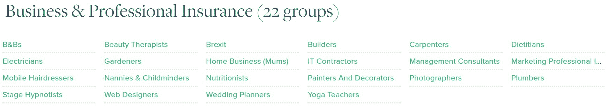
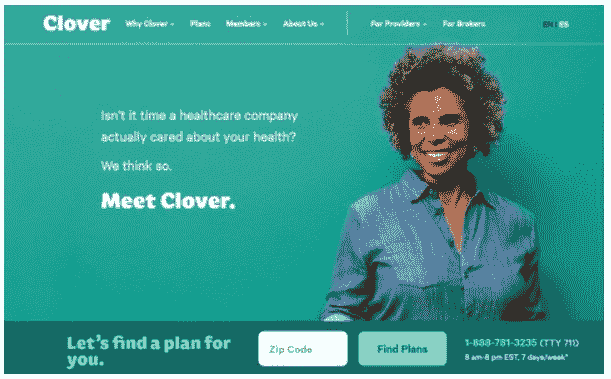
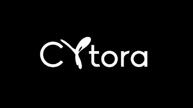
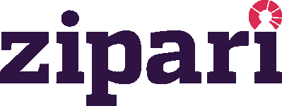
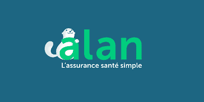
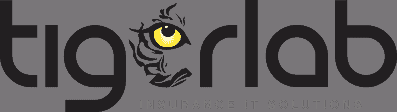

# 9 家使用 Python 的金融科技公司:Insurtech 版

> 原文：<https://www.stxnext.com/blog/7-insurtech-companies-python-their-tech-stack-and-why-its-fit/>

 > ***“需要保险就像需要降落伞。如果第一时间它不在那里，你可能就不会再需要它了。”***
> 
> ***—作者不详***

说实话，你上一次兴奋地购买保险是什么时候？或者你最后一次与朋友或同事公开讨论你最近的报道？

如果你一无所获，我并不惊讶。大多数人讨厌购买保险的想法。但这种状况可能很快就会改变。

**数据分析、人工智能和机器学习正在推动 insurtech 的出现。**

保险是一个古老的行业，这正是保险科技公司值得你关注的原因。该领域的顶级玩家正在推动一个创新时机成熟的行业发生巨大变化。

作为这个领域的创始人或首席技术官，这使得你对技术组合的选择变得更加重要。你想要的技术不仅要有良好的记录和庞大的社区，而且要成为数据分析、  [人工智能和机器学习](https://stxnext.com/services/machine-learning/)的首选工具。

也许你在这里是因为 insurtech 现在很性感(见下面的 meme)，你想知道你的同行已经决定使用哪些技术来构建他们的尖端保险应用程序。

或者，您可能是一个 Python 爱好者，非常想知道哪些公司已经选择实现您所选择的编程语言。不管怎样，我们会保护你的。

在我们关于  [Python 和 fintech](/stx-new-blog/why-python-should-be-technology-choice-your-fintech/) ，系列的续篇中，我们为您带来 9 款 fintech，即  [使用 Python](https://stxnext.com/ebooks/what-is-python-used-for/) 在其  [tech 栈](https://stxnext.com/ebooks/what-is-python-used-for/#fintech) —insurtech edition。

如果你想跳到列表中，请继续。但是在我开始这篇文章的重点之前，我想提供一些关于这个行业及其与 Python 的关系的背景信息。 

#### 保险没意思；insurtech 正试图改变这种状况

保险业可以追溯到几百年前。举个例子，法国的安盛成立于 1817 年，而英国的保诚成立于 1848 年。任何存在了这么长时间的行业都应该发生革命性的变化。

**现有保险提供商面临的问题** 是他们的产品有两个主要关注点:

1.  **真无聊。购买保险不会让任何人兴奋。** 这可能就是为什么你不太可能听到 insurtech 像其他金融科技垂直领域(支付、财富科技和加密货币)一样令人兴奋的讨论。(顺便问一下，你的比特币怎么样了？)

2.  **对客户的价值并不明显** 直到客户需要提出索赔——这可能永远不会发生。

**输入 insurtech** 。 保险的伟大之处在于它是一种无形的产品，很容易数字化。

正如你将从我们的 8 人名单中看到的，insurtechs 正在使用尖端的数据分析和人工智能来推动创新和推出新产品。同时，他们非常重视  [产品设计](/stx-new-blog/software-product-design-roi-good-ux/) ，以确保最终用户的体验在速度和易用性方面得到优化。

**Possibly the first insurtech meme created—author unknown**

#### Fintech 正在老化；insurtech 已经搞定了

保险科技在整个金融科技生态系统中仍是一个相对新生的部分。虽然金融科技作为一个整体开始走向成熟(Transferwise 始于 2010 年，Zopa 始于 2005 年，Venmo 始于 2009 年，仅举几个例子)，但大多数 insurtechs 尚未庆祝其存在的第五年，在许多情况下是第五个月。

根据旧金山投资银行  [金融科技伙伴](http://insurtech.mayerbrown.com/2018/01/23/ft-partners-fintech-industry-research/)的数据，投资者在 2017 年通过创纪录数量的交易向保险科技公司注入了 22.38 亿美元。

insurtech 之所以是一个有趣的领域，是因为它还未被开发。 大部分进入者仍然专注于美国和英国市场，并且主要集中在个人和非寿险业务上。还有很大的空间去打乱非寿险和商业线。

成长的空间不仅仅是初创公司的专利。现任者刚刚开始采取行动。埃森哲的  [数据显示，2017 年，只有 17%的传统保险公司拥有专注于创新和收购的内部风险投资基金。与银行业相比，成熟的零售银行的这一比例接近两倍。](https://www.accenture.com/t00010101T000000__w__/gb-en/_acnmedia/PDF-50/Accenture-Insurtech-PoV.pdf)

#### Python 是数据科学的理想选择，数据科学是 insurtech 的支柱

数字世界的数字处理能力改变了保险公司的游戏规则。凭借近乎无限的数据量，保险公司可以更准确地评估风险，从而推出更加个性化的产品。

对于 insurtech 的创始人来说，应该优先选择适合数据科学的编程语言和框架。如果你读了我以前的帖子，你会知道 Python 正在成为一般 fintechs 的首选服务器端技术。

然而，对于保险行业来说  [您最好考虑将 Python](/stx-new-blog) 作为您的工具，原因如下:

*   根据 IBM 的一项研究[Jean Francois Puget](https://dzone.com/articles/and-the-most-popular-language-for-machine-learning)、  **Python 是机器学习和数据科学最流行的语言；**
*   以  **易语法** 而著称的**与** 相比其他传统语言，Python 是优化  **上市时间的最佳选择；**
*   最后是 Python 的财富  **开源[库](/stx-new-blog/blog/2018/09/20/most-popular-python-scientific-libraries/)** (NumPy，SciPy，StatsModels，scikit-learn，Pandas 等。)为 fintech 中许多常见的数据分析问题提供了  **现成的解决方案。**

Validate Health 的创始人 Andrew Webster 在他的 2017 年案例研究  [中分享了他使用该语言的经验，即 Python 如何拯救了我的公司](https://blog.actexmadriver.com/2017/10/09/how-python-saved-my-company/)。

> ***【验证健康应用程序】的所有分析均使用 Python 实现自动化，并通过基于网络的界面为我们的客户提供实际控制。如果我们继续在 Rails 上使用 R 和 Ruby，我们不可能达到现在的阶段。Python 拯救了我的公司！***
> 
> ***—安德鲁·韦伯斯特***

#### 9 家公司使用 Python 改变了 insurtech 的面貌

到目前为止，你很有希望了解 Python 及其在数据分析和人工智能方面的应用，并且你渴望深入了解最初让你来到这里的列表。以下是 8 家 insurtech 公司，它们强调 Python 是其技术堆栈中的必备组件。

##### 1)被许多人购买

*   **总部:** 英国伦敦
*   **创办:** 2012 年
*   **亮点:**2018 年，公司推出首款旅游保险产品

##### **关于**

假设你是一名婚礼策划人或营养师，或者你选择的狗是一只那不勒斯獒犬。你会去哪里获得最好的保险来满足你的...  *独特的* 需求？如果有足够数量的志同道合的人，你是否已经覆盖了。

buy By Many 汇集了在大多数情况下有非常具体的保险需求的群体或社区。通过联合他们的集体谈判力量，这些社区可以从保险提供商那里获得比他们单独寻求保险更好的交易。从保险公司的角度来看，它获得了非常准确的风险细分，尽管规模更大。

**Examples of some of the groups individuals can join under the Business & Professional Insurance category**

截至 2018 年 9 月，buy By Many 拥有 551，472 名会员和 317 个群组。群体范围从家庭、旅行、宠物、职业到小工具和运动爱好者。一旦该组织获得大量成员(通常在 100 人左右)，该企业将开始与保险公司谈判，以获得尽可能好的保险。

2018 年 1 月，buy By Many 推出了首款旅游保险产品，专门为那些患有癌症等严重健康问题的人量身定制。而且，2018 年 7 月，买多多银行 1500 万 B 轮融资。

[//www.youtube.com/embed/1RKPcWypCFg](//www.youtube.com/embed/1RKPcWypCFg)

##### **技术堆栈**

被许多人购买的全栈开发人员应具备以下技能和经验，按优先顺序排列:

*   **Python；**
*   **MongoDB 和关联的 Python 库；**
*   **微服务和 REST APIs**
*   **AWS: Lambda、Kinesis、API Gateway**
*   **AWS devops 和 APIs**
*   **Python Web 框架(Django，Flask)。**

据被许多人买下的  [栈溢出](https://stackoverflow.com/)称:“就技术而言，我们主要是一家使用 [Django](/services/django-development/) web 框架和 Flask 的 Python 商店。”完全符合我们的名单。

##### 2)奥斯卡健康

****

*   **总部:** 美国纽约
*   **成立:** 2013
*   **亮点:** 截至 2018 年 1 月，公司已融资 7.275 亿美元

##### **关于**

对于那些关注美国政治的人(这些天他们没有关注)，你可能已经错过了 2017 年 12 月废除  [平价医疗法案的个人授权](https://www.reuters.com/article/us-usa-tax-healthcare/u-s-senate-tax-bill-accomplishes-major-obamacare-repeal-goal-idUSKBN1DW07T) ，预计这将影响健康保险提供商的未来。

Oscar Health 的首席执行官马里奥·施洛瑟对此非常关注，他对 2018 年的预期仍然乐观，预计这家健康保险初创公司将在 2018 年获得近 10 亿美元的收入，并注册 25 万名会员。

“(美国的)医疗保健体系已经崩溃。我们要修复它”是奥斯卡网站上的口号。作为一家专注于千禧一代的保险初创公司，该公司因其对数据的使用而获得了巨大成功。

传统上，美国的保险公司使用数据来给客户开账单。然而，Oscar 通过一个设计良好的应用程序使用数据提供以客户为中心的服务，该应用程序允许人们跟踪医生就诊、处方药购买和实验室工作。它还提供全天候的远程医疗服务和医生预约服务。

2017 年初，Oscar Health 扩展到一个新的业务领域，推出了一款专为小企业打造的产品，名为  [Oscar for Business](https://www.hioscar.com/business/) 。

[//www.youtube.com/embed/v3ic9SetIHQ](//www.youtube.com/embed/v3ic9SetIHQ)

##### **技术堆栈**

Oscar 的数据和安全工程师应该有使用脚本语言的经验——Python 就属于这一类。据该公司称，“他们的产品和平台主要是用  [Python](https://stxnext.com/services/python-development/) 、  [JavaScript](https://stxnext.com/services/javascript-development/) 、Java、Objective C 和 Go 构建的。”[Siftery](https://siftery.com/)也证实了 Oscar Health 的 tech 栈中包含 Python。

##### 3)斑马

*   **总部:** 美国得克萨斯州奥斯汀
*   **创办:** 2012 年
*   **亮点:** 背靠达拉斯小牛队老板马克·库班

##### **关于**

另一个有据可查的例子[Austin fin tech](https://stxnext.com/portfolio/vyze/)在其 techstack 中使用 Python，Zebra 是一个在线保险比较市场，消费者可以在几秒钟内收到来自 200 多家汽车保险公司的报价。迄今为止，斑马已经与超过 25 家保险公司合作。

2017 年 9 月，这家试图让保险“黑白分明”的公司获得了由风险投资公司 Accel Partners 牵头的 4000 万美元 B 轮融资。这笔融资是德克萨斯州 2017 年最大的 B 轮融资，使 insurtech 自成立以来的总额达到 6150 万美元。

斑马公司预计到 2019 年底，其员工人数将增加一倍，从约 100 人增加到 200 人。

[//www.youtube.com/embed/soSuY8oQEhk](//www.youtube.com/embed/soSuY8oQEhk)

##### **技术堆栈**

斑马公司的招聘团队以一种有趣的方式暗示了他们首选的技术组合，这与你在他们的求职页面上看到的信息一致:

> ***让我们印象深刻的体验:*** ***Python 体验*** ***Django 体验***

好了，这份工作描述一点也不“灰色”。

##### 4)三叶草健康

*   **总部:** 美国加州旧金山
*   **成立:** 2013
*   **亮点:**2017 年 5 月，三叶草获得谷歌 1.3 亿美元投资

##### **关于**

联合创始人 Kris Gale 和 Vivek Garipalli 早在 2014 年就创办了 [Clover Health](https://www.cloverhealth.com/en/) ，旨在利用数据科学改善预防性医疗保健。这家总部位于旧金山的公司是一家由美国联邦政府报销的保险公司。

2017 年 5 月，Clover 从谷歌筹集了 1.3 亿美元，这一轮融资现在对该公司的估值为 12 亿美元，使其总融资额达到 4.25 亿美元。

##### **技术堆栈**

根据他们的媒体页面，Clover 使用 Python 进行所有的后端编码。

他们旧金山总部的工作描述包括以下内容:“Python 是我们技术堆栈的主要语言，我们希望为我们的团队增加更多 Python 专业知识。”Clover 不仅重视有经验的 Python 开发者，也重视那些将指导其他 Python 开发者的人。

##### 5) Cytora

*   **总部:** 英国伦敦
*   **成立:** 2014
*   **亮点:** 商业保险公司可以使用的风险引擎，帮助他们使用人工智能算法来确定风险目标和定价风险

##### **关于**

[Cytora](https://cytora.com/) 利用  [机器学习](https://stxnext.com/blog/2017/12/12/getting-started-machine-learning-python/) 和非结构化数据，帮助商业保险公司改善对风险的理解和定价方式。随着该公司“风险引擎”的推出，保险公司将能够利用人工智能来提高赔付率和保费增长，为客户提供更准确的定价。

2017 年 12 月，Cytora 从一群投资者那里筹集了 590 万美元，其中包括 QBE 风险投资部门和 Starr Cos 的部门。2018 年 8 月，该公司宣布将在 B 轮融资前启动美国业务。

##### **技术堆栈**

Cytora 新聘用的高级数据工程师开始致力于“公司最大的一些挑战，从扩展数据处理管道(使用 Python、Spark、ElasticSearch、Docker、GCP 和 TensorFlow/Keras 构建)到构建(公司的)网络爬行基础设施(基于 Python 和 JavaScript)。”

##### 6) Zipari

*   **总部:** 美国纽约布鲁克林
*   **成立:** 2014
*   **亮点:** 在过去的两年里，团队规模扩大了约 225%

##### **关于**

随着越来越多关于患者保护与平价医疗法案(俗称奥巴马医改)未来的讨论，医疗保险提供商将需要工具来恰当地吸引年轻、富裕的美国人，并鼓励他们注册医疗保险。

创立于 2014 年的 [Zipari](http://www.zipari.com/) 正在帮助医疗保健行业提高客户满意度和消费者体验。该公司的产品 InsureCX 为保险提供商提供其成员的实时数据。它还支持基于规则的建议、自动化工作流程和会员参与管理。

##### **技术堆栈**

Zipari 正在寻找 Python Django 开发人员。根据他们的网站，要求包括:“优秀的 Python 编码技能和对 Python 最佳实践(PEP8)的理解，对 Django 和 Flask 等 Python web 框架以及使用 Python 构建 RESTful API 的丰富知识。”

##### 7)都市丛林

*   **总部:** 英国伦敦
*   **创办:** 2016
*   **亮点:**2018 年 1 月筹集 100 万种子资金

##### **关于**

我们的倒数第二名也是最年轻的。城市丛林的创始人正在解决英国租房者目前面临的问题，提供更便宜、更定制的房屋保险。

根据 Urban Jungle 的数据，只有 40%的城市租房者会考虑购买房屋保险。该公司的“租房者物品保险”解决了在租房者的家变得无法居住的情况下的替代住所、租房者的房东的固定装置和设备的责任保险以及涵盖家庭物品的选项等问题。

该公司在 2018 年 1 月筹集了 100 万英镑的种子资金，并将利用这笔资金扩大产品供应。

##### **技术堆栈**

Urban Jungle 的创始人认为，他们可以通过使技术栈现代化来扰乱保险业，包括智能手机优先的设计和使用  [机器学习](https://stxnext.com/machine-learning-applications-examples-industries/) 来提高风险评分。

说到机器学习， [Python](/stx-new-blog/blog/2018/09/20/most-popular-python-scientific-libraries/) 是一个特别强的选择。编程语言是一个理想的选择，因为它拥有广泛的 [科学和数据分析库](/stx-new-blog/blog/2018/09/20/most-popular-python-scientific-libraries/) ，包括但不限于:

*   **【scikit-learn】**
*   **SciPy,**
*   **NumPy，**
*   **熊猫，**
*   **【张量流】**
*   **Keras,**
*   **Theano。**

联合创始人兼首席技术官(前脸书和谷歌高级工程师)格雷格·史密斯(Greg Smyth)选择了以下堆栈:“Angular2、CSS、Javascript、Python、Linux、Docker、AWS 和 SQL。”

##### 8)艾伦

*   **总部:** 法国巴黎法兰西岛
*   **创办:** 2015
*   **亮点:**2017 年，公司推出公司寿险产品

##### **关于**

1986 年至 2015 年间，只有一家保险公司在法国获得了保险执照——[艾伦](https://alan.eu/)。获得法国审慎监管局(ACPR)的许可，Alan 创始人的使命是通过解决两个关键领域来实现健康保险的现代化:定价和改善整体用户体验。

艾伦与这份名单上的许多人不同的一点是，在 2017 年中期，该公司冒险进入了企业所有的人寿保险，增加了其已经很受欢迎的企业健康保险系列。由于没有直接获得许可，该公司正利用其主要投资者 CNP 保险公司来提供新的保险产品。

2018 年 4 月，艾伦完成了 2830 万美元的 A 轮融资，目前覆盖 850 家公司的 7000 名员工。

##### **技术堆栈**

Alan 有一个小而有才华的开发团队，专注于构建简化医疗保险的基础设施、界面和应用程序。Alan 的全栈开发人员应该是 Python、JavaScript 方面的专家，并且愿意使用选定的编程语言。

##### 一)老虎实验室

*   **总部:** 马来西亚吉隆坡
*   **成立:** 2008
*   **亮点:**2018 年，公司推出基于云的保险软件产品 i2go

##### **关于**

在 2008 年至 2018 年期间， [tigerlab](https://www.tigerlab.com/) 的主要工作是为大型保险公司、MGA、保险经纪人&再保险公司开发个人软件解决方案。tigerlab 认识到了最近的趋势以及保险公司对其软件解决方案更加灵活、快速和创新的需求，通过开发基于 Python 代码的云保险软件来响应这一号召。

自 2018 年以来，他们帮助跨国保险公司简化了新的创新保险产品(如远程信息处理、GI 等)的推出，开辟了新的数字销售分销渠道，并通过更高的运营效率和更低的管理费用提高了整体盈利能力和用户体验。

##### **技术堆栈**

因为他们必须使用几个第三方 API，所以 Python 是他们开发团队的首选语言。他们一直在为他们在吉隆坡的总部寻找非常有才华的前端和后端开发人员。

#### 您的反馈

感谢您花时间通读像我们一样热爱 Python 的 fintechs 的最新列表。

你认为还有一个领先的保险技术被我们遗漏了吗？在评论里提一下，我们会核实一下，补充到这里。

我们将在未来的版本中讨论 Regtech 和 Wealthtech，所以也可以随意推荐这些领域的公司。

#### 进一步阅读

要了解更多关于 Python 对金融科技公司的优势，请务必阅读我之前的文章: [为什么 Python 应该是你的金融科技](/stx-new-blog/why-python-should-be-technology-choice-your-fintech/)的技术选择。

如果你有兴趣阅读 insurtech 之外其他将 Python 纳入其技术堆栈的金融科技公司，只需看看 [将 Python 纳入其技术堆栈的前 17 家金融科技公司](/stx-new-blog/top-15-fintech-companies-include-python-their-tech-stack/)。

要第一个了解我们的最新文章，请不要忘记使用右边的表格(或在手机上向下滚动)订阅我们的时事通讯。

#### 来源和进一步的阅读

*   [Fintech 行业研究](http://insurtech.mayerbrown.com/2018/01/23/ft-partners-fintech-industry-research/)
*   [Insurtech 的崛起](https://www.accenture.com/t00010101T000000__w__/gb-en/_acnmedia/PDF-50/Accenture-Insurtech-PoV.pdf)
*   [机器学习最流行的语言是...](https://www.ibm.com/developerworks/community/blogs/jfp/entry/What_Language_Is_Best_For_Machine_Learning_And_Data_Science?lang=en)
*   [Python 做机器学习:为什么要用 Python 做 ML？](/blog/python-for-machine-learning/)

