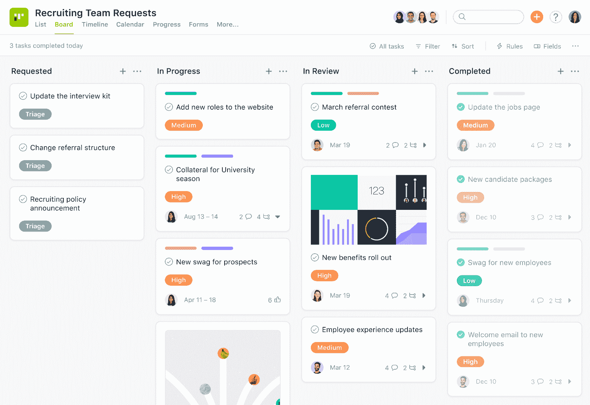
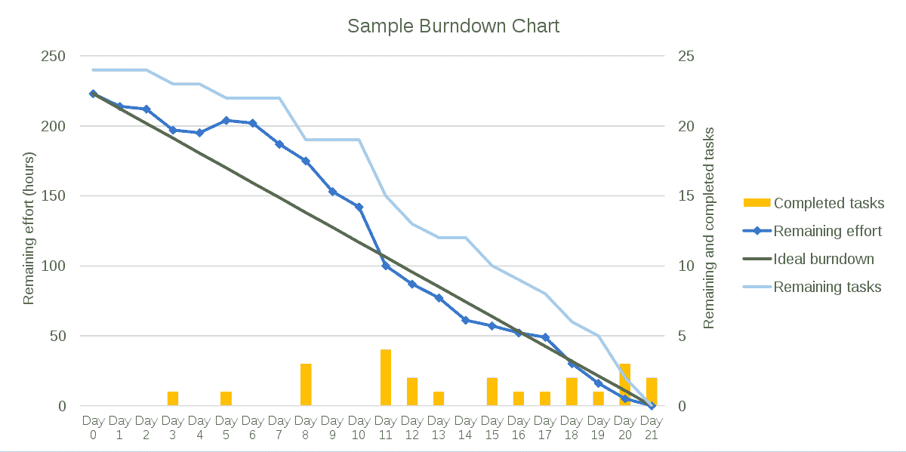
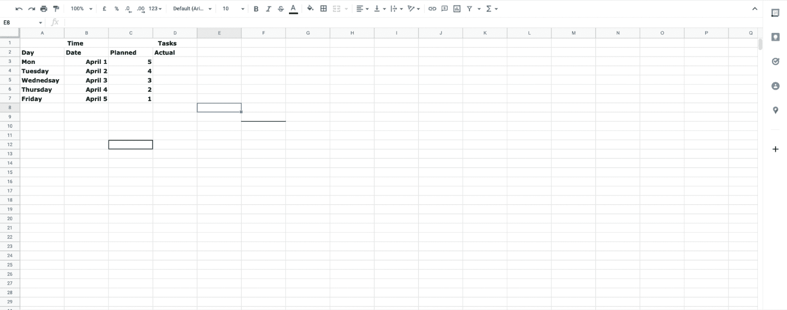
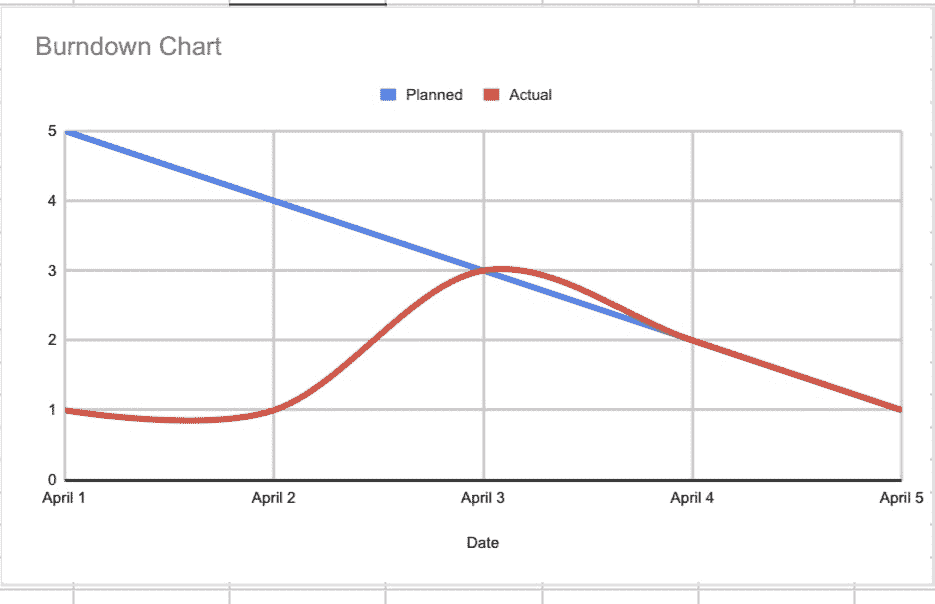

# 产品开发和工程团队的敏捷最佳实践

> 原文：<https://www.stxnext.com/blog/agile-best-practices/>

 敏捷是软件开发项目的强大框架。无数提供数码产品的公司都这么说， [包括我们自己的客户](/lp/case-studies/evalueserve) 。

然而，只有当您遵循保证高效执行、最小错误和无缝通信的最佳实践时，才会出现这种情况。

在本文中，我们将讨论几种最佳敏捷实践，并向您展示如何使用它们来创建高绩效的敏捷团队。**下面是我们将要讲述的内容:**

*   **创建结构化文档**

*   **召开每日站立会议**

*   **可视化您的项目工作流程**

*   **拥有持续整合战略**

*   **使用燃尽图进行冲刺**

*   **实施拉，不推策略** 

#### 1.创建结构化文档

结构化文档作为项目执行的唯一真实来源，确保每个人都在同一页上。这反过来改善了团队协作，并使执行过程更加高效。

在 LinkedIn 的一条评论 中，AutoScout24 的高级工程经理 Nikita Belokopytov 指出，“没有书面文件，一个人无法根据情况调整想法——实际上没有什么是一成不变的。如果范围和工作量都没有被记录下来，人们甚至不能就项目的范围进行协商或寻求更多的帮助。从我的经验来看，缺乏项目和决策的文档会滋生混乱，这反过来会降低团队的速度，导致混乱和混乱。”

文档编制可能是一项乏味且耗时的任务，这一点是肯定的。为了快速跟踪这一过程，首先与您的团队举行一次简单的规划和头脑风暴会议。一旦你的团队明确了需要做什么和执行过程是什么，你就可以用一个简洁易读的文档写下这个计划。然后你应该将它传递给项目的涉众，以获得完全的透明度。

#### 2.每天召开站立会议

Scrum 指南 将每日站立会议定义为开发团队为未来 24 小时做计划的 15 分钟时限事件。

Brivo 的首席技术官杰夫·尼尔森(Jeff Nielsen)说，“每日站立会议的目的是让团队计划和协调当天的工作。接下来的 24 小时我们要一起做什么？我们的合作计划是什么？谁将和谁一起工作？在忙什么？我们还有哪些优先事项，事情需要以什么顺序发生？”

这些问题帮助您识别和解决您的团队成员所面临的任何挑战，以免这些障碍变成更大的问题，从而破坏项目的执行。

但是要注意，如果你没有计划好，单口相声会变得单调乏味，浪费大量时间。以下是一些有效进行每日站立会议的建议:

*   确保站立出席者是在接下来的 24 小时内将一起工作的人。
*   设定一个明确的目标。
*   避免在会议中试图解决问题。你可以也应该在会议中确定需要解决的问题，但只能在会议结束后解决。
*   加点变化。您可以更改提供更新的顺序，或者在您的 Agile 工具中使用不同的视图在会议上进行演示。

#### 3.可视化您的项目工作流程

可视化项目工作流可以让您更清楚地了解需要做什么、什么时候应该做以及谁负责，以便您可以更有效地进行规划。这是将大型复杂项目分解成可追踪的离散行动的好方法。

作为一个人，你可能有过这样的例子，即将到来的任务看起来势不可挡或无法完成，直到你把它们放在你的日历上或在像 Trello 或 Asana 这样的计划应用程序中。

一旦你做到了这一点，突然之间你就能优先处理紧迫的任务，委派那些你没有时间去做的任务，并设定最后期限来让自己负责。敏捷团队也是如此。

**来源:** [**体式**](https://asana.com/)

可视化项目工作流的最好方法之一是使用看板。看板是一种项目管理工具，它允许您规划和管理项目任务、工作流和沟通。

向看板添加新任务时，您可以:

*   将它们分配给不同的团队成员；
*   添加开始和/或到期日期；
*   创建项目阶段，如“未完成”、“进行中”和“审查中”

最后，随着事情的进展，您可以在这些不同的阶段之间移动任务，直到项目完成。

#### 4.拥有持续集成战略

持续集成策略允许开发人员获得关于新代码或他们对现有代码系统所做的任何迭代的近乎即时的反馈。

它防止开发团队花费很长时间来构建不再可行的解决方案，并帮助他们保持在循环中并跟上不断变化的用户需求。所有这些都使得开发过程更加高效。

杰夫·尼尔森用在火星上远程驾驶的类比来解释这个概念。他说，由于地球和火星之间发送信号的速度，即使是最熟练的地球司机也需要更长的时间才能安全地从火星上的 A 点移动到 B 点。

“当然，区别在于反馈的速度，”尼尔森说。“在一般情况下，你要花 10 分钟才能从地球上的方向盘上把无线电信号传到火星上的汽车上。当你在地球上驾驶一辆普通汽车时，当你转弯或踩油门时，你可以立即看到你所看到的，你可以感觉到那里发生了什么。反馈的速度会影响你开车的速度，而反馈的速度会影响你工作的速度。这适用于软件开发。”

您的持续集成策略应该要求开发人员一天多次检查他们的代码，而不是等到所有事情都完成了。考虑建立一个自动验证系统，使这一过程更加有效。

“构建必须运行得很快，”尼尔森说。“有一个门槛，超过这个门槛，人们就不会再等着建造完成了。我发现这个阈值大约是 10 分钟。一旦你的 CI 建立超过 10 分钟，人们就会停止检查。他们不会坐在那里等待结果超过 10 分钟。所以这里有一个神奇的数字。您可以将它保持在 5 个，甚至更好，但是构建必须快速运行，以便它作为反馈机制是有价值的。”

在建立持续集成策略时，需要注意的其他事情有:

*   建筑必须是可靠。也就是说，它必须始终产生准确的结果。
*   任何人都很难忽略系统的反馈。

Nielsen 说:“让 CI 服务器向团队中的每个人发送电子邮件是不够的。忽略电子邮件或把它过滤到收件箱里，以便稍后阅读，这太容易了。我发现，当一个构建崩溃时，团队区域会响起警笛声或其他声音，甚至当一个构建崩溃时，会出现红色的闪光灯，这些都是人们很难忽视的事情。”

#### 5.使用燃尽图进行冲刺

燃尽图是一种图表，显示未完成的任务以及完成这些任务还剩多少时间——无论是在特定的冲刺阶段还是在整个项目中。

未完成的任务表示在图表的纵轴或 Y 轴上，项目的持续时间表示在横轴或 X 轴上。随着未决任务的完成，图表在冲刺或项目的最后一天或之前“燃烧”到零。

**来源:** [**百科**](https://www.wikipedia.org/)

燃尽图是核心的 Scrum 最佳实践，因为它提供了项目进展的实时状态报告。这有两个主要优点:

1.  它有助于您识别可能会阻碍项目执行的具有挑战性的任务，因此您可以及时解决这些问题。
2.  它让你更容易知道什么时候冲刺会比预期花费更多的时间，这样你就可以提前通知利益相关者。

您可以在 Microsoft Excel 或 Google Sheets 中创建一个简单的燃尽图。这里有一个简短的分步指南可以帮助你:

*   在表格中填写时间和任务，就像我们在下图中所做的那样

*   生成您的图表；为此，请按照下列步骤操作:
    *   选择“日期”、“计划”和“实际”列
    *   点击顶部菜单栏中的“插入”选项
    *   选择“图表”
    *   从选项中选择任何简单的折线图

#### 6.拉，不要推

“拉，不要推”是敏捷 101 的一条原则，遗憾的是，这条原则经常没有得到实施。

在推送系统中，你的工程师等待分配给他们的任务。但在拉动式系统中，他们会根据自己的技能和带宽，主动承担并迅速完成任务。这可以防止微观管理，并允许任务快速完成。

在 [Coventures.io](http://coventures.io/) 的首席执行官和产品宣传员 Marko Oksanen 说，“很少有组织有一个真正的拉动机制，让团队实际决定在冲刺阶段做什么。”

当你有一个在推动环境中运作的团队，不习惯承担商业责任时，需要一些时间来改变这种心态。这里的一个技巧是“轻推”这意味着你开始使用间接控制来引导讨论选择正确的故事。

奥克萨恩说，“即使你轻轻推动他们说出哪些是重要的，你也不会直截了当地说出来。而是迫使团队讨论如何挑选故事的前提。如果这在开始时不起作用，那么你可以问他们需要什么来授权他们自己做出这些决定。”

#### 关于产品开发和工程团队的敏捷最佳实践的最终想法

以下是你应该从这篇文章中得到的关键见解:将原则置于过程之上。

在许多情况下，人们采用他们最喜欢的敏捷框架的工具和过程——Scrum、看板、精益项目管理——而不理解使一切工作的基本原则。

正因为如此，他们不能有效地使用这些框架。例如，他们可能使用没有工作进展限制的看板，或者尝试将瀑布计划与 Scrum 过程结合起来。

如果你真的想在敏捷中获胜，投入时间向你的团队传授你所采用的任何框架的核心原则——这是成功的唯一途径。

感谢您阅读我们的文章！我们希望你觉得有用。如果你有，一定要看看我们博客上的其他资源，了解更多关于敏捷和 Scrum 的知识:

*   [CTO 用累了的 10 个敏捷软件开发工具吉拉和特雷罗](/blog/agile-software-development-tools-for-ctos)
*   [敏捷角色如何帮助你管理软件开发外包中的风险](/blog/agile-roles-manage-risk-software-development-outsourcing/)
*   [Scrum 的三大支柱以及你为什么要理解它们](/blog/three-pillars-scrum/)
*   [Scrum 如何在大型组织中出错](/blog/how-scrum-can-go-wrong-in-large-organizations)
*   [Scrum 大师如何帮助你的软件开发团队？](/blog/scrum-master-software-development-team/)

这些年来，我们已经通过向客户介绍 Scrum 方法并教他们的开发人员如何敏捷地工作，帮助我们的客户增加了他们的商业价值并提高了他们团队的绩效。

其中一个客户是 [Evalueserve](/portfolio/evalueserve) ，他们对我们建议的对他们工作流程的改变非常满意，以至于他们将 2020 年命名为他们“有史以来产品创新最好的一年”，这是我们开始最密切合作的一年 Evalueserve 数字产品主管耶鲁安·克莱恩霍芬甚至说:

“我认为最有价值的是使用 Scrum 的严格性——敏捷团队组成的严格性，Scrum 仪式的严格性。我们来自一种混合的、不那么有效的方式；我认为，在与 STX Next 合作的两年里，我们收获了很多。”

请随意 [看看我们与 Evalueserve 合作的完整案例研究](/lp/case-studies/evalueserve) 。您的团队在日常工作中是否需要更敏捷的类似支持？我们可以帮你解决这个问题， [和更多的](/services/) 。您所要做的就是 [联系我们](/hire-us) ，我们会马上回复您！