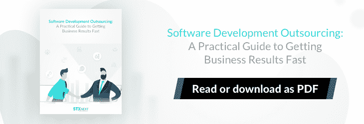
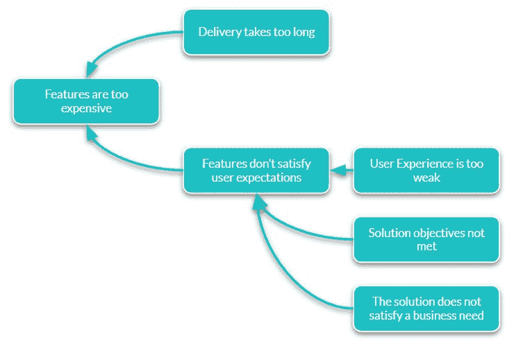
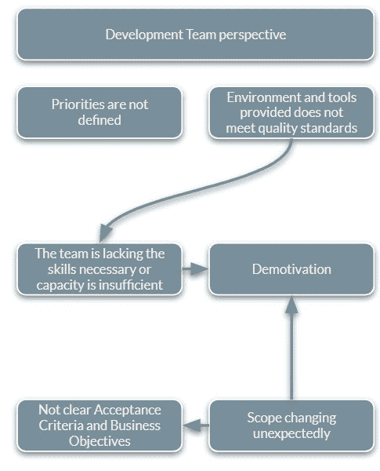
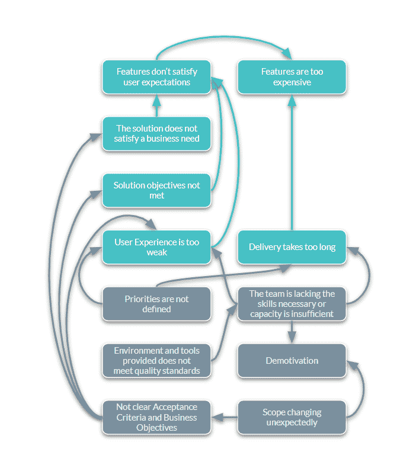
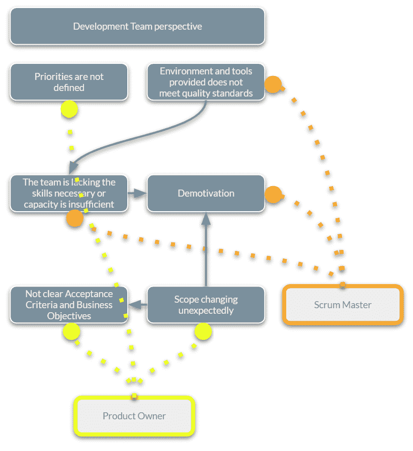

# 敏捷角色如何帮助你管理软件开发外包中的风险

> 原文：<https://www.stxnext.com/blog/agile-roles-manage-risk-software-development-outsourcing/>

 你对一个产品有了想法，并决定雇佣一家软件公司来帮助开发过程。

你很可能意识到，与外包开发团队合作可以带来  [大量的优势](https://stxnext.com/software-development-outsourcing-guide/)，包括获得专业知识、更低的成本以及更多的时间专注于日常业务运营。

然而，为了充分利用这种合作，你应该注意即使在最成功的伙伴关系中也会出现的潜在挑战，并做好应对这些挑战的准备。虽然您可能能够指出您正在经历的问题，但是开发人员正在努力应对的挑战并不总是非常明显。

如果你足够仔细地观察，你会发现所有这些问题都是相互依存的。为了有效地解决你的问题，你需要找到问题的根源。

看似复杂且不可逾越的挑战，在一位 [S](/blog/scrum-master-software-development-team/) [crum Master](/blog/scrum-master-software-development-team/) 和一位[产品负责人](/blog/product-owner-responsibilities-path-junior-expert/)的帮助下，可以轻松解决。

在这篇文章中，我们将指导您识别作为软件外包客户可能会遇到的一些问题，以及这两个角色如何帮助您找到相关的解决方案。

 

#### 软件开发中的挑战:客户的观点

作为客户，你可能会遇到哪些障碍？

*   功能太贵
*   送货时间太长
*   功能不能满足用户的期望
*   用户体验太弱
*   业务目标未能实现
*   整体质量不令人满意
*   你在这个项目上投入的时间太多了

从上面的图表可以看出，你可能遇到的障碍是相互关联的。尽管这可能从一开始就不明显，但如果仔细观察，您会注意到某些依赖关系。

例如，如果特性不能满足用户的期望，这通常意味着用户体验不够好，或者解决方案不能满足业务需求。如果特性的花费超出了你的预期，可能是因为交付时间太长了。

#### 软件外包的挑战:开发团队的观点

到目前为止，我们已经从你作为客户的角度看了潜在的障碍。当试图识别和克服任何挑战时，要考虑的另一个观点是开发团队的观点。

当事情没有按预期发展时，程序员经常是责备游戏中的一个容易的猎物。然而，他们也可能面临一系列可能不会立即明朗的问题。然而，这些通常是你的问题的根本原因，仔细看看它们将为你提供开始解决它们的必要信息。

以下是一些例子:

*   优先级没有很好地定义
*   环境和提供的工具不符合质量标准
*   团队缺乏技能或能力不足
*   该队士气低落
*   没有明确的验收标准或业务目标
*   范围意外更改

正如您所经历的问题一样，开发人员面临的挑战通常错综复杂，如下图所示:

例如，不符合预期标准的工具可能会阻碍团队的能力。

此外，如果你雇佣的唯一的人是开发人员，但是在某些时候，自动化测试是必要的，团队可能很难达到他们的最佳表现。

由于工具或时间不足(例如，团队同时参与多个项目，甚至过度分配)而导致的频繁的上下文切换，可能会导致士气低落。当这种情绪出现时，不仅会引发其他问题，还会挫伤团队的士气。

当你专注于开发团队面临的问题时，你可能会逐渐看到它们之间的依赖关系和你遇到的挑战。

****

例如，团队需要关于期限、质量、范围、利益和风险偏好的明确目标，以便能够根据软件开发的最新框架来计划其工作量。

任何方向的突然改变通常会导致更多的任务被添加到 sprint backlog 中，并且可能会降低开发人员的积极性。

在 sprint 中期改变范围通常也意味着故事没有被恰当地定义。因此，团队努力实现的业务目标没有完全实现。任务不能在预设的时间表内完成，它们要么被交付了一半(当涉及到代码质量或用户体验时)，要么导致延迟。

当团队不熟悉所提供的工具时，交付可能会花费很长时间。成本也会随之增加。通常，开发人员是某些开发工具包的专家，所以当他们没有访问它们的权限时，他们最终不得不重新装备，这可能很耗时。

重要的是，  **努力防止开发者遇到问题将有助于确保双方合作顺利进行。然而，如果在开发过程已经全面展开的时候出现困难，不要绝望。你可以采取一些措施来阻止它们升级为全面危机。通过这样做，你也将解决发生在你身边的问题的根本原因。**

 

#### 用敏捷角色解决软件开发外包中的挑战

为了帮助你找到解决方案，关键是要有一个了解背景的人，并且在困难发生时能够立即介入。

当谈到补救消极情绪、工具问题、不完善的技能或有限的能力时，专注于开发过程的人将能够提供帮助。他们应该愿意花一些时间组织具体的工具和会议，并与开发团队保持联系，以便尽早发现任何障碍。这个人是 Scrum 高手。

然而，有些问题与产品本身有关，而与开发过程无关。它们可能包括没有确定优先事项或没有明确的标准。为了处理这些问题，产品所有者可以与客户方负责产品的人员联系。这可以帮助两个团队开发所有需要的工件，并保持更新以监控和协调项目。

#### Scrum 大师和产品负责人如何帮助你找到解决方案？

##### 1.Scrum 大师的角色

基于上面图表中的例子，下面是一个**Scrum Master**如何帮你找到解决方案:

*   如果你的开发团队发现**环境或者提供的工具不合适，**一个 Scrum 大师可以促进专注于架构和危险的研讨会。
*   一旦**消极**悄然而至，可以在团队辅导中找到有效的补救方法。
*   如果**团队缺乏必要的技能或能力，**Scrum Master 将会进行回顾，讨论哪些做得很好，哪些还需要改进。

##### 2.产品所有者的角色

这就是  [产品负责人](/stx-new-blog/product-owner-responsibilities-path-junior-expert/) 如何应对以下挑战:

*   如果开发团队纠结于 **优先级没有被充分定义** **，**产品负责人可以召开产品战略研讨会，讨论产品的方向和基本方面。
*   如果 **范围发生意外变化** **，则产品所有者可以持有一个未来权证。它包括陈述目标和寻找实现目标的方法。会议不仅对开发团队有帮助，而且对客户也有帮助，因为它可以为他们提供重申业务目标的机会。**
*   如果**验收标准或业务目标不明确****产品负责人可以通过召开** **[产品发现和流程设定研讨会](/stx-new-blog/software-product-discovery-workshops/) 来提供帮助。他们通常还拥有一些领域知识或商业头脑，可以帮助在这些研讨会期间进行讨论。**

 **如果在合作之初就填补产品负责人和 Scrum Master 的角色，将有助于双方从一开始就防止上述问题的发生。然而，在产品开发的任何阶段，将他们加入你的团队都是有益的。**  **##### 3.什么时候需要产品负责人，什么时候需要 Scrum 大师？

在团队中永久安排产品和流程协调员可以帮助您找到应对可能面临的挑战的长期解决方案。有理由假设，如果你只是在产品方面有问题，你可能会考虑只雇佣一个产品负责人。

同样，如果你面临与流程相关的问题，你可能也想只雇佣一个 Scrum 大师。然而，同时扮演两种角色可能会让你产生协同效应，帮助他们优化彼此。

Scrum 大师更关心通过管理过程风险和促进团队活动和会议来优化团队的可持续交付速度。

**另一方面，产品负责人致力于通过管理产品风险、细化待办事项和对可交付成果进行优先级排序，在特定的时间框架内最大化交付价值。**

因此，这两种方法之间存在某种竞争，  **让一个人扮演两个角色是不可取的。通过让两个人合作，你将确保他们之间的合作产生最佳结果。如果你的项目没有深远的影响，拥有两个兼职角色也是一个选择。**

通常，软件公司能够为你提供产品负责人和 Scrum 大师。但是，您不一定需要从组织外部雇佣额外的人员来履行这些职责。

如果你的企业中有训练有素的专业人员，他们可以负责传统上由产品负责人或 Scrum 大师执行的任务，请放心地将他们分配到项目中。

你甚至可以决定自己承担其中任何一个角色。然而，要注意的是，虽然这个想法看起来很诱人，但你可能会发现很难找到时间来完成额外的工作。

无论你最终选择哪一个，都取决于你自己，但是要确保你能接触到两个专业人士，一个是 Scrum 大师，一个是产品负责人。否则，您可能只是将您的项目置于风险之中。**  **#### 最后的想法

当谈到软件开发外包时，即使是最成功的合作也会遇到障碍。

虽然您可能遇到的问题的根本原因并不总是显而易见的，但在问题升级之前找到问题的根源是至关重要的。

当你发现自己面临挑战时，让像 Scrum 大师和产品负责人这样的人来帮助你解决问题是很有用的。

如果你想了解更多关于在你的团队中拥有这些角色的好处，以及一般的 Scrum 过程，你可能会发现这些文章很有用:

*   [Scrum 大师如何帮助你的开发团队？](/stx-new-blog/scrum-master-software-development-team/)
*   [为什么需要产品负责人？提高你的软件开发项目的 5 种方法](/stx-new-blog/why-do-you-need-product-owner-5-ways-improve-your-software-development-project/)
*   究竟什么是 Scrum？Scrum 开发简介

请记住，如果您的组织中已经有具备合适技能的人，您不一定需要雇用额外的人。然而，如果你需要额外的帮助，我们会在这里帮助你。请随时  [与我们联系](https://stxnext.com/contact-us/)——我们很高兴收到您的来信。

**