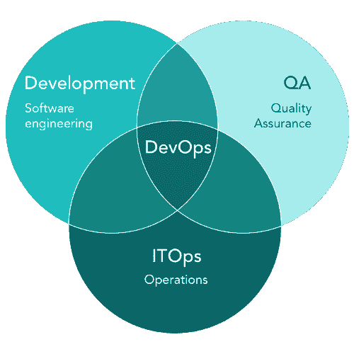
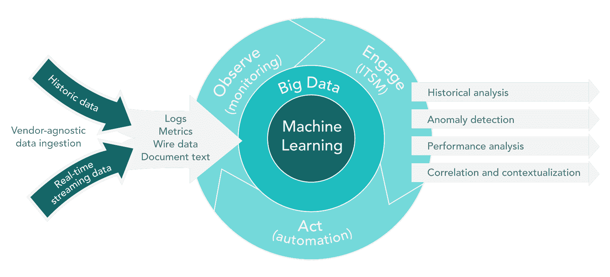
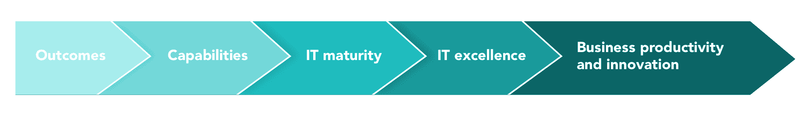
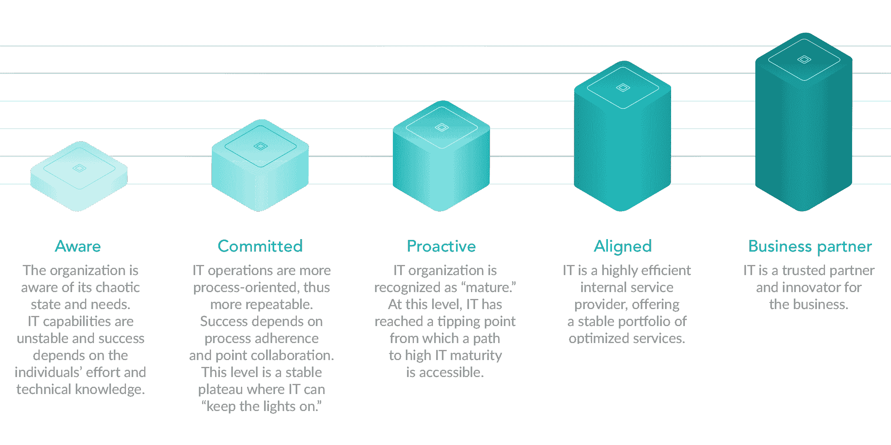
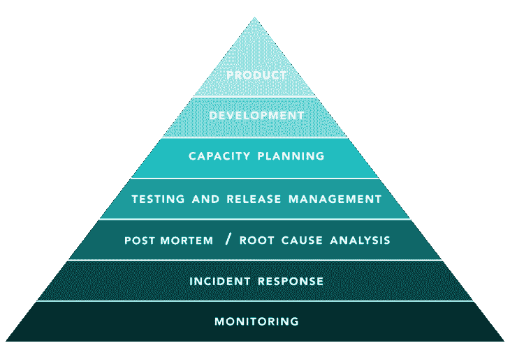

# 什么是 AIOps，BizDevOps，CloudOps，DevOps，ITOps，NoOps？数字业务转型简介

> 原文：<https://www.stxnext.com/blog/aiops-bizdevops-cloudops-devops-itops-noops-introduction-digital-business-transformation/>

 最近，IT 界经历了与运营相关的不同术语的爆炸式增长。过去的好时光——全球秩序是根据经验法则定义的，它与商业是分开的——已经一去不复返了。

我们面对的不是简单的规则，而是在经理、董事和首席技术官中引起越来越多的困惑和沮丧的流行词汇。这反过来导致人们误用这些术语，造成更多的困惑和沮丧。

**本指南的目标是帮助您理解 IT 运营的相关术语，定义贵公司的业务需求，并做出明智的决策。** 然而，它并不是实施企业数字化转型的全面指南。 

#### 定义 IT 运营

有这么多不同的运营术语，在您决定您和您的企业的下一步发展之前，有必要对它们进行定义。

我们将讨论最重要的术语。你可能已经熟悉或听说过或见过使用。我们无意与维基百科条目或任何其他正式术语表竞争，所以我们只打算解决你绝对需要知道的问题。

##### 1.什么是 ITOps？

“ITOps”或“信息技术操作”这个术语对您来说可能并不陌生。这是在更广的意义上指代所有 It 相关操作的一种常见方式。

如今，每个商业领域都依赖于计算机相关技术。很难想象没有计算机网络或互联网接入的业务。

##### **ITOps 的目标**

ITOps 的目的就是满足这些基本要求。  **It 通常负责交付和维护业务运营所需的所有服务、应用程序和技术。**

由于这个定义非常宽泛，IT 公司通常会在 ITOps 中的不同组之间划分界限。例如，他们创建竖井来更好地定义团队的领域和职责范围，例如:

*   管理和维护，
*   网络管理，
*   系统管理，
*   技术支持(服务台)。

不仅团队是孤立的，过程和技术也是孤立的，因为公司专注于领域相关问题的故障排除，并且通常遵循基于瀑布的方法。  **虽然这些方法看起来非常具体，但是从开发的角度来看，它们是无效的和不同的。**

此外，该定义默认不包括研发(R&D)团队，因为他们被认为是与生产或办公室员工相同类型的内部客户。这完全取决于特定公司的规模和结构。

##### **为什么 ITOps 不够好？**

**传统的 ITOps 模式被认为已经过时，不再有效，原因有很多，包括:**

*   当今商业的节奏，
*   不断变化的技术环境，
*   日益增长的缩短对业务需求的反应时间的需求。

现有的 ITOps 定义过于宽泛。如果你想跟上变化的速度，我们之前提到的专业团体不能再孤立了。

为了克服不断变化的业务需求和快节奏的市场要求的挑战， **ITOps 和 R & D 团队联手创建了 DevOps。** 但是在我们深入到 DevOps 的世界之前，我们应该提到另一个在前段时间颇具势头的术语:  **CloudOps** 。

##### 2.什么是 CloudOps？

CloudOps 经常被比作 ITOps，并被认为是 it 的替代方案，但仅限于云。 ITOps 是针对传统数据中心的，而 CloudOps 只与云有关。

随着云计算变得越来越受欢迎，而不仅仅局限于公共云，CloudOps 也越来越受欢迎。许多大型组织需要利用私有云解决方案或混合云，以更有效的现代方式优化其资源。

##### **cloud ops 的特点**

CloudOps 是一种提供工具和最佳实践的方法，非常类似于 [DevOps](/services/devops/) ，但仅限于计算资源管理领域。

**CloudOps 区别于 ITOps 的两个特征:**

2.  **内置任务自动化。**

这个术语及其背后的思想现在相当不受欢迎，因为它们代表了现代作战的广泛方法的一个如此狭窄的专门化。

事实上，当一个叫做  **DevOps** 的新的、更实用的想法被引入时，CloudOps 很快就被超越了。

 [##### 3.DevOps 是什么？](https://stxnext.com/blog/2018/12/11/what-is-devops/) 

根据定义，“DevOps”(“开发和运营”)被理解为  **软件应用程序开发(R & D)、质量保证(QA)和 ITOps、** 及其背后所有最佳实践、结果和方法的组合。

该合资企业旨在:

*   **【缩短软件开发生命周期】**
*   **，** 提高对市场需求的反应
*   **缩短上市时间(TTM)。**

**DevOps as a joint effort and areas of responsibility for R&D, QA, and ITOps**

DevOps 公司遵循由以下步骤组成的连续工作周期:

##### **devo PS 的目标**

DevOps 的核心目标是通过  **在合理的范围内自动完成尽可能多的任务。** 要记住的一个重要区别是，  **自动化本身并不被视为一个目标，** 而是一种方式:

*   缩短产品或服务的市场交付时间，
*   提高发布质量，
*   缩短发布之间的时间，
*   缩短平均修复时间(MTTR)。

DevOps 的原则在理论上看起来很棒，但它们需要强有力的跨部门沟通。正因为如此，它们在现实中可能并不一定有效。

虽然 R&D 和 QA 团队在日常工作中非常有效，但 ITOps 团队通常需要掌握自动化方面的新技能。另一种方法是让 R&D 团队执行与运营相关的任务。

这里的一个副作用是 QA 团队成员的技能倾向于更多地关注脚本、集成和编码。因此，他们在测试中的传统角色转移到了测试自动化，或者更进一步，转移到了过程自动化。

##### **开发运维的优势**

DevOps 参与者的努力和责任之间经过深思熟虑的平衡会带来回报，但好处不会立即显现出来。你可能会问:为什么会这样？

没有简单易行的答案。R&D 和质量保证团队非常关注:

*   自动化开发，
*   建筑，
*   测试，
*   新软件版本的部署。

但是，运营团队仍然管理他们以前的职责:

*   基础设施(硬件和网络)，
*   操作系统，
*   政策合规性，
*   事件。

在较小的环境中，一些通常由运营团队处理的任务现在需要由软件或测试工程师来完成——而且复杂性还不止于此。

##### **推卸责任，模糊与 DevOps 的界限**

R&D 和 QA 的职责相互渗透，他们之间的界限变得越来越模糊，因为自动化不仅在测试中需要，在开发过程中也需要。

因此，开发人员更多地参与到类似 Ops 的任务中(提供环境和工具)，而测试工程师需要使用编程技能来:

*   自动化测试，
*   测试或准备环境供应，
*   帮助实现持续集成和持续交付(CI/CD)。

DevOps 组织中 R&D 和 QA 团队不断增长的经验有助于减轻基础架构相关问题，减轻运营团队的负担。然而，在大公司中，由于他们的规模，这种低层次的合作并不总是可能的。

在这种情况下，运营团队仍然参与硬件、网络或系统管理，尤其是生产环境，在生产环境中，最佳资源分配(虚拟化和容器化)和业务连续性是关键。

##### **开发运维的最佳实践和工具**

DevOps 不仅仅是团队和他们的责任；它也是 **工具和最佳实践的集合，涵盖任务和流程的自动化、监控和优化。**

一个组合良好的工具集应该尽可能小，以减少维护成本，同时工具应该很容易集成，几乎不需要任何工作。组织越大，您的团队之间的协作就应该越好越紧密，以便为您选择工具和最佳实践。

你的预算是另一个需要考虑的方面。当开发运维资源的投资被认为过高时，一些公司决定采用  **这是一种相当极端的开发运维实施模式，称为 NoOps。**

##### 4.NoOps 是什么？

“NoOps”代表“无 IT 运营”，这种方法可以极大地有利于技术成熟度高的公司，或者在某些情况下在软件开发和维护中发挥重要作用。

##### NoOps 的目标

NoOps 背后的主要假设是  **开发人员(或者更一般地说，DevOps 从业者)不再需要关心运营，可以专注于软件开发。**

在 NoOps 下，所有操作都是自动化的，最大限度地减少甚至消除了人为错误的风险，自动化过程更快，更不容易出错。通过这种方法，ITOps 团队不再需要每天从事与技术相关的任务，因为  **所有可以自动化的事情都已经自动化了。**

##### **NoOps 的好处**

听起来像是一厢情愿？诚然，这一提议在今天看来颇具争议且不切实际，但其潜在好处是显而易见的:

1.  **人为失误的风险大大降低或消除；**
2.  **DevOps 大幅加速日常运营和协作；**
3.  ITOps 成为致力于技术进步的战略团队，而不是处理枯燥的任务，如硬件和网络维护或系统备份。

无论看起来多么激进，大型组织中的某些公司或团体可能会考虑采用 NoOps 方法。

例如，如果一家公司的所有 IT 基础设施都在云中，并且他们的应用程序开发主要基于无服务器计算，那么 NoOps 可能值得他们关注。

##### 什么是无服务器计算？

从两个角度来看，无服务器计算非常有吸引力:

1.  基础设施投资——没有或几乎没有(仅内部成本)；
2.  维护或管理成本—无。

所有这些都由给定组织的云服务提供商处理。根据需求和合同级别，整个基础架构按比例扩展和调配。一切都是自动化的，本质上超出了您的控制，因为提供商会保护环境。

##### **NoOps 的风险和缺点**

从预算的角度来看，**NoOps 的做法并不是很有效率。** 成本可能会超过您在自己的架构、系统和人员上的投资，而无服务器计算环境的性能对于生产级应用程序来说可能太低。

NoOps 的反对者经常争辩说，这个想法在许多方面都是极端的，因为它假设了高度特定的环境和无服务器计算的使用。 后者意味着你无法控制缩放机制，它们对你来说仍然是未知的(这是使用无服务器计算的隐性成本)。

考虑到这些缺点，  **精通技术的严肃企业通常会得出结论，NoOps 风险太大。** 选择这种方式可能导致数字化业务崩溃或危及数字化转型。

众所周知，R&D 团队最擅长开发，但不一定擅长设计、供应、扩展、优化或维护运行关键业务应用程序和支持服务的生产环境。经常被忽视甚至忘记的是，确定谁来维护现有系统和应用程序的自动化、集成和管理。

NoOps 的最后一个缺点是，它需要仔细选择和正确实现应用程序性能监控和管理工具。

##### 5.BizDevOps 是什么？

通常理解的 DevOps 不考虑业务。

虽然这在某些情况下可能是可以接受的，但旨在快速响应市场需求的敏捷组织必须采用一种新的运营模式，称为 BizDevOps。

##### **BizDevOps 的目标**

**BizDevOps 无非就是将业务考虑在内的 DevOps，用响应式的业务给 DevOps 团队指明方向。**

与标准开发运维相比，开发运维与业务的结合还可以更快地向市场发布新版本。

在其他因素中，这就是为什么  **BizDevOps 有时被称为 DevOps 2.0。**

##### **BizDevOps 的优势**

BizDevOps 模型使 DevOps 团队  [以敏捷的方式](/stx-new-blog/introduction-scrum-development/)与业务部门协作。  团队的协同作用加速了开发的步伐， 要求业务拥有并积极贡献于产品/服务积压。

同时，DevOps 团队对他们交付的业务方面变得更加负责。这是对现有  *业务请求**开发响应* 模型的重大改变。

##### 【BizDevOps 的最佳实践和工具

与其他方法非常相似，BizDevOps 也需要特殊的工具才能成功。

除了 DevOps 的标准工具集，  **用户体验分析解决方案( [UX/CX 实时分析](/stx-new-blog/how-leverage-ux-analytics-data-driven-product-design/))对市场成功至关重要。** 它们让你能够监控、分析和响应客户的需求。在选择技术组合时，易用性以及与现有监控和管理工具的集成是关键因素。

市场分析师一致认为，BizDevOps 和数字绩效管理是数字化转型和业务发展最重要的技术驱动力。 在分析业务效率的同时，必须依靠关键绩效指标和依赖关系的可视化来做出明智的业务决策。

在今天的数字市场中，直觉不是一个值得的商业策略。 你的有利位置必须建立在从不同来源和角度收集的信息周围。由于数据源的数量和数据量，您应该考虑  **使用大数据解决方案。** 简单的工具，比如电子表格或者关系数据库，已经不再有效。

你最好也不要错过这幅图中的人工智能。于是，  **一个新名词被创造出来:AIOps。**

##### 6.什么是 AIOps？

术语“AIOps”代表“IT 运营的人工智能”。最初是 2017 年 Gartner 定义的  [。](https://blogs.gartner.com/andrew-lerner/2017/08/09/aiops-platforms/)

**AIOps 是指 IT 组织使用[人工智能(AI)](/stx-new-blog/will-artificial-intelligence-replace-developers/) 管理其环境中的数据和信息的方式。**

这个定义非常宽泛和不具体，留下了大量的解释空间。在努力实现更智能的 IT 操作的过程中，AIOps 平台供应商在获取和利用以下技术方面不受任何限制:

*   大数据，
*   [机器学习](https://stxnext.com/services/machine-learning/) ( [ML](https://stxnext.com/blog/2018/06/28/getting-started-machine-learning-python/) )，
*   模式识别，
*   其他分析技术。

##### **AIOps 的目标**

**ai ops 的主要目标是通过为您提供来自多个来源的数据进行分析和自动化，从而增强您的 IT 运营。**

AIOps 旨在优化高技能工程师的使用，以完成无法自动化的任务或广泛的领域知识绝对必要的任务。

**AIOps platforms enabling IT operations management (ITOM)**

AIOps 范例假设从所有可用来源收集的数据可以在所有团队之间共享。通过这种方式，分析得到简化，专家不再需要对大多数典型情况进行故障排除。

##### **AIOps 的优势**

来自更多来源的更多数据支持多维分析，但同时存储和处理大数据需要更多资源。因此，大多数公司都面临着大数据解决方案实施的常见问题。

最简单的方法就是简化你的分析。没有人愿意浪费大量的时间来分割数据集、遍历数据湖等等。时间就是金钱，  **如果你的 AIOps 平台给你的是有支撑数据的答案，而不是没有答案的原始或处理过的数据，那对你的业务来说就是一大胜利。**

软件开发人员尤其需要数据来支持答案，因为他们通常不信任人工智能。他们通常了解 AI 如何工作，以及它是否能给出可预测的结果。无论您选择的 AIOps 平台是什么，请记住，它应该在任何必要的时候为您提供支持数据。

##### 【AIOps 的最佳实践和工具

Gartner 起草的目标可以通过多种不同的方式由 AIOps 平台实现。

您可以使用商业或开源平台，该平台可以:

*   消费来自不同馈送的结构化和非结构化数据；
*   将数据与贵公司已经使用的管理平台集成；
*   如上所述，开发分析逻辑以提供结果。

或者，您可以考虑一个现成的商业平台来完成大部分数据消费和分析。然而，沿着这条路走下去意味着与其他平台的集成将需要您进行一些开发。

无论您做出何种选择，软件开发都必然会涉及到，以确保您在工具上的投资为您带来预期的回报。  [让外部服务提供商来处理开发和集成是明智之举。](https://stxnext.com/services/devops/)

##### 7.关于 IT 运营的最后说明

AIOps 平台在现代企业中的成功实施总是意味着这样的平台将成为您业务生态系统的一部分。这通常是通过将业务关键型运营系统集成到“[单一平台](https://www.webopedia.com/TERM/S/single-pane-of-glass.html)中来实现的

很自然，实施 AIOps 平台的整个过程必须与您的 It 运营重组相一致，并且应该遵循专门适合您的业务的运营模型。

一种屡试不爽的方法是 Google 开发的网站可靠性工程模型。我们一会儿将详细讨论它。

不过，首先要做的是。在您开始向任何具体的方向前进之前，让我们确保您确切地知道您的组织在 IT 成熟度等级上所处的位置。

 

#### 贵公司的 IT 成熟度

此时，我们想请你问问自己:  **“我在哪里？我要去哪里？”** 自然，我们指的是在贵公司的商业背景下。

回答第一个问题既不明显也不容易，尤其是对于较大的企业。即使是一个小团队也可能会怀疑它是否适合某个特定的类别。如果你的公司碰巧是一家大型跨国公司，在全球市场上运营，那么这个问题就更难回答了。

然而，问第二个问题可能更有价值。这很容易回答，尽管事实上有多条道路可以将您引向数字化转型的明确目标。

**在接下来的章节中，我们将解释在为您的数字业务管理制定战略时，您应该首先考虑哪些因素。**

或者，这些因素对您来说可能很重要，因为您已经在为您的企业进行数字化转型做准备，并且需要技术支持来支持您的业务运营。

##### **什么是成熟？**

**随着 IT 成为您业务的核心，您业务的表现取决于 IT 的卓越性。这反过来依赖于 IT 成熟度。**

但是什么是“IT 成熟度”呢？毕竟，如果你的业务足够成熟，可以在市场上运作，这意味着你的 it 能力至少和你的业务一样成熟，对吗？不完全是。

如果我们将 IT 成熟度定义为  **“旨在交付特定成果的一系列能力”** 成果应基于以下项目:

*   组织结构，
*   流程和实践，
*   技能和知识，
*   工具和政策，
*   系统和数据，
*   文件和协议。

从 IT 成熟度的角度来看，这些标准正是实现 IT 卓越的基础，从而带来业务成熟度、创新和生产力。这整个因果关系最好用下面的顺序来说明:

一般来说，IT 成熟度是 IT 能力如何适应和实现可以被认为是“优秀”的业务绩效由于没有哪两个企业是完全相同的，因此其功能和用途总是因公司而异。

**这里重要的是相关性。** 即使你的业务和 it 方面的 IT 相对较小，也依然可以做到成熟和优秀。

IT 市场分析人士表示，IT 成熟度的评估可谓是一个公司为达到高成熟度而爬的梯子。

您的组织可以遵循许多成熟度模型——例如  [能力成熟度模型(CMM)](https://searchsoftwarequality.techtarget.com/definition/Capability-Maturity-Model)——但是重要的是要记住  **在成熟度模型上前进本身并不是目标。**

在你选择的模型上达到更高的水平只不过是从混乱走向组织良好的过程。为了防止您的业务变得过于繁琐，我们建议您遵循以下简单的建议:

**您的 IT 应该处于对您的业务有意义的成熟度阶梯的最高位置。**

然而，这并不意味着你应该停止你的改进过程。就像组织中的其他所有计划一样，你需要资源和计划。有一个路线图是非常重要的，因为它可以帮助你组织计划的执行。

[文化变迁](/stx-new-blog/why-are-company-values-important-and-how-we-defined-ours/) 说到它的成熟也不容忽视。恰恰相反，它应该成为你公司思维模式的一部分。

有趣的是，根据 Gartner 的调查，只有大约 10%的 IT 企业自我评估为成熟度等级 3 或以上。

#### 如何构建可靠的 IT 运营

IT 成熟度和 IT 管理技术就像沟通的船只— **你的 IT 越成熟，它使用的 IT 管理技术就越复杂。** 然而，一些企业仍然希望使用现代工具来提升他们的成熟度。

你可能对“希望不是策略”这句话很熟悉非常正确，尤其是对于生产环境。

在 IT 领域，系统和服务不会自行部署和维护，这是一个常识。这就是为什么我们仍然需要 IT 运营人员和对您的业务至关重要的路线图。

##### 1.谷歌网站可靠性工程

谷歌将一个名为网站可靠性工程(SRE)的模型定义为  **任何数字业务的最佳实践的集合** 在高度竞争的市场上认真对待当代环境。

SRE 建议成熟的企业遵循这种模式或类似的模式，否则他们的数字化转型的成功是非常值得怀疑的。

商业成熟度并不意味着你的公司必须在市场上有 30 年的历史。这意味着  **你经营数字业务的方法已经成熟。**

与测试环境、应用程序部署或性能测试的自动化供应相比，大规模的服务或应用程序交付和维护更加苛刻和困难。

这样的周期，虽然对于 DevOps 或 BizDevOps 团队来说是典型的，但它只是大型 IT 组织拥有并需要每天管理的许多其他周期中的一个。

考虑到这一点，像谷歌这样的企业建立这样的模型就不足为奇了。否则，他们就不能成功地经营他们的企业。因此，即使你的组织不可能达到与谷歌相当的规模，遵循 SRE 模式仍然是非常有意义的。

你的业务成熟度意味着你要考虑到 SRE 模型的所有层面，并相应地构建它们，特别要注意四个属性:

*   人，
*   流程，
*   技术，
*   商业惯例。

这种方法背后的理由是，每一层都代表了必须解决的明确定义的业务需求。

##### **a)监控**

您从监控层开始，因为您需要知道您的数字业务中发生了什么。  **你考虑的测量点越多，你就能更好地理解你的业务是如何运作的。**

例如，除其他外，您应该衡量以下各项的性能:

*   交付应用程序的系统；
*   服务器端的应用程序代码；
*   客户端，转化为用户对你的应用程序的体验；
*   您的业务线(或您的小型数字企业整体)。

监控是整个可靠性模型的基础，这是有道理的，所以要注意如何实现监控。

明智的做法是与你信任的伙伴合作，因为虽然你不需要成为监控方面的专家，但你绝对是经营业务方面的专家。

##### **b)事故管理**

以结构化的方式管理和应对突发事件有助于你在糟糕的事情发生时建立客户(和员工)之间的信任。而且毫无疑问，他们  *将* 发生。所以  *当，* 而不是  *如果，* 他们做——最好做好准备。

您的组织需要做的是 **定义一个事件管理流程，以可重复的方式处理事件。** 事件管理是 IT 服务管理(ITSM)流程的一个领域。其首要目标是  **恢复正常的服务运营，最大限度地减少对业务运营的影响。**

理想情况下，对事件的响应应该基于监控层并与之紧密集成。如果是自动化的，那就太好了，因为这会节省你很多时间。

##### **c) *事后分析* /根本原因分析**

为了改善你的业务，了解问题的根源是至关重要的。 否则，你将无法根据事实采取纠正措施。

这种纠正措施有双重目的:

1.  帮助您了解事件发生的时间、原因和地点；
2.  让您为未来发展壮大业务。

在这两种情况下，目标是相同的:  **确保问题不会再次发生，如果发生，将其业务影响降至最低。**

同样，在一个完美的世界里，根本原因分析应该是自动化的。毕竟，谁有时间花无数的时间来解决一个问题，然后分析多个应用程序或系统日志、应用程序负载等等？该分析还应该基于来自不同测量点的真实监测数据。

 

##### **d)测试和发布管理**

**无论什么类型的产品，质量都很重要。** 在你发布一个产品的任何版本之前，要确保它的特性是经过精心设计和彻底测试的，否则你会把你的声誉置于危险之中。

对于数字产品，有大量的测试和发布管理平台可供您使用。理想情况下，测试工具应该与监控和事件管理平台无缝集成。这将实现一种受控的方法来解决应用程序性能问题。

**发布管理无非是构建和交付软件，** 意思是:

*   源代码管理，
*   配置管理，
*   建立自动化，
*   测试自动化和集成，
*   包自动化和管理…

…可能还有几个软件产品交付领域。

如果这听起来很复杂，那是因为发布工程师对于提供一种自动化的、可重复的、可靠的构建二进制文件和配置的方式是至关重要的。

##### **e)产能规划**

容量规划听起来像是未来的趋势，但它对企业的成功至关重要。

我们都听说过许多组织成为自身成功的牺牲品的故事。这些故事中的所有失败都有一个相同的潜在原因:那些公司没有准备好让他们的业务发展到他们没有计划的规模。

**这就是容量规划在数字化转型中如此重要的原因。** 传统上，您可以使用在较长时间内从不同测量点收集的监控数据来了解您的业务在负载下的表现。然后，您可以使用近似值或其他趋势线技术来预测更大规模的业务需求。

随着你的公司和产品的成长，当你对他们的成长进行适当的投资时，更容易扩大规模。 基础设施和  [销售力量](https://www.entrepreneur.com/encyclopedia/sales-force) 是容量规划产生明显差异的几个例子。

或者，你可以使用谷歌提倡的所谓“基于意图的容量规划”。本质上，它基于相当抽象的需求:性能度量、领域知识和一些特定的算法。当然，适用于谷歌的方法不一定适用于所有人，但采取一种基于近似的更简单的方法将在大多数情况下适用于更低的规模。

##### **f)开发**

构建了所有的底层之后，您现在可以专注于为您的产品开发人员提供一个“游乐场”了。不仅仅是软件开发人员，还有 UI/UX 设计人员和其他对开发什么和如何开发有发言权的贡献者。

像谷歌这样的大公司通常在内部进行  [软件工程](/stx-new-blog/moving-development-back-in-house-how-ensure-watertight-software-project-handover-process/)，这可能不完全适用于你的情况。幸运的是，这并不意味着在软件开发由外部公司处理的情况下不使用 SRE 模型。

**无论你称之为“[外包](https://stxnext.com/software-development-outsourcing-guide/)还是“团队扩展”，使用来自服务提供商的开发团队完全符合 SRE 模式。外部团队:**

*   **使用和你一样的工具链，**
*   **遵循与组织内其他团队相同的原则。**

当你在一个根据 SRE 精心设计和准备的环境中开发一个软件产品时，你可以确定产品开发和投放市场的所有移动元素都支持你的主动性和组织的成功运作。

##### **g)产品**

最后但并非最不重要的是，展览的明星:你的产品。

现在，您已经准备好发布您的工作产品，并使它从上市的第一天起就可以使用。你有许多或多或少的系统化方法可供选择，所有这些方法都有一个共同点: **启动清单。**

SRE 提供了大量关于如何制定自己的启动清单的示例和指南，以及生产服务的最佳实践。

我们建议您仔细研究 SRE 的细节，以全面了解如何在您的产品发布中实施这些实践。

##### 2.沟通和协作

SRE 模式中既不包括沟通也不包括协作，但它们对于成功的运营是必不可少的。

建立有效可靠的沟通对每个组织来说都是一个挑战。 无论他们是否步 SRE 的后尘，他们仍然面临着和其他人一样的挑战。然而，该模型通过围绕操作的核心(生产会议)实现沟通，帮助您处理和解决许多这样的问题。

生产会议以服务为导向，由 SRE 团队召开。  **你们 SRE 团队的组成应该是跨组织的；** 越多样化越好，因为这样的团队更注重沟通。

生产会议的目标有两个，清晰而简单:

1.  确保每个离开会议的参与者都知道正在发生什么；
2.  通过与其他参与者分享对服务工作方式的见解来改进服务。

会议的组织、角色、责任和结果既可以是你的组织特有的，也可以遵循谷歌的方法。

协作是有帮助的，因为 SRE 模式有许多层，每层的专业知识应该渗透到相邻的层。 这有助于将各个层面的人聚集在一起，让每个参与者对运营有更深入的了解。

积极参与会议和更好的沟通技巧将改善整个协作，并防止您的团队成员陷入感觉类似于电子邮件分发列表上的收件人的陷阱。

 

##### 3.自动化

手动运行您的流程始终是一个选项。人们从一开始就这样做。但是现在继续这样做合理吗？

想象在以下过程中手动收集和处理数据:

*   基础设施组件的发现；
*   实时监控硬件、系统、应用程序和用户；
*   复杂流程的管理；
*   复杂服务交付流程的自动化；
*   由无数时间序列组成的收集的指标和趋势的聚合和可视化。

没有 IT 运营的自动化，你就无法运营数字业务。 无论你想在成熟度阶梯上完成什么，无论你想遵循你的路线图，都必须将你的核心领域和流程自动化。

##### 4.你应该为你的企业使用可靠性模型吗？

你可能认为 SRE 模式只适合大型企业，但实际上它在两方面都很适用。

无论你是一家初创公司，还是一家成熟的企业，SRE 就像一顶棒球帽，适合所有人。只是你选择什么和你决定如何实施的问题。

即使在  [建立 MVP 以验证你的商业想法](/stx-new-blog/5x5-5-tips-building-successful-minimum-viable-product-5-weeks/)的阶段，你也必须考虑所有的机制，这些机制会让你知道:

*   你的客户做什么和如何做(监控)，
*   当你的 MVP 有问题时(事故管理)，
*   它在负载下的表现(容量)。

你还需要收集反馈，以便进一步发展。这听起来是不是有点像我们上面描述的 DevOps 持续改进循环？

如果你计划让你的数字业务更具创新性、竞争力和成功，你的数字化转型战略应该包括衡量谷歌网站可靠性工程金字塔每一层的关键绩效指标(KPI)。

因此，您需要选择工具，使您能够交付所有这些层，并持续监控它们的效率或性能。使用第三方顾问 的  [专家的服务或者让外部专业人士](https://stxnext.com/contact-us/) [处理您的集成/实现需求](https://stxnext.com/services/)也是完全明智的。

#### 摘要

长话短说，以下是本次介绍中最重要的几点:

##### 1.确定您的 ITOps 模型、您想要前进的方向和路线图。

这是你继续之前的一个必要步骤。如果你不知道你在地图上的位置，你的旅程就不可能成功。迟早你会触礁的。

##### 2.寻找值得信赖的合作伙伴，帮助您打造可靠的数字业务。

信任来自于与你所依赖的伙伴的成功、长期的关系。不要害怕在各自领域专家的支持下建立自己的企业。

向多个合作伙伴寻求帮助是没问题的，但是你应该避免与不同的合作伙伴创建模型的每一层。

##### 3.自动化节省了金钱和时间。

虽然您最初的自动化工作在成本方面可能很重要，但随着时间的推移，投资会得到回报。数字业务的每个方面都应该有自动化的空间。

##### 4.根据您未来的需求，对项目进行相应的评估。

[保持敏捷](/stx-new-blog/step-step-product-validation-using-impact-mapping/)，改变您组织的文化以支持开发运维，并实现数字化转型。从小处着手，慢慢来，但要为大而快做好计划。与你的搭档密切合作，这样你们都知道你的生意的所有方面。

##### 5.包括集成您的工具链。

分散或松散集成的工具弊大于利。明智地选择您的工具(您的合作伙伴可以帮助您)，这样您的集成就不会成为另一个平台的开发，为模型添加不必要的层和复杂性。

##### 6.不要试图完美。

从简单开始迭代。随着时间的推移，随着解决方案的增长，您会增加复杂性。  [永远保持敏捷](/stx-new-blog/common-misconceptions-about-scrum-framework/)，无论你做什么。

##### 7.数字化转型不仅仅是应用。

反而都是你公司的  [文化变革](/stx-new-blog/why-are-company-values-important-and-how-we-defined-ours/)。

#### 关于通过 AIOps、BizDevOps、CloudOps、DevOps、ITOps 和 NoOps 实现数字业务转型的最终想法

感谢您阅读我们的 IT 运营术语和数字化业务转型指南。希望在阅读本文后，您不会再困惑地看待 DevOps、NoOps 或 AIOps 等术语，您的变革努力将轻而易举。

现在你已经掌握了所有的运营建设知识，是时候决定你的企业在这方面的下一步行动了。

我们有一个关于 DevOps 的更详细的初级读本，特别关注该解决方案为业务经理带来的好处。  [如果你觉得你需要更多的劝说来尝试向你的组织介绍 DevOps，请继续阅读](/stx-new-blog/what-is-devops/) 。

但是，如果你有足够的信心，并且已经在考虑通过 DevOps、  [转变你的业务，我们强烈建议你熟悉我们提供的服务](https://stxnext.com/services/devops/)。

STX Next 愿意并能够满足您可能有的任何和所有 DevOps 需求。

