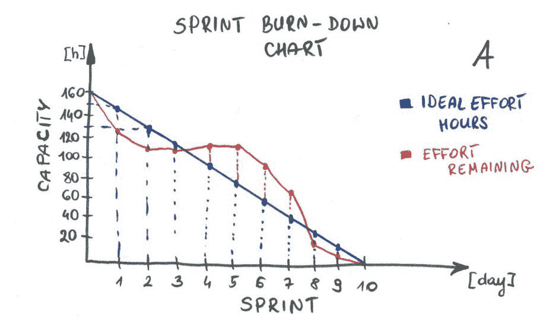
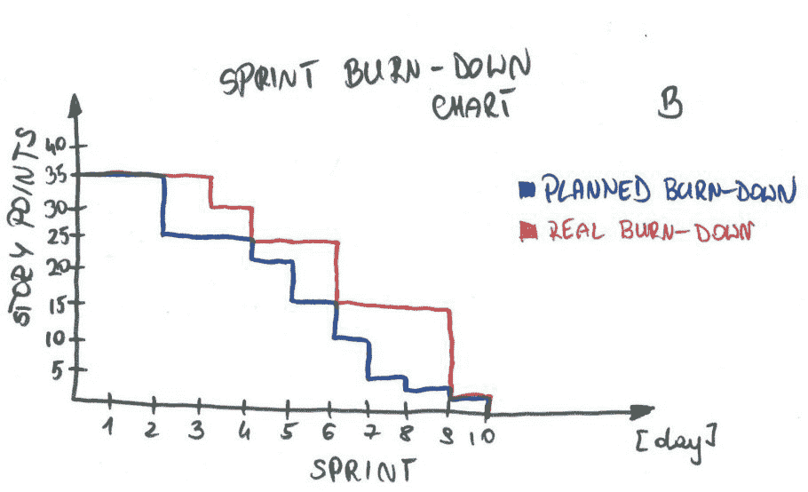
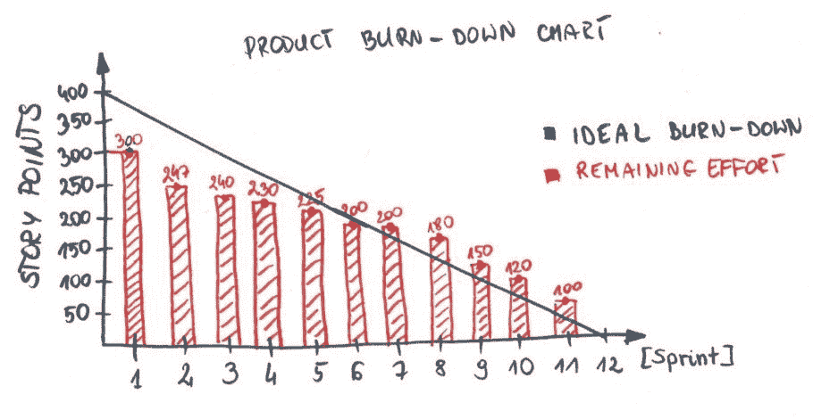

# 如何使用燃尽图进行透明和可预测的开发

> 原文：<https://www.stxnext.com/blog/all-about-burn-down-charts/>

 看起来软件开发和可预测的结果像火和水一样相伴——也就是说，根本不是。您的开发人员可能会遇到意想不到的障碍，不同冲刺阶段的生产率各不相同，并且很难说具体会完成多少，以及何时完成。

但不一定非要这样。

简介:燃尽图。

燃尽图通过清晰地可视化实际工作和预测工作之间的差异，能够监控 Sprint 和产品发布中的工作进度。

燃尽图在以下方面很有用:

*   识别工作中的延误
*   日常工作计划
*   **指定团队速度，**
*   **产品发布的策划。**

在 Scrum 中，通常使用两种燃尽图:  **一种冲刺燃尽图和一种产品燃尽图。** 它们之间的区别在于  **的时间范围和归属。**

一个 Sprint Burndown 图是开发团队在一个 Sprint 内用来监控工作进度的，而一个产品 Burndown 图是产品负责人用来  **进行产品管理的。** 

#### 冲刺燃尽图

冲刺燃尽图位于坐标系的第一象限。x 轴代表 Sprint 中的天数，y 轴表示剩余时间或故事点的总结。图 A 和 B 是 Sprint burndown 图表的例子，其中容量是 Sprint 中可用开发人员小时数的汇总(包括开发人员、QA 等)。).

#### Sprint 燃尽图的好处

##### a)计划和组织冲刺阶段的工作

了解了冲刺阶段的理想时间和完成任务的剩余时间，就有可能计划工作。突出显示有风险的票证，团队可以决定投入一些额外的努力来加快这些任务的速度，或者重新安排计划以确保承诺可以实现。

##### b)风险监控

基于理想时间和剩余时间之间的差异，图表每天显示未兑现承诺的风险。

##### c)工作检查

Sprint Burndown 图表在 Sprint 回顾中也非常有用。他们回答许多问题，例如:

“为什么在冲刺的第 4 天和第 5 天之间看不到工作进度？”

"当冲刺阶段的第 3 天和第 4 天之间的估计值增加时，会发生什么？"

“我们今后应该怎么做才能避免这些情况？”

基于小时的 Sprint Burndown 图表不显示已完成的任务。燃尽图中可能只剩下少量的时间，而在冲刺阶段没有交付任何故事。这种情况通常表明团队正在同时处理多项任务。为了更好地可视化故事是如何传递的，建议也使用故事点燃尽图，如下所述。

燃尽图 B 显示了团队能力和致力于 Sprint 的故事点之间的关系，并允许监控 Sprint 中的工作进度。与示例 A 类似，需要每日更新。团队检查哪些任务已经交付，并从提交给 Sprint 的故事点中减去交付的故事点。

这种消耗的力量在于工作交付的可视化，但是在日常工作组织中使用这种消耗需要大量的 Scrum 经验。

考虑到这两种燃尽图的优点，并行使用这两种图是有意义的。

#### 产品燃尽图(又称发布燃尽图)

产品燃尽图在坐标系的第一和第四象限运行。x 轴代表 sprint 数字，y 轴代表产品 Backlog 中所有项目的所有故事点的总结。下图是产品燃尽图的示例。

**注:** 关于坐标系第四象限燃耗图用法的信息是高级知识，将在以后的文章中介绍。

产品所有者在每次冲刺后都会更新产品燃尽图。要创建和使用产品燃尽图，您需要评估产品待办事项中的所有项目。在每次 Sprint 评审之后，产品负责人从产品 Backlog 中所有故事点的总结中减去在最后一次 Sprint 中获得的故事点，并更新图表。

这里有一个例子来解释应该如何解释上面的样本图表:

*   项目开始时所有故事点的总结= 400
*   冲刺 1 的结果=交付 100 SP(故事点)；剩余= 300 点
*   冲刺 2 的结果=交付 53 SP 剩余= 247 点

#### 使用产品燃尽图的好处

##### a)项目和冲刺规划

有了开发团队交付的故事点总数和故事点平均速度的知识，就有可能预测和计划何时发布功能。

##### b)风险监控

将发布计划与实际完成的工作进行比较，产品负责人监控延迟，评估交付不足的风险，并与客户沟通以最小化延迟的成本。

##### c)工作检查

在 Sprint 评审期间，整个 Scrum 团队和所有利益相关者可以分析图表和预测，看到风险并计划未来的行动。

#### 最后的想法

燃尽图应该对你和你的团队有日常帮助。聪明地使用它们，并根据你的项目  [和你的需求](https://stxnext.com/ebooks/what-is-python-used-for/)进行调整。

你对燃尽图有什么经验？你有什么故事或建议想分享吗？请不要犹豫，在下面给我们留言。

