# Berts，Bots 和 Bets:2019 年科技力量峰会上我的五大记忆

> 原文：<https://www.stxnext.com/blog/berts-bots-and-bets-my-top-5-memories-tech-power-summit-2019/>

 *更新:峰会视频终于准备好了！  [在这里观看他们所有的荣耀。](https://www.youtube.com/playlist?list=PLwXxS6lAcQUNCUTA2QrUnJEqwUgQiBne2)*

2019 年科技力量峰会已经过去快两周了，但记忆犹新。

是因为我主持了这个活动吗？大概吧。

但是，这次峰会是不是也比我迄今为止参加的其他科技活动更令人难忘呢？肯定！

由于几个原因，本届年会有所不同。演讲者不仅展示了独特的知识，还以令人难忘的方式展示了这些知识。他们全身心地投入到他们的演讲中，这真的表现出来了。

我承认，在一天结束时，我经历了我真的没有预料到的激动人心的时刻。

**让我告诉你我对 2019 年科技力量峰会、** 的五大回忆，你就明白我的意思了。 

#### 1.从喜来登酒店到森林旅行，然后和保罗·于尔德茨卡一起回来

不是每天都能看到演讲者在台上沉思。除非你在参加佛教会议，我猜？

然而，最早的演讲之一正是以此为特色的。保罗·于尔德茨卡盘腿坐在舞台上的椅子上，邀请我们离开喜来登酒店，和他一起走进树林…

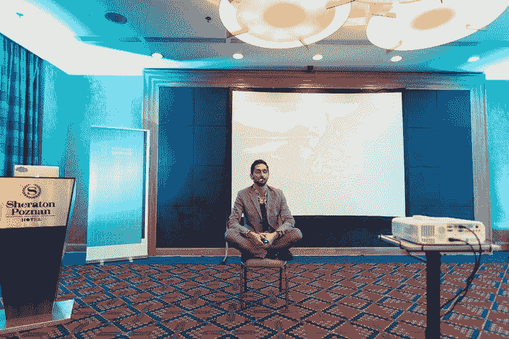

我开始担心我们如何在半小时内到达和返回，但谢天谢地，这原来是一个比喻。这是创造力的象征，意味着离开你通常的环境去寻找解决方案。

保罗想出了一个多么好的解决办法！即使是现在，我也无法停止想这件事。

但是在揭示解决方案之前，让我描述一下这个问题。

演讲围绕着从一个应用程序的想法到一个实际工作的数字产品的过程。

你可能认为构建产品是过程中最长的部分，但更多时候它只是锦上添花。

不，最长的部分是事先进行所有必要的对话。 与管理层、财务、营销和销售、内部或外部技术团队的对话…

从某种意义上说，这就像集邮，只是你不知道你需要收集多少张邮票。每次你得到一个，你就会发现你还需要得到三个。

**这可能需要几个月；甚至长达 9 个月，就像保罗提到的。幸运的话，3 到 6 个月。**

这是个问题，我相信你会同意的。

解决办法？时间太短，保罗无法分享细节，但他确实说过这样的话:  **使用 STX Next 屡试不爽的框架，我们可以将这个时间缩短到只有 5 天。**

这引起了我的注意，并使他的演讲进入我的前五名。

在短短 5 天内全面启动一个新项目听起来像一个梦。

这怎么可能呢？我不完全确定。但如果是呢？

(也许你应该  [让保罗跟进这个](https://www.linkedin.com/in/pawel-jurdeczka)。)

就我个人而言，我希望我们的一些客户能够发现保罗是如何施展他的魔法的。当然，我是做市场营销的，所以也许我应该这么说。但是我很确定  **把 9 个月变成 5 天足以给任何人留下持久的印象。**

#### 2.伯特和杰西·科瓦尔斯基的问答

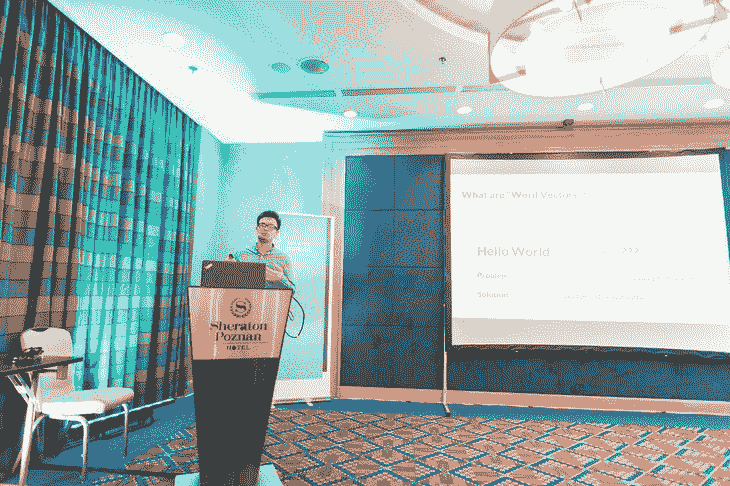

当要介绍杰西·科瓦尔斯基和他关于单词向量的演讲时，坦白地说，我不知道该说什么。

我认识单词；我有时会写。我想我可以解释向量，如果我从高中开始回忆的话。但是单词向量呢？

然而，在短短的 30 分钟内，Jerzy 不仅帮助我理解，而且让我着迷于单词向量。

我惊讶地得知，通过单词向量，计算机现在开始像人类一样阅读。

有趣的是，最流行的程序之一叫做 Bert。

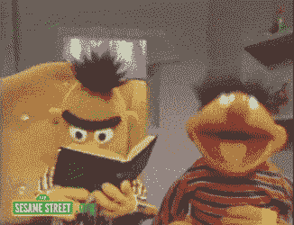

以下是使用 Bert 时发生的情况:

首先，**你** **输入一段文字**， 就像  [这个维基词条的第一段](https://en.wikipedia.org/wiki/Bert_(Sesame_Street))。

然后，你  **问一个问题**， 比如，“谁是第一个在  *芝麻街中扮演伯特的演员？*

有了这些信息，程序会根据自己对文本的理解，  **输出答案**；在这种情况下，答案应该是“弗兰克·奥兹”

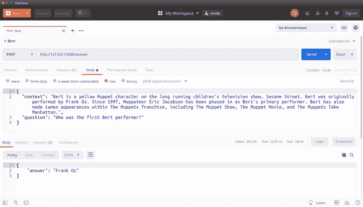

换句话说，这是一个有一定阅读理解能力的算法。一个六年级学生的水平，但仍然！

我可以说我不是唯一一个被这个演讲吸引的人。

有一种确定的方法可以看出人们是否真的在听你说话:当你还没说完，问答环节就开始了&。

杰西的演讲也是如此。在我意识到之前，观众周围的人都大声说:

“如果你反过来问这个问题呢？”

“如果你  [问伯特玛丽的仓鼠](https://ydyo.anadolu.edu.tr/sites/ydyo.anadolu.edu.tr/files/files/mat/d/D%20Reading_comprehensionn.pdf)叫什么名字，即使她没有仓鼠？”

这给我带来了整个峰会的核心问题:  *如果？*

如果这种趋势继续下去，我们的技术超越了处理数据，转而处理意义，那会怎样？

Jerzy 的演讲告诉我，我们比看起来更接近现实。

#### 3.Maciej Urbański 透过蟒蛇的眼睛看(或者，我与无人机的死亡擦肩而过)

我承认 Maciej 的演讲是以一种相当专业的方式开始的。他正在用 Python 深入研究计算机视觉，作为一个非开发人员，我跟不上。

但不久之后，马切伊不仅从技术细节的深处走了出来；他一飞冲天。

更具体地说，  **他决定在实践中演示他的 Python 驱动的面部识别程序。但不仅仅是使用网络摄像头。相反，他使用了无人机。**

**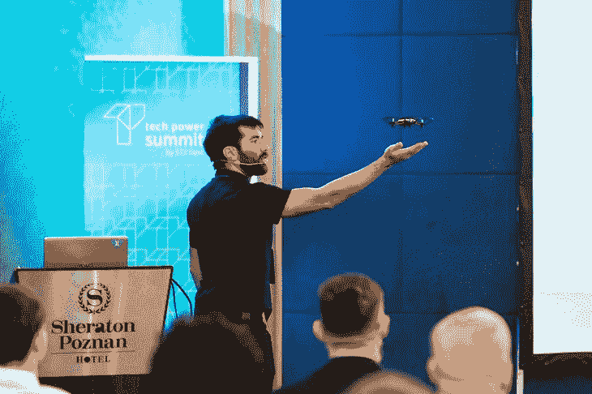**

这是一个值得一看的景象。无人机在空中盘旋，发出持续的嗡嗡声，而投影仪显示出无人机所看到的:Maciej 的脸清晰可见，在每一帧中都被完美地识别出来。

然后，好奇心再次战胜了我们的服务员。

“如果你把无人机转向观众会怎么样？它会跟随哪张脸？”他们问。

所以我们测试了一下。毕竟，了解更多正是峰会的目的。

观察无人机的焦点如何从一个观众转移到另一个观众很有趣，但过了一会儿，我就不再关心这个了。这是因为当无人机适应它所看到的东西时，它开始向旁边飞，离我的脸越来越近。

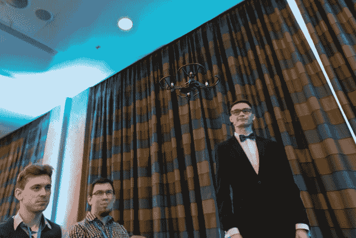

一个星期后，我的左眉毛仍然疼。但那只是因为我在峰会后的一场音乐会上与某人的肘部有过一次亲密接触。

Maciej 的无人机在他手里安全着陆，我们对计算机视觉都多了一点悟性。

#### 4.托梅克·马科维亚克和他意想不到的高风险€100 赌注

"不管你做什么，别忘了托梅克·马克·科维克，好吗？"

这是我在峰会前几天与峰会团队的简报中得到的总体感觉。

作为主持人，我的工作之一是在会议一开始就邀请所有人接受托梅克的挑战。

“托梅克训练了几个机器人来玩游戏，他邀请你去冷藏室挑战它们。他很确定你打不过他们。”

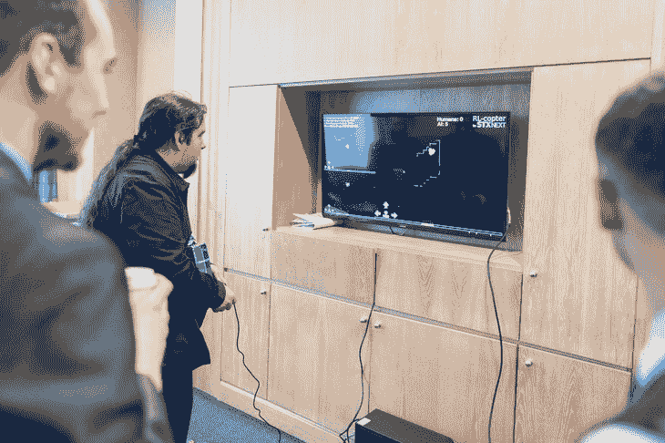

"今天晚些时候，他的演示会告诉你他是如何训练机器人的."

当我发出挑战时，我甚至可以看到托梅克自信的微笑。

事实上，他是对的。当他的演讲开始时，我已经有机会和机器人赛跑了，而且我根本不可能打败它们。

屏幕上出现了一个记分牌:人工智能:40，人类:0。这是不言自明的。

但是在他的演讲中，托梅克给了每个人最后一次挑战机器人的机会。

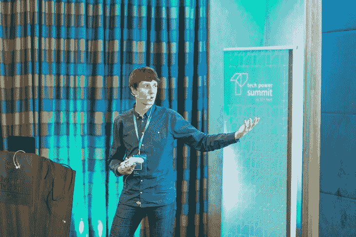

“如果你能在舞台上打败他们，”他说，“你会赢得这个。”

然后他给每个人看了一张崭新的€100 美元钞票。

观众中的大多数人脸上都带着怀疑，但托梅克让我们放心，打赌是真的。

一位挑战者站了起来:我们产品设计团队的 Adam Srebniak。

他坐在电脑前，抓起游戏手柄，摆出我那天见过的最专注的表情，游戏开始了——真的。

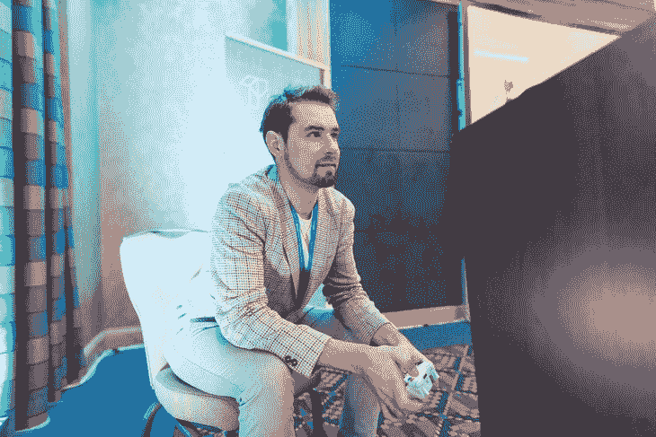

你可以看到房间里的每个人都越来越紧张。当我看到亚当在比赛中比休息时表现得更好时，我情不自禁地笑了。

事实上，他赢了！

但是其中一个机器人超过了他。亚当被困在一个障碍物上，机器人获得了巨大的优势。

一直屏住呼吸，直到那时，我终于在那一刻呼出。看来托梅克对自己的赌注充满信心是正确的。

在我知道之前，亚当弹弓越过了他的障碍，而机器人撞上了自己的一些障碍，减慢了它的进度。突然间，比赛又变得更加接近了。

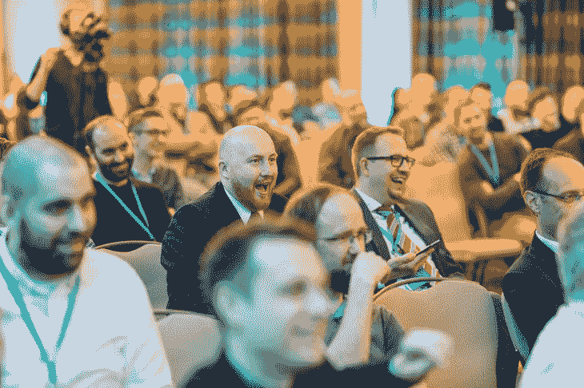

然后，亚当又领先了。

然后，他第一个冲过了  *的终点线！*

爆发的掌声既突然又激烈，我很高兴加入其中。后来，托梅克评论说，他希望没有人看到他在人类本能反应占上风时的表情。

托梅克信守诺言，交出了他的€100 元钞票，我们有照片为证！

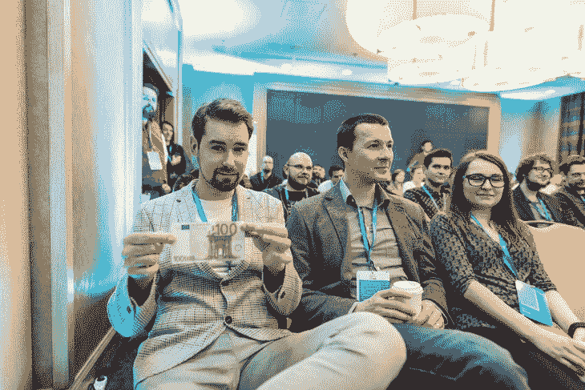

然而，回过头来看这种情况，我不禁会想:  如果这只是面对普遍趋势的一个异常现象呢？

毕竟，比赛是如此接近。而 AI 在星际争霸 2[中已经是](https://www.theverge.com/2018/8/28/17787610/openai-dota-2-bots-ai-lost-international-reinforcement-learning) [碾压人类职业选手在 Dota 2](https://www.theverge.com/2019/1/24/18196135/google-deepmind-ai-starcraft-2-victory) 中几乎独霸。

如果 ML 驱动的技能在几年后成为无可争议的冠军呢？

#### 5.听到我们的首席执行官承认想家

“最后但并非最不重要的”非常适用于我想分享的峰会的最后记忆。这是其中最情绪化的。

按照传统，我们的首席执行官 Maciej Dziergwa 做了最后的报告。

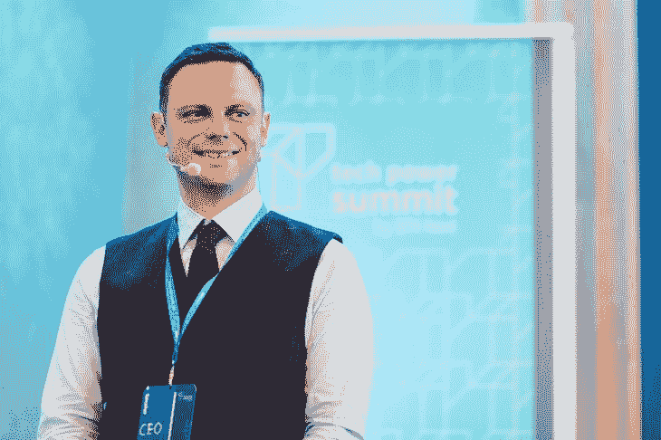

当他开始说话时，我知道他会提到不久前他在 LinkedIn 上发表的 STX Next 的故事。

我熟悉这个故事。  **几年前，Maciej 离开波兰，去荷兰寻求 Python 开发者的成功。他找到了，但是想家了，所以他回来开始 STX Next。**

简而言之，事实就是这样。然而，看到他亲自谈论它是非常不同的。

**听到马切伊声音中的情感，我终于明白了故事背后的真实影响。**

我清楚地意识到，Maciej 放弃国外的有利可图的机会，专注于在波兰从零开始建立一家公司，没有成功的保证，这是多么大的牺牲。

为什么要冒这个险？因为离家近更重要。家庭更重要。不管怎样。

我想到了我自己的家庭，以及我和未婚妻即将开始的家庭。

如果那是我的人生呢？

我会走多远*去接近我最亲近的人？*

 *你会牺牲什么来亲近你所爱的人？

正是这些想法让 Maciej 的演讲成为我最感激的一个。

当会议结束时，我将他的想法付诸实践。我和我的未婚妻(还有我们的猫)喝了咖啡，然后回来参加晚会。但我承认，我没有尽可能久地待下去。

回家更重要。*  *#### 最后的想法

离开峰会，回忆起会谈，一个想法在我脑海中非常清晰:

我不知道。

没想到科技发展如此之快。

没想到人工智能会变得如此强大。

不知道有些科幻场景快要变成现实了。

我还意识到，对我来说，不仅主持峰会，而且只是参加峰会也很重要，这样我就可以为即将到来的变化做好准备。我觉得你也应该做好准备。

与以往一样，技术将决定 2020 年及以后会出现哪些新的商业机会。这也将决定哪些职业会失去相关性，而你可能是下一个被淘汰的。

当然，最好的准备方式是参加明年的峰会。

但是在你这样做之前，这里有一些你现在可以采取的步骤:

*   **关注我们** [LinkedIn](https://www.linkedin.com/company/stx-next-python-experts) ，  [脸书](https://www.facebook.com/StxNext/)，**和**[Twitter](https://twitter.com/STXNext)观看 Tech Power Summit 2019 视频，我们会尽快发布(*更新:  [他们来了！](https://www.youtube.com/playlist?list=PLwXxS6lAcQUNCUTA2QrUnJEqwUgQiBne2))*；
*   **观看去年峰会的** [视频](https://www.youtube.com/watch?v=UkzHEGL5n0Y&list=PLwXxS6lAcQUNVxBWBEo7Tt2PgU-V3hUs8)；
*   **订阅我们的时事通讯** ，了解最新科技新闻(桌面版在右边，手机版在下面)。

感谢你花时间阅读我在峰会上的回忆。

希望明年的版本能见到你！

*