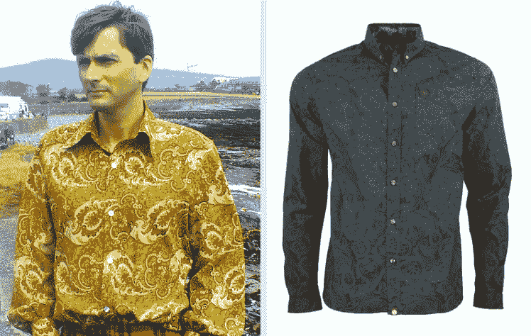
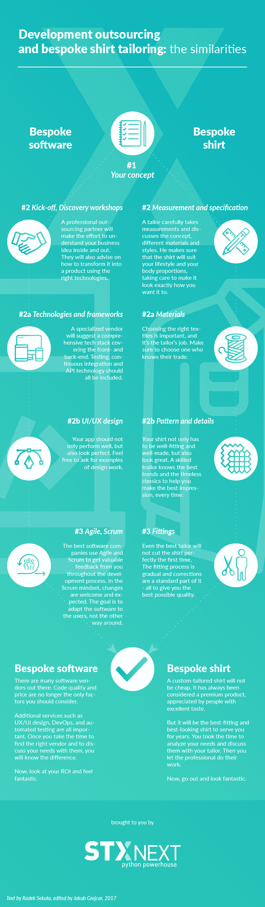

# 定制软件开发:为什么定制软件很重要？

> 原文：<https://www.stxnext.com/blog/bespoke-software-development-why-tailor-made-software-important/>

 当你外包产品开发时，沟通是关键。否则，您可能会发现自己的软件性能不佳，没有人会满意。让我们回顾一下正确的沟通如何帮助您获得您所支付的东西——根据您的需求定制软件。

我最近迷上了男士时装。对我来说，其中一个关键的步骤是把我现在所有的衣服都裁剪好，并且在我买了一件新衣服后就开始裁剪。然而，我花了一些时间去信任我的裁缝。我曾经试图违背他们的建议，向他们推行我对 t 恤应该有多短的想法。我现在有一个平顶。

这段经历，加上我目前在一家高端软件开发公司工作，让我意识到定制  [软件外包](https://stxnext.com/software-development-outsourcing-guide/) 和裁剪的流程是多么的相似。这两者都需要你和服务提供商之间开诚布公的沟通，一定程度的信任，以及把事情做好的时间。

但是，当所有的部分最终组合在一起时，留给你的是一个完全按照你想要的方式工作并满足你所有要求的产品。有时它甚至符合你不知道自己有的要求。

请随意阅读。或者，如果你太忙——向下滚动到这篇文章的摘要信息图。 

#### 拜访裁缝店

想象一下去裁缝店买一件定制的衬衫。你会给他们一张你的尺寸和期望的便利贴吗？提前付款，一周后回来，衬衫看起来完全符合你的要求？还是会很乱？

这个过程看起来很不一样。你带着想法去找裁缝。他们是你可以信任的专业人士。第一，你有分寸。他们收集所有可用的数据，以确保衬衫合身。他们询问你的生活方式。例如，如果你生活在炎热的气候中，你可能希望腋窝周围有更多的空间。

每个细节都很重要。你们讨论不同的材料、衣领和袖口样式，谈论图案和颜色——这是一场对话。理解你的需求是一个漫长的过程，但也要回顾你没有意识到的衬衫制作的各个方面。你真的想要一件厚厚的棉衬衫去南美旅行吗，因为亚麻在那里会更好。

第一次装配后，你再次去商店试衣。调整过程开始了，裁缝要确保衬衫完全合身。

#### 定制软件

好吧，你可能认为我对衬衫制作的细节研究得有点太深了。定制软件开发与此有什么关系呢？

让我们来探讨一下这种比较。当然，裁缝是卖主，衬衫是你想要生产的软件。

发展伙伴(至少是有能力的)会问你很多问题。目标群体是谁？截止日期是什么？你的营销策略是什么？项目的范围是什么？

这是他们版本的测量过程。不要因为他们请求的电话数量而气馁——这表明他们关心你的产品和你的成功。

#### 工作材料

一个合适的裁缝会有各种各样的材料可供选择。选择合适的衣服并不是一个容易的选择，它可能会对你的衬衫的功能产生最大的影响。

在软件开发中，技术和框架浮现在脑海中。你冬天想要一件衬衫吗？选择羊毛。你想要网络服务？和姜戈一起去。专业软件开发人员将提供最符合您需求的技术组合。

#### 让它看起来很棒

让我们回到之前的便利贴。看起来大卫·田纳特在他的便利贴上写了“绿色佩斯利衬衫”,而且他确实收到了。好看吗？还有第二个  [怎么样？它符合同样的描述，但看起来完全不同。](http://www.jonbarrie.co.uk/shirts-c6/pretty-green-linear-paisley-shirt-in-navy-p1640)

一个好的裁缝会理解你的要求，并和你一起返工，让衬衫看起来更好。

这就是为什么在你的项目中你可能需要 UI/UX 设计的帮助——以确保你的产品的外观和感觉对用户有吸引力。

(作为读到这里的奖励——如果你想怀旧并看到一个看起来像左边衬衫的页面，只需看看官方的  [太空堵塞网站](https://www.spacejam.com/)。)

#### 尝试，尝试，再尝试

当你在开发一个应用程序的时候，你很少有机会说，“好了，完成了。”

您想要添加新功能并改进现有功能。所以才会有迭代。这就是为什么一个好的裁缝会做试衣——看看这件衬衫是否真的适合你，并在需要的地方做些小的修改

再次重申:

*   衬衫-产品(网络、应用程序、移动软件)
*   定制软件开发合作伙伴
*   测量和规格-项目启动、发现研讨会
*   材料-技术，框架
*   模式和细节-用户界面/UX 设计
*   配件——开发软件以更好地满足用户需求

#### 摘要

要了解更多关于探索研讨会流程的信息，请点击  [点击此处](https://stxnext.com/digital-product-development/)。

为了更好地解释这一过程，我冒昧地准备了一张对比这两个过程的信息图(点击放大)。

选择合适的 裁缝并不容易。这需要很多考虑。

其中之一是距离。有时你想找一个尽可能近的伴侣，但有时看得远一点会有回报。

在软件开发的情况下,“更进一步”就相当于外包；或者更确切地说，近岸作业。如果你不熟悉近视的确切特点和优势，不要着急- [我们的免费电子书将回答你所有的问题。](https://stxnext.com/ebooks/c-level-guide-to-software-development-nearshoring/)

另一方面，如果你想了解更多定制衬衫的制作过程，请访问著名的[特恩布尔&阿塞尔](http://turnbullandasser.eu/bespoke)网站。他们详细介绍了每一个步骤，我在撰写这篇文章时利用了他们的专业知识。他们给威尔士亲王穿衣服，所以他们知道自己在做什么。

你最好和最差的裁缝经历是什么？我对听软件和时尚故事都感兴趣。给我们留下评论，发送[推文](https://twitter.com/STXNext)或在[脸书](https://www.facebook.com/StxNext/)上给我们发消息。

