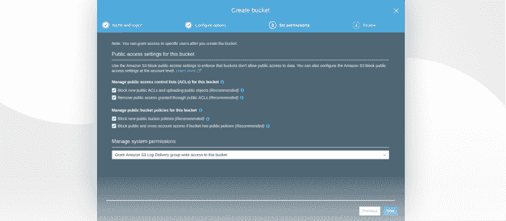
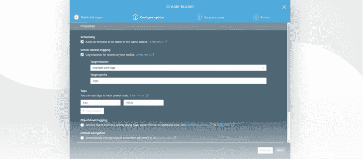
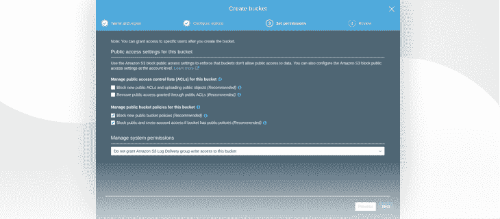
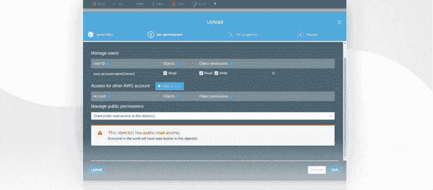
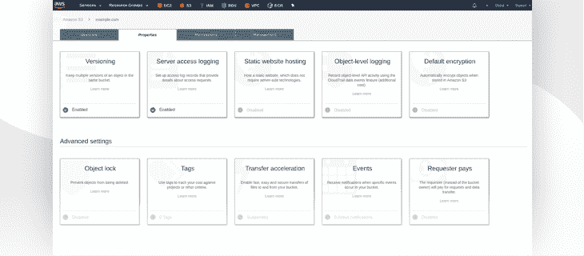
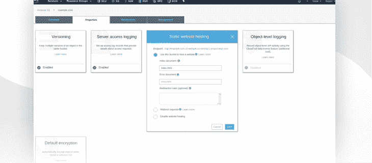
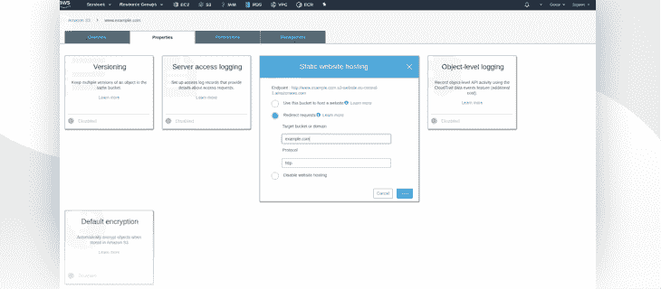
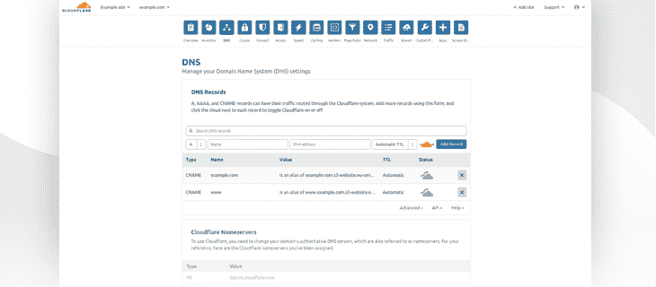

# DevOps:如何在 AWS S3 上托管一个简单的静态网站

> 原文：<https://www.stxnext.com/blog/devops-hosting-static-websites-aws-s3/>

 如果你想托管一个网站，你通常有两个选择:

1.  购买一台虚拟服务器并自己管理它，
2.  使用托管公司的服务。

对于建立网站来说，后一种解决方案是最简单也是最受欢迎的，因为它使网站易于管理，维护成本低廉。

使用托管公司通常归结为访问 FTP 服务器或面板，在那里你可以上传你的网站工作所需的文件。其余的由你的主机服务提供商处理。

但是如果我告诉你还有第三条路呢？静态网站更好的解决方案？

在这篇文章中，我将向你展示如何在 AWS S3 托管你的网站。我还将告诉您使用 AWS S3 如何使我们的一个客户受益。

**** 

#### 你应该什么时候在 AWS S3 上托管你的静态网站？

不是每个人都知道亚马逊 S3 提供了一个功能，允许你托管一个静态网站——“静态”是这里的关键。该网站应该是简单的，没有在后端发生太多，因为像 PHP，JSP 或 ASP.NET 服务器端脚本不支持。

最好的使用案例是作为名片的公司或个人网站，在那里你的用户可以找到你的联系信息。

然而，如果你需要使用类似  [的 CMS，我建议你去看看那些提供托管解决方案的公司，或者使用类似](https://wordpress.com/)[AWS light sail](https://aws.amazon.com/lightsail/)的专用服务。

#### 使用 AWS S3 静态网站托管有什么好处？

有很多原因可以解释为什么你应该把你的网站放在 AWS S3 上。

除其他原因外，这是因为服务:

1.  管理一切，所以你没有必要担心底层软件，如 web 服务器或一般的操作系统；
2.  针对暂时的高流量负载进行良好的扩展；
3.  便宜(在法兰克福地区，成本是每 1000 个 GET 请求 0.00043 美元)；
4.  与 CloudFront 有很好的集成；
5.  操作简单，让你一眨眼的功夫就能建立自己的网站。

#### 在 AWS S3 上托管一个静态网站需要什么？

在 S3 上托管你的网站之前，你需要满足某些要求。

确保您具备以下条件:

1.  注册域名(出于本文的目的，我们假设您拥有一个名为“example.com”的域名)；
2.  访问允许您管理域的 DNS 记录的面板；
3.  AWS 账户；
4.  运营 S3 服务的基本知识；
5.  充分准备的网站(我不会在这篇文章中向你展示如何建立自己的网站)。

 

#### AWS S3 静态网站托管的 4 步指南

现在，我将带您浏览一下在 S3 托管您的网站的过程。

##### 1.创建日志存储桶

让我们从在 S3 创建一个桶开始。它会将请求记录到您的网站上。这不是强制性的，但是我认为收集这样的信息总是有价值的。

我建议您将这个桶称为“example.com-logs”通过保留除“管理系统权限”之外的所有选项的默认设置来配置它在这里，有必要向 S3 日志传递组授予写访问权限。

Granting write access to the S3 Log Delivery group

如果你打算在 S3 上托管不止一个网站，你最好为这个桶使用一个不同的集合名称。设置正确的前缀将最小化混淆来自多个站点的日志的风险——稍后将详细介绍。

##### 2.创建 S3 存储桶

接下来，我们将在 S3 创建两个存储桶。我们会将包含您网站代码的文件放在其中一个文件中。

您的存储桶应该以您的域命名，因此将第一个存储桶命名为“example.com”，将另一个命名为“www.example.com”

现在让我们关注第一桶。

Creating a bucket for your website

在配置您的 bucket 时，我建议打开对象版本控制。如果您希望恢复图像的以前版本或整个网站模板，这可能会很有用。

下一步是打开对站点的请求日志记录。选择您创建的桶作为 **目标桶** 。放置日志的文件夹将作为前缀。

如果您要从几个桶收集日志到这个桶，我建议您将域名设置为前缀。由于这个原因，当您浏览日志时，您将知道日志来自哪个存储桶。

现在，我们将只使用  **日志**、 ，因为我们只托管 1 个站点。

Bucket configuration

下一步是解锁对象的公共 ACL。

这样做至关重要，否则您将无法公开共享这些对象。因此，在浏览器中显示您的网站将是不可能的。

Unlocking public ACLs

你的第一桶就快好了。现在，您可以将包含站点代码的文件上传到其中。

当您上传文件时，请记住确保它们可以公开访问。

Granting public access to bucket objects

在下面的步骤中，您可以选择存储类。将其设置为“标准”

##### 3.启用静态网站托管

是时候启用托管服务了。

转到您的存储桶属性。你会在那里找到“静态网站托管”标签。

**Bucket properties view**

默认情况下，该服务将被禁用。启用它。

**Enabling static website hosting**

你需要输入你的网站的“核心”文件的名称。通常，它是“index.html”，就像这里的情况一样。

如果您有一个应该在出错时显示的文件，那么它也应该在这里定义——当然，应该事先放在您的存储桶中。然而，这仅适用于属于 4XX 组的错误。

另外，在这一点上值得保存上面显示的  **端点** 。

如果您已经正确地完成了所有这些操作，那么一旦您将端点输入到浏览器中，您的网站应该会按预期显示出来。

**Checking if our site is accessible**

现在让我们创建第二个存储桶:“www.example.com。”

您可以将整个配置设置为默认值。这里你最关心的是从“www.example.com”重定向到“example.com”

一旦你创建了这个桶，进入它的属性并启用静态网站托管，就像之前一样。不过，这一次，您还应该:

*   从可用选项中选择“重定向请求”,
*   在“目标桶或域”字段中输入“example.com”域，
*   将“http”设置为协议。

**Setting up redirection for ''www.example.com''**

##### 4.设置 DNS 记录

您的网站现在应该在线。然而，很明显你不想使用这个冗长的网址作为访问该网站的接入点。

为了使用“example.com”域，请登录到您可以添加新 DNS 记录的面板。在这个实例中，我使用[cloud flare](https://www.cloudflare.com/)来管理 DNS 记录，但是不管怎样，您需要做的事情归结为两件事:

1.  删除将“example.com”和“www.example.com”指向 IP 地址或其他域的现有记录
2.  添加 2 条**【CNAME】**记录

*   “example.com”将指向我们的“example.com”存储桶端点
*   “www.example.com”将指向我们的“www.example.com”存储桶端点

**DNS records settings for our website**

您应该等待一段时间，让 DNS 记录传播。之后，您可以从“example.com”或“www.example.com”域进入您的网站。

 

#### 我们的一个客户如何从 AWS S3 获益

在 STX Next，我们经常在项目中使用亚马逊 S3 来存储用户上传的和应用程序生成的静态或媒体文件。静态文件是诸如图像或 CSS/JS 文件之类的文件，它们不是动态生成的。

很多时候，  **这是高度敏感的数据，** 就像包含机密用户信息的 pdf。因为 S3 支持服务器/客户端加密，所以该服务是存储这种数据的真正安全的解决方案。

我们的一个客户找到我们，打算将他的整个基础设施从一个不同的托管提供商转移到 AWS。客户端只有一个虚拟服务器，其中安装了多种服务。

其中一项服务是 NGINX，它在应用程序和公司主网站之间分配流量。客户的主站点只包含一些 HTML、CSS 和 JS 文件。

通过这个网站，潜在买家可以找到客户的联系方式，了解他们的服务。在将基础设施迁移到 AWS 的过程中，我们决定将该网站从应用服务中分离出来，并将数据库迁移到 RDS。

**这是最方便、最安全的选择。一个实例，一个角色。** 如果我们不得不将应用程序转移到另一个实例，我们就不必担心网站、数据库等其他组件。

要启动一个新实例，我们只需运行脚本，该脚本将自动安装应用程序开始运行所需的包，然后简单地将其部署到服务器。就是这样。

为单个网站维护一个额外的 EC2 实例是不必要的，我们不希望主网站有任何大流量——但是如果发生了，AWS 会处理的。

正如你所看到的，S3 的静态网站托管对我们来说是完美的解决方案，我相信对你的企业来说也是如此。

#### 摘要

你现在知道如何为你的网站创建 2 个 S3 桶。您创建的第一个存储桶允许您存储运行网站所需的文件，而第二个存储桶仅用于重定向目的。

您已经设置了 DNS 记录，因此您的访问者现在可以通过友好的域进入您的网站。您的站点对全世界开放，您不必担心底层服务器、软件更新、扩展或成本。

如果你想使用 HTTPS 协议——这是强烈推荐的——你应该看看[CloudFront](https://aws.amazon.com/cloudfront/)服务。使用 Cloudflare，您可以通过他们的服务器路由流量来建立 SSL/TLS 连接。但是，客户端和 Cloudflare 服务器之间的流量是加密的。对于完整的 SSL/TLS 设置，需要 CloudFront。

#### 最后的想法

感谢您阅读我关于使用 AWS S3 托管简单静态网站的文章。

DevOps 是科技界最新的热潮——或者至少是众多热潮中的一个——所以我很高兴与你分享我的一些知识，希望能让你的生活变得轻松一点。

如果你是一名开发经理，希望进入 DevOps、  [，我们有专门为你准备的资源](/stx-new-blog)。这是一本入门书，可以让你正确地开始开发工作。

我们还在 STX Next 提供全面的 DevOps 服务。  [看看吧，如果你觉得你的业务需要一点推动](https://stxnext.com/services/devops/)。

如果你有任何问题或意见，请在下面留下，我会尽快回复你！

