# 如何用领域驱动设计架构一个良好模块化的系统

> 原文：<https://www.stxnext.com/blog/domain-driven-design/>

 领域驱动设计(DDD)是一种软件开发方法，它通过将实现与演进的模型联系起来，帮助您解决复杂的问题。

DDD 包括一系列工具，这些工具从本质上捕获领域术语中的领域模型，将模型嵌入到代码中，并保护它免受破坏。它也可以被认为是一个软件开发由设计和用户体验驱动的过程。

然而，所有这些都给我们带来了一个问题，“如何在您的系统中实现 DDD？”你会发现，如果你坚持阅读，以及其他相关的概念，如:

*   **在 DDD 定义一个大泥球**

*   **比较微服务和单体**

*   **利用领域驱动设计将项目分割成更小的部分**

*   **战略性地将 DDD 整合到您的系统中**

*以下指南基于 Sauce Labs 技术主管 Sebastian Buczyński 在庆祝 Python 30 周年的 PowerIT 大会上的演讲。点击这里观看 Sebastian 关于这个主题的网络研讨会的完整记录:*

[https://www.youtube.com/embed/dTOddqKOHIA](https://www.youtube.com/embed/dTOddqKOHIA) 

#### 什么是领域驱动设计中的大泥球？

即使它的创造是从一张白纸开始的，每个产品最终都会变成一个大泥球。

设计和构建软件解决方案最常见的方式——一大团泥巴——指的是代码丛林，它由结构混乱、杂乱无章、基本上由胶带捆绑在一起的代码组成。

尽管这个定义听起来很奇怪，并且似乎违背了您所遵循的软件设计原则，但是您有可能已经或者将要从事具有这些特征的项目。因为编程和软件开发的科学，包括那些涉及 Python 的科学，每天都在创造一个新的大泥球。

项目变成一团烂泥总有一个很好的理由。也许是因为高离职率，不断增加的压力，或者缺乏知识，经验，或者对项目的理解。

虽然已经有无数次尝试来解决这个问题，但是大多数都没有提供预期的结果。在少数可行的解决方案中，一个值得注意的解决方案是微服务。

#### 选择微服务而非整体架构的优势和风险

微服务的主要卖点之一包括将一个整体分割成几个更小的部分。然而，微服务比整体系统复杂得多。所以，如果组织你的代码是你的主要目标，你可能要重新考虑你转向微服务的选择。

大多数使用微服务架构的人最终都以错误的方式划分它。系统只是为了微而被拆分，最后在你的团队只有几个开发人员的情况下，管理和维护几十个微服务就成了一场噩梦。

然而，微服务的底线是你摆脱了一个大问题，转而处理几个小问题。虽然这个概念不一定有缺陷，但也许你不必总是发布你的应用程序。尽管如此，如果仍然需要微服务，您需要一种健壮的方法来将您的系统分成更小的、可管理的部分。

这正是我们将在接下来的部分中讨论的:如何将一个项目分割成小块，并以领域驱动设计为模式保持有序。

#### 如何以 DDD 为模式将项目分割成更小的部分

因为我们在本文开始时提到了干净的石板，所以让我们开始一个新的示例项目——一个书签平台。

##### 登录页面

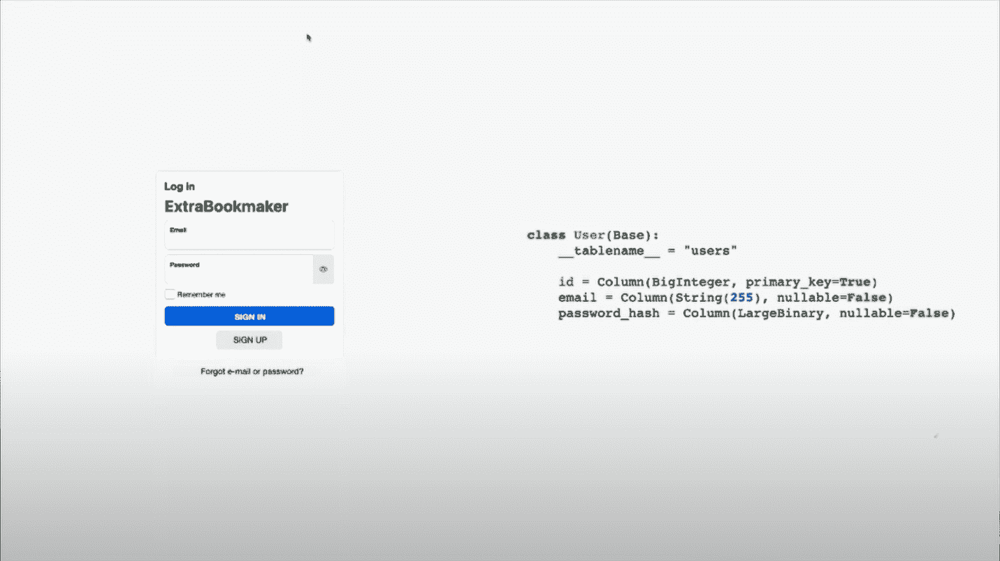

像在每个平台上一样，我们从登录页面开始，在那里你输入你的电子邮件和密码。

如果你以前做过类似的项目，你可能已经知道使用哪个框架，或者你是否应该利用代码或云服务。

尽管如此，书签平台的核心是下注的能力。该系统应该能够告诉你一个给定游戏的赔率和你的潜在投资袋利润。

##### 支付选项

说到利润，你需要为用户提供一种提取收益的方式。

**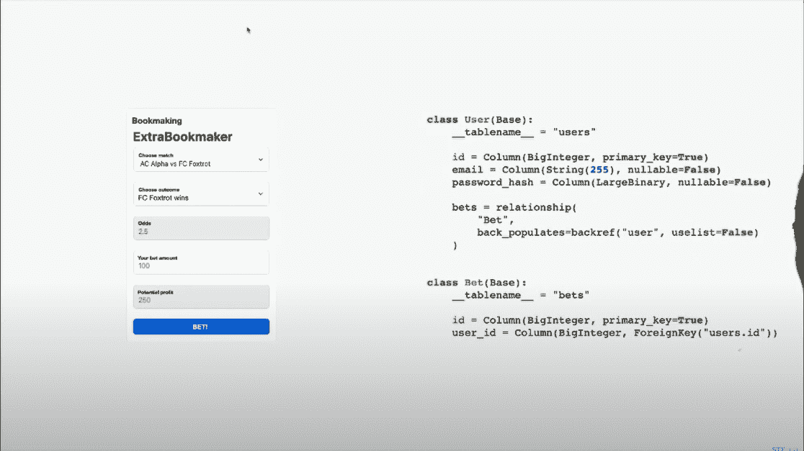**

意思是，银行账户列表或银行整合。

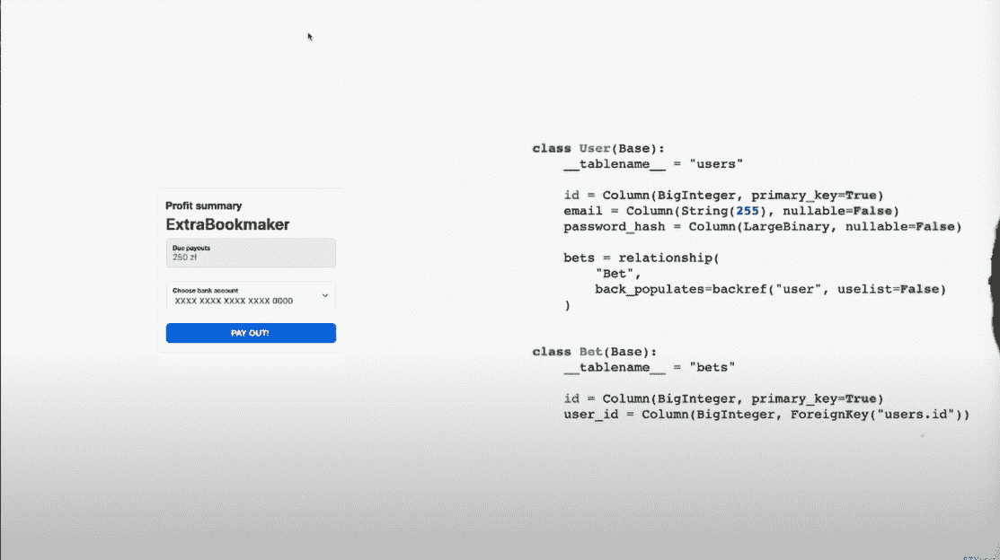

##### 确认

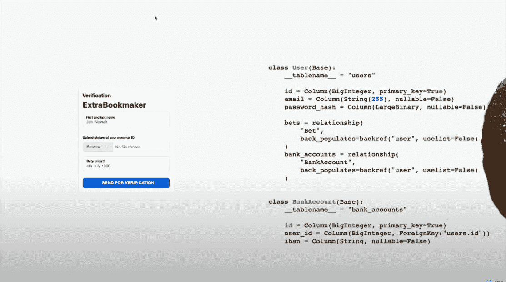

然而，整合支付选项并不那么简单。首先，您必须验证注册帐户的用户是否遵守您所在地区的法律。例如，在波兰，博彩服务提供商应确保用户年满 18 岁，并通过 KYC 程序，才能在平台上合法赌博。

因此，您还需要将一个验证页面整合到您的书签平台中，包含图片、出生日期、ID 等字段。然而，事情并没有就此结束。现在，你还必须通过自动化来验证你收到的申请。

在为我们的博彩平台创建了大量的元素后，如果你看下面的图片，你会发现它变成了一个多么可怕的大泥球。

嗯，这里的问题是我们在想象真实的场景并把它们转化成代码。要么是这样，要么是我们想出了一个关于事物应该如何工作和系统应该如何的心智模型，并迅速将它们翻译成代码。这就是产生一个大泥球的原因。

#### 战略领域驱动的设计

首先，你不应该创建一个单一的模型，因为这会导致灾难。此外，您创建的任何模型只在特定的上下文中有意义。

例如，如果我们看一下我们之前创建的用户界面，我们可以认为用户是一个点击所有屏幕的人。此外，我们可能一直想知道特定于 UI 的问题——如何确保他们点击那个按钮，如何确保他们花钱，以及如何确保没有摩擦。

一个古老的格言在这里变得相关:分而治之。源自领域驱动设计的一个思想流派认为，要创建一个可维护的系统，必须有多个上下文和模型。

##### 有界上下文

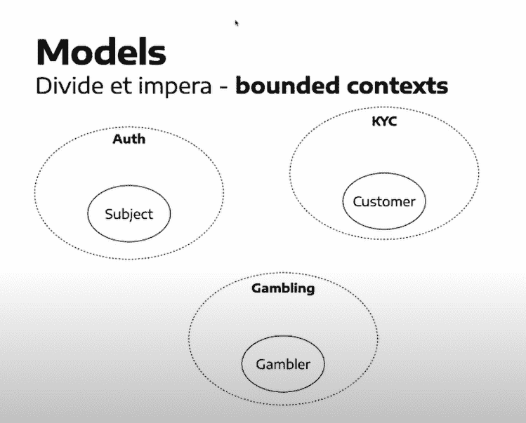

上下文可以是有界的。例如，我们为 bookmaker 平台创建的客户模型在上下文之外没有意义，因为没有用户或任何得到验证的人的概念。

为了让有界上下文的概念更容易理解，我们向用户添加了不同的视角。因此，像认证一样，有一个主体——对赌博进行认证的一方、一个赌徒和一个顾客/KYC。

因此，在这种情况下，在我们的软件中区分各种有界情况变得很容易。这是一个关键阶段，因为这是我们领域驱动设计的第一个战略模式。

尽管这些不同的模型使得分析现实变得容易，但是它们仍然应该作为一个单一的系统一起交流和工作。然而，当所有模型都以不同的方式看待现实时，我们如何解决这些差异呢？

简单的答案是帮助他们找到共同点。

##### 整合上下文

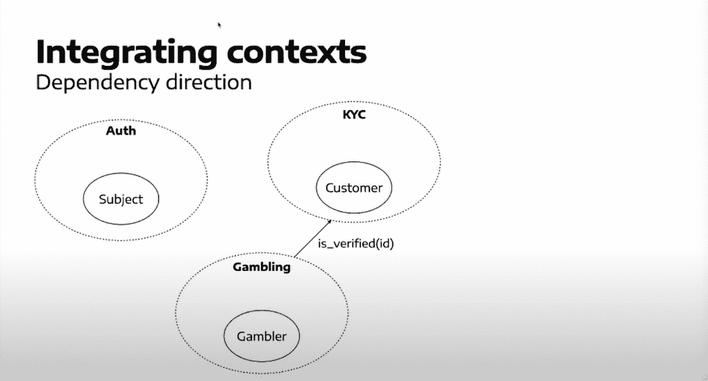

每个模型都应该相互通信。例如，一般来说，处理赌博的赌博上下文询问 KYC 上下文用户是否被验证并且有资格赌博。

然而，由于两个模型使用不同的语言，我们选择使用什么语言进行交流。因此，举例来说，我们可以牺牲一点 KYC，通过简单地回答用户能赌博吗？

这个有界上下文相互通信并决定使用谁的语言的过程被称为上下文映射。

##### 上下文地图

战略领域驱动设计的另一个重要组成部分——上下文图——围绕着决定在交流中使用的语言或定义谁的模型更好的过程。

在最开始的时候，你对模型、它们的语言以及它们的优越性一无所知。因此，在开发上下文图之前，您必须提前执行一些分析，或者在项目上工作很长时间。

##### 依赖类型

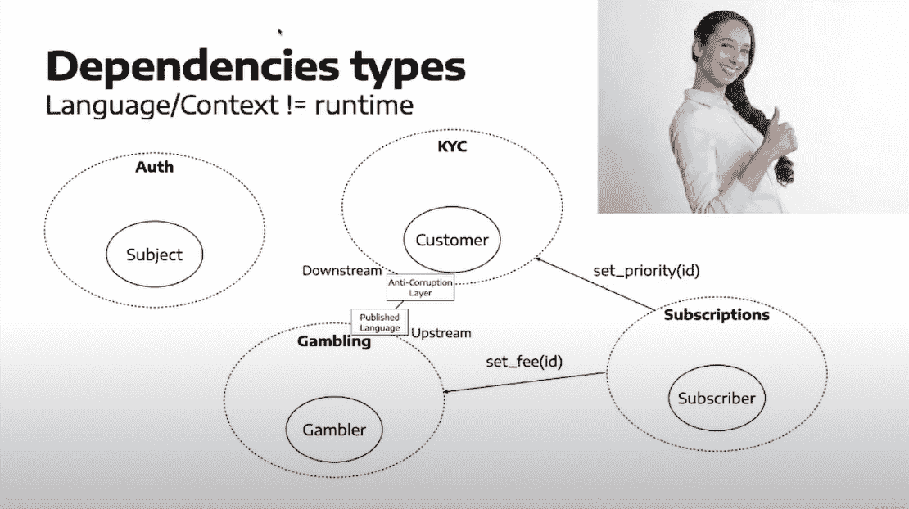

我们可以做一个有界的订阅上下文来告诉 KYC 和赌博模型优先级并设置费用。然而，这里的整个功能不仅仅是关于订阅，而且还关于将优先级概念引入 KYC 有界上下文。

因此，这个过程现在变得简单多了。这里要注意的另一点是，语言和运行时依赖关系总是可以翻转的，无论你喜欢还是想要。

订阅是一个可以影响系统功能的组件。因此，确保整个项目不依赖于它是很重要的。

##### 寻找有界上下文

为了找到有界的上下文，你必须看下面的试探法:

*   **什么是子域和问题空间？**

你应该首先分析业务，你将为业务创建的软件应用程序，该公司活动的不同领域，他们如何赚钱，他们的额外业务，法律义务，等等。

*   我们是否在考虑不同的利益相关者？

有可能代码的某些部分是为不同的涉众创建的。例如，KYC 是我们平台上唯一的数据驱动者。因此，它应该专注于让用户意识到法律义务，而不是发送冷静的电子邮件，这与帮助公司获得更多利润的利益相关者完全不同。

*   我们可以分开卖吗？有人已经这样做了吗？

这也是 KYC 的情况。有几家公司可能想把人放在已知供应商的数据库中。

*   每一个事实都有唯一的真相来源吗？

如果每一个事实都没有单一的真相来源，那么不可能在任何地方都有相同的信息。例如，订阅是优先 KYC 处理或其费用的真实来源。然而，因为它是真理的来源，KYC，赌博，或任何其他背景不能保持它的缓存。因此，如果你希望了解一个单一的事实，你将不得不去一个单一的有界环境。

*   我们能观察数据或特征输入的现象吗？

当一个有界上下文需要执行一些操作，但是与其他有界上下文有很多通信发生时，这些上下文边界可能会出错。因此，它需要更多的洞察力。

*   我们会用相同的名字来称呼不同行为的事物吗？

这是另一个启发，它指出在你的系统中，不同的事物可能有相同的名字，但行为不同。这种现象在个别班级尤其明显。例如，我们之前看到过一个案例，我们对几个不同的概念使用了一个非常通用的用户名。

*   我们是否混淆了用户界面和商业模式？

我们可能混淆了用户界面看待事物的方式和业务运作的方式。这就是我们在文章前面提到的书签平台的例子。

所以，现在我们有了一个漂亮的上下文图。但是我们如何在不创建代码丛林的情况下实现它呢？

有两种方法:模块化模型或微服务系统。

#### 模块化整体

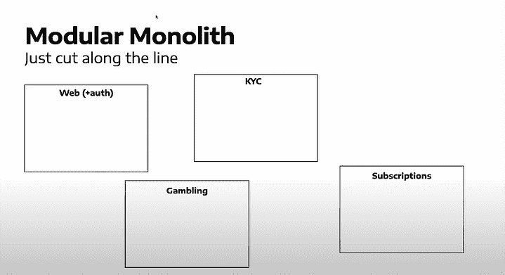

有了模块化的独石，我们沿着有限的背景切割，并从中创造出不同的组件。或者，我们将身份验证上下文与 web 应用程序结合起来，这样就不需要单独的上下文或代码，因为已经有库可以做到这一点。

需要记住的一件重要事情是，它们需要有单独的名称空间。因此，在代码中，您可以有一个根包和几个子包。

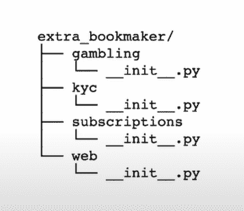

每个组件都应该有一个 API。在组件的空隙中，您可以使用它的 API 来处理它所提供的服务。例如，在 KYC 的情况下，它可以是一个方面设计模式来公开相应的功能。这可以将“gamble”分配给“gambling ”,并设置订阅的优先级。

所有组件都像对象一样被封装。所以，它们包含一些私有的、不能从外部使用的代码，也包含一些可以在外部使用的代码，比如 facets。这意味着公共元素是 API，私有元素都是机制和内部的东西。

现在，Python 可能不直接支持它，但是有工具支持它。例如，如果所有属性都是在模块级声明的，PyCharm 会在您不应该使用它的时候通知您，因为它没有被声明。虽然程序可以工作，但是工具会阻止你这样做。

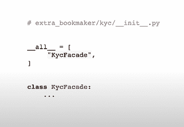

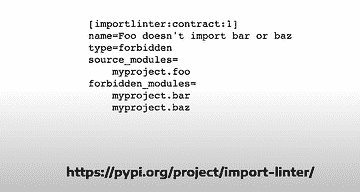

#### 微服务

对于微服务，我们从沿线切割开始，然后继续使用几种微服务模式，如往复前端。这意味着似乎有一个服务充当多个微服务的保护伞，并且还可以提供一种身份验证的方法。

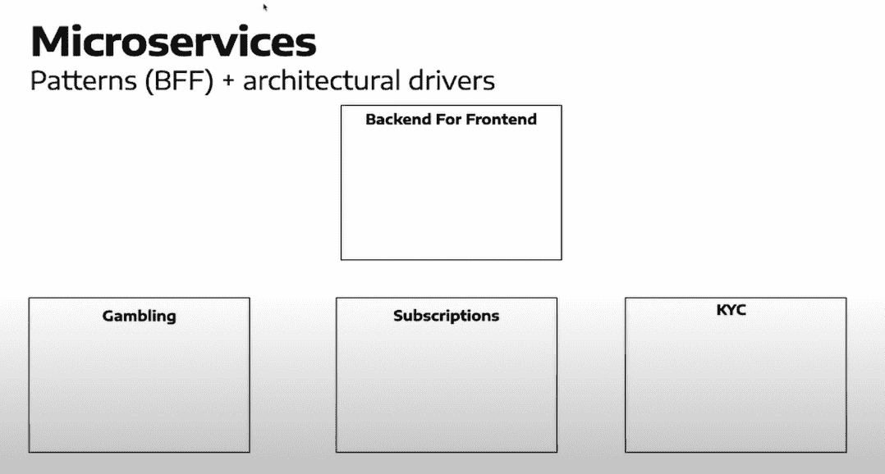

在这里，我们还考虑一些架构驱动因素，例如独立扩展或部署所需的东西。同样，这是在将我们的上下文图转换成代码时要考虑的关键点。

#### 微服务与模块化整体比较

总而言之，API 模块化整体是直接调用一个上下文到另一个上下文的理想选择。使用微服务，我们必须调用另一个微服务的 API 或通过代理发送消息。

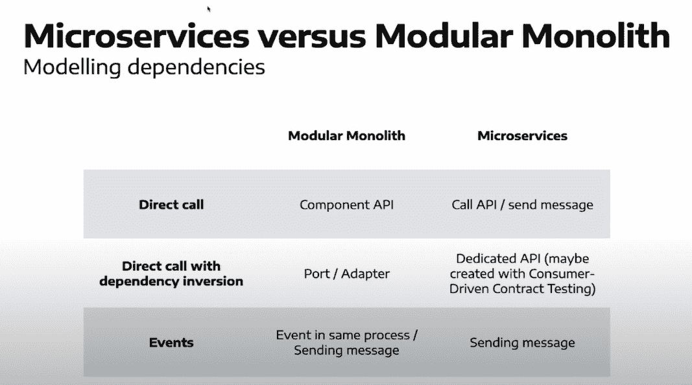

说到方向的反转，我们可以在模块化的 monolith 中使用抽象类或者具体类。另一方面，通过微服务，我们可以获得一个专用的 API，它可能是通过一种被称为消费者驱动的契约测试的技术创建的。

最后，对于事件，模块化模型变得更简单，因为您可以使用 Blinker 或 Django Signals 之类的库，或者向代理发送消息，而对于微服务，您总是需要向代理发送消息。

#### 关于用 DDD 构建一个良好模块化系统的体系结构的最后思考

更好的代码不仅仅源于更好的编程技能。这也需要对你正在处理的问题有很深的理解。

因此，尽管 DDD 可能不是解决编程世界中所有问题的万能解决方案，但它是推动更好的软件设计的完整而全面的技术。最终，它会给你提供一个比一大团泥好得多的项目。

感谢您阅读我们的文章！我们希望你觉得有用。如果您希望获得更多软件开发方面的专家建议，请考虑查看我们网站上的以下资源:

*   [2021 年全球 CTO 调查报告](/cto-survey-2021-report)
*   [Python 是用来做什么的？](/what-is-python-used-for/)
*   [Python vs .其他编程语言](/python-vs-other-programming-languages/)
*   [软件开发外包:快速获得商业成果的实用指南](/software-development-outsourcing-guide/)
*   [新任 CTO 手册](/ebooks/new-ctos-handbook/)
*   [科技领袖枢纽:管理&成长](/ebooks/tech-leaders-hub-management-growth/)
*   [如何审计你的 Python 代码的质量:检查表和样本报告](/code-audits/python/)

最后但同样重要的是，如果你在未来的项目中需要任何支持，我们有数百名专业人士随时准备好 帮助你。请随时到 [看看我们的服务](/services/) 和 [联系我们](/hire-us) 寻求帮助！