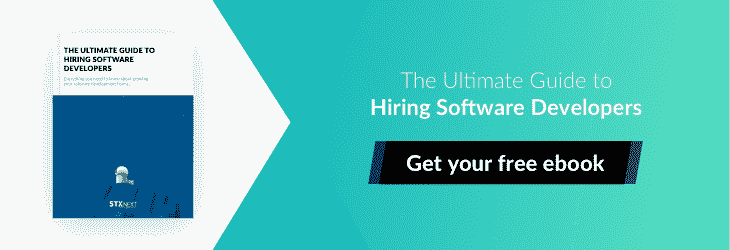

# 网上银行的发展:数字银行应用和趋势

> 原文：<https://www.stxnext.com/blog/evolution-online-banking-digital-banking-apps-and-trends/>

 老实告诉我:你身上有钱吗？

不，我不是说你破产了，也不是问你的账户余额；我说的是你实际上放在钱包里的现金。

没有吗？我想是的。我也不知道。

前几天我去见一个客户喝咖啡，在街上看到一个无家可归的人。他在人行道上走来走去，向人们要钱。你知道他最常得到的答案是什么吗？“对不起，伙计，我没有现金。”

你知道吗？有生以来第一次，我真的相信了。

借记卡和信用卡现在变得越来越普遍。结果，人们越来越不愿意携带现金——而波兰正处于这一现象在欧洲的最前沿。

极点数字银行。万事达卡开展的一项研究显示，超过 91%的波兰受访者每月至少进行一次网上支付(欧洲平均水平为 85%)。此外，德勤的中东欧金融科技报告对波兰金融科技市场的估值接近 8.6 亿€。这两项数据都让波兰在欧洲这一地区处于领先地位。

波兰的数字银行业务现在可能比以往做得更好，但情况并不总是如此——实际上远非如此。回顾我国数字银行的开端，可以肯定地说，我们已经取得了长足的进步。一段非常非常长的路。

在本文中，我想通过展示您绝对应该关注的应用程序和趋势，带您了解在线银行在波兰和全球的发展。 

#### 艰难的开端和成长的烦恼:波兰数字银行的早期

我花了 6 年时间探索在线支付行业，不仅仅是在波兰，还包括全球市场。2012 年，我开始为一家支付提供商工作。我的工作是说服电子商务客户信任在线支付，这在当时只意味着从他们的银行账户进行电子转账。

我们可以说，这个过程很费力。

我有很多那个时候的故事。例如，人们将装有现金的信封送到我们的办公室，要求将钱转到他们的虚拟钱包，通常是在博彩和在线约会网站上。甚至不要让我开始解释什么是虚拟钱包是一场噩梦。

但就挑战而言，有一件事取得了成功:向客户解释，他们需要使用为每笔离散交易提供的单独链接进行单独支付，而不是像以前一样登录自己的账户并输入相同的账户信息进行转账。

这是黑魔法，我不是在开玩笑。

当然，最糟糕的是，这些客户会不可避免地使用不正确的账户信息进行错误的转账，他们的付款不会被接受。每天，我们必须回答至少 50 个客户打来的愤怒电话，询问我们他们的钱去了哪里。有人甚至指责我们的  *窃取了* 它。是的，真的！

谢天谢地，事情已经变得更好了——好得多。波兰的数字银行正在蓬勃发展，新的应用程序和趋势层出不穷，证明了我的观点。

稍后我们会详细介绍。在我们继续深入之前，让我们后退一步，从头开始:数字银行是如何发展到现在这个地步的？

#### 从那时到现在:数字银行的发展

你可能会感到惊讶——我知道我很惊讶——银行早在 1985 年就开始向客户提供数字银行服务！

然而，互联网用户数量少以及与使用数字银行相关的成本减缓了这一进程。直到 20 世纪 90 年代末的互联网热潮，人们才对网上交易变得更加适应。

从某种意义上说，数字银行是伴随着互联网发展起来的。但现在想来，最大的挑战是建立信任。

这就是金融科技发挥作用的地方。

##### **Fintech**

在世纪之交，不仅数字银行，金融科技公司也变得越来越重要。这对人们对电子银行的信任程度以及网上转账的数量产生了至关重要的影响。

我们如何定义金融科技公司？嗯，这并不像看起来那么简单。

归根结底，金融科技结合了金融和科技。但当我们需要精确确定一家公司成为金融科技公司所需的金融和技术水平时，困难就出现了。为了简化事情，我们主要在通过在线渠道销售金融产品的公司的背景下谈论金融科技。

第一批金融科技公司出现在金融危机之后，由业内人士运营。它们是在低利率和银行低贷款率的浪潮中发展起来的。迄今为止，金融科技和数字银行并驾齐驱，其中一个对另一个的快速增长和发展的贡献不可低估。

说了这么多，我们现在可以安全地转移到你渴望已久的部分:数字银行应用和趋势。准确地说，是三次。

请注意，这个列表纯粹是主观的。这些是我喜欢的应用程序，也是我觉得有趣的趋势。希望你会有同样的感觉。

#### 现在什么是热点:你应该知道的 3 个数字银行应用和趋势

##### **1。IKO**

好吧，所以我对 IKO 有点偏见，因为我自己也在用它。但这远不是唯一的原因！

IKO 手机应用是波兰评分最高的数字银行应用。根据 146 个评级，它的平均得分为 4.7 星(满分 5 分)。IKO 可以在 Android、iOS 和 Windows 上使用，在三大应用商店中占据榜首:Google Play、App Store 和 Windows Phone Store。

IKO 是由 PKO 银行 Polski 创建的，让他们的客户能够方便地使用和管理他们的手机账户，并进行无卡支付(该服务也包括 Inteligo 卡)。

IKO 最重要的特征包括:

1.  **国内账号转账；**
2.  **电话号码转移；**
3.  **带 NFC 的手机非接触式支付；**
4.  **通过 BLIK 的无卡支付；**
5.  **ATM 无卡取现；**
6.  **充值；**
7.  **西联汇款接待处。**

PKO 银行 Polski 雇佣了一个由 1300 多名技术专家、爱好者和专家组成的团队，他们渴望发现和实现数字银行领域的新趋势和解决方案。

为一家软件公司工作，我觉得如果我不看看 PKO BP 的技术团队，那会很奇怪。所以我就这么做了，你瞧，他们当然用了  [Python](/stx-new-blog/why-python/) 。 如果你对其中的原因感到好奇，看看我们的文章  [为什么 Python 应该是你的 fintech 的技术选择](/stx-new-blog/why-python-should-be-technology-choice-your-fintech/)。

根据他们的  [网站](https://bulldogjob.pl/companies/profiles/409-pko-bank-polski)，PKO BP 的开发人员在后端使用 Python、Java 和 C++，在前端使用  [JavaScript](https://stxnext.com/services/javascript-development/) 、jQuery 和 React 等。

就像我说的，我自己正在使用 IKO，我真的不能抱怨，所以如果 PKO 银行波尔斯基是你的选择，不要犹豫，下载应用程序。相信我，你不会后悔的。

##### **2。文莫**

我喜欢这个，因为它很容易。

简单来说，Venmo 就是一个数字钱包。

这项移动支付服务由 PayPal 所有，可在 Android 和 iOS 上使用，允许用户通过该应用程序快速转账。

以下是更多关于如何使用 Venmo 的信息:

1.  **单个工作日内向银行转账；**
2.  **用您在 Venmo 上的钱或使用您的关联银行账户和借记卡进行支付和共享支付；**
3.  **毫无问题、毫无困难地与亲朋好友分摊账单；**
4.  **进行接受移动应用支付的购买。**

除此之外，Venmo 还在寻找软件开发人员。他们需要熟悉后端技术的人，比如 MySQL、Django、MongoDB，最后但同样重要的是——你猜对了！—Python。只是提醒一下，以防你想参与其中，开发一款很酷的产品。

Venmo 确实是一个很酷的产品。很简单，很免费，也很好玩。强烈推荐。

##### **3。QuickBooks GoPayment**

现在，这里有一些不同的东西，销售人员可能会更感兴趣。

QuickBooks GoPayment 是一种移动信用卡处理和支付服务，由总部位于加利福尼亚州山景城的一家非常成功的软件公司  [Intuit](https://www.intuit.com/) 开发。该应用程序与简单的 Intuit 移动读卡器齐头并进。

一旦你建立了一个账户，一个小型的信用卡扫描仪将会免费寄给你。你所要做的就是将扫描仪直接插入你手机的音频插孔，你就可以开始了(抱歉，iPhone 7+用户)。该应用程序在 Android 和 iOS 上可用；它甚至可以在一些黑莓设备上运行。

扫描仪硬件使得 QuickBooks GoPayment 成为  [Square](https://squareup.com/) 的最大竞争对手之一。该服务提供商 Intuit 的主要业务是在线商店支付和移动处理。

不出所料，Intuit 也在寻求扩大他们的软件开发团队。根据他们的职业页面，他们的目光瞄准了可以改变人们“在云、平台、移动和 SaaS 环境中管理财务”的方式的工程师他们的技术栈包括 HTML5、CSS3、Django 和 Ruby on Rails 等技术。

GoPayment 是一个漂亮的小工具，它改变了你使用信用卡的方式，等等。我鼓励你去看看。

#### 前瞻:数字银行的下一步是什么？

世界在变化，技术在飞速发展。这些都是事实，没有什么能阻止这列火车。如果有的话，它会继续加速。

因此，对金融科技公司的需求不断增长。他们可能很快就会让银行为他们的钱而战——真的。

我甚至不打算在这里讨论加密货币和；你可以在网上 [或其他地方](/stx-new-blog/blockchain-part-two-how-blockchain-will-change-your-future-browser-experience/)读到区块链将如何影响我们的生活。可以说，加密正在像野火一样蔓延。我们已经在 STX Next 观察了一段时间，随着越来越多的初创公司进入这项技术。目前，我们有两个区块链/加密项目正在进行中:[block trade](https://stxnext.com/portfolio/blocktrade/)和 [Lamden](https://stxnext.com/portfolio/lamden/) 。

建立信任将再次成为数字银行未来的关键挑战和优先事项。人们需要克服对新的支付和投资方式的恐惧，就像数字银行刚刚出现时一样。

当这种情况发生时，金融科技和加密将成为我们使用货币的一个组成部分；甚至可能是它的基石，有足够的稳定性和社会拥抱。反过来，这将意味着银行机构面临更多的考验和磨难，迫使它们想出如何抵御变革之风——而且要快——如果它们想保持相关性的话。

与此同时，随着行业的持续增长，一波新的数字银行应用和趋势必将到来。我只能想象我们在新的特性和功能方面可能会走向何方，但随着竞争的激烈，我们可以放心令人兴奋的发展即将到来。

总而言之，如果你对金融和科技感兴趣，这是一个多么美好的时代。

#### 最后的想法

那么，你对数字银行业务有什么看法？

你认为你会再买一个皮夹作为礼物吗？

你认为我们最终会停止使用纸币和硬币吗？

作为一名业务发展主管和在线支付爱好者，我想说我在这个问题上的立场非常明确，所以我让你自己回答这些问题。

同时，非常感谢你阅读我在公司博客上的第一篇文章。与世界分享我热爱的东西总是一件愉快的事。如果你喜欢我的文章，我有好消息告诉你；从那里来的还有很多！

更多 STX 优质内容接下来， **关注我们的博客** 或 **订阅我们的时事通讯。** 我们涵盖了各种与技术相关的主题，每周都有新的更新。

以下是我强烈推荐的一些进一步阅读的建议:

*   [为什么 Python 应该是你的 Fintech 的技术选择](/stx-new-blog/why-python-should-be-technology-choice-your-fintech/)
*   [将 Python 纳入其技术堆栈的前 17 家金融科技公司](/stx-new-blog/top-15-fintech-companies-include-python-their-tech-stack/)
*   [区块链，第一部分:什么是区块链，它是如何工作的](/stx-new-blog/blockchain-part-one-what-blockchain-and-how-it-works/)

如果你知道任何最新的数字银行应用程序或趋势，或者有一些你自己喜欢的，请给我留言或在下面留下评论！我一定会回复你的。

