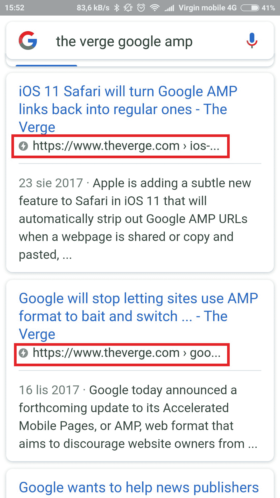

# 谷歌的 AMP:用例子解释移动的未来

> 原文：<https://www.stxnext.com/blog/googles-amp-future-mobile-explained-examples/>

 如果让您猜，您能说出目前有多少移动用户在浏览网页吗？

在现代网络中，[手机](/services/mobile-development/)正在崛起成为主导。据[gs.statcounter.com](http://gs.statcounter.com/platform-market-share/desktop-mobile-tablet)称，超过 48%的互联网浏览设备是移动设备。桌面用户排名略低，而平板电脑用户不到 10%。

我们能从这些数据中学到什么？移动用户至关重要。你忽视他们，后果自负。

自从 2015 年 4 月谷歌的 [Mobilegeddon](https://en.wikipedia.org/wiki/Mobilegeddon) 以来，有越来越多的工具旨在改善移动用户的网络体验。其中之一是谷歌的 AMP，即加速移动网页。

如果你想在移动市场保持竞争力，你应该了解 AMP。

在这篇文章中，我将介绍 **什么是放大器，它是如何工作的，** 和 **为什么你应该关心放大器。** 我还会给出一些 **放大器示例** 以及，为了避免事情变得过于甜蜜，这个解决方案的一些 **缺点。** 我们再来看看**AMP 的未来，** 同样如此。

我们开始吧！

 

#### AMP 是什么？

**【AMP】(代表加速移动页面)** 是谷歌支持的开源项目。其目的是加快网页内容显示给移动用户的速度。

要享受 AMP 的优势，您的网站需要满足 Google 设定的某些要求。一旦这些要求得到满足，你的用户将会享受到一个几乎可以在手机上即时加载的网站，因为它的内容是通过谷歌的服务器直接优化和提供的。

我们现在谈论的速度有多快？

在早期测试中，我们发现 AMP 页面加载速度比传统的移动优化页面快四倍，使用的数据少八倍。

Jon Parise ，Pinterest 的产品经理

AMP 由三个元素组成:

1.  AMP HTML–针对 AMP 页面优化的 HTML 标签子集
2.  AMP JS–a[JavaScript](https://stxnext.com/services/javascript-development/)库专门针对 AMP 页面，
3.  AMP CDN–内容交付经理，负责将所有文档交付到 AMP 页面。

#### AMP 是如何工作的？

1.  谷歌的爬虫来到一个网站，扫描该网站的内容。
2.  爬虫找到一个到网站的 AMP 版本的特殊链接。由于这一点，它知道移动设备网站的静态版本可以在不同的 URL 地址获得。
3.  之后，谷歌扫描网站的 AMP 版本，保存静态版本并上传到自己的服务器。

上传完成后，移动用户可以通过搜索引擎或 Google Cards 找到 AMP 版本的网站。

所以本质上，实现 AMP 需要你创建一个特别优化的网站版本，让移动用户的体验像黄油一样流畅。

#### 为什么要关心 AMP？

如果你的目标用户是使用移动设备的人，AMP 肯定会帮助你。

如果你经营的企业由静态页面组成或者有一个类似博客的结构，这同样适用。

由于 AMP 的速度，它提高了你的网站搜索引擎优化排名，因为加载时间是搜索引擎优化的一个重要因素。

此外，用户通过谷歌搜索信息可以看到某个特定页面是 AMP 页面，用闪电图标表示的**。** 他们期待 AMPs 几乎瞬间加载，让他们更愿意点击文章。

#### AMP 的局限性和缺点

与任何事物一样，AMP 并不完美，也有其不足之处:

*   即使是 AMP 支持的广告，其实现也有些不同，这就需要开发者正确的学习和开发网站，
*   您的服务器负载可能会减少，但这只是因为 AMP 由 Google 托管，
*   页面加载速度很快，但它受到谷歌提供的缓存的影响，并且高度依赖于该机制，不管你喜欢与否。

然而，正如我们将在下一节看到的，一系列流行的网页已经决定，放大器的权衡对他们来说是值得的。

#### AMP 页面示例

越来越多的网站决定实施 AMP。这里只是几个例子:

*   [美国消费者新闻与商业频道](https://www.cnbc.com/)——英国财经商业电视台，
*   [《华盛顿邮报》](https://www.washingtonpost.com/)——美国报纸，
*   [The Verge](https://www.theverge.com/)——科技新闻门户，([在此了解](https://www.theverge.com/2016/10/6/13188306/refreshing-the-verge-facebook-video-google-amp-future-of-the-web))
*   [《卫报》](https://www.theguardian.com/uk)——英国报纸([在此了解](https://www.theguardian.com/membership/2016/feb/24/todays-release-of-accelerated-mobile-pages-amp))
*   [Gizmodo](https://gizmodo.com/)——设计、科技和科幻网站(在  [AMP 项目组合](https://www.ampproject.org/case-studies/gizmodo/)中突出显示)
*   最后，Wordpress [为其所有站点](https://en.blog.wordpress.com/2016/02/24/amp-for-wordpress-dot-com/)自动实现了 AMP。

这份名单还在继续，而且一天比一天长。如果你想分享你遇到的任何有趣的例子，请随时给我们发短信。

#### 如何开始使用 AMP

这很简单。要开始在你的网站上使用 AMP，开发者必须使用 AMP 语法创建一个静态页面，并使用*<link rel = " AMP html ">*标签链接到该页面。

谷歌提供了一个非常酷的 AMP 教程，可以在这里[获得。](https://www.ampproject.org/docs/tutorials/create)

 

#### AMP 的未来

AMP 的未来会是怎样的？

我们打赌这一趋势将继续流行。一个原因是它将被更多种类的网站所采用。

“虽然 Google AMP 最初是为出版商提供的，但它很快就会为所有类型的网站提供，”T2 的艾琳·费尔德曼和 T4 在 T5、T6、T7、unamo、T8、T9 上说。 com 。 **“在不太遥远的将来，各类 app、网站都会被 AMPed。”**

如果你仍持怀疑态度，你可以求助于谷歌新闻和社交产品主管理查德·金格拉斯。在 2016 年 2 月的一次采访中，他展示了 AMP 的计划(通过  [尼曼实验室](http://www.niemanlab.org/2016/02/a-qa-with-googles-head-of-news-richard-gingras-on-its-vision-for-the-accelerated-mobile-pages-project/)):

AMP is not just about news and not just about articles. That was our initial focus. I see applications across a whole spectrum of web experiences, from e-commerce sites to the landing pages for an ad.Richard Gingras, head of news and social products at Google

至少，AMP 将是“移动搜索引擎优化的未来”，正如[hoppa](https://www.hoppa.com/en)的搜索引擎优化主管丹尼尔·博德曼所提到的。

你可以期待谷歌继续推动 AMP 被越来越广泛的采用。如果从谷歌的历史中可以学到什么的话，那就是你应该追随这个搜索巨头的脚步，而不是被它抛弃和抛弃。

#### 摘要

让我们总结一下我们所学的:

1.  统计数据显示， **移动网络流量比以往任何时候都重要，** 迎合移动用户是显而易见的。
2.  **AMP 是一种以更好的页面表现和更好的 SEO 来吸引和留住移动流量的方式** 。
3.  虽然 AMP 并不完美，因为  **你会变得依赖谷歌的服务器，你需要满足谷歌的 AMP 要求** 这可以影响你的页面提供广告的方式。
4.  **AMP 被越来越广泛地采用，** 随着《美国消费者新闻与商业频道邮报》、《华盛顿邮报》和《the Verge》等版面紧跟潮流。
5.  **AMP 的未来一片光明。** 最初主要面向出版商，在未来的几个月里，它必将被各类网站广泛采用。

最终，AMP 只是让用户访问你的网站时生活更轻松的另一种方式。努力帮助他们获得顺畅的体验是值得的。

感谢阅读我的文章！希望对你有所帮助。如果你想了解更多，一定要看看我们的其他帖子:

*   [渐进式网络应用:特点和商业优势](https://stxnext.com/blog/2017/06/14/progressive-web-apps-features-and-business-advantages/)
*   [无服务器计算讲解:将功能和定价与 SaaS、IaaS、PaaS](https://stxnext.com/blog/2017/12/06/serverless-computing-explained-comparing-features-and-pricing-saas-iaas-paas/) 进行比较
*   [人工智能会取代开发者吗？](https://stxnext.com/blog/2017/11/08/will-artificial-intelligence-replace-developers/)

