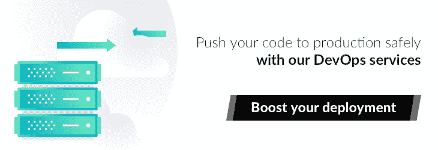
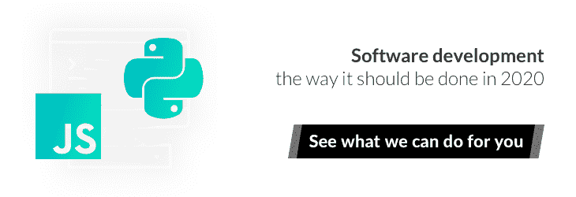

# 如何提高你的软件开发速度——即使是在经济衰退时期

> 原文：<https://www.stxnext.com/blog/increase-software-development-velocity-economic-slowdown/>

 按时并在预算内交付 sprint 任务是软件开发的基石。

在如此不稳定的时期，这种稳定尤为重要，因为稳定意味着可预测性。只有当你的业务条件是可预测的，你才能达到预期的结果。

有助于软件开发稳定性的一个关键因素是速度。但是到底是什么呢？和性能有什么不同？你如何实现高速度？

**继续阅读了解:**

*   **软件开发中速度是什么意思？**
*   如何提高你的团队速度？
*   在经济放缓的时候，如何增加收入？

 

#### 什么是软件开发速度？

首先，在软件开发的环境中，区分速度和性能是很重要的。它们相似，但不相同。

速度主要与每次冲刺可以完成的工作量有关，而性能则侧重于更快、更有效地完成所述工作。

然而，团队速度决定着你的产品的成败。

高性能往往对高速度有很大贡献，但并不能保证高速度。如果你有太多的任务要在一个 sprint 中交付，但你最终还是交付了，你的质量可能会受到影响，因为你必须更快地完成它们。

**速度就是在不牺牲质量的情况下提供价值——良好的计划和交付。** 如果速度伴随着更低的质量，真的值得吗？不，不是的。

这就是为什么在本文中，我们将关注速度而不是性能；质量高于速度。

#### 提高软件开发团队速度的 7 个最佳实践

##### 1.使用可重复的流程

速度不是在真空中产生的。这是你需要事先准备好的许多因素的结果。对于可重复的过程来说尤其如此。

没有坚如磐石、久经考验的现成解决方案，你将无法建立一个高速开发团队。

仅举几个例子，这种做法包括:

*   员工入职和离职，
*   知识转移，
*   责任交接。

开发人员流动是当今 IT 市场上企业面临的最大挑战之一。在一个新雇佣的工程师成为你团队中不可或缺的一部分，并对你正在做的工作有一个好的感觉之前，你可能会失去太多的时间来满足你的最后期限——而且你永远不知道下一个人什么时候会离开。

**提前准备成文的流程是减少轮岗时间的一个好方法。** 尽可能多的拥有它们，尽可能的使用它们。下面是几个例子:

*   分阶段更换开发人员，给自己充足的时间进行知识转移；
*   关注产品文档；
*   录制您的产品演示和培训课程，
*   不要忽视单元测试，因为这是记录你的项目的最好方法；
*   使用 Docker 或 containers 自动化您的部署，以避免在环境设置上浪费时间，因为现有的开发人员仍在项目中，他们的知识可以用在其他方面。

##### 2.建立一个平衡的团队

平衡的团队组成是提高软件开发速度的重要一步。没有平衡，你的生产力就会受到影响。

如果你的团队过于“强大”——也就是说，如果你的团队中有太多的高级开发人员——你最终会无休止地争论谁的方法是正确的，解决方案对于简单的问题来说过于复杂。

相反，一个由初级开发人员组成的太“弱”的团队，不会完成很多工作，因为他们缺乏必要的技能来解决许多不可避免的问题。

此外，让普通开发人员加入你的团队也不是一个好方法，因为他们可能不具备克服一些需要资深经验的挑战的能力。

那么，最佳的团队构成是什么？ **如果你的目标是团队中有六名开发人员，我们建议挑选两名资深人员、两名普通人员和两名初级人员。**

不管你项目的确切性质如何，你的 sprints 将包括不同难度的各种任务——所有这些任务都需要完成。有些对高年级学生来说太容易了，但对低年级学生来说却是完美的；其他的会非常复杂，只有高年级学生才能处理。

**一个混合的团队让所有成员都投入到工作中，并给他们平等的成长机会。**这种做法被低估的副作用是，它会让你的离职率保持在较低水平。

分布式团队构成也给了高年级学生一个机会，与低年级学生分享他们的专业知识，并教给他们新的东西。这有助于老年人练习和保持他们的技能，同时也比简单地完成任务给他们更深的满足感。在这个过程中，整个团队的士气都提高了。当你的团队成员可以互相学习时，每个人都会因此受益。

 

##### 3.学习如何给出好的反馈

反馈是提高团队速度的一个很好的工具，但前提是方法正确。给予或接受正面和负面的反馈实际上比看起来要困难得多。

最主要的问题是诚实。 **只有诚实的反馈才有帮助**。隐藏你的真实感受，使用委婉的说法，最糟糕的是对你认为可能会适得其反、伤害你而不是帮助你的事情撒弥天大谎。

错误的反馈往往是一个国家文化的直接后果。我们经常看到这种情况，尤其是在英国的企业中，礼貌是非常重要的。

假设你的团队在一次冲刺中完成了许多任务。他们没有履行自己的承诺，只完成了 60%的任务，并提供了一些蹩脚的理由，甚至没有努力解释自己。

你对此的反应是，“哦，很好，伙计们，还是做得很好，我相信你们下次会做得更好！”当你内心深处对白白浪费时间和金钱感到愤怒时，你真的相信你在帮他们或你自己吗？

**做生意不是为了做好人。做生意就是要得到结果。** 软件开发也不例外。

当然，你不应该反其道而行之，对你的团队成员刻薄或辱骂。但是 **好的反馈并不总是好的反馈。** 你需要诚实地说出你的感受，即使这意味着失望或焦虑。有时候，你需要提醒表现不佳的团队他们的责任，从而让他们振作起来。

一个好的做法是从一开始就坦率地说出你的期望。让你的团队在第一天就了解真实的你:这是我，这是我想看到的，这些是我的价值观，我的职业道德，我如何运作。你知道“胡萝卜加大棒”的方法吗？嗯，两者都是有原因的，而不仅仅是一个或另一个。

**记住，公开反馈本身就是一种挑战。** 这需要情商、努力、同理心。这是一项你需要不断努力的技能，而不是在任务清单上打勾。此外，确保你要求反馈的次数和你给出反馈的次数一样多。这是一条双行道。否则它不起作用。

##### 4.持续集成和部署工作

开发和部署是 *而不是* 将产品推向市场的两个独立阶段。不要对一个关注过多，对另一个关注不够。

这两者需要携手合作，确保你的产品尽快投入生产。如果交付代码需要一个月，部署需要整整一个季度，那么一周的快速开发毫无意义。

如今，向最终用户交付价值是最大的软件开发挑战之一。这就是为什么 [DevOps](https://stxnext.com/services/devops/) 是高速度的关键。持续的集成和部署是你能多快地使用你的团队已经完成的工作的成败因素。

下面是一些好的做法:

*   使用[基于主干的开发](https://stxnext.com/blog/2018/02/28/escape-merge-hell-why-i-prefer-trunk-based-development-over-feature-branching-and-gitflow/)来避免合并地狱，
*   依靠自动化的流程，与人一起不断改进，
*   经常小规模部署，
*   将修复损坏的构建作为您的首要任务，
*   可靠地自动化你的单元测试。

 

##### 5.在你的团队中总是有一个产品负责人

好的产品所有者为你提供真正的商业价值。 [如果你想提高你的速度，在你的开发团队中有一个这样的人是必须的](https://stxnext.com/blog/2018/08/07/why-do-you-need-product-owner-5-ways-improve-your-software-development-project/)——即使是以牺牲你的一个开发人员为代价。

最重要的是，产品负责人是软件开发的两条最重要规则的守护者:

1.  好就够了。完成比完美更好。
2.  如果你走错了方向，你走得多快都没用。

正如我们之前所说，速度与速度无关。这不是在一次冲刺中完成尽可能多的任务。相反，它是关于专注于做那些真正需要完成的任务。

一个专门的产品负责人负责处理积压的工作，确保期望是明确的，并作为你和你的团队之间的单一联系点。 每次冲刺后，你会学到什么有用，什么没用，在这个过程中节省时间和金钱。

[产品负责人的工作是高速度的关键](https://stxnext.com/blog/2018/08/02/product-owner-responsibilities-path-junior-expert/)，即使是一次计划不周的冲刺也会导致挫折。你的产品负责人将筛选优先级，按照重要性的顺序分配任务，并现实地计划应该做什么和可以做什么。

##### 6.尝试发现方法

如果你只是处于软件开发旅程的开始，在深入到整个产品的端到端开发之前，考虑建立一个 MVP。

在我多年管理服务交付的过程中，我发现 **终端用户通常只使用任何产品的 20%左右。** 计划你的工作量是有意义的，这样你就可以先发展那 20%的工作量。

有了熟练的产品负责人协调的正确路线图，再加上勤奋的业务分析， **您将通过对 20%的产品完成 100%的工作来显著缩短上市时间。** 但故事还没结束。

建立 MVP 的一个重要好处是，你可以完善你的产品愿景，并验证你的产品的市场潜力。您还可以准确地估计开发成本，并指定您的核心目标受众。

为了实现这些目标以及更多目标，我强烈建议参加[探索研讨会](https://stxnext.com/blog/2019/07/25/software-product-discovery-workshops/)。

探索方法将帮助您了解未来的挑战，构建稳健的路线图，并定义 MVP 以获得最佳结果。

一旦你越过 MVP 并开始全面开发你的项目，定期的发现会议跟进也是一个明智的做法，这样你就可以将你的产品性能与你的业务预期进行比较和对比。为了确保你在正确的轨道上， **每季度重复一次会议是一个很好的基准。**

##### 7.限制依赖性

过多的依赖总是对你的软件开发速度有负面影响。

如今，大型企业经常与来自多个国家的多个团队合作，每个团队开发他们产品的一个独立部分。虽然这本身不一定会造成问题，但是缺点是这些团队通常相互依赖来交付他们的承诺，有时一个冲刺接一个冲刺。 **当一个团队落后于计划时，其他团队会很快跟上，从而减缓整个开发进度。**

再次强调，如果时间对你来说不重要，这不一定是一个决定性因素。但有多少公司能诚实地负担得起这种奢侈？最多几个。

任务分布在世界各地，可能无法按期部署。 **避免这种延迟的最好方法是限制任务依赖的数量。**

即使我们自己是一家软件公司，我们也不会假装不知道供应商经常会导致依赖性。如果你能在公司内部不断接触到同样的人才，这可能对你更有好处。

但是如果你选择了一个可靠的软件公司，他们会竭尽全力让你的项目继续进行，因为你的成功就是他们的成功。

 

#### 如何在经济衰退时期提高软件开发速度？

当然，如果我们不考虑全球经济目前所处的严峻金融形势，那将是我们的失职。我们可能正处于本世纪最大的危机之中，但你还有软件要开发，不是吗？

因此，这个百万美元的问题是: **如果你的钱快用完了，你最应该关注什么？** 毕竟，优化你的预算并不意味着自动优化你的速度——或者至少不需要这样做。

这是我推荐的:

##### **1。确保你的团队中的关键成员，具备从事核心业务的必要能力，感到安全并受到照顾。**

如果他们现在换工作，会伤害到你。很糟糕。

##### **2。[让一位经验丰富的产品负责人领导团队。](/blog/product-management-culture/)如果你的团队中还没有这样的人，那就赶紧雇佣他们。**

这一点怎么强调都不为过，尤其是现在，当你的发展朝着正确的方向前进是必须的。也有可能一个商业支点摆在你面前，在这种情况下，你会失去一个 PO。

##### **3。管理好你的钱，就像你的整个未来都依赖于它一样——因为它可能。**

在一段时间内，你的预算会少得多。暂停所有不必要的投资。尽可能多地榨取你所拥有的。只关注优先事项。放弃所有美好的事物。

##### **4。每天做市场调查，尽可能提前计划。**

按照事情的发展方式，没有人知道一个月后世界会变成什么样子。做最坏的打算。在你的计划中始终使用情景语境。明确知道你想要建立什么，并专注于此。

##### **5。不要忽视当前危机之前你在做什么。**

还记得我们说过的给予和获得反馈吗？通常，你会在办公室面对面地做。你可能现在不能亲自见到你的开发者，但是这并不意味着反馈应该停止。用你以前提供价值的方式提供价值，即使你不得不依赖替代品。每一个手势都很重要，不管多小。别忘了我们都在一起。

#### 最后的想法

我想提的最后一件事是 **你不能改进你没有衡量的东西。** 处理硬数据，使用特定的标准来评估你的团队今天的表现。然后将结果与你希望他们将来如何做进行比较。

一旦你这样做了，你就会对你当前的软件开发速度有一个完整的了解——以及你应该做些什么来提高它。看完这篇文章，你也应该知道如何着手了。

如果您愿意，我们可以通过[举办探索研讨会](https://stxnext.com/blog/2019/07/25/software-product-discovery-workshops/)或[快速可靠地向您的团队添加新成员](https://stxnext.com/services/python-development/)来帮助您。如果您需要的话，我们甚至可以[为您打造整个产品](https://stxnext.com/services/)。

[让我们了解一下](https://stxnext.com/contact-us/)！

