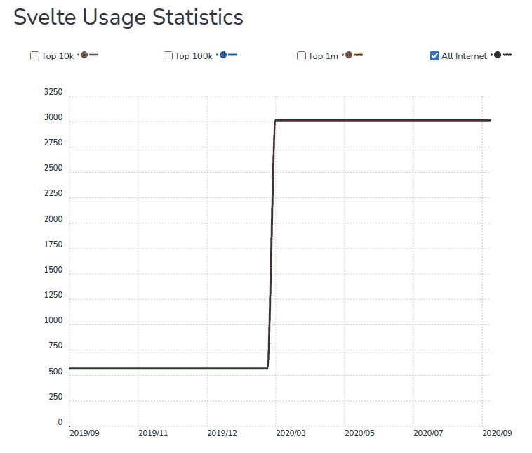

# JavaScript Web 框架经理指南

> 原文：<https://www.stxnext.com/blog/managers-guide-javascript-web-frameworks/>

 如果没有框架， [web 开发项目](https://www.stxnext.com/services/web-development/) 将会花费更多的时间。问问任何一个 [JavaScript 开发者](/services/javascript-development/)他们是否愿意用纯 JS 编写每个项目，而不使用任何框架。只有 JS 的神秘大师可能会同意，尽管他们可能仍然更喜欢框架。

使用纯 JS 从头开始构建一切是不可行的。框架是标准，但是当你从开发团队之外的角度来看它们时，它们可能会很混乱。

这就是为什么我们写这个指南来告诉你关于 JavaScript web 框架你需要知道的一切。又不是给开发者做技术对比。这是为经理和 CTO 准备的，侧重于选择特定框架的业务影响。

在你读完这篇文章后，你会确切地知道哪些框架适合你的项目，以及如何选择使用哪些框架。 

#### TL；灾难恢复摘要

如果您时间紧迫，以下是本文中最重要的几点:

*   React、Vue 和 Angular 是 JavaScript 框架的三巨头。Svelte 是一个正在迅速流行的框架。Node.js 不是一个框架。
*   适合您项目的框架通常是您的团队最满意的，因为框架通常提供相同的功能，但方式不同。
*   您可能希望确保您选择的框架在原则上与您正在使用的后端技术相似(如果它是 Java 之类的严格语言，请使用 Angular 之类的高度固执己见的框架，等等)。
*   框架的大小和性能也很重要。Angular 通常用于大型项目，LitElement 和 Preact 非常适合小型或超快的项目，react 或 Vue 非常适合介于两者之间的项目。
*   框架有不同的包，它们越复杂(Angular 是最复杂和功能最丰富的)，你的团队就越难学习它。
*   在一个成熟的项目中切换框架几乎是不可能的。有很多方法可以做到这一点，但是一般来说，通过从一开始就选择正确的框架，就可以避免这个问题。
*   与用普通 JS 构建相比，使用框架可以更容易地避免安全问题。

#### 流行度和可用性排名靠前的 JavaScript web 框架

三大 JS 框架是:React、Vue 和 Angular。

如果您想知道为您的项目选择哪一个框架，这将在本文的下一节中讨论:“如何做出关于 JS 框架的正确决策”

本节是 JS 框架生态系统的概述。

##### 反应(和反应自然)

由脸书和一个大型开源社区创建和维护的, [React](https://reactjs.org/) 于 2013 年首次发布，此后成为世界上许多顶级应用程序不可或缺的工具。 [React Native](https://www.stxnext.com/services/react-native-development/) 于 2015 年发布，它是一个简化构建移动应用程序界面的框架。

React 本身不是一个框架，它是一个库。框架为你做了很多技术上的决定，而库本质上是给你积木，把决定留给你。

但是开发者像使用框架一样使用 React。使用 React 作为基础，程序员通过添加他们需要的不同功能的包，将它变成一个框架。他们正在构建自己的基于 React 的框架。

因为 React 不会为你做很多决定，你需要自己做那些决定。React 不强加规则，这可能是优点，也可能是缺点。没有主要的约定，所以 React 项目可以彼此完全不同。

##### 使用最流行的 React 框架:Next.js 快速启动 React 项目

如果你不想选择自定义包，像 [Next.js](https://nextjs.org/) 这样的 React 的现成框架，为你解决了这个问题。Next.js 提供了 React 没有的所有东西，比如服务器端渲染和路由。它使 React 项目能够更快地启动，但也可能是限制性的，因为它强加了某些技术选择。

(顺便说一下，Next.js 和 STX Next 之间没有关系。尽管我们已经用它为我们的一些客户构建了软件产品。)

如果您希望最大化可定制性，不介意使用大量第三方包，并且希望从代码可重用性中受益，请在您的项目中使用 React。如果没有时间自己选择额外的包，就添加 Next.js。

##### view . js-检视. js

于 2014 年首次发布， [Vue.js](https://vuejs.org/) 是一个开源框架，由一位前谷歌开发人员创建，他希望建立一个更轻便的 Angular 替代方案。

Vue 与 React 非常相似，但它提供了更多开箱即用的功能。它比 React 更固执己见，为你做更多的决定。这使得启动更快，但使它的可定制性稍差。

##### 使用最流行的 Vue.js 框架:Nuxt.js 加速你的项目

像 React 一样，开发人员可以添加 [Nuxt.js](https://nuxtjs.org/) 框架作为一个完整的工具集来快速启动项目，或者选择他们自己的包来围绕 Vue 构建。

对于更简单的项目，开发者可以直接使用 Vue。这与 React with Next 非常相似，因为当您需要服务器端渲染时，或者您的项目比纯 Vue 处理的复杂一些时，Nuxt.js 就变得很有必要。

如果你想快速开始，你的应用程序不是一个复杂的庞然大物，并且你想要一个经过测试的解决方案来加快开发时间，那么在你的项目中使用 Vue.js。

##### 有角的

有两个角。两者都是谷歌创建的开源框架。

首先是“老”，2010 年首次上映。它仍然被维护只是因为有大量的项目没有切换到另一个框架(在成熟的项目中切换框架通常是不可能的，正如您将在本文后面看到的)。

第二个是“新”，有时简称为 Angular 2+，2016 年首次发布。这是对旧的 AngularJS 的完全改写。

棱角分明是绝对的野兽。它拥有构建前端所需的一切，并且让开发人员几乎没有什么决策可做。他们只需要学习如何以有棱角的方式建造东西。这是最固执己见的框架，对一切都有非常清晰的规则。

使用 Angular 构建大型应用程序是最简单的，主要是因为它很容易在不同团队构建的应用程序之间划清界限，并避免妨碍彼此。Angular 项目被很好地划分和组织。

所有三大框架都适合复杂的企业解决方案，Angular 是最受欢迎的选择。它很重，所以它需要大量的优化和熟练的工艺才能使界面快速。但它提供了开发人员构建网络和移动前端所需的一切。

在你的项目中使用 Angular 如果你的开发人员已经知道它，你希望在你的前端尽量减少第三方包的使用，你希望你的项目被整齐地分成几个不同的部分。

##### 冉冉升起的竞争者——苗条的

2016 年发布了 Svelte ，这是第一个不受任何科技巨头影响的流行框架。它现在是第三版，自 2020 年初以来一直在经历受欢迎程度的飙升。

*资料来源:https://trends.builtwith.com/framework/Svelte*

Svelte 是一种新的框架方法，因为它是一个编译器，这使它成为一个没有框架的框架。这是什么意思？如果 React、Vue 和 Angular 让浏览器(本质上是指用户的计算机或移动设备)工作来生成你所看到的界面，那么 Svelte 在浏览器之前就完成了所有的魔法。

由于这种新颖的方法，Svelte 非常轻，有助于快速应用。

如果你非常关心速度，并且不怕使用不到 5 年的革命性技术，那么在你的项目中使用 Svelte。

##### 荣誉奖:文学、行为和其他

没有必要详细介绍每一个 JavaScript 框架，但是除了三大框架和 Svelte 框架之外，仍然值得一提一些流行的框架。这里有几个你可能听说过的 JS 框架的快速分类。

*   [LitElement](https://lit-element.polymer-project.org/) 是一个非常轻、非常快、非常小的框架。
*   [Preact](https://preactjs.com/) 有点像 LitElement，但是基于 react，去掉了很多很少使用的 React 特性。
*   [Backbone.js](https://backbonejs.org/) 、 [流星](https://www.meteor.com/) 和 [Ember](https://emberjs.com/) 是一些开发者喜欢的不太流行的框架，但它们并不是主流，正在慢慢消亡。
*   jQuery 是第一个主要的 JS 库，现在是更早时代的遗迹。在所有浏览器处理 JavaScript 的方式变得统一之前，jQuery 是开发人员用来编写在不同浏览器中工作的 JS 代码的工具。

##### 为什么 Node.js 不是一个框架

Node.js 经常被列在 js 框架中，这是一个简单的错误。Node.js 是一个运行时环境。

在 Node.js 之前，开发人员不能使用 JavaScript 来构建他们应用程序的后端。但是 Node 存在于服务器上，使得开发人员可以使用 JavaScript 从后端到前端对应用程序的整个堆栈进行编程。

React 的 Next.js，Vue 的 Nuxt.js，Angular 的 Angular Universal 用于从服务器端启动前端。可能正是由于这种功能，一些人将节点与框架组合在一起。但它们不像 Node 它们只是节点(或另一种服务器端技术，如 [、Python](https://www.stxnext.com/services/python-development/) )和前端之间的桥梁。

(如果你想知道什么时候在后端使用 Node.js 更好，什么时候应该使用 Python， [我们为你准备了完整的 Python 与 Node.js 对比指南](https://www.stxnext.com/blog/python-vs-nodejs-comparison/) ！)

所以，虽然 Node 很受欢迎，被广泛使用，并且基于 JavaScript，但是你不能直接把它和前端框架相提并论。

如果您有一个 JavaScript 专家团队，并且您需要一个快速、灵活的后端，请在您的项目中使用 Node.js。

##### 为什么不用香草 JS 呢？

之所以创建新的主要框架，是因为很难决定何时呈现哪个 HTML，以及将什么数据放入该 HTML 以及如何做。使用普通的 JS，你需要自己设计所有这些。

框架使这些决策变得更加容易。但是 JS 生态系统在不断变化，JS 也越来越强大。我们有 Web 组件，或者像 Svelte 这样的框架，它们是普通 JS 的小补充，它们开始做框架做的事情。

普通 JavaScript 出现在主流框架上，并增加了主流框架的特性。这是一种军备竞赛。

在未来，开发人员可能只能使用纯 JavaScript 或带有极少框架的 JavaScript。目前，框架对于按时交付复杂的项目并使开发人员的生活变得更容易是必要的。

哦，不要被宣传香草 JS 作为框架的[【VanillaJS.com】](http://vanilla-js.com/)网站所迷惑。只是纯 JavaScript。

#### 如何做出关于 JS 框架的正确决策

好了，以上是关于每个最流行的 JavaScript 框架的大量信息。但是在一天结束的时候，你必须和你的开发团队讨论选择一个适合你的项目的。

为了帮助您做出正确的技术决策，这里有一些在您选择框架之前需要考虑的最重要的事情。

##### 你的项目应该选择哪个 JS 框架？

##### 1.选择你的团队知道并且熟悉的框架

选择框架的第一个关键方面是开发者的偏好。在很多情况下，无论你的开发人员最喜欢或者最了解哪个框架，都是最适合你的项目的。

看看三大品牌——React、Vue 和 Angular——它们在很大程度上是可以互换的。它们将满足您所有的前端需求，或大或小，简单或复杂，但它们需要稍微不同的设计和开发方法。

除了这三大框架之外，还有针对特定用例的多种框架，比如针对需要在低端设备上运行的微小应用的 LitElement 或 Svelte。您仍然可以全面使用这些框架，但是小尺寸、高速度的情况是它们产生最大价值的地方。

请记住，如果项目需要一个特定的框架，但是您的团队中还没有人使用它，这并不意味着您应该立即选择另一个框架。

例如，如果您没有很短的截止日期，并且您的分析显示某个特定的框架将会工作得最好，那么高级开发人员应该能够在合理的时间内学会该框架。

但是在另一种情况下，如果你有 5 个从未使用过 Angular 的高级 JS 开发人员，这是避免 Angular 的有效理由，因为它是一个庞大的框架，需要很长时间才能掌握。

和往常一样，正确的决定取决于了解你独特的背景并做出恰当的决定。

##### 2.选择与您的后端最兼容的框架

假设你的后端团队正在用 Java 工作。它是一种严格的强类型编程语言，对于如何编写代码有非常清晰的规则。

Angular 有一个非常相似的方法，对于如何使用它有明确的规则。因此，如果你的后端开发人员使用 Java，Angular 可能非常适合你的前端。

如果你的后端开发者也在做你的前端，这一点尤其重要。但是，即使你们有不同的团队，以这种方式将技术配对会使合作变得更容易。这意味着你的两个团队将拥有相似的编程理念，从而最小化沟通错误的风险。

##### 3.选择具有合适规模和性能的框架

框架通常是笨重的工具，重量转化为性能。在本文的所有框架中，Angular 是最重的。React 更小，Vue 甚至更小，然后你有像 LitElement 这样的超级小框架。

总的原则是，在不增加很多不必要的重量的情况下，使用满足您需求的尽可能最小的框架。

在某些情况下，你可能根本不需要框架，只需要使用普通的 JS 来构建简单的功能。或者你可以使用一个非常小的框架，像 LitElement，它是对 vanilla JS 的一个小小的补充，使你能够做类似的事情来反应或角度。

如果你正在创建一个(PWA，本质上是一个移动应用)，越轻越快越好。再说一次，LitElement 会很好，或者 Preact，它是一个反应克隆，去掉了很多东西，所以它更快，但功能更少。

注意，在大多数情况下，如果你的应用相当复杂，仅仅使用普通的 JS 很难提升性能。你的团队将不得不花更多的时间来设计和解决问题。在今天的 JS 生态系统中，除了非常简单的 web 应用程序之外，你最好对所有东西都使用一个框架。

##### 4.选择适当复杂程度的框架

假设您正在构建一个 web 应用程序，它将有数千个子页面，这些子页面包含各种内容、功能和逻辑。不同的子页面会有表单、游戏、博客、视频、商店功能等等。

在这里，Angular 可能是一个不错的选择，因为它是为处理复杂的前端而构建的。然后，你可以使用 React、Vue 或 Svelte，并获得类似的结果；开发过程会有一点不同。

如果你所需要的只是构建一个简单的概念验证应用程序，只是为了看看你的想法是否可行，那该怎么办？React 以构建 MVP 而闻名。

如果你正在建立一个非常简单的网站——一个没有动态元素和非常基本的交互的基本在线名片——那么它甚至不需要很多工作。你可以用少量的 JS 将 HTML 从后端移到浏览器。

##### 如果你的团队不知道一个框架，要多久才能学会？

很难给出明确的答案，因为要看情况。如果你有一个不懂框架的初级 JS 开发人员，与高级 JS 开发人员相比，他们需要更多的时间来学习。

学习框架的基础并不困难。如果一个高级开发人员了解框架的构造、正确的设置和工具选择，那么使用框架应该相对容易。做基本的事情，需要一天时间。对于更复杂的用法，应该需要一到两周的时间。

至少对于 React、Vue 或 Svelte 来说是这样。当谈到 Angular 时，在一个开发人员能够熟练地编码之前，有更多的东西需要学习；它有最高的入口。即使是高级开发人员也需要至少一个月的培训。

但还是那句话，很难说。这取决于每个开发人员的个人经验和学习新工具的能力，以及框架的大小。

##### 框架和技术债务

所有的软件都有安全问题，所以你需要更新。如今，有一些很酷的工具可以检测你正在使用的工具是否存在安全问题。您会立即得到通知，并知道哪些内容需要更新。

升级通常很容易，只要一切都是最新的。使用 React，升级到新版本没有任何问题。有了 Vue，从版本 2 升级到版本 3 有点困难，因为有太多的东西发生了变化。有棱角的，看情况。一些版本很容易升级，而另一些版本——有大量的升级代码——需要大量的时间和精力。但是每一个新版本都引入了一些使未来升级更容易的东西。

例如，如果你在 Angular 4，想更新到 9，你已经错过了中间的 5 个版本。这将是一个大问题。这就是为什么保持一切更新是很重要的。

React 有一个警告。虽然升级 React 本身很容易，但您还必须升级所有其他添加到 React 构建中的包，这可能会增加过程的难度。对于其他框架和您添加到其中的额外包也是如此。

为了避免技术债务，请确保您的开发人员使用最新版本的工具、库和框架，并保持更新。有时，有正当的理由不这样做，但它经常发生，因为它很容易忘记。

##### 切换到不同的 JS 框架有多容易？

很复杂。如果你在框架 A 中有一个成熟的项目，你想把它改成框架 B，你基本上需要从头重写一切。转换框架非常困难。

但是开发人员已经提出了不同的想法。例如，您可以运行两个不同的应用程序——一个在框架 A 中，另一个在框架 B 中——然后慢慢地将所有功能重写到框架 B 中。这使性能变差，但这是可行的。

还有一个概念叫做微前端。它使开发人员能够在一个应用程序中有效地使用几个框架。但这也需要特殊的策略和独特的实施过程。要使它可行，需要做大量的工作。

##### 纯 JS 不是更适合一个 MVP 吗？

简答？号码

在某种程度上，用普通 JS 和框架编码的方式是相互排斥的。框架强加了一种不同类型的编码。如果你用其中的一个来建立一个 MVP，很可能你必须用同样的方式来发展它。

使用框架构建原型更容易。如果框架显示出作为一个可行的业务的前景，那么它也会使你的 MVP 更容易增长。

但它必须是正确的框架。像 Angular 这样笨重且固执己见的框架通常不是 MVP 的好选择。

##### 哪个框架最安全？

这是一个有争议的问题。这完全取决于你的开发人员的经验。所有三大框架都让你很难把事情搞砸。开发人员不得不不厌其烦地添加明显的安全缺陷。

所有主要的框架都会经历成长的烦恼，但是它们很快就会达到非常安全的程度。它们都有开源开发者的全球社区，尽可能地完善每一部分，使之稳定和安全。

最容易出错和最危险的方法是使用普通的 JS。当然，你会发现许多开发者并不这么认为。但是在一个有着紧张的期限和初级/中级开发人员的商业环境中，他们在一个框架中犯错误会更加困难。

#### 最后的想法

感谢您的阅读！希望您对 JavaScript 丰富的生态系统有了新的了解。

如今框架无处不在，所以明智地使用它们很重要。确保您选择了您的团队了解并喜欢的框架。如果你需要一个你的团队不知道的框架，他们应该能学会，但是会拖慢开发。

只有当你的项目足够复杂，确实需要的时候，才使用较重的框架。否则，您会不必要地牺牲性能。

通过使用最新版本的框架来避免技术债务，并确保它们在项目的整个生命周期中定期更新。

框架证明了协作是软件开发的驱动力。它们是聪明的开发人员、行业领先的公司和全球开源工程师社区共同努力的结果，他们都有一个共同的目标，那就是创造更好的软件。

如果您想了解更多关于框架的知识，请查阅以下文章:

*   [React vs . Angular:JavaScript 库和 TypeScript 框架的比较](https://www.stxnext.com/blog/react-vs-angular-comparison/)
*   [为什么要为你的手机 App 使用 React Native？](https://www.stxnext.com/blog/why-use-react-native-your-mobile-app/)
*   [Python Web 框架入门](https://www.stxnext.com/blog/beginners-introduction-python-frameworks/)

附注:如果您需要帮助为您的产品选择合适的框架和构建您的应用， [联系我们，我们总是渴望承担新项目](https://www.stxnext.com/hire-us) 。