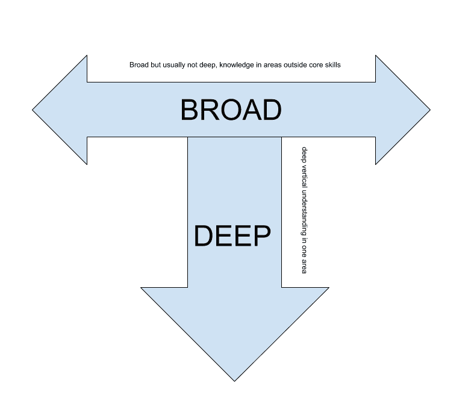

# 管理软件开发人员:改进过程和提高团队生产力的 9 个步骤

> 原文：<https://www.stxnext.com/blog/managing-software-developers/>

 所以你已经经历了 [**的努力，为你的项目雇佣了一个软件开发团队**](https://www.stxnext.com/ebooks/ultimate-guide-hiring-software-engineers/) 。现在是管理他们工作的时候了。

你如何充分利用他们的技能？作为软件开发人员的管理者，如何省钱省力？

我们建议特别关注能产生最佳效果的 4 个领域。 

#### 改进流程的 4 个步骤

##### 1.在迭代中开发(如果你还没有)

让我们先把显而易见的事情解决掉。下面是软件开发过程过去的样子:

1.  你建立你的需求，也就是说，一旦你的软件完成了，它应该能够做什么。
2.  **你** [**设计**](https://stxnext.com/services/product-design/) **软件并编写代码。**
3.  你测试代码并部署软件。

在传统的瀑布方法下，对于复杂的项目，上述过程可能需要一年或更长时间。这个计划在纸面上看起来不错，但实际上还有一个秘密的最后一步:

你希望你在过程开始时想到的软件在结束时仍然有用和相关。

数月工作后发布无关软件的风险是您选择敏捷、迭代开发方法更好的原因之一。

我们并不是告诉你立即切换到像 Scrum 这样的框架，并采用它所有的仪式和礼节，尽管我们自己已经成功地实现了这样的实践。如果你有兴趣，可以看看我们的 [**Scrum 简介**](https://www.stxnext.com/blog/introduction-scrum-development/) 。(如果你持怀疑态度，下面是我们对常见的 [**Scrum 批评**](https://www.stxnext.com/blog/common-misconceptions-about-scrum-framework/) 的回应。)

所以 Scrum 可能适合你，也可能不适合你。但是至少你应该考虑最小化开发不必要的功能和创造一个完全不符合市场预期的产品的风险。

在 1-2 周的冲刺中解决发展问题可以让你避免这种风险。它还有助于指导工作优先考虑最重要的功能。当您定期对新特性进行分析并提供反馈时，您可以确保开发保持在正确的轨道上并符合您的期望。

此外，它还能帮助你在市场和环境发生变化时迎头应对。这样，您可以适应项目范围的变化和外部条件的变化。

##### 2.考虑如何管理代码的质量

让我们继续讨论成功软件开发过程的其他特征。

你可以从问自己开始:**你如何管理你的代码的质量？**

将预算的很大一部分用于质量保证似乎是一个昂贵的提议。使用人工测试人员会产生额外的成本，而自动化测试人员的成本甚至会更高。你甚至可能认为减少测试时间会给你更多的资源来开发更多的代码。

但是发送充满 bug 的软件的成本更高。失去客户信任的代价要大得多。

这就是为什么从一开始就为测试留出空间是值得的。对于自动化测试来说尤其如此，自动化测试可以帮助您监控软件的小片段，并确保它们在您扩展时仍然有效。(关于自动测试优势的详细报道， [**点击这里**](https://www.stxnext.com/blog/how-can-your-software-benefit-automated-testing/) 。)

工作并没有就此结束。我们的经验告诉我们，为了获得最好的结果，你还应该让你的开发人员 [**创建单元测试**](https://www.stxnext.com/blog/measurable-benefits-unit-testing/) 和 [**对彼此的工作进行代码评审**](https://www.stxnext.com/blog/code-review/) 。

我们喜欢遵循“四只眼睛原则”，这意味着每段代码至少应该由两个人来检查。帮助确保代码质量只是这种方法的一个好处。另一个好处是，如果开发人员离开您的公司，您可以确保不会丢失关于代码如何工作以及为什么工作的知识(开发人员的流动率可能非常高)。

为了将您的 QA 提升到最高水平，您还应该考虑增加一个类似于服务交付经理的职位，他监督整个开发过程，确保测试人员和开发人员和谐工作。

##### 3.投资开发人员的技能

软件开发的世界正在快速创新。随着每一次新的技术会议和活动，新的技术和框架被发布或变得突出。

这使得保持开发人员的技能与时俱进变得更加重要。在培训上投资，并不断地推动你的开发人员走出他们的舒适区，以确保他们能够应对未来的挑战。

特别注意处于“维护模式”的开发人员，他们在旧代码中寻找 bug，或者为遗留解决方案提供 DevOps 支持。结果可能是他们的技能停滞不前。

如果说这条建议最适用于一个领域，那就是网络安全。也许您可以使用过时的 web 框架来完成任务，但是过时的安全措施可能会危及您公司的数据和客户的个人数据。

投资开发人员的技能可能会在某种程度上增加您的运营成本，但落后的后果可能更具破坏性。当你做下一个预算决定时，请记住这一点。

##### 4.将工作转化为有效的沟通

你的开发人员的时间是宝贵的，作为他们的经理，你的职责是保护他们的时间，并确保时间得到最好的利用。

确保这一点的方法之一是采取措施促进沟通。如果开发人员和公司其他人之间有更多的理解，没有什么比软件中开发不良(或过度开发)的特性更糟糕的了，这些特性本来是可以避免的。

您可以从引入**快速每日会议**(最多 20 分钟)开始，在此期间，开发人员可以同步他们的工作并报告任何潜在的阻止者。再加上通过 Hangout、Skype 和/或 Slack 进行沟通，发生误解的几率会小得多。

我们发现一个有效的策略是在开发团队和项目中的涉众之间建立一个单点联系。这种实践特别有助于软件公司和他们的客户之间的合作，但它也有助于避免内部开发团队的挫折。

通过单点联系，您总是知道在需要进度更新时向谁询问最新信息。

或者更好的是，**每周举行一次软件新功能的演示**(见**第一点**)，你可以亲自参加来欣赏进展。让演示成为你冲刺过程的一部分，并看到你的沟通得到改善。演示将帮助您及时发现问题，以便在软件到达最终用户之前很好地纠正它们。

##### 摘要

上面的许多建议可以总结如下:**尽早投资于过程、开发人员技能、沟通和软件质量。**您很快就会看到，通过避免常见的陷阱和问题，您将来会节省多少钱。

然而…

有些问题即使对最成功的经理来说也很难解决。例如，如果你已经完成了招聘软件开发人员的工作(也许使用 [**我们的指南**](https://www.stxnext.com/ebooks/ultimate-guide-hiring-software-engineers/) )，你想让他们从事生产性工作。

假设他们帮助你开发并发布了一个很棒的应用——之后你会做什么？让他们中的一些人离开，让其他人进入维护模式？可能几个月后，当你打算开始一个新项目时，你发现自己又缺乏资源，需要再次投资招聘。

以一种灵活的方式，以一种适合你的需求的方式，增加或减少开发资源，是你在管理软件开发中必须解决的首要挑战。如果您可以随心所欲地在团队中增加或减少开发人员，而不需要通过招聘，您的预算不是更容易预测吗？

对于这样的挑战，一个有效的软件经理可能会求助于 [**外包**](https://stxnext.com/software-development-outsourcing-guide/) 作为解决方案。如果你想了解更多，可以从阅读我们的 [**软件开发近岸**](http://bit.ly/nearshoringguide) 指南开始。

#### 高效团队涅槃的 5 个步骤

无论何时你管理一个开发团队，生产力问题都可能发生。

如今，生产率可能是一个被过度使用的词。但最终，我们不都是在寻找结果吗？

如今，数小时的开发工作并不便宜——然而，当你在冲刺阶段询问团队进展时，几乎总是令人失望。

你不知道为什么。你肯定还能做得更多。你错过了最后期限，不得不向你的客户、你的上司或两者解释。

这是一种常见的情况——但这不一定是你的现实。你有可能打电话给你的开发人员，听说一切都按照计划进行。他们可能急切地要求你做更多的工作，或者他们能完成的比你预期的更多。

你怎样才能达到这个高效的团队涅槃？这里有 5 个实践可以帮助你更好地管理你的开发者。

##### 1.定义明确的目标

清晰、具体和透明的目标是每个成功项目的最重要因素。然而，[**10 支队伍中只有 1 支成功执行了他们的目标**](https://www.fastcompany.com/795028/why-are-goals-and-objectives-important) 。**通常团队花更多的时间在如何做事情上，而不是他们为什么要做。**

这通常会导致实现不必要的功能，或者在新发布的版本中导致巨大的重构工作量。这也削弱了团队的积极性和参与度。

富有成效的团队关注“为什么”他们确保每个人都清楚地定义、了解和理解他们的目标。富有成效的团队与他们的产品所有者/利益相关者一起工作，来理解所设想的特性的价值。

##### 行动步骤

*   与团队分享您的愿景，确保所有团队成员理解您在项目背后的“为什么”。
*   使用 [**产品愿景框**](http://www.agile-ux.com/2011/03/04/a-day-in-life-of-an-agileux-practitioner-vision/) 等技巧来设想你的目标。
*   确定你的利益相关者。用你的解决方案 勾选 [**你要解决谁的问题。**](http://www.romanpichler.com/blog/10-tips-agile-personas/)
*   每天支持你的团队，帮助他们根据你的目标验证他们的行动。

##### 2.“T 形”你的团队

在快速变化的技术世界中，专家是无价之宝，建立在坚实的跨职能基础上的团队是每个成功项目的基础。

Sprint 任务可以完美地映射到团队成员的核心技能，这种情况很少见。后端或前端开发人员的任务总是太多或太少，或者在 [**测试自动化**](https://stxnext.com/blog/2017/08/09/how-can-your-software-benefit-automated-testing/) 或手动测试上的工作量有时超过了可用测试人员的数量。

能力瓶颈往往发生在不同的 Sprint 之间，并导致 Sprint 的遗留问题。

解决这个问题的关键是建立具有 T 型技能的团队。T 形是一个抽象概念，用来描述对某个领域(如后端开发或测试自动化等)有深刻理解的人。)还包括其他领域的广泛但通常不深入的知识。

想象一个 [Python 开发者](/services/python-development/)，他擅长使用 Django 框架，但也能做一点前端工作并创建基本的 E2E 自动化测试——这是一个 T 型团队成员。

t 型人对团队的可扩展性有积极的影响，但更重要的是他们可以消除技能瓶颈。

##### 行动步骤

*   当你的团队成员提高了他们的多面性时，奖励他们。
*   鼓励并帮助你的团队在核心技能和舒适区之外工作。
*   给你的团队一份培训预算。

##### 3.停止开始，开始结束

可能表明团队效率低下的最常见症状是**大量工作正在进行中。**

高 WIP 导致冲刺剩菜。通常大约 60%的 Sprint 任务 70%完成，40% 100%完成，这可能会打破一个基本的 Scrum 原则**，即在每次迭代中提供一个潜在的可交付产品(如 [**Scrum 指南**](http://www.scrumguides.org/scrum-guide.html) 中所述)。同时处理多个任务还需要代价高昂的上下文切换。**

 **高效团队意识到多任务的真实成本，并不惜一切代价避免它。无论他们使用什么类型的开发方法，他们都试图限制 WIP。将 WIP 置于控制之下是看板和精益方法的一部分，但是它也可以成功地用在不同的方法中，比如 Scrum。

##### 行动步骤

*   将您正在进行的任务限制在您的**手动测试人员的数量内(WIP 必须等于或少于您的手动测试人员的数量)，或者尝试 [**群集方法**](http://www.innolution.com/resources/glossary/swarming) ，将整个团队应用于一个票证/故事。**
***   想象你的任务板，每天讨论它。*   与团队一起准备“准备就绪的定义”和“完成的定义”****  ****##### 4.与您的团队建立信任

微观管理是创造一群盲目服从经理命令的人的好方法——但它不会帮助你建立一个团队。完全控制摧毁了创造力，并夺走了团队的责任。这也使得这个项目成为一个“独角戏”，几乎没有团队的支持。

优秀的管理者将信任作为项目开发的基本工具。

比起直接管理，他们更重视领导。信任是他们的秘方，它与透明的愿景、跨职能团队和可靠的流程相结合，使他们成为现代发展的第六海豹突击队。

优秀的管理者利用无责备的环境来创造信任的精神。如果出现错误，他们会将错误作为一个机会，共同制定最佳流程解决方案，以备将来使用。

##### 行动步骤

*   关注结果并对结果负责。
*   让你的团队不时地失败，并帮助他们从错误中学习。
*   基于事实而非观点给出诚实的反馈。
*   不要提供解决方案。
*   给他们你的时间，永远支持他们。
*   鼓励你的团队建立他们自己的流程。

##### 5.…并持续改进

开发团队需要前进的动力。否则，它可能会成为一个古老真理的牺牲品，用你以前可能听过的话来说:

***He who moves not forward, goes backward.*****—Johann Wolfgang von Goethe**

幸运的是，现代开发框架有适当的改进过程，比如回顾。

高效的团队使用回顾来持续改进。他们不仅仅将“复古”局限于开发过程；他们还关注产品、流程和改善相关人员的态度。最好的团队理解小变化的力量。

##### 行动步骤

*   遵循改善哲学来解决小的有意义的事情。
*   衡量实施的改变是否改善了你的处境。
*   激励人们推动改进。

##### 摘要

请记住，以上只是我们主观列出的主题。然而，我们确信如果你明智地使用它，它将提高你的团队的生产力。我们也鼓励你自己测试不同的方法和工具。

开发过程更多的是关于人而不是技术。如果有一条经验法则可以遵循的话，那就是:任何改善人们互动的事情都会提高他们的工作效率。

当然，为了更接近软件管理的天堂，还有更多的东西需要学习。这里有几篇我们的文章会有所帮助:

*   [**使用非暴力沟通方式解决团队中的冲突**](https://stxnext.com/blog/2017/08/23/resolve-conflicts-your-teams-using-nonviolent-communication/)
*   [**为什么开放空间的工作场所对开发人员不起作用**](https://stxnext.com/blog/2017/09/13/why-open-space-workplace-doesnt-work-developers/)****