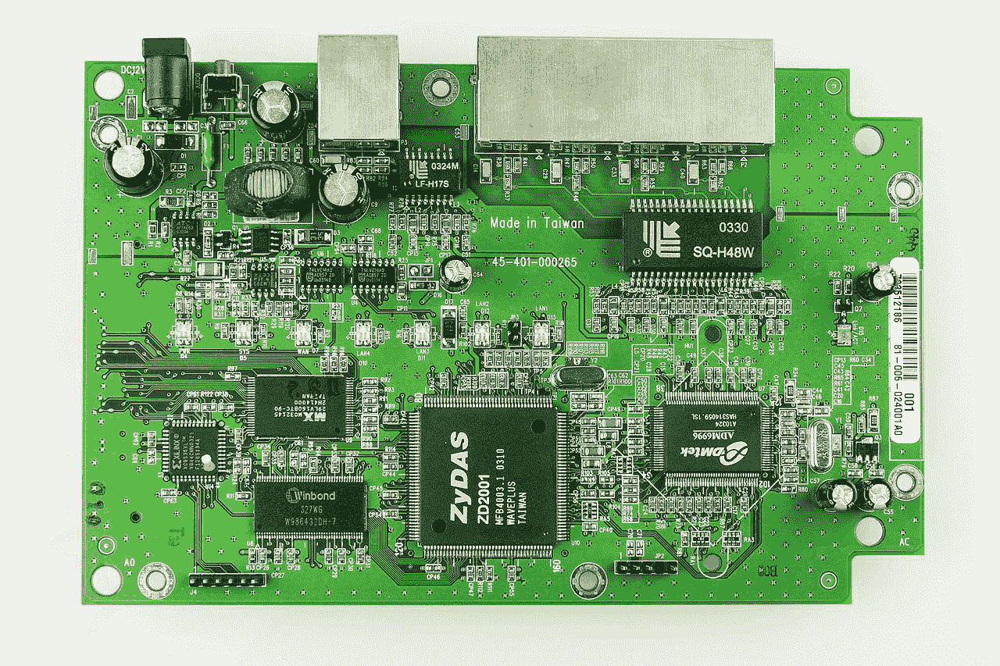

# 单元测试的可测量的好处

> 原文：<https://www.stxnext.com/blog/measurable-benefits-unit-testing/>

 称赞单元测试用法的文章比比皆是。不太受欢迎但仍然容易获得的文章试图让你相信单元测试是浪费时间，至少在某些情况下是这样。

他们中的大部分(或者甚至全部？)试着证明他们的论点是基于感觉，基于作者自己对什么是好的和有效的或坏的和低效的评估。

在这篇文章中，我不会试图证明哪一方是正确的。

相反，  **我将向您展示一种衡量您是否能从单元测试中获益的方法。** 你会学到自己做决定需要考虑的所有因素。 

#### 什么是单元测试？

简单地说，一个单元测试就是 **一个小单元** **的快速测试。**什么是单元取决于开发者。它可以是任何小的、可测试的代码，比如一个方法或一个类。

当然，这只是一个定义。一些开发人员将单元测试定义为“浪费时间”，对此我说:  *不要雇佣他们*。继续前进...

**单元测试是低级别的测试。** 他们强制一小块应用程序执行一些动作，并检查最终结果。这个操作非常简单，结果独立于应用程序的其他部分。单元测试中的失败毫无疑问地表明了代码的哪一部分不起作用。

此外，  **执行单元测试不需要应用程序运行。** 它甚至可以在整个应用程序构建之前完成。

这些是事实。网络上经常引用单元测试的许多其他优点，例如:

*   单元测试会减少软件中的错误；
*   开发人员对部署单元测试覆盖的代码更有信心；
*   遵循测试驱动开发(TDD)过程的程序员声称，单元测试帮助他们更快地实现目标，用更少的代码和更好的代码架构解决问题。

但是这样的论点要么是基于感觉，要么是很难证明的，因此我不会集中讨论它们。

相反，我想关注每个开发过程的一个公共元素，不管有没有单元测试。即:虫子。

bug 总会发生。唯一的区别是开发人员会花多少时间去发现这些错误，多久他会注意到它们。这很容易测量和比较，接下来我将向您展示。

#### 我们能衡量单元测试是否有任何好处吗？

让我们用一个例子来分析有单元测试和没有单元测试的开发是什么样子的。在我们的例子中，我们将构建一辆汽车，而不是一个应用程序。我们将与电子工程师合作，而不是开发人员。

我们从一位电子工程师开始，他被要求为汽车门窗制造一个电子控制器。他收到了他需要的所有文件。过了一段时间，他根据自己的知识和文档构建了一个控制器，现在是时候检查它是否工作了。

他决定将控制器安装在车门上进行测试。 这听起来可能很傻，但这正是开发人员在没有单元测试的情况下测试他们的工作时的样子。

不出所料，车门上的控制器第一次尝试就不工作了。也许在第二次或第三次尝试时甚至不起作用，这取决于具体情况。即使你和专家一起工作，错误也会发生。他们只是人类。

最后，在随后的尝试中，控制器工作了。

我们的工程师在测试上花了多少时间？

让我们看看。安装控制器需要  *安装 _ 时间*分钟。手动测试需要*testing _ time*分钟。他重复这个序列  *n* 次——也许一次，也许两次，也许更多次——直到控制器工作。这给了我们:

*测试时间无单元测试= n *(安装时间+测试时间)*

这个问题还有别的解决方法吗？

是的。工程师可以制造一种特殊的电路板，自动完成所有的测试。 这个板就是他的相当于单元测试。

 造一个板要花他*build _ testing _ board _ time*分钟。然而，用这种板执行测试是如此之快，以至于我们可以假设它是不相关的。总之，公式修改为:

*测试时间与单元测试=构建测试电路板时间*

值得建这个板吗？那得看情况。我一会儿会回答这个问题，但首先我们必须为我们的故事添加一个重要的细节。

我们知道汽车象征着一种软件产品。而且我们知道 IT 项目至少有一个共同点:它们是不断变化的。

所以让我们回到我们的工程师和电子控制器。开始时，工程师被告知控制器应该使用两个窗口。但是在他的工作完成几个星期后，项目发生了一个小变化，现在我们的车将有四个窗户。

听起来很有趣，但通常这就是 IT 项目的工作方式。从客户的角度来看，一个小小的改变从工程师的角度来看可能会产生巨大的影响。

根据新的文档，我们的工程师尽最大努力更新控制器。他把它安装在门上...新功能在第一次尝试时不起作用，第二次也不起作用，以此类推...直到最后它再次工作。

**这里是把最好的和其余的分开的部分。** 一个好的工程师总是会检验他的工作。但是一个顶级工程师会检查他有没有弄坏别的东西。

我们与最好的人合作，因此我们的工程师检查控制器的先前功能是否仍然工作良好。让我们假设其中一些没有，我们的工程师必须做一些修复和更多的测试。

总的来说，他在创建新功能后花了这么多时间进行测试:

*测试时间无单元测试= n *(安装时间+新功能测试时间)+先前功能测试时间*

有了测试板，情况会有什么变化？ 工程师会花*extension _ time*分钟升级测试板。然后他会在这么短的时间内同时测试新老特性，当然是在  *n* 迭代中，因为错误会发生。这给了我们:

*测试时间与单元测试= n *测试时间+延长时间*

但是由于使用测试板时 testing_time 几乎是瞬时的，我们可以假设该值为 0，最终得到:

*testing _ time _ with _ unit _ tests = extension _ time*

现在问问你自己:当我们添加第三个、第四个或第 n 个特性时会发生什么？

没有单元测试，每个新特性都会延长测试时间，因为所有以前的特性都必须手工测试兼容性。 如果你有适当的单元测试，前面的特性几乎可以立即测试出来。

此外，缺乏单元测试使得很难预测最终的测试时间。 开发人员可能会估计他会在构建一个新特性上花费多少时间，但是没有人知道在开发过程中需要多少次迭代来进行测试，或者会产生多少与之前特性的冲突。

另一方面，  **有了单元测试生活就轻松多了。一个工程师可以很容易地说出他们需要多少时间来创建新的单元测试。**

在这种情况下，开发期间的测试时间是无关紧要的。花在修复 bug 上的时间和没有单元测试是一样的。但是我们确实得到了更多的  **可预测性** 以防开发过程中出现 bug，并且减少了花费在人工测试时间上的金钱。

通过单元测试，你还可以  **改进并行工作。** 不需要等到汽车完全组装好再去测试车窗控制器。在汽车制造之前，可以使用测试板对其进行测试。

#### 我需要单元测试吗？

如前一节所示， **创建单元测试:**

1.  **需要一些时间，但是……**
2.  **在开发过程中为您节省测试时间。**

哪一个提供更大的价值——创建单元测试花费的时间和测试节省的时间——取决于您的项目。

有几个因素可以告诉您您的项目需要单元测试:

*   你的项目会及时成长，
*   你的特征很复杂，
*   项目中的错误会让你损失很多钱，
*   可预测的上市时间对您的项目至关重要。

如果你的项目符合以上任何一项，你将从单元测试中受益。 适合的因素越多，单元测试对你的帮助就越大。

#### 但是等等，我已经在使用自动化测试了。他们做同样的事情，对不对？

不完全是。

不同的目标有不同类型的测试:

*   **组件测试** 检查一个整体组件(由几个单元组成)是如何工作的；
*   **集成测试** 检查一个组件如何与其他组件协同工作；
*   **自动化测试** 检查整个应用程序中的关键路径。

严格地说，所有这些都是自动化的。它们都像单元测试一样节省时间:你花时间构建测试来减少手工测试的时间。

那么，当我有单元测试时，为什么还要创建单元测试呢？

答案很简单:覆盖高层次和低层次的测试。

**自动化测试是高级别的测试。** 他们使用可用的接口来迫使应用程序做一些动作，然后他们检查最终的结果。这个动作通常会很复杂。在到达最终状态之前，它可以调用许多小步骤。这些步骤中的每一步都可能失败。

所以每个自动化测试的最终结果取决于许多更小的组件，很难说哪一个失败了。它只说一些场景不工作，或者一些元素与另一个元素不正确地工作。

**单元测试是低级测试。** 他们指出具体是哪个单元和那个单元的哪个部分工作不正常。这些信息使得找到 bug 的来源变得更快更容易。

#### 结论

单元测试有很多优点。我只关注那些容易衡量和比较的东西。我指出了可以告诉你是否会从单元测试中受益的因素。

当然，项目就像参与项目的人一样多种多样，每个项目都需要单独分析。但是如果你把上述价值观记在心里(数值，而不是崇高的情感)，那么你就有了一个可以遵循的指南针。

感谢您花时间阅读本文。如果你有任何我可以回答的问题，请不要犹豫留下你的评论。

对我们的软件测试服务感到好奇？点击此处阅读更多内容。

