# 10 多家领先公司在德国推动创新

> 原文：<https://www.stxnext.com/blog/most-innovative-companies-germany/>

 德国通常在世界上最具创新力的国家名单中排名第一。随着对技术和环保解决方案的大量投资，该国出现了旨在推动进步的公司蓬勃发展的景象。

受他们精神的鼓舞，我们编制了一份 10+创新公司的名单，这些公司要么总部设在德国，要么在那里有重要的存在。

这一选择绝非详尽无遗——令人兴奋的德国企业实在太多，无法一一涵盖。然而，我们希望我们的名单，包括来自开放银行或物流等各种行业的公司，将鼓励你到德国寻找新的想法。 

#### 1.维姆卡尔

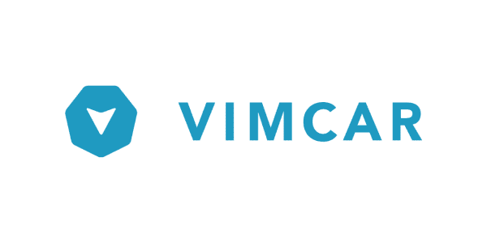

总部位于柏林的 Vimcar 提供了一个易于使用的车队管理平台，可以让客户在任何给定的时间对车队进行 360 度的概览。它允许用户实时跟踪车辆，发现出现的问题，并改善日常运营。

该公司拥有近 200，000 次记录的出行和 100，000 辆监控车辆，知道如何大幅降低车队成本、抑制车辆滥用和提高内部效率。

通过其驾驶风格分析，Vimcar 识别危险的驾驶员行为，以帮助降低事故率和保险成本。

其旗舰产品 Fleet Geo 是一款屡获殊荣的车队跟踪软件，可提供市场上最准确的车队跟踪。

**跟谁保持联系 Vimcar:** [**张秀坤布鲁，CTO**](https://www.linkedin.com/in/dominik-bruhn/) **。**

#### 2.耶欧

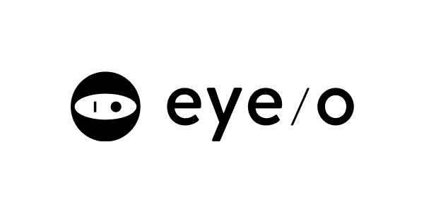

Eyeo 认为，将内容货币化的出版商和控制互联网体验的用户并不相互排斥。

即使用户在开始浏览时就被弹出窗口和闪烁的横幅等不相关的侵扰性广告淹没，他们的利益和广告商的利益之间也可以有一个平衡。

由于其创新技术，eyeo 提供的解决方案提供了有价值的货币化选择，同时始终将用户体验放在心上。

该公司的 Adblock Plus 是一款桌面浏览器插件，通过阻止某些广告同时允许其他广告来改善用户的在线体验。这个免费的开源工具可以禁用跟踪功能，有助于保护数据和设备的安全，并确保更愉快的浏览。

**跟谁保持联系 eyeo:** [**尤塔·霍斯特曼，CTO/首席运营官/董事总经理**](https://www.linkedin.com/in/jhorstmann/) **。**

#### 3.萨斯特里夫

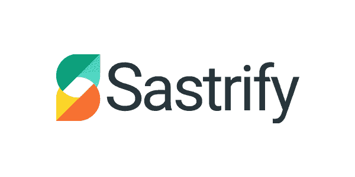

担心你的 SaaS 订阅超支？总部位于科隆的 SaaS 采购服务公司 Sastrify 帮助其用户优化工具的成本和管理。

通过评估实际使用情况并将活动与购买的许可证进行比较，该公司为客户提供了其需求与支出的全面视图。然后，它处理掉未充分利用的许可证，根据他们的偏好推荐新工具，并与供应商协商价格。

平均而言，Sastrify 每月为其客户节省 20 多个小时，并以最少的时间投入使其投资回报率翻倍。

**追随谁与萨斯特里保持联系:** [**马克西米利安·梅辛，联合创始人& CTO**](https://www.linkedin.com/in/maximilianmessing/) **。**

#### 4.ryd

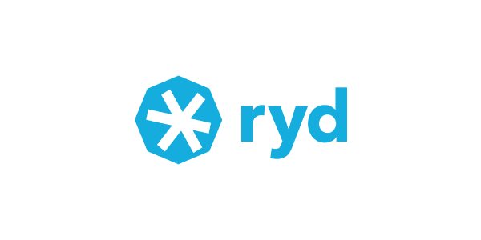

ryd 是一家快速发展的物联网初创公司，专注于司机体验，提供在加油站使用的移动支付平台。

使用该工具，司机可以在加油站支付应用内费用，节省他们的时间并保持社交距离。该应用程序还会向他们显示该地区最便宜的加油站。

作为其多品牌生态系统的一部分，ryd 与万事达卡、安盛和贝宝等公司合作，并不断扩大其加油站、保险提供商和汽车服务店的网络。

该工具目前在德国、奥地利和瑞士可用。该公司目前正计划在欧洲推广。

**跟谁保持联系 ryd:** [**延斯·菲舍尔，CTO**](https://www.linkedin.com/in/jfischer77/) **。**

#### 5.满足的

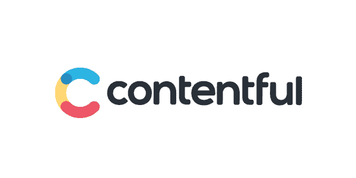

[Contentful](https://www.contentful.com/) 是一个创新且易于使用的内容平台，帮助数字团队以比许多其他 CMS 工具更快的速度汇集内容并提供体验。

Contentful 专为创建全渠道体验而构建，使团队能够轻松地与数百种现代工具集成，跨多个渠道发布，并快速上市。

有了 Contentful，用户就有了一个统一所有内容的中心，可以对其进行调整，以便在任何频道上使用，并在必要时进行扩展。

该平台支持宜家、沃达丰等巨头和 30%的财富 500 强企业向世界提供内容。

**跟谁保持联系** **心满意足:** [**保罗·内格里，联合创始人&CTO**](https://www.linkedin.com/in/panegri/)**。**

#### 6.用户车道

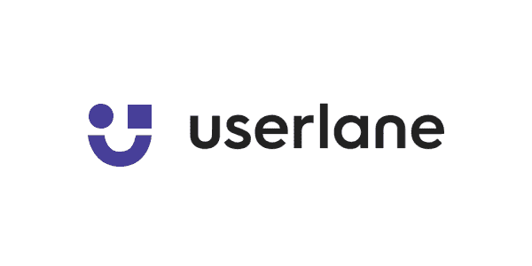

Userlane 帮助公司在用户浏览软件时为他们提供指导和支持，让他们能够让任何软件或流程都易于理解。

通过将正确的信息传递给正确的人，该工具是改善用户体验的好方法。它允许用户按照自己的节奏完成每项任务和流程，并通过其主动、直观的提示和指南提供上下文支持。

因此，该工具减少了支持请求，并且优于传统的培训和支持方法，如手册和视频。

它还可以在任何基于浏览器的应用程序上运行，并遵循严格的安全性和合规性标准。

**追随谁与** **保持联系 user lane:**[**Felix Eichler，CTO &联合创始人**](https://www.linkedin.com/in/felix-eichler/) **。**

#### 7.恩帕尔有限公司

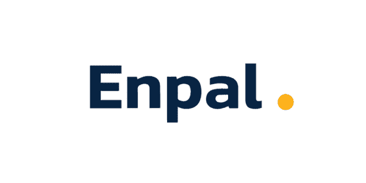

安装太阳能电池板通常被认为是复杂、昂贵和耗时的。认识到这一挑战，Enpal 决定向客户提供租赁太阳能电池板的选择，同时还提供长达 20 年的保险和维护服务。

Enpal 承诺摆脱电力供应商的束缚，降低电费，帮助客户完成从评估到安装的整个过程。

自 2008 年成立以来，该公司已经完成了几千个项目。

**追随谁与 Enpal GmbH 保持联系:** [**马里奥·科尔，创始人**](https://www.linkedin.com/in/mario-kohle-600a8a112/) **。**

#### 8.投

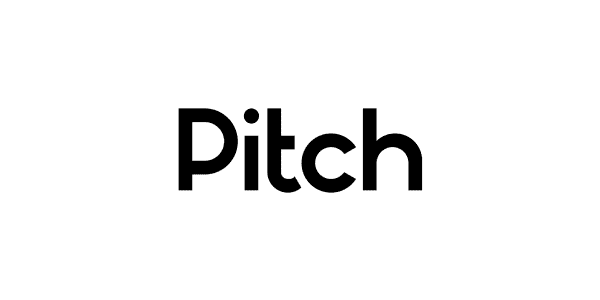

[Pitch](https://pitch.com/) 提供演示软件，允许团队轻松创建和分发现代和令人惊叹的演示文稿。

从宣传资料到项目计划，该平台为用户提供了协作创建文档的空间，同时还能主持实时会议并进行实时编辑。

使用 Pitch 创建的演示文稿可以通过来自 YouTube、Vimeo 和 Loom 的嵌入视频或用户自己的视频来实现。他们还可以整合来自 Google Analytics 和 Google Sheets 等工具的数据。

该平台提供了许多方便的功能，包括直观的编辑选项、智能格式化以及与顶级照片库的集成。虽然它为用户提供了足够的发挥创意的空间，但也防止他们偏离公司认可的品牌风格。

该公司由八名联合创始人团队于 2018 年创立，总部位于柏林。

**追随谁与 Pitch 保持联系:** [**Adam Renklint，联合创始人& CTO**](https://www.linkedin.com/in/adam-renklint/) **。**

#### 9.森德

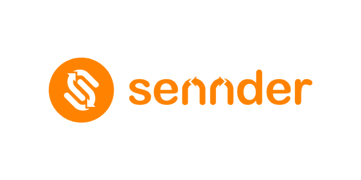

[森德](https://www.sennder.com/)是一家数字化公路货运物流公司。该公司总部位于柏林，在欧洲各地设有办事处，是欧洲大陆领先的货运代理公司，为其托运人提供由数千辆卡车组成的互联车队。

Sennder 在连接托运人和承运人时绕过中间商。因此，他们能够向双方提供有吸引力的条件。

除其他因素外，使 sennder 在竞争中脱颖而出的是其专有技术，该技术有助于通过数字化和自动化推动行业创新，其独特的跟踪解决方案以及其国际生态系统的覆盖范围。

**跟谁保持联系 sender:**[**Greig McEwan，CTO**](https://www.linkedin.com/in/greig-mcewan-03a01448/) **。**

#### 10\. PPRO

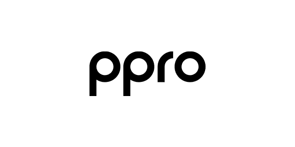

作为本地支付基础设施的提供商， [PPRO](https://www.ppro.com/) 整合了支付方式，因此公司可以专注于其核心业务。

PPRO 的解决方案被花旗、PayPal 和 Worldpay 等巨头用来提高他们在全球电子商务市场的销售额。PPRO 允许他们的客户全球化他们的支付平台，接受替代支付，并因此加速他们的增长。

从柏林到新加坡，该公司拥有 10 个全球办事处，员工超过 430 人。

**追随谁与 PPRO 保持联系:** [**伯尼迈尔斯，CTO**](https://www.linkedin.com/in/berniemiles/) **。**

#### 11.葡萄 DS

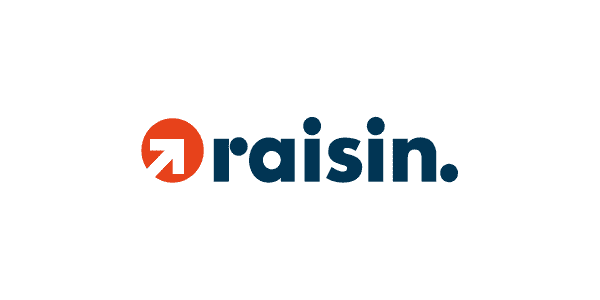

由金融科技公司 Deposit Solutions 和 Raisin 于 2021 年 6 月合并而成的 Raisin DS GmbH 是第一个也是唯一一个面向储户和银行的泛欧洲市场。

他们在 30 多个国家开展业务，为客户提供遍布欧洲大陆的专属储蓄产品。Raisin DS 与 120 家合作银行合作，为 50 多万直接客户提供服务。

Raisin DS 在欧洲和英国经营自己的 B2C 平台，品牌有 Raisin、WeltSparen、Savedo 和 ZINSPILOT。在美国，它被称为 SaveBetter。

**跟谁保持联系葡萄干 DS:** [**德拉戈米尔·普罗达诺夫，CTO**](https://www.linkedin.com/in/dragomir-prodanov-bb897670/) **。**

#### 12.太阳能银行股份公司

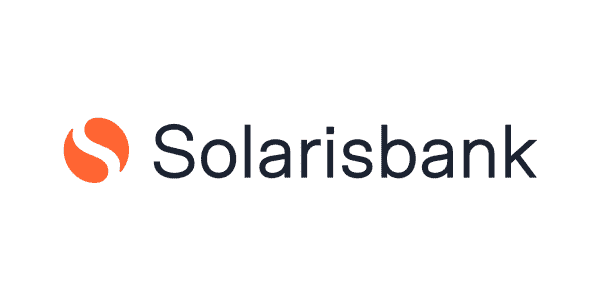

[Solarisbank](https://www.solarisbank.com/en/) 是一家总部位于柏林的金融科技公司，提供银行即服务平台，帮助其客户构建自己的银行产品，具有高度的灵活性和快速的上市时间。

凭借德国银行牌照和简单明了的 API，它允许客户将其完全数字化的银行服务集成到他们的产品中，同时承担监管的复杂性。

通过其现代的 RESTful APIs(可以混合使用以满足特定需求)，Solarisbank 提供了对模块化服务的访问，如支付和电子货币、贷款、数字银行以及由集成的第三方提供商提供的服务。

**跟谁保持联系 Solarisbank AG:** [**伊马曼达利，CTO**](https://www.linkedin.com/in/hima-mandali-70480a110/) **。**

#### 13.Taxfix

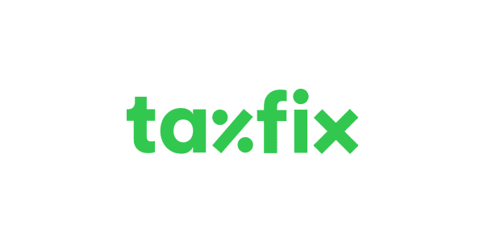

Taxfix 下载量超过 500 万次，是德国最受欢迎的税务应用。它通过提供一个类似聊天的界面，在引导过程中向用户提出易于理解的问题，简化了复杂的报税任务。

有了 Taxfix，用户不需要知道纳税申报的来龙去脉，也不需要知道复杂的行话。该应用程序允许他们通过拍照来上传任何必要的文件，然后自动提取所需的信息。

使用安全加密技术将用户数据传输到 Taxfix 服务器，然后传输到税务局。

**追随谁与 Taxfix 保持联系:** [**亚历山大·德莱昂·巴蒂斯塔，首席软件架构师**](https://www.linkedin.com/in/alexjdl/) **。**

#### 关于德国领先企业推动创新的最后思考

从纳税申报到太阳能电池板，对于那些有远见的人来说，总有创新的空间。我们希望你能从这些德国公司的进步理念中得到一些启发。

如果你正在寻找更多的灵感，请随意查看我们以前的类似文章:

*   [2021 年 Paytech:改变支付市场的十大+英国公司](/blog/uk-paytech-companies/)
*   [2021 年金融科技 7 大趋势及引领变革的公司](/blog/fintech-trends-companies/)
*   [2022 年 Fintech CTOs 们担心的具体挑战有哪些？](/blog/fintech-cto-challenges/)

凭借 15 年为不同行业的公司提供软件开发服务的经验，我们知道在商业中保持好奇和创新的心态是多么重要。

如果您需要额外的帮助来开发您的产品，不要犹豫，请 [联系我们](/hire-us) ，我们将很乐意支持您的项目！