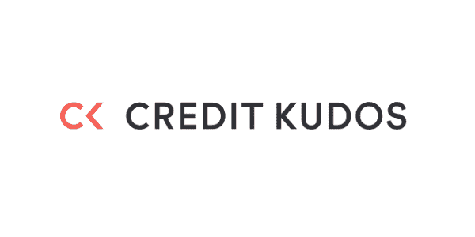
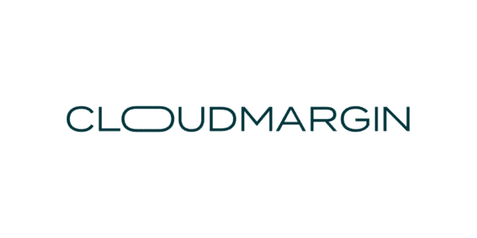
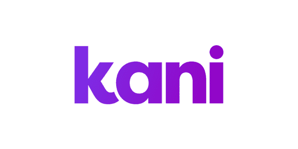
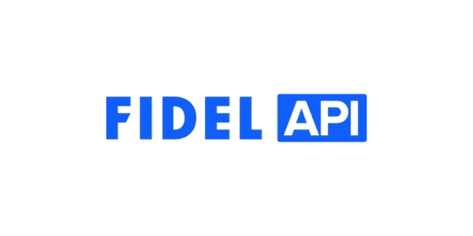
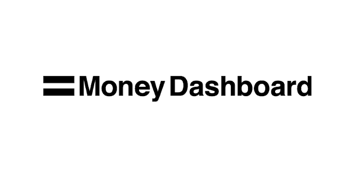
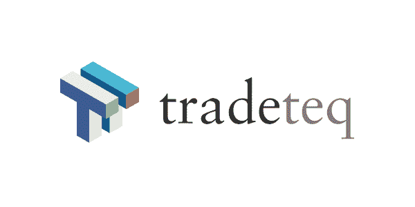
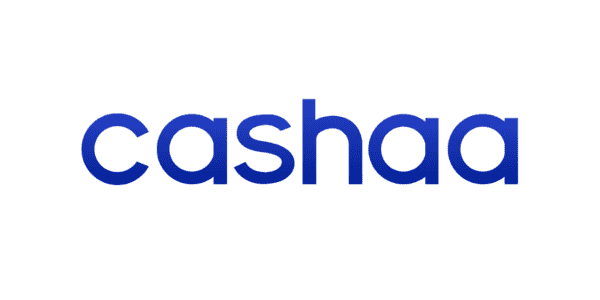

# 2022 年最值得关注的 9 家英国金融科技初创公司

> 原文：<https://www.stxnext.com/blog/most-innovative-uk-fintech-startups/>

 创新应该是任何企业的北极星。这对任何想在特定行业取得成功的人来说都是必不可少的，尤其是当你的领域是金融科技的时候。

如果你想为一个多年未能解决的问题创造一个开创性的解决方案，或者你想发明一种产品来满足市场中未被服务的部分的需求或服务——你肯定需要很大的勇气和创造力。

你可以做到这一点的方法之一是用你想要实现的好例子来滋养你的创新思维。

对于所有在企业中寻找灵感的人来说，我们发现了几家崭露头角的英国金融科技公司，它们可能会激励你在未来几个月采取一些有意义的行动。请继续阅读，了解那些创新的创业公司！ 

#### 1.荣誉

金融行业因其过时的流程而臭名昭著，这些流程往往与现代不符。一个例子是信用评分的传统方法，这是一个用来预测一个人偿还债务的可能性的数字记录。

信用评分通常是根据付款历史、债务金额和信用评分过去的时间长度来计算的。对于许多个人来说，尤其是在这些动荡的时期，房东和贷款人设定的信用评分要求是不可能达到的。

[信用声望](https://creditkudos.com/) 已经利用了开放式银行的力量，为你的财务状况提供了一个更全面的视图，即使你没有或几乎没有信用记录。

该公司的产品之一 [Signal](https://creditkudos.com/signal) 利用机器学习来准确预测你的还款可能性，让贷款人超越传统信用评分的限制，提高接受度。

#### 2.云缘

[CloudMargin](https://cloudmargin.com/) 成立于 2014 年，是世界上第一个基于云的抵押品管理工具，也是第一个成为 SWIFT 网络成员的抵押品管理解决方案提供商。

他们的单一产品结合了你可能想从这样的工具中得到的任何东西:它帮助客户集中和连接他们所有的工作流程，并额外降低了运营风险。此外，该工具可以为整个组织节省高达 70%的抵押品管理成本。

向云迁移带来的自动化有助于公司专注于重要的工作，摆脱冗余的手动流程，同时增加积极的变化。

#### 3.卡尼

成立于 2018 年 10 月的 [卡尼支付](https://kanipayments.com/) 是一个 SaaS 平台，目标是让金融科技的报告和对账更简单。

该公司为对账和报告带来了自动化、准确性和合规性，这意味着通常由财务团队执行的手动且耗时的后台流程，以说明支付交易。

卡尼被新兴支付协会授予领先的金融服务或支付初创企业，并在 2021 年英国 50 大最具创新性金融技术创造者中获得第二名。

今年，卡尼计划在全球范围内扩张，并引入新功能 [，将机器学习技术与记录匹配解决方案](https://kanipayments.com/kani-payments-helping-fintechs-scale-up-for-an-even-more-successful-year-in-2022/) 。

#### 4.熔融企业

melted Ventures 是一家总部位于伦敦的风险投资公司，致力于投资最具创新性的科技公司。

这意味着通过跟随他们的行动，你可以在创新领域获得尽可能多的灵感。他们既与种子阶段的初创公司合作，也与已经成立的有前途的金融科技公司合作。你可以在他们的 [网站](https://www.moltenventures.com/insights) 上从作品集中获得更多见解。

另一个值得一提的方式是他们的 [ESG(环境、社会和治理)政策](https://investors.moltenventures.com/esg-policy) ，他们承诺将工作对环境的影响降至最低。

#### 5.矿脉

在过去几年中，加密货币市场一直在蓬勃发展。这是一个快节奏、富于创造性、不断发展的领域，所以如果你正在寻找创新，这应该是寻找灵感时要考虑的领域。

[礁](https://reef.io/) ，一家成立于 2020 年的金融科技公司，是我们遇到的业内最具创新性的公司之一。他们的珊瑚礁链是一个 EVM 兼容的区块链。它结合了传统区块链的最佳功能、低交易成本和完全智能合约兼容性。

该链使用下一代区块链技术，包括提名的利益一致证明、EVM 扩展、链上升级、libp2p 网络和最先进的加密技术。

#### 6.菲德尔 API

另一家总部位于伦敦的金融科技公司 [Fidel API](https://www.fidel.uk/) 旨在通过帮助开发者避免与支付服务提供商的复杂集成来释放支付卡的潜力，并更快更有效地将产品推向市场。

该公司通过其 API 提供了一个单点集成，因此开发人员可以在卡交易的基础上进行构建，并在使用支付卡的那一刻创造引人入胜的体验。

他们的解决方案可以应用于许多用例，如奖励、归属、见解、数字收据或费用管理。

Fidel API 在 2021 年德勤科技 50 强 榜单上位列 15 家发展最快的英国科技公司之一。

#### 7.金钱仪表板

创新应该让你的生活更美好。这就是 [金钱仪表盘](https://www.moneydashboard.com/) 背后的基本思路，这是一个将你所有账户集中在一个地方的金融应用。

这是一个个人财务助理，可以跟踪你的支出，帮助你做出更好的财务决策。就这么简单，但它会对你的个人理财方式产生很大的影响。

如果你在一家资产管理公司、零售商或咨询公司工作，你可能想看看该公司的 Money Insights，这是一种收集客户消费习惯交易数据的商业智能解决方案。

该工具跟踪与您的市场份额、客户忠诚度、他们的钱包份额、消费者健康以及最有价值的买家概况相关的数据，所有这些数据都有助于您修改产品以适应市场需求。

#### 8.Tradeteq

[tradeeq](https://www.tradeteq.com/)提供人工智能驱动的贸易融资投资平台，为全球贸易投资提供端到端的支持。

该公司提供交易自动化解决方案，可以自动化整个资产分配流程，将其重新包装为一种服务，可以将任何资产转化为资本市场产品或人工智能支持的分析工具，以准确计算风险。它承诺“不再有容易出错的手动流程，不再有电子表格，不再有繁琐的数据聚合。”

成立于 2016 年的英国金融科技公司(the British fintech)诞生于为自己寻找这种解决方案的人寻找正确技术以进行成功投资的需求。这使得 Tradeteq 公司不再专注于单一的问题，而是寻找满足客户所有需求的方法。

#### 9.Cashaa

[Cashaa](https://cashaa.com/) 是英国最大的加密友好型新银行，为全球数百家加密企业提供服务。它的一些合作伙伴包括 Paysafe Group 和许多其他受 FCA、立陶宛中央银行和科罗拉多银行分部监管的金融机构。

Cashaa 相信现有的支付和银行系统的替代品可以为个人和商业客户所用。通过其服务，该公司正在拥抱金融去中心化和加速数字化转型。

这家初创公司的目标是，到 2023 年，成为世界上参与新兴技术的企业和个人的主要和首选银行，我们正在为他们祈祷！

#### 关于 2022 年最具创新性的英国金融科技初创公司的最终想法

创新是许多企业的核心价值观，在许多情况下，也是企业生存的唯一方式。这就是为什么当你考虑你未来的成长时，这种技能，或者说态度，应该是你优先考虑的。

2022 年将是英国初创公司迎来增长和创新的又一个充满活力的年份。希望这份名单能给你一些启发，帮助你发现今年真正值得你关注的几家公司。

如果你想了解更多有远见的公司，请查看我们关于英国金融科技领域的其他文章:

*   [2022 年 Fintech CTOs 们担心的具体挑战有哪些？](/blog/fintech-cto-challenges/)
*   [2021 年金融科技 7 大趋势及引领变革的公司](/blog/fintech-trends-companies/)
*   [2021 年 Paytech:改变支付市场的十大+英国公司](/blog/uk-paytech-companies/)
*   [2021 年英国十大金融科技贷款公司跟进](/blog/top-uk-fintech-lending-companies/)

欲了解更多金融科技的最新趋势， [订阅我们的科技领袖中心简讯](/tech-leaders-hub#newsletter) ，了解我们与高管的最新会谈。

凭借对金融科技 的浓厚兴趣和丰富经验，如果你的项目需要一些额外的帮助，我们也是一个很好的技术合作伙伴。欢迎 [联系我们](/hire-us)——我们很乐意支持你创造你的下一个金融科技产品！