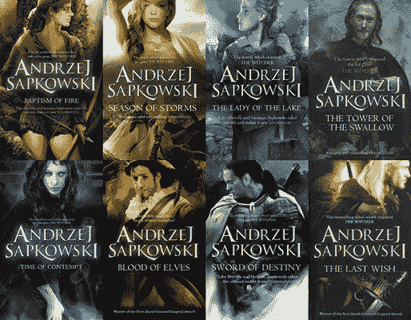
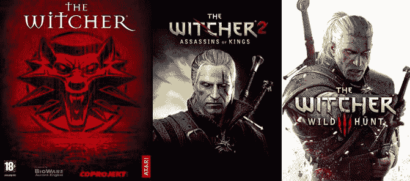
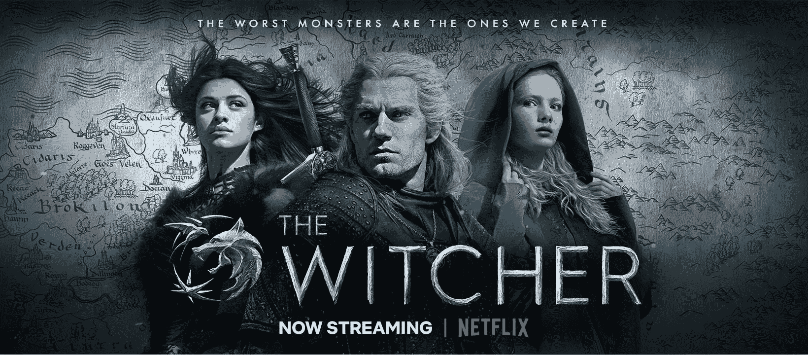
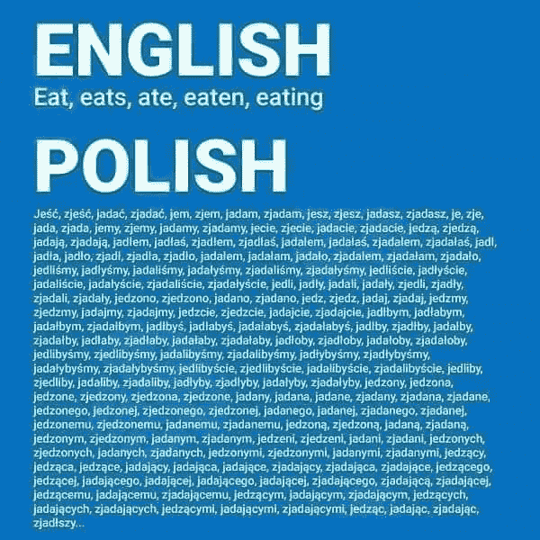
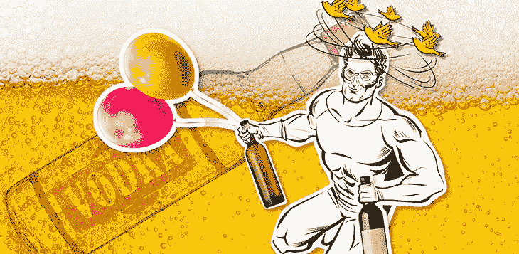
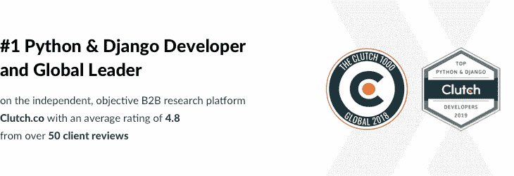
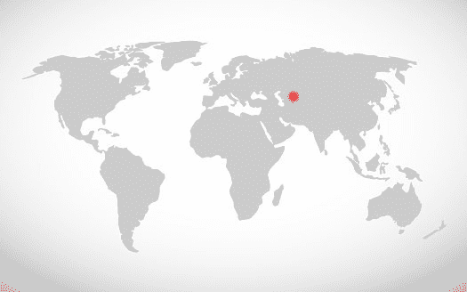
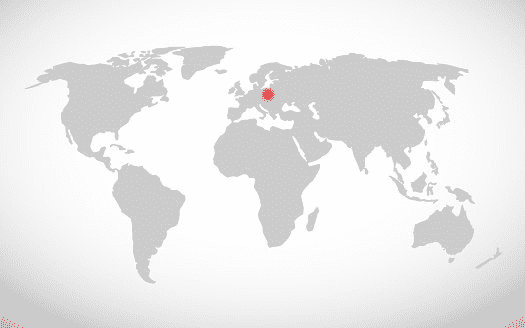
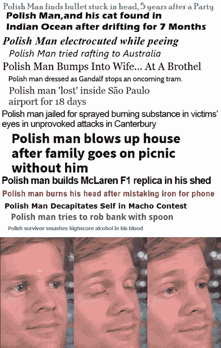
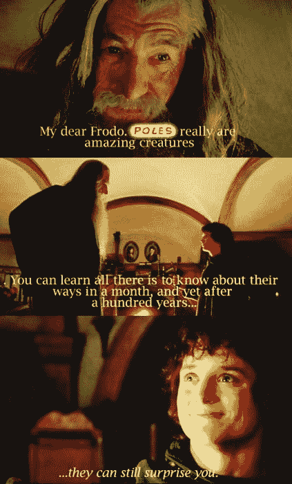

# 流言终结者:这个后共产主义的伏特加和馅饼之地是秘密的软件开发外包黄金国吗？(提示:这不是俄罗斯！)

> 原文：<https://www.stxnext.com/blog/mythbusters/>

 你好！我们是波兰人。

波兰人。

你知道，从波兰？

不，这不是我们:

Source: https://www.fakt.pl/pieniadze/zakupy/black-friday-za-komuny-byl-praktycznie-codziennie-najwieksze-kolejki-byly-przed-22/ehdqy0w

肯定不是我们:

Source: https://www.theaustralian.com.au/world/polar-bear-roams-russian-city-streets/news-story/924109554643b0dd3b7b873c47aad1ba

也不是我们:

Source: http://thewvsr.com/in-celebration-of-wild-drunken-weddings/

……好吧，也许最后一个不是  *太过* 远——不时！

无论如何，波兰的形象有时会被简化为有名无实的后共产主义国家，充斥着伏特加和馅饼。

但是波兰人值得所有这些负面吗？对我们兄弟姐妹的偏见是真的吗？或者也许还有更多故事，我们实际上在某些领域很棒，比如说，  [软件开发](https://stxnext.com/services/)？

继续读下去找出答案，因为我们一个接一个地打破了关于我们国家的神话！

(剧透提醒:是  *真的* 没那么差。我们很擅长做一些事情。) 

#### 误解 1:波兰人真的很懒

上个世纪有句波兰谚语说，“捷克·西斯托伊，捷克·西斯 leży，tysiąc·佐蒂奇·西斯 należy，”大致意思是，“闭嘴，付钱给我，否则我杀了你。”

开玩笑！不是这么说的。更像是，“不管你是坐着还是站着，一千兹罗提都在意料之中。”

(好吧，所以我不会押韵。不要评判我。)

关键是，波兰人被认为是懒惰的混蛋，他们会在工作中偷懒，然后期望得到公平和全额的报酬。像这样:

**Source: https://pbs.twimg.com/media/Df0FEQfWsAEeHIr.jpg**

好吧，这种刻板印象在  [波兰人民共和国](https://en.wikipedia.org/wiki/Polish_People%27s_Republic)可能还站得住脚，那时一切都很混乱，没有什么是有意义的，但是现在，它与事实相去甚远。

事实上，  [微软新闻](https://www.msn.com/en-xl/asia/life-arts/the-hardest-working-nations-in-the-world-revealed/ss-BBSdObq#image=31) 报道称…

> **波兰人是世界上第七勤劳的民族**

…平均每周工作 36.4 小时，失业率为 5.7%，是欧洲最低的失业率之一。

随着50%或 100%的加班率——在晚上、周日和节假日——波兰工人加班也并不罕见。

哦…是的，不想让人失望，但是波兰人实际上让很多其他国家感到羞愧，因为我们是如此的勤奋。不好意思！下次运气好点，偏见！

#### 误解 2:波兰是一个非常贫穷的第三世界国家

这可不是什么好照片，不是吗？

30-40 年前，你可能会认为波兰的很多地方都是这个样子。

不再

让我们把一件事说清楚:如果没有 PPR 那些不光彩的日子，我们现在基本上已经是瓦坎达人了，好吗？

**Source: https://i1.wp.com/www.aitheology.com/wp-content/uploads/2019/08/WWT0020_v008_027999.1081.jpg**

不过，这就是波兰人的特点:你不能长期压制我们。许多人尝试过，但都失败了。自 1989 年以来，我们一直在卷土重来，而且进展  *非常顺利。*

事实上，如此之大，以至于波兰最近被从新兴市场升级为发达市场。

这种地位的变化似乎不言而喻，但如果你只是*想知道这对我们的国家和未来意味着什么，我们的首席执行官被邀请参加彭博的现场活动，与来自波兰的其他高管一起讨论这个问题。*

 *这是我们的 TL；博士，这是完整的面板:

[//www.youtube.com/embed/1-N8jvI8Hyo](//www.youtube.com/embed/1-N8jvI8Hyo)*  *#### 神话 3:波兰人比一袋石头还笨

如果你开始在谷歌上搜索关于波兰人的刻板印象，你会发现最常见的是波兰人，我该怎么委婉地说呢…愚蠢。

对此，我只能说…什么？

好的，首先，我们有许多各种奖项的诺奖得主，最近的一位是杰出的  [奥尔嘉·朵卡萩](https://www.theguardian.com/books/2019/oct/10/nobel-prizes-in-literature-olga-tokarczuk-peter-handke-2019-2018) 文学奖。

其次，截至 2018 年，44%的波兰人  [接受了高等教育](https://www.gov.pl/web/science/report-the-percentage-of-poles-with-higher-education-is-close-to-the-oecd-average)——比十年前增加了 12%，接近经合组织的平均水平。

最后，波兰专家的需求量越来越大，尤其是在软件开发领域。

根据  [黑客排名](https://blog.hackerrank.com/which-country-would-win-in-the-programming-olympics/) …

> **波兰开发者全球第三好！**

我很惊讶我们自己排名那么高！

**Source:https://gph.is/2oY0DNi**

可以肯定地说，我们是科技领域的*。我们甚至在  [Python 软件基金会](https://www.python.org/psf-landing/)中有一名成员——而且不是普通的成员，而是董事会的  [副主席](https://www.linkedin.com/in/anna-ossowski-2040475b/)！*

 *所以，不，我们国家最大的成功不是  *【巫师】*——尽管它本身就是一个非凡的成就。

文学上的一项成就…

**Source: https://ibookpile.net/the-witcher-complete-series-by-andrzej-sapkowski/**

…游戏开发…

**Source: http://mcmiller.ca/writing/academic-essay/the-witcher-transmedia-narrative-games/**

…还有流媒体电视！

Source: https://goodvibes7.com/wp-content/uploads/2020/01/The-Witcher.jpg

(是的，书先来了，  [萨科夫斯基](https://www.polygon.com/2018/10/2/17927916/the-witcher-author-andrzej-sapkowski-royalties-cd-projekt-red)。 *我们知道。*)

**Source: http://www.edytoriada.pl/2019/07/28/andrzej-sapkowski-i-obserwacje/**

如果你还需要更多的证据来证明波兰人是冷静和聪明的，而不是跛脚和哑巴，他本人将出现在 CD Projekt Red 即将推出的视频游戏  *赛博朋克 2077 中。* 耶！

**Source: https://gph.is/g/Evd6RL5**

啊，谢谢，基努！但是，真的——*你*是。

如果你喜欢，可以看看下面的*预告片。这是一件美好的事情！*

 *[//www.youtube.com/embed/YApuEWtG30w](//www.youtube.com/embed/YApuEWtG30w)**  **#### 误解 4:波兰语是世界上最难的语言之一

那…实际上是真的。

我是说，看看这个:

**Source: https://www.reddit.com/r/europe/comments/cfx5zt/english_vs_polish/**

看着它！很疯狂吧。

在有史以来世界上最难学的语言中，波兰语一直名列前茅。有点像美国英语中波士顿方言的  [是最具挑战性的](https://www.pri.org/stories/2016-03-06/why-boston-accent-so-wicked-hard):

**Source: https://i.pinimg.com/originals/83/b2/d1/83b2d1b21674c8b44581303d931f8298.jpg**

但是没关系。不是什么事情都需要交上一份银子  *【普拉塔】* 我说的对吗？

顺便说一下，语言困难并不是波兰和波士顿唯一的共同点:

**Source: https://imgflip.com/i/3oua3r**

这是一件  [整件事情](https://en.wikipedia.org/wiki/Max_Kolonko)。一个  [里面的笑话](https://www.youtube.com/watch?v=vA-OAztVkAM)，我猜。

#### 谣言 5:波兰人喝酒……喝得很多

问任何人，任何地方，当他们想到波兰时，第一个想到的是什么，十有八九你会听到“伏特加”。或者，你知道，某个以“ku”开头，以“rwa”结尾的词，但这不是重点。

无论我们走到哪里，我们作为世界上最无耻的酗酒者国家的名声在国际上都是领先的。实际上，这会变得很烦人！

让我直截了当地告诉你:那只是一派胡言。举例来说，我在写这篇文章的整个过程中没有喝一口酒。

好吧，好吧，我们确实喜欢喝酒。但是我们可以随时停下来！说真的。这不是问题。一点都没有。除非我们有客人。

**Source: https://files-cdn.sharenator.com/drunk-peasants-s500x414-52588-1020.jpg**

真的，虽然，大部分只是我们天生的魅力和好客的一部分。永远不要说波兰人不知道如何玩得开心，也不知道如何向我们的游客展示这一点。

就这点来说，伙计，我们办了一个很棒的派对！他们不一定(总是)只涉及喝酒。以我们的  [年度科技力量峰会](/stx-new-blog/berts-bots-and-bets-my-top-5-memories-tech-power-summit-2019/)为例，在这里，教育与娱乐相结合，无论有没有酒，都充满乐趣:

[//www.youtube.com/embed/2ljXSQ2i16k](//www.youtube.com/embed/2ljXSQ2i16k)

#### 误解 6:波兰人只吃土豆

显然，有些人认为土豆是我们波兰人在这个农业奇迹国家制作和食用的每顿饭的第一种和最后一种配料。

胡说八道！传统的波兰美食有着丰富多彩的历史。

以著名的“科普特卡”为例…

**Source: https://upload.wikimedia.org/wikipedia/commons/c/c4/Kopytka_in_tomato_sauce.jpg**

…典型的波兰晚餐…

**Source: https://d3iamf8ydd24h9.cloudfront.net/pictures/articles/2019/05/583005-v-1000x1000.jpg**

…最后但同样重要的是，我们菜肴中的皇冠上的明珠和民族自豪感的象征:馅饼…

**Source: https://www.mygourmetconnection.com/wp-content/uploads/potato-and-cheese-pierogi-720x540.jpg**

…所有这些都是由…嗯…土豆制作或提供的。

好吧，好吧，我们确实爱我们的土豆。告我们！

不过，让我告诉你:我们把那些土豆做成活人*。*

 *它们功能多样，易于使用，几乎可以搭配任何东西！

我敢说土豆是…

**Source: https://gph.is/1a5y6Lc**

哦，你知道还有什么是多功能的，易于使用的，几乎可以和任何东西搭配的吗？

没错:就是  [Python](https://stxnext.com/python-vs-other-programming-languages/) ！

是啊，是啊，一个完全显而易见的联系，没有任何私利在这里。

我的意思是，这不像我们是世界上排名第一的 Python 和 Django 开发者或其他什么:

*  *#### 神话 7:波兰基本上是俄罗斯

啊，是的，每个人心中永恒的问题(不是真的):连  *是* 波兰，到底在哪里？！

与普遍看法相反，波兰不在这里:

**Source: https://www.istockphoto.com/pl/wektor/simple-world-map-vector-illustration-gm940404500-257079839**

它实际上在这里:

**Source: https://www.istockphoto.com/pl/wektor/simple-world-map-vector-illustration-gm940404500-257079839**

呃，等等，这不对。

**Source: https://www.istockphoto.com/pl/wektor/simple-world-map-vector-illustration-gm940404500-257079839**

那里。搞定了。不是俄罗斯。明白了。Page:相同。

随着讨厌的地理问题的解决，我们可以转向国家象征，比如，我不知道，国旗！

**Source: https://en.wikipedia.org/wiki/File:Flag_of_Monaco.svg**

不，不是这个。不过，很接近了！

**Source: https://imgflip.com/i/3p6y99**

明白了吗？

**Source: https://en.wikipedia.org/wiki/File:Flag_of_Poland.svg**

资料来源:[【https】:/。 维基百科 。/【wiki】/【文件】 : 标志【SVG】](https://en.wikipedia.org/wiki/File:Flag_of_Poland.svg)

没错！

我可以继续把这个笑话讲下去，但是…够了；你明白了。很多人对波兰的一些基本情况理解错误。了不起。挺好的。  *天气晴朗。*

**Source: https://gph.is/2HThg52**

*来源:[https://gph。 是/2 hth g52](https://gph.is/2HThg52)*

所以，是的。你好。很高兴认识你。

想写一些软件吗？

没有吗？那好吧。

开个玩笑…或者我是？

#### 误解 8:波兰人只会说波兰语

这是错误的。我是说，我是波兰人，你不会是用波兰文读的吧？

然而，这种刻板印象依然存在。这并非完全没有好处，因为波兰语是我国 97%人口的第一语言，但在  [之外，波兰还使用 20 种其他语言](https://www.redlinels.com/languages-spoken-in-poland/)——最著名的是德语、俄语，当然还有英语。

事实上，波兰最近在  [2019 EF 英语熟练指数](https://www.ef.com/wwen/epi/regions/europe/poland/)中排名第 11 位，显示出对英语的“非常高的熟练程度”。诚然，调查中的绝大多数参与者  [都不到 40 岁](https://www.careersinpoland.com/article/news/english-is-easy-poles-ranked-among-world-s-best-speakers-of-english)，但你总得从某个地方开始，对吧？

我得说我们的历史背景给了我们一张通行证。

**Source: https://gph.is/2niNZHH**

说外语——尤其是英语——在商业中至关重要。没有它，就不可能有  [文化契合](/stx-new-blog/why-are-company-values-important-and-how-we-defined-ours/)。我们知道，你也知道。

谢天谢地，我们的客户也知道这一点:

[//www.youtube.com/embed/5eMa_P-TFTA](//www.youtube.com/embed/5eMa_P-TFTA)

这么好的一个人。看看他的胡子！太美了。

*(清嗓子)*…继续，我们就快完成了！

#### 误解 9:波兰人没有幽默感

嗯……你有没有  *看过* 这篇文章？

**Source: https://media1.tenor.com/images/4f6decd07fc0415fe5a2c9adeec02ba1/tenor.gif**

没想到会这样！

澄清一下:是的，不。我们中的一些人可能对某些笑话比其他人更敏感，但总的来说，我们对事情很冷静，并且不介意取笑自己。

举个例子，看看传奇的波兰人:

**Source: https://www.reddit.com/r/dankmemes/comments/8d6djx/adventures_of_the_polish_man/**

用已故的伟大的斯坦·李的话说:

**Source: https://gph.is/2RQSLJV**

我的意思是，这只是坏蛋。

#### 最后的想法

**Source: https://www.wykop.pl/cdn/c3201142/comment_SuA9ivkA30yU2HonG6zD7LFmdCdadDcf.jpg**

无论是在国外还是在我们自己的国家，波兰人都受到了很多指责。有些是应得的，有些不是。

当然，我们不是最志同道合的一群人，我们经常低估自己，我们倾向于给人不太好的(第一)印象。很公平，都是真的。

但是对于我们这个奇怪的小国家来说，还有更多的东西。就像  *《指环王》中甘道夫告诉佛罗多的:*

**

**Source: https://www.pinterest.com/pin/353040058259892584/**

好吧，这是个不完美的比较。但是如果说历史教会了我们什么的话，那就是波兰人有一种不可思议的适应新环境和克服意想不到的障碍的能力。

说到这里——既然你花了这么多时间阅读关于波兰人的书籍——你对与两个波兰人和一个加拿大人会面有什么想法？

请允许我解释。

我们的[首席执行官](https://www.linkedin.com/in/maciejdziergwa/)、[工程副总裁](https://www.linkedin.com/in/%C5%82ukasz-koczwara-235b54b5/)和[业务发展总监](https://www.linkedin.com/in/matthew-harris-270322b/)将于 3 月 11 日至 18 日在波斯顿和纽约。他们很想和你面谈，讨论如何一起开发软件。

**[让我们知道你是否感兴趣](https://stxnext.com/contact-us/)。我们将帮助您在预算内按时实现目标**。****