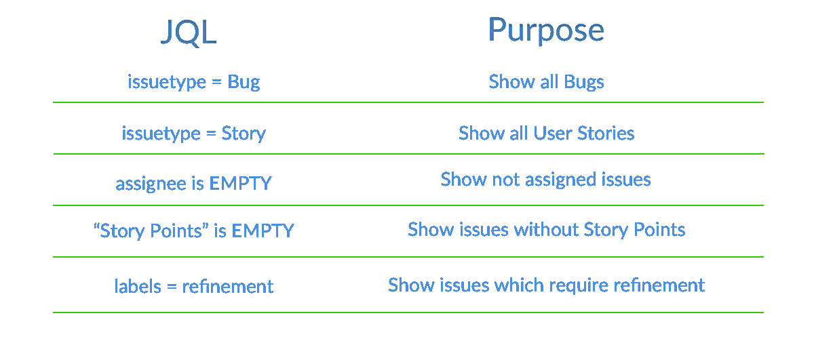
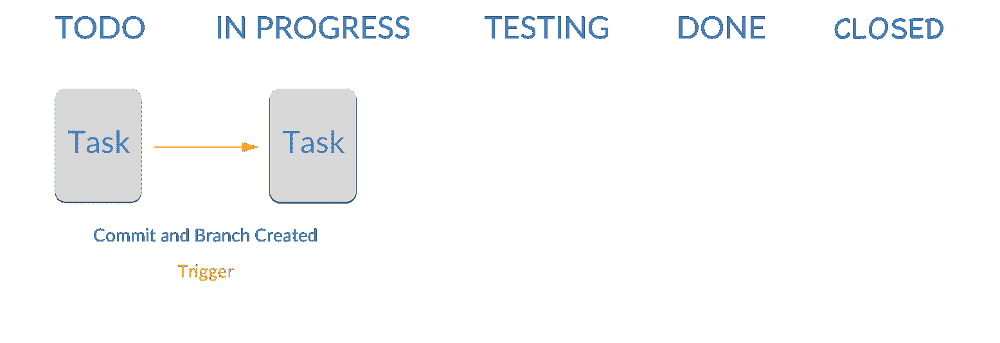
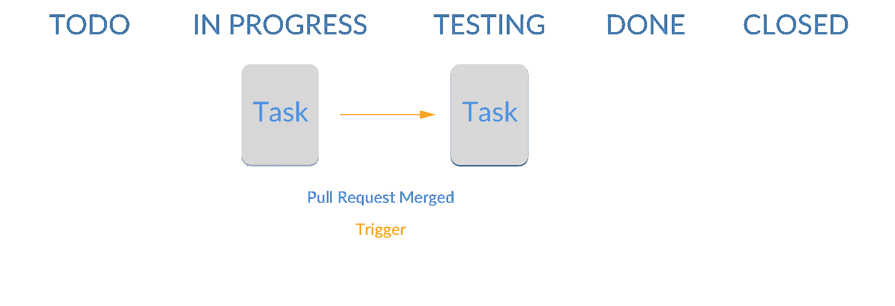
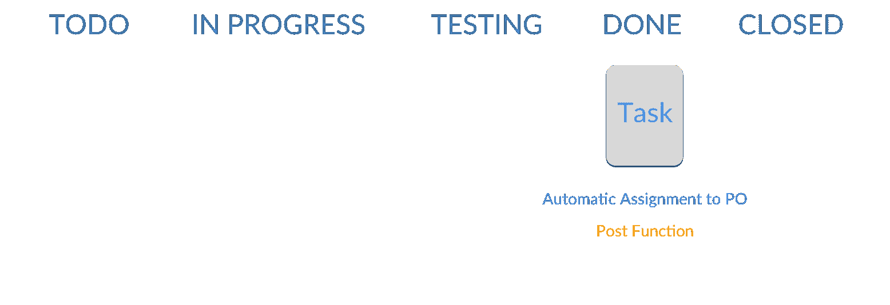

# JIRA 软件的实用技巧

> 原文：<https://www.stxnext.com/blog/practical-tips-jira-software/>

 如今的软件开发项目正变得越来越复杂，旨在交付具有许多功能的产品。一旦你选择了合适的问题跟踪和项目管理工具，管理这样的项目会更容易。

市面上有很多解决方案:  [JIRA 软件](https://www.atlassian.com/software/jira)，  [aha.io](http://www.aha.io/) ，[base camp](https://basecamp.com/)或者  [Trello](http://trello.com/) 。它们都可以支持广泛的软件开发项目。显然，每个工具都有其优缺点，但我个人最喜欢的是 Atlassian 创建的 JIRA 软件。

不幸的是，选择正确的软件是不够的。您还需要为您的项目正确地配置它。老实说，这不是一件容易的事情，尤其是如果你刚刚开始使用这种工具。最有可能的是，在您的团队成员发现工具的可用性可以接受之前，需要进行多次迭代。

与 JIRA 共事一段时间后，我学会了如何调整它来改进流程，提高某些行动的绩效。在这篇文章中，我想分享一些简单易行的“速赢”方法。

 

#### 快速过滤器

一般来说，快速过滤器使您能够显示待办事项中的特定问题。例如，您可以使用它们只显示 bug。如果你在 JIRA 有一个 Scrum 或者看板项目，你可以在你的板上添加定制的快速过滤器。请记住，为了创建快速过滤器，您需要有足够的权限，并熟悉 JQL (JIRA 查询语言)。

下面你可以找到一些过滤器，它们对你日常处理积压的工作很有帮助。

为了使最后一个过滤器工作，你首先需要给选择的问题添加“细化”标签。如果你的待办事项很多，并且你不想错过任何东西，标签真的很有帮助。

#### 工作流自动化

JIRA 允许构建自定义工作流并对其进行适当配置。这里有很多选项，但我只提到其中的两个:触发器和 Post 函数。

**触发器**是 JIRA 区分的特殊事件，能够触发从一种状态到另一种状态的问题转换。触发器可以与开发工具(GitHub，Bitbucket)集成，并允许 JIRA 问题在特定操作后自动更新，这样开发人员就不需要手动进行更新。

我们可以让 JIRA 认识到以下触发因素:

*   已创建拉式请求
*   分支已创建
*   已合并拉取请求
*   提交已创建
*   拉请求已重新打开
*   拒绝拉取请求

遗憾的是，最后两个选项仅在  [位桶](https://bitbucket.org/)中受支持。

首先，我建议配置您的工作流，以便创建一个分支或进行第一次提交会触发特定问题从“待办事项”到“进行中”状态的转换。这当然取决于特定的工作流程；然而，根据我的经验，它通常可以很好地处理大多数项目。通过这种配置，开发人员无需使用 JIRA 就可以手动将问题移动到“进行中”状态。

相同的概念可以应用于工作流中的其他转换——例如，您可以为“拉”请求合并事件创建一个触发器。在这种情况下，问题将从“进行中”状态变为“测试中”状态。

请注意，所有这些配置都需要 JIRA 与  [Github](https://github.com/) 集成。

**发布功能** 让您在两种状态之间完成转换时自动执行某些动作。这里有几个选项，但我的经验证明，将 issue 字段更新为给定值是最常用的选项。

在我的项目中，一旦问题被转移到 DONE，我就使用 post 功能将受托人从开发人员或测试人员更改为产品所有者。这表明团队已经交付了一个用户故事，PO 需要在结束之前接受它。

您可以创建一个类似的 post 函数，将一个问题分配给一个特定的测试人员，一旦它被转移到测试状态。

类似上面的场景是可以使用 post 函数的最简单和最直接的情况。

我希望这些基本提示能帮助你在日常工作中有效地使用 JIRA。JIRA 配置有许多更高级的选项。请记住，增强和调整项目中的 JIRA 是一个长期的、迭代的过程。

如果您有任何问题或想了解更多关于使用 JIRA 的信息，请不要犹豫，给我们发一条线到或  [Twitter](https://twitter.com/STXNext) 。

