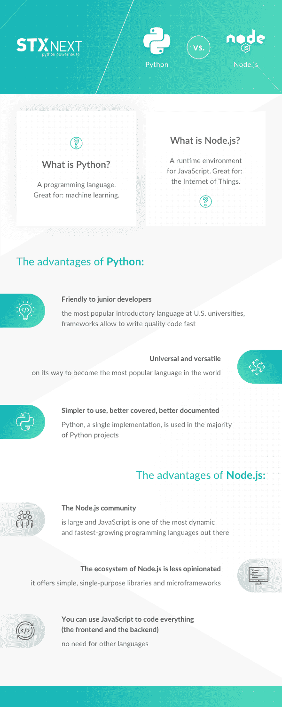

# Python 与 Node.js:比较利弊和用例

> 原文：<https://www.stxnext.com/blog/python-vs-nodejs-comparison/>

 很明显，我们喜欢 Python。

但是，它是治疗所有软件开发挑战的灵丹妙药吗？

不，不是的。如果我是你，我会怀疑其他人的说法。

无论是构建软件还是做生活中的任何事情，你很少能对每个问题都应用相同的解决方案。

每个软件项目都有自己独特的需求和要求。  [对一个人有效的](https://stxnext.com/ebooks/what-is-python-used-for/) 对另一个人可能完全无效。在 STX Next，我们使用最适合给定项目的技术。

也就是说，比较是不可避免的。毕竟，有如此多的编程语言和框架可供选择，如果你想得到一点帮助来选择一个适合你的，那是无可厚非的。

[除了 Python vs. Golang 或者 Python vs Java](https://stxnext.com/ebooks/python-vs-other-programming-languages/)，我们最近看到的最流行的查询之一是**node . js vs Python。我们将对此进行阐述。**

请继续阅读，深入了解 Python 和 Node.js，了解它们的  **差异和相似之处，优势和劣势**， 以及最重要的:  **哪个更好？**

**** 

#### 什么是 Python，什么是 Node.js？

在我们跳到细节之前，我们应该澄清我们实际上比较的是什么。

**[Python](/services/python-development/) 是一种编程语言；Node.js 是*不是。*这里的语言是 JavaScript，Node.js 是 JavaScript 的运行时环境。**

Python 和 Node.js 之间的关键区别在于，当你在 Node.js 中编写时，你对前端和后端使用相同的语言。

事不宜迟，下面是对这两种选择的更详细的分析。

#### Python 有什么优势？

##### **Python 对初级开发人员更友好**

没有经验的 Node.js 开发人员很容易犯错误，这些错误对于那些没有完全理解  [JavaScript](https://stxnext.com/services/javascript-development/) 的一些更高级的概念和工作方式的人来说是常见的。

这可能要归功于 JavaScript 多年来的发展方式。只有在大量不那么优雅的代码片段和教程在网上传播之后，像面向对象编程这样的概念才受到有意义的关注。

另一方面，Python 对初学者非常友好，这可能是为什么它现在是美国大学最受欢迎的入门语言。初级 Python 开发人员在某些框架中可能犯的大多数错误都是可以原谅的，也不会成为前进的绊脚石。

##### **大多数 Python 框架不需要开发者有很高的技能水平**

Django 就是一个很好的例子，它有一个成熟的生态系统，允许你快速编写高质量的代码。

##### **Python 更加通用和通用**

虽然它也可以用于桌面应用程序，但由于  [电子](https://electronjs.org/)，Node.js 的主要用例是 web。然而，Python 的应用远远超出了 web。

Python 是成为  [数据科学](https://www.kaggle.com/surveys/2017)领先编程语言的主要竞争者。这对系统管理员来说是一笔巨大的财富，因为它允许他们轻松地编写小型的一次性脚本，同时提供像 Ansible 这样的大型系统管理工具。

举个例子，只要看看 Dropbox 就知道了，它是用 Python 编写的最常见的桌面应用之一。

##### **Python 使用更简单，覆盖更广，文档更丰富**

这使得 Python 比 Node.js 更有优势，尽管这两种技术的编写速度都非常快。

Node.js 是一种 JavaScript 实现，一种历史悠久的语言，主要是一种前端工具。因此，为 Node.js online 找到的解决方案可能不适合后端使用，或者依赖于不可访问的接口。

这一点不能夸大，因为每个 JavaScript 框架或运行时环境在实现 JavaScript 的方式上都会有轻微的差异。不可否认，这种情况在过去几年中有所改善，但与 Python 相比仍有很大差距，在 Python 中，CPython 是一个单独的实现，用于绝大多数 Python 项目中。

 

#### Node.js 有什么优势？

##### **Node.js 开发者更灵活**

因为我们在前端和后端有相同的语言，你需要是一个 JavaScript 开发人员才能使用 Node.js。

如果你想快速开发你的应用，Node.js 是一个完美的工具。这是因为你可以使用相同的语言(JavaScript)来开发应用程序的后端和前端。因此，一个程序员可以自己轻松实现整个特性，而不需要了解另一种语言。这也意味着开发成本的降低。”

**—STX Next 的 Node.js 开发人员 David Solomon**

这种交叉学科在你最意想不到的时候会派上用场，尤其是当你需要快速灭火的时候。

但是让我们暂时把这种可能性放在一边。事实是，如果你对项目有很好的理解，并且有合适的人来构建它，那么使用 JavaScript 和 Node.js 是不会出错的。

“我喜欢 Node.js 的一点是，它使用了我在前端使用的相同语言。这允许我使用相同的库和工具(包括 TypeScript！)用于我的应用程序的两个部分，这导致了一个更小的技术堆栈。此外，我几乎不需要做任何请求数据处理，因为它通常是 JSON 格式的，这只是 JavaScript 对象，随时可以使用。这就是 Node.js 与前端应用程序完美合作的原因。”

**—przemysaw Lewandowski，STX Next 的高级 JavaScript 开发人员**

##### **node . js 的生态系统不那么固执己见**

许多 Node.js 包是简单的、单一用途的库和微框架，迫使开发人员更有意识地决定何时使用什么。

这使得 Node.js 的要求更高，对开发人员来说，这比在 Django 上用 Python 编写代码、使用 ORM 的内置解决方案、缓存抽象等等要求更高。

##### **有了 Node.js，你可以用 JavaScript 编写任何东西**

Node.js 允许您使用 JavaScript 编写前端和后端代码。这意味着您不需要那么多不同的技术，这又意味着您不需要您的开发人员学习相同编程范例的另一种实现。

在组建团队的阶段，你通常不知道你需要多少 Python 或 JavaScript 开发人员。在特定的 Sprints 中，你的需求也可能不同——如果你在 Scrum 中工作，那就是——这取决于你的目标。

在整个项目中使用相同的语言消除了这种风险。甚至可以前后共享一部分代码。这是一个巨大的好处，不用浪费时间做同样的事情两次。

##### **node . js 社区很大，JavaScript 是最有活力和发展最快的编程语言之一**

JavaScript 一直在以指数速度增长，  [每天都有超过 500 个新的包产生](http://www.modulecounts.com/)。Python 不再像过去那样拥有众多的库和框架，因为 JavaScript 现在已经在这方面赶上了它。

“我最喜欢 Node.js 的一点是它是 JavaScript。前端和后端使用一种语言。Node.js 的另一个优势是它很容易并且很受欢迎，它附带了大量的包，这实际上也适用于 Python。”

**—Bartosz Marciniec，STX Next 的 Node.js 开发者**

唉，对于 JavaScript 来说并不都是阳光和彩虹——但是我们马上就会谈到这一点。首先，一张信息图！

#### Node.js 与 Python:信息图

好了，在我们继续比较 Python 和 Node.js 之前，让我们休息一下，快速回顾一下。

以下是我们到目前为止所学内容的直观总结:

**Python vs. Node.js**

那里；都赶上了！

现在让我们继续讨论 JavaScript——推而广之，node . js——面临的一个特殊问题。

#### JavaScript 和 Node.js 的问题

JavaScript 现在可能发展得非常快，但过去并不总是这样。

起初，这种语言是随意编写的  **，** ，直到今天，它仍然在与旧版本及其兼容性引起的问题 作斗争。

JavaScript 最近的流行带来了另一个奇怪的缺点。

如此多的开发人员在如此短的时间内转向这种语言，以至于很难跟上所有新的更新和复杂的技术。 [自己看吧！](https://dayssincelastjavascriptframework.com/)

JavaScript 库的快速增长带来了  **文档问题、** 从而导致 Node.js 的  **质量差**。这正是后端需要更熟练的开发人员的原因——处理好它需要事先做更多的准备。

可悲的是，这对 JavaScript 来说并不新鲜；其实挺典型的。如果说历史教会了我们什么，那就是 Python 一直更可靠。

#### 比较 Node.js 和 Python 的时候需要特别考虑什么？

比较技术总是一个挑战，Python 与 Node.js 的问题也不例外。

这里有三个要点，每个都侧重于故事的不同方面，这将帮助你做出明智的决定。

##### **趋势技术**

Python 是  **非常适合[趋势技术](/stx-new-blog/new-technologies-stx-next/)，尤其是[机器学习](https://stxnext.com/machine-learning-applications-examples-industries/)。**

*   Python 是数据科学领域的主要参与者，它提供了几个经过测试的支持 ML 的库。
*   比起 JavaScript，更容易找到精通 Python 的  [机器学习专家](https://stxnext.com/services/machine-learning/) 。
*   MicroPython 是 Python 的一个更轻更小的版本，可以用更少的功率和资源运行，非常适合物联网设备(JavaScript 有一个类似的 Espurino，但明显不太受欢迎)。

另一方面，  **Node.js 对于物联网来说用起来更舒服，** 当你比较最流行的 Python 或者 JavaScript 的库的时候。

一如既往，选择权在你，这取决于你想要构建什么。

Node.js 允许你  **更早地使用新的技术趋势，** 尽管它有一个风险:你可能需要以后重写你的整个项目。  **对于长期项目，Python 的风险要小得多。**

为什么会这样呢？因为与 Python 相比，JavaScript 的生态系统看起来像是无政府状态。在某种意义上，每个 JavaScript 用户都在朝着自己的方向前进，这导致了 **的趋势流动性。** 正因为如此，像同构 JavaScript 或 Meteor 这样的技术会更快地过时。

它与 Python 不同。重大的变化是慢慢引入的，有时会令人难以置信地如此。对 Python 2.7 长达 10 年的支持还有什么别的说法吗？

JavaScript 的这种不稳定性和不可预测性正是 Python 是更安全的选择的原因。

##### **速度和性能**

Node.js 的事情是这样的:  **它不能同时做太多事情，除非你在里面写得非常好。**Python 和 Node.js 都只有  *假装* 能够一次做很多事情，但是 Python 应用程序倾向于使用更简单、更传统的多处理模型，而不是更高级的异步范式。

如果不恰当地使用 Node.js，你可能很容易得到一个  **缓慢运行、低性能的产品**。如果你的项目涉及一个特别耗时的任务，它会把所有的注意力放在那里，而其他功能会落后。

当编写正确时，你的软件会向操作系统发送信息，告诉它需要执行某个功能并继续前进，而系统就在那上面工作。但是如果你写得很差，应用程序将等待系统完成任务，在此期间不做任何其他事情。

对于最终用户来说，  **这会让你的软件看起来很慢。** 众所周知，当很多人同时使用你的产品时，就会出现这样的问题。

Python 的一个巨大好处是，它的一些框架是专门为免除您的麻烦而设计的。诚然，如果写得不好，Django 也会运行缓慢，但它有内置的解决方案来处理高负载 ，这使得防止这种结果变得更容易。这只是 Python 对开发人员的技术期望降低的众多例子之一。

主要区别在于 Node.js 被设计成使用少量的工作线程。这就是为什么当一些工人挂起时，它可能很容易变慢。然而，由于没有在它们之间的上下文切换上浪费时间，它也可以执行得更好。

相反的方法是使用许多工人。在这种情况下，当其中一些挂起时，其余部分服务的用户不会受到影响。最新的 Node.js 版本也支持工作线程，用于 CPU 受限的工作负载，尽管它仍然是一个实验性的特性。

*“node . js 真的很适合开发实时应用。它也很容易学习，这使得它很容易成为全栈开发人员，这要感谢 JavaScript。不幸的是，Node.js 是单线程的，所以在某些情况下不适合使用这种环境。此外，与 Go 相比，Node.js 速度较慢。”*

**—STX Next 的 Node.js 开发者 KAC per makowski**

##### **团队组成**

就像我们之前说的，每个项目都是特殊的，都有自己的需求。你需要理解这些需求来成功地构建它。

事实是，  **Python 更适合一些项目，而 JavaScript 更适合另一些项目。** 我们不要忘记构建软件产品是一个流动的过程。你经常会在前进的过程中调整你的技术栈——通常是框架，但有时也包括语言。

不过， **最重要的是你的团队构成。**

有没有好的  [Python 开发者](https://stxnext.com/services/python-development/)？用 Python！

有没有好的 [Node.js 开发者](/services/nodejs-development/)？用 Node.js！

一些团队成员在项目的一部分工作，一些在另一部分工作。有时团队的组成是预先决定的，但是需要随时改变，包括前端和后端。

最重要的是，团队中的成员决定了语言和框架的选择。

很自然，如果你足够幸运，你的团队中有同时使用 Python 和 JavaScript 的全栈开发人员，这个问题会自动解决。然而，这些都供不应求，更常见的是与精通其中一种或另一种的人一起工作。

 

#### Python 和 Node.js 哪个更好？

现在，这是一个百万美元的问题！

说实话，赢家是…都不是？

我们知道你希望吃一份简单又美味的外卖来帮助你做出选择，所以就这样吧:

**如果你手头只有一群没什么经验的初级开发者，那就用 Python 如果你的团队更有技术和成就，选择 node . js .T3**

但事实远不止如此。

尽管 Node.js 在软件工程游戏中青睐经验丰富的玩家，但专业开发人员声称，它实际上并没有给他们提供很多回报。是的，他们需要利用他们的专业知识来有效地使用 Node.js，但是他们选择两种技术中的哪一种并不重要。

所以在事情的大计划中，你可以说  **Python 赢了，因为它不歧视初级开发者。**

*然而……*

#### 关于 Node.js 和 Python 的最终想法

底线就是专家开发者所说的: **说到底，你选择 Python 还是 Node.js.** 并没有多大区别

一些 Python 框架，比如 asyncio ，允许你像在 Node.js 中一样在 Python 中工作。如果你足够关心它，有可能让体验变得非常相似。

旅程可能不同，但目的地可能大同小异。从某个角度来看，像“Python 与 Node.js”这样的比较可能有点…没有意义。

为什么？因为这一切都取决于你的团队。

你选择的语言和框架可能不一定是*更好，但是只要你的团队里有合适的人，这都没关系。*

 *与您的团队成员交谈。问他们问题。

*他们* 对语言的选择有什么感受？

*他们* 会更喜欢在 Python 或者 Node.js 工作吗？

不要太注意工具的选择；付出  *所有对团队构成的关注。*

你的团队决定了你的软件项目的成败。

* * *

非常感谢您阅读我们的文章。

既然你对学习 Python 和 Node.js 感兴趣，为什么不看看我们的[Python 和其他编程语言的对比](https://stxnext.com/ebooks/python-vs-other-programming-languages/)？

或者也许你已经迷上了 Python，并想开始你的第一个 Python 项目？如果是的话，  [我们有一本电子书上面有你的名字](https://stxnext.com/ebooks/introduction-python-tech-managers/)。

此外，虽然 Python 可能是我们的面包和黄油——毕竟，我们是 Python 发电站——但我们也有 Node.js 经验。我们用它为客户交付软件，如[关键成分](https://stxnext.com/portfolio/keyingredient/)，或  [TBSeen](https://stxnext.com/portfolio/tbseen/) 。点击其中任何一个链接，进入我们的  [投资组合](https://stxnext.com/portfolio/) 了解更多信息。

如果您有任何问题或意见，请随时[给我们发短信](/contact/)；我们会尽快回复你的！

*