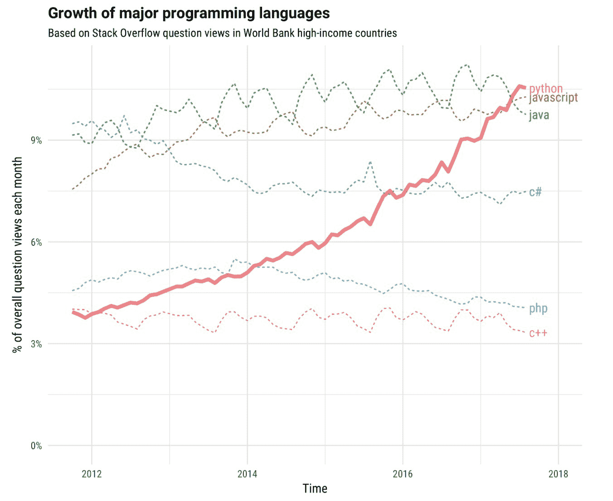

# Python 与 Ruby:异同比较

> 原文：<https://www.stxnext.com/blog/python-vs-ruby-comparison/>

 当面临在两种编程语言 之间做出选择时，选择一种或另一种的最简单方法是问自己你试图实现什么样的业务目标。

钻研给定语言的每一个方面来寻找赢家可能会适得其反，因为尽管某些语言的哲学不同，但它们提供了相似的功能。

在比较 Python 和 Ruby 时，情况确实如此。两者都是通用的高级语言，允许开发者编写  **简洁易读的代码** 来实现  **的相似，高质量的结果**[构建 web 应用](https://stxnext.com/services/python-development/)。

然而，使他们不同的是他们解决问题的方法，他们解决问题的方法这些年来已经发展到包括 web 开发以外的领域。

**在本文中，我们将向您简要介绍 Python 和 Ruby 的主要特点，以帮助您决定哪一个更适合您的下一个软件项目。**

**** 

#### 什么是 Ruby？Ruby 是用来做什么的？

Ruby 是一种解释性的、通用的、开源的、100%面向对象的编程语言。 它是 1995 年由日本的松本幸弘设计创造的。

根据 Matsumoto 的说法，创建 Ruby 背后的指导思想是:

1.  设计一种他自己喜欢的编程语言，
2.  让开发者使用起来更有趣，
3.  限制与使用它相关的人力和工作。

**据说这种语言遵循最小惊讶原则，** 这意味着它以一种对有经验的用户来说最小化混乱的方式运行。

Ruby 有很多 web 框架，Ruby on Rails(有时简称为“Rails”)是最常见的一个。事实上，这个框架如此受欢迎，以至于它被认为传播了对 Ruby 本身的认识。

该语言丰富的第三方库作为“宝石”发布，可以通过一个叫做 RubyGems 的工具安装。这些库托管在公共库[RubyGems.org](https://rubygems.org/)上，也可以在  [GitHub](https://github.com/rubygems/rubygems) 上找到。

虽然 Ruby 是一种通用语言，但 Ruby on Rails 的流行导致这种语言主要用于开发 web 应用程序。

Ruby 也可以成为初创公司的一个很好的工具，因为它允许你快速构建一个原型，并测试最初的想法。

#### Ruby 和 Python 的区别

##### 1.流行

当谈到在程序员中的受欢迎程度时，Python 轻而易举地击败了 Ruby。 尽管有大量的编程语言调查，并且每个调查提供的结果略有不同，但是 [Python](/services/python-development/) 在我们所观察的所有调查中遥遥领先于 Ruby。

在开发者社区最全面、最权威的研究之一[2019 Stack Overflow Developer Survey](https://insights.stackoverflow.com/survey/2019)中，Python 排名第 4，而 Ruby 仅排在第 12 位。然而，也许更重要的是流行趋势。

根据 GitHub 的 Octoverse，Ruby 在该平台用户中的受欢迎程度一直在逐渐下降，贡献逐年减少。这种语言从 2014 年的第 5 位上升到 4 年后的第 10 位。

在存在了近 30 年之后，Python 在发展和用户兴趣方面还没有表现出停滞的迹象。 A [栈溢出预测 Python 从 2017 年](/stx-new-blog/python-vs-ruby-comparison/) 开始向上的人气增长至今成立。

然而，当涉及到 web 开发时，Python 远不如[Ruby on Rails](https://github.com/rails/rails)框架受欢迎。它在 GitHub 上的贡献者几乎是 Django 的两倍，Django 是最流行的 Python web 框架，它提供了与 RoR 相似的功能。

##### 2.需求

需要 Python 或 Ruby 知识的工作的可用性也是衡量其受欢迎程度的一种方式。即使粗略地看一下开发者工作板，如  [栈溢出](https://stackoverflow.com/jobs)，也会发现对**Python 程序员的需求远远超过了对 Ruby 开发者的需求。**

在撰写本文时，这些求职网站上 Pythonistas 的职位空缺是 Ruby 开发人员的五倍:

|   | 红宝石 | Python |
| 领英(欧盟) | [一万四千](https://www.linkedin.com/jobs/search/?geoId=91000000&keywords=ruby&location=European%20Union) | [88500](https://www.linkedin.com/jobs/search/?geoId=91000000&keywords=Python&location=European%20Union) |
| 堆栈溢出作业 | [250](https://stackoverflow.com/jobs?q=Ruby) | [1150](https://stackoverflow.com/jobs?q=Python) |
| 骰子 | [800](https://www.dice.com/jobs?q=Ruby) | [五千八百五十](https://www.dice.com/jobs?q=Python) |
| 的确 | [五千四百五十](https://www.indeed.com/q-ruby-developer-jobs.html) | [30750](https://www.indeed.com/q-python-developer-jobs.html) |

根据时间的不同，结果自然会有所不同，但它们可以让你大致了解这两种语言有多受欢迎和受重视。

##### 3.易用性

Ruby 传奇般的美丽有时被描述为“不可思议的”，因为它让开发人员能够提出创造性的解决方案。  **在 Ruby 中做事的方式往往不止一种，** 都是为了用户的方便。

然而，这个事实不仅允许非常规的解决方案，而且意味着任何错误都难以检测和调试。

**另一方面，Python 是关于可读性和可见性的。** 每  *蟒蛇之禅:* “显不如隐。简单总比复杂好。”

尽管这一原则可能意味着 Python 代码更简单，看起来不像 Ruby 的代码那样“优雅”,但它更容易梳理，也更容易梳理以前未知的代码库。同样，Python 项目也倾向于遵循 PEP8 风格指南，而 Ruby 社区则分成了几个风格稍有不同的部分。

**Ruby 和 Python 都被认为是高度表达性的，** 意为实现程序目标需要较少的代码。来自开源项目 的  [统计信息以及来自被调查开发者](https://redmonk.com/dberkholz/2013/03/25/programming-languages-ranked-by-expressiveness/)的  [数据似乎很好地支持了这一说法。](https://redmonk.com/dberkholz/2013/03/26/some-external-validation-on-expressive-languages/)

**这两种语言都非常灵活，** 将类和模块等基本构造视为不同类型的可变对象。元编程是这个游戏的名字。有了猴子打补丁的能力，各种编码的可能性都出现了。

Ruby 可能被认为更加灵活，因为它允许您替换基本类型上的算术运算符。也就是说，在这两种语言中，即使是动态的代码重写也是可能的，所以天空真的是极限——只是不要指望其他开发人员会宽恕它。

##### 4.社区

Python 和 Ruby 背后都有专门的支持社区，网上也有大量高质量的文档和学习资料。不管给定的开发人员可能在寻找什么样的支持——从视频和播客到论坛——两个社区都提供了优秀的材料。

以下是一些对 Ruby 和 Ruby on Rails 开发人员有用的资源:

*   [Ruby Docs](https://ruby-doc.org/) ，
*   [轨道导轨](https://guides.rubyonrails.org/)，
*   [RubyFlow](http://www.rubyflow.com/) ，
*   [红宝石工具箱](https://www.ruby-toolbox.com/)，
*   [RubyCentral](https://rubycentral.org/) 。

凭借更广泛的用例——从 web [应用到机器学习](https://stxnext.com/machine-learning-applications-examples-industries/) 到科学——**Python 比 Ruby 享有更广泛的社区支持。**

从初级支持到专家建议，像这样的团体和论坛随时准备帮助你:

*   [懒虫](https://pyslackers.com/web)
*   [r/learnpython](https://www.reddit.com/r/learnpython/) ，
*   [Python 论坛](https://python-forum.io/)，
*   [幽门螺杆菌](https://www.pyladies.com/)，
*   [行星巨蟒](https://planetpython.org/)。

 

#### Python 是什么？Python 是用来做什么的？

[Python 是用来做什么的？](https://stxnext.com/what-is-python-used-for/)

就像 Ruby 一样，  **Python 是一种通用的、跨平台的编程语言**， 由吉多·范·罗苏姆在 90 年代创造。

Python 具有高度的灵活性和通用性，这意味着它是各种领域的  [的绝佳解决方案](https://stxnext.com/what-is-python-used-for/)，包括但不限于:

*   [网页开发](https://stxnext.com/services/python-development/)，
*   [机器学习](https://stxnext.com/services/machine-learning/)，
*   [创业公司](/stx-new-blog/why-python-should-be-the-programming-language-for-your-startupwhy-python-should-be-programming-language-your-startup/)，
*   [fintech](/stx-new-blog/web-app-speed-website-performance/) ,
*   [学术界和科学界](/stx-new-blog)，
*   [物联网](https://stxnext.com/what-is-python-used-for/#internet-of-things)。

Python 跨不同用例的应用之所以成为可能，很大程度上要归功于它丰富的  [预建库](/stx-new-blog) 和  [框架](/stx-new-blog/beginners-introduction-python-frameworks/) ，这些库使得实现和部署工作解决方案变得更加容易。

**因为易学、易读、易写，** [Python 在不牺牲可靠性或可伸缩性的情况下加速开发](https://stxnext.com/ebooks/introduction-python-tech-managers/)。Python 易于理解且直观的语法使其成为初学者学习的绝佳语言。

该语言得到了各种教程和指南的广泛支持，以及不断增长的动态爱好者社区的支持。2014 年，它取代 Java 成为美国顶尖大学最受欢迎的入门教学语言。

 

#### Ruby 和 Python 的相似之处

在我们讨论 Python 和 Ruby 的区别之前，让我们先来看看它们的共同点。两种语言都是:

*   高层，
*   服务器端，
*   脚本，
*   跨平台，
*   通用的，
*   动态类型化，
*   成熟，
*   久负盛名，
*   被许多不同领域的顶级科技公司使用(例如，Twitter、Shopify 和 Airbnb 使用 Ruby，而 Spotify、亚马逊和脸书使用 Python)。

#### Python 的利与弊

##### 1.Python 的优势

*   易学易用；
*   具有出色的可读性和类似英语的简单语法；
*   享有一个非常稳定和多样化的社区；
*   有很多用途，包括 web 开发、学术、机器学习、数据分析和科学编程；
*   是开源的，这意味着它可以免费使用和分发，也可以用于商业目的；
*   越来越受欢迎。

##### 2.Python 的缺点

*   尽管它是表达能力最强的语言之一，但由于其显式的风格，与 Ruby 相比，它被认为是不优雅和浪费的；
*   它不是移动环境固有的；
*   作为一种解释型语言，它可能比其他语言要慢。

#### Ruby 的利与弊

##### 1.Ruby 的优势

*   为 web 开发提供了大量现成的特性，
*   给予开发人员应用创造性解决方案的自由，
*   就像 Python 一样，是开源的。

##### 2.Ruby 的缺点

*   它的灵活性意味着很难调试，
*   除了 web 开发之外几乎没有其他用例，
*   拥有比 Python 更小的支持社区，
*   它的受欢迎程度一直在下降。

#### 你的下一个软件开发项目应该使用 Python 还是 Ruby？

考虑到我们到目前为止所讨论的一切，这个问题的答案相当简单: **除非你正在开始一个特别需要你使用或了解 Ruby 的新项目，否则你应该选择 Python。** (当你在做这件事的时候，  [确保你从 Python 3](/stx-new-blog/why-migrate-from-python-2-to-python-3/) 开始。)

无论你能用 Ruby 做什么，你也能用 Python 做。不过，这条规则反过来就不适用了。 Python 在机器学习、学术、统计或数据分析等多个领域有着独特的优势。它的适用范围更广，这让您在决定向项目中添加更多功能时有了更多的回旋余地。

然而，当严格考虑 web 应用程序开发时，Ruby 可能是正确的选择，因为它具有优秀的质量和上市时间。不过，你应该准备好扩展 Ruby 之外的技术栈，以防将来你的需求发生变化。

Python 学习起来也更快。它的可读性和简单的语法使它成为初学者学习的完美语言，或者是希望学习额外技能的更有经验的程序员。当您的团队开发人员需要互相审查代码时，可读性也很有帮助，因为它减少了误解的可能性。

 

#### Ruby 和 Python 的未来会怎样？

##### 1.2020 年及以后的 Ruby

在过去的几年里，有很多关于 Ruby 逐渐消亡的言论。搜索“Ruby 死了吗”会返回无数的博客帖子，年复一年地宣布 Ruby 确实死了。为了省去你一一过目的麻烦，访问 isrubydead.com将为这个迫切的问题提供一个明确的答案。

Ruby 在排名中的位置可能下降了，但它仍然是十大最受欢迎的编程语言之一。如果这一事实是可靠的话，Airbnb 和 GitHub 等大公司仍在继续使用 Ruby on Rails。

这种语言一直在发展，每一个新发布的版本都有改进，使它更快、更简洁。 例如，人们翘首以待的 Rails 6 于 2019 年 8 月发布  [，它搭载了许多新功能，必将使开发者的生活更加轻松。](https://weblog.rubyonrails.org/2019/8/15/Rails-6-0-final-release/)

简而言之: **尽管近年来 Ruby 的受欢迎程度在慢慢下降，但它仍然是一门有着丰富内涵的语言。** 如果你一直在你的项目中使用它，并担心它会过时，现在还没有理由恐慌。

##### 2.2020 年及以后的 Python

Python 是世界上最流行的编程语言之一，它在全球排名中的上升没有停止的迹象。

**Python 人气的大规模飙升，不能归结为单一原因。** 这种语言清晰的语法、多功能性、可用的库和支持社区都在其中发挥了作用。

对人工智能日益增长的兴趣是推动 Python 非凡崛起的另一个因素。由于其灵活性、全面性和对众多科学库的访问——由我们的人工智能专家  [在本文](https://www.datasciencecentral.com/profiles/blogs/how-can-python-help-solve-machine-learning-challenges)中巧妙地描述——Python 是创建机器学习解决方案的开发人员的必备工具。

根据 Stack Overflow 基于高收入国家数据对编程语言增长的分析，  **Python 是增长最快的主要语言。** 特别是最近五年来，其扩张力度空前。

**Stack Overflow: Growth of major programming languages**

正如你所看到的，Ruby 甚至没有进入描述主要编程语言随时间增长的排名。

虽然 Python 的未来最近受到质疑，因为吉多·范·罗苏姆辞去了该语言终身仁慈独裁者的头衔，但社区还是介入进来，找出了治理模式。开发确实停滞了几个月，但新的指导委员会迅速应对了前所未有的挑战。

鉴于 Python 的无处不在及其发展速度，它的未来看起来非常光明。如果你是一个寻找通用语言的项目经理，开始使用 Python 是一个非常安全的选择。

#### 总结:关于 Python 和 Ruby 的最终想法

尽管 Python 和 Ruby 有很多相似之处，但它们也有很多不同之处，熟悉它们可以帮助您决定哪种语言更适合您的下一个软件项目。

如果你只从事 web 应用程序开发，特别是如果你是一家初创公司，选择 Ruby 可能会很好地满足你的需求。然而，如果您希望在未来的扩展方面保持选择的开放性，或者您是一名有抱负的开发人员，试图在当今竞争激烈的市场中选择最好的语言来学习，那么使用 Python 是不会错的。

在选择编程语言时，考虑个人和业务发展的其他标准可能是个好主意。这些可能包括:

1.  性能，
2.  平均工资，
3.  [公司文化](/stx-new-blog/why-are-company-values-important-and-how-we-defined-ours/)(令人惊讶的是，它可能会对给定公司为其项目选择的编程语言产生重大影响)。

对于 Ruby 和 Python 来说，它们有些相似，但是尽可能多的考虑将会使你的决定更加明智。

你认为我们也应该考虑其他因素吗？也许我们已经错过了 Ruby 或 Python 的一些隐藏的优点或缺点，你会发现相关的吗？请留下您的评论，我们会尽快回复您。

如果您希望了解更多关于 Python 的知识，以及它与其他编程语言和框架相比如何，我们鼓励您查看以下资源:

*   [Python vs .其他编程语言](https://stxnext.com/python-vs-other-programming-languages/)
*   [Python 是用来做什么的？](https://stxnext.com/what-is-python-used-for/)
*   [面向技术经理的 Python 介绍](https://stxnext.com/ebooks/introduction-python-tech-managers/)

