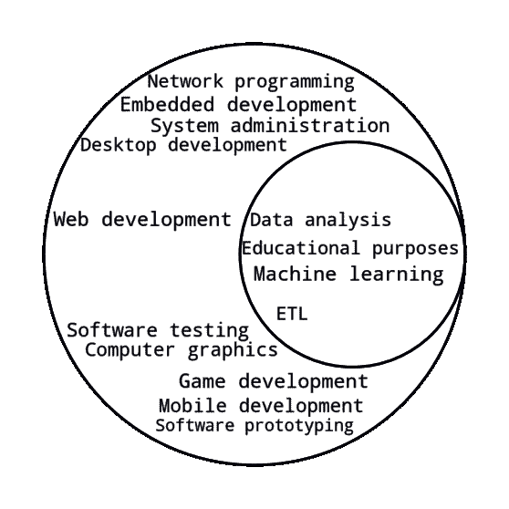

# R vs . Python:R 和 Python 真正的区别是什么？

> 原文：<https://www.stxnext.com/blog/r-and-python-comparison/>

 数据迅速扩散到我们的生活中，导致了用于分析和提取这些信息中有价值见解的工具的出现。 [Python](/services/python-development/) 和 R 是两种最流行的用于剖析数据的编程语言。如果你正在尝试一个新的数据科学项目，在它们之间做出选择可能会很有挑战性。

R 和 Python 都是最先进的，它们都致力于数据科学的卓越发展，因此很难做出选择。如果您使用维恩图来映射这两种语言的能力，您将会看到在以数据为中心的领域中有很多趋同之处。

然而，Python 和 R 各有优缺点。他们还采用不同的方法来开发代码和共享结果。

学习 Python 和 R 显然是选择正确语言的理想解决方案。为了帮助你做到这一点，我们写了这篇文章。下面我们就来讨论:

*   **两种语言的异同，**

*   **各自的优缺点，**

*   他们的未来是怎样的。 

#### R 是什么？R 是做什么用的？

R 由 Ross Ihaka 和 Robert Gentleman 在二十多年前开发，是一种开源编程语言和免费软件，拥有最丰富的生态系统来执行统计分析和数据可视化。

r 提供了大量的统计和图形方法，包括线性回归、时间序列、机器学习算法、统计推断等等。此外，它为数据报告提供了复杂的数据模型和复杂的工具。

在数据科学学者和研究人员中很受欢迎，几乎有一个库可供您执行任何分析。事实上，大量的库使 R 成为统计分析的首选，特别是对于专门的分析工作。许多跨国公司使用 R 编程语言，如脸书、优步、Airbnb、Google 等。

使用 R 进行数据分析只需几个简单的步骤——编程、转换、发现、建模，然后交流结果。当谈到交流发现时，这是 R 真正脱颖而出的地方。r 有一系列奇妙的工具，允许以演示或文档的形式共享结果，使得报告既优雅又简单。

通常，R 在 RStudio 中使用，R studio 是一个 [集成开发环境(IDE)](/blog/best-python-ides-code-editors/) ，它简化了统计分析、可视化和报告。但这并不是运行 R 的唯一方式，例如，R 应用程序可以通过 Shiny 在网络上直接交互使用。

#### Python 是什么？Python 是用来做什么的？

Python 是一种面向对象、通用的高级编程语言，于 1989 年首次发布。它通过大量使用空白来强调代码的可读性。总而言之，它以一种相对直观的方式编写和理解， [使 Python 成为那些寻求快速开发的人的理想编码语言](/what-is-python-used-for/) 。

一些世界上最大的组织——从美国宇航局到网飞，Spotify，谷歌等等——以某种形式利用 Python 来支持他们的服务。根据 [TIOBE 指数](https://www.tiobe.com/tiobe-index/) ，Python 是世界上第三大流行的编程语言，仅次于 Java 和 c，各种原因促成了这一成就，包括 Python 的易用性，其简单的语法，蓬勃发展的社区，以及最重要的多功能性。

Python 可以用于各种项目，从 [数据分析](/services/data-engineering/) 和可视化到 [人工智能](/services/machine-learning/) ，语言开发， [设计](/services/product-design/) ，以及 [web 开发](/services/web-development/) 。

Python 特别适合大规模部署机器学习，因为它有包含 TensorFlow、scikit-learn 和 Keras 等工具的库，这些工具允许创建可以直接插入生产系统的复杂数据模型。

此外，许多 [Python 库](/blog/most-popular-python-scientific-libraries/) 支持数据科学任务，如下所示:

*   Astropy—一个功能强大的图书馆，非常适合在天文学中使用
*   **Biopython**—一个非商业 python 工具的集合，用于表示生物序列和序列注释
*   **Bokeh**—一个 Python 交互式可视化库，有助于快速创建交互式绘图、仪表盘和数据应用程序
*   **DEAP**——一个完美的计算框架，用于快速原型制作和想法测试

(寻找更多有用的 Python 科学库的例子？ [在我们的博客](/blog/most-popular-python-scientific-libraries/) 上阅读关于他们的所有信息。)

#### R 和 Python 的区别

如果您计划在下一个软件项目中选择 Python 或 R，那么了解这两种语言的不同特性非常重要，这样您就可以做出明智的决定。下面是 R 和 Python 之间的主要区别。

##### 1.学习曲线

一般来说，学习的难易程度主要取决于你的背景。

由于 r 语言的非标准化代码，初学者很难掌握。即使对一些有经验的程序员来说，这种语言看起来也很笨拙。另一方面，Python 更容易，具有更平滑的学习曲线，尽管统计学家经常觉得这种语言专注于看似不重要的事情。

因此，对于您的数据科学项目来说，正确的编程语言应该是看起来更接近您习惯的数据思维方式的语言。

例如，如果你更喜欢简单和省时，那么 Python 可能对你更有吸引力。这种语言需要更少的编码时间，因为它的语法与英语相似。

伪代码要成为 Python 程序，唯一需要做的事情就是将它保存在. py 文件中，这是一个流传已久的笑话。这使您可以快速完成任务，从而有更多时间使用 Python。此外，R 的编码需要较长的学习时间。

##### 2.流行

Python 和 R 都很流行。然而，Python 比 R 有更广泛的受众，与 Python 相比，R 被认为是一种合适的编程语言。如前所述，许多组织将 Python 用于他们的生产系统。

另一方面，r 通常用于学术界和研究行业。尽管行业用户喜欢 Python，但由于它在数据操作方面的能力，他们也开始考虑 R。

##### 3.包装

R 和 Python 都提供了数千个开源包，您可以在下一个项目中随时使用。

r 提出了一个 CRAN 和数百个备选包来执行单个任务，但是它们不太标准化。因此，API 和它的用法有很大的不同，很难学习和组合。

此外，高度专业化的 R 语言包的作者通常是科学家和统计学家，而不是程序员。这意味着结果只是一套为特定目的设计的专门工具，如 DNA 测序数据分析或甚至广义的统计分析。

然而，R 的包不像 Python 那样混搭。目前，人们正在尝试编排工具套件，如 tidyverse，它将工作良好的包集合在一起，并使用相似的编码标准。就 Python 而言，它的包更加可定制和高效，但是它们通常不太适合数据分析任务。

然而，Python 确实提供了一些可靠的数据科学工具，如 scikit-learn、Keras (ML)、TensorFlow、pandas、NumPy(数据操作)、matplotlib、seaborn 和 plotly(可视化)。另一方面，r 有 caret (ML)、tidyverse(数据操作)和 ggplot2(非常适合可视化)。

此外，R 为快速应用程序部署提供了亮点，而使用 Python，您将不得不付出更多的努力。Python 还有比 R 更好的集成数据库的工具，最重要的是 Dash。

简而言之，如果您计划构建一个成熟的应用程序，Python 将是理想的选择，尽管这两种选择都适合用于概念验证。r 附带了用于统计目的的专用包，而 Python 在这一特定领域并不那么强大。此外，R 非常擅长处理大多数流行数据存储中的数据。

这里值得一提的另一个方面是可维护性。Python 允许你创建、使用、破坏和复制一个野生的、充满活力的环境，每个环境都安装了不同的包。对于 R，这恰好是一个挑战，只是由于包的不兼容性而加剧。

专家经常使用 Jupyter Notebook，这是一种流行的工具，用于脚本编写、快速探索和类似草图的代码开发迭代。它支持 R 和 Python 的内核，但值得一提的是，该工具本身是在 Python 生态系统中编写和起源的。

##### 4.形象化

r 是为数据分析和可视化而明确创建的。因此，它的可视化比 Python 丰富的可视化库更容易看到，而 Python 丰富的可视化库使可视化变得复杂。在 R 中，ggplot2 使得定制图形比在 Python 中用 Matplotlib 更简单、更直观。

但是，您可以使用提供标准解决方案的 Seaborn 库来解决 Python 的这个问题。Seaborn 可以帮助您用相对较少的代码行实现类似于 ggplot2 的绘图。

总的来说，对于哪种编程语言更好地高效、清晰和直观地创建情节，存在争议。适合您的理想软件取决于您个人的编程语言偏好和经验。最终，你可以同时利用 Python 和 R 来清晰地可视化数据，但 Python 比数据可视化更适合深度学习。

##### 5.速度和性能

Python 是一种高级编程语言，这意味着如果您计划快速构建关键应用程序，它是最佳选择。另一方面，即使是简单的过程，R 也经常需要较长的代码。这大大增加了开发时间。

说到执行速度，Python 和 R 之间的差别微乎其微。这两种编程语言都能够处理大数据操作。

尽管 R 或 Python 不如某些编译编程语言快，但它们通过允许基于 C/C++的扩展来规避这个问题。此外，两种语言的社区都实现了利用这一特性的数据管理库。

这意味着 Python 和 R 中的数据分析可以以类似 C 的速度进行，而不会失去表达能力或处理内存管理和其他低级编程概念。

#### Python 与 R:优缺点

Python 和 R 各有利弊。其中一些是显而易见的，而其他的很容易被忽略。

##### R 的优势

*   对于专业程序员来说，r 是一种舒适而清晰的语言，因为它主要是为数据分析而创建的。因此，大多数专家都熟悉这种语言是如何工作的。
*   检查统计假设只需要几行 R 代码，因为数据分析所需的许多函数都是内置语言函数。(但是请记住，这是以牺牲可定制性为代价的。)
*   RStudio (IDE)和其他基本的数据处理软件包易于安装。
*   r 有许多数据结构、参数和操作符，涉及很多东西——从数组到矩阵、递归和循环，以及与其他编程语言如 Fortran、C 和 C++的集成。
*   r 主要用于统计计算。它的一个主要亮点是为机器学习工程师和顾问提供的一套算法。此外，它还用于分类、线性建模、时间序列分析、聚类等。
*   r 为几乎所有类型的数据科学和机器学习提出了一个有效的包存储库和一系列广泛的现成测试。
*   对于各种任务的数据可视化，有多种质量包。例如，用户可以构建二维图形和三维模型。
*   基本的统计方法作为标准函数执行，提高了开发速度。
*   有了 R，你可以为每种口味找到许多额外的包——无论你想要一个来自 Twitter 的数据包还是一个用于模拟污染水平的包。每天，越来越多的包裹到达市场，所有的包裹都被收集在同一个屋檐下:特殊的克兰仓库。

##### R 的缺点

像任何其他编程语言一样，R 也有一些缺点。

*   通常，R 编程语言的性能很低，尽管您仍然可以在系统中找到允许开发人员提高速度的包。
*   与其他编程语言相比，R 是高度专业化的，这意味着除了数据处理之外，它的技能不能轻易应用于其他领域。
*   由于 R 中的大部分代码是由不熟悉编程的人编写的，相当多的程序的可读性是有问题的。毕竟，不是每个用户都坚持正确的代码设计准则。
*   r 是统计和独立应用程序的完美工具。然而，在使用传统通用语言的领域，它并不那么有效。
*   您可以以不同的方式使用 R 的相同功能，但是几个任务的语法并不完全清楚。
*   由于有大量的 R 库，一些不太流行的库的文档不能被认为是完整的。

##### Python 的优势

Python 因其简单而被广泛使用，但这并不意味着它的功能性很低。

*   作为一种多用途语言，Python 非常适合数据处理。这种语言非常方便，特别是因为它简化了数据处理管道的开发，将结果合并到 web 应用程序中。
*   程序员发现 Python 特别有益，因为它的交互性对于在数据科学中交互式地测试假设是至关重要的。
*   Python 正在积极开发中。每个新版本的性能和语法都在不断改进。例如，3.8 版本新增了一个 walrus 操作符，这对于任何语言来说都是一件大事。在 Java 和 C++等其他语言中，变化的速度相对较慢——变化需要得到每隔几年召开一次会议的特别委员会的批准。Python 的变化是由 PEPs 提出的，即使在一个发布周期(一年)后，也经常会将其融入语言中。简单地说，这意味着 Python 比 r 发展得更快。

##### Python 的缺点

*   在选择数据分析软件时，可视化是您应该考虑的一项重要功能。然而，虽然 Python 有大量的可视化库列表，但选择单一选项可能会让人不知所措。此外，Python 中的可视化通常比 R 中的更复杂，其结果有时也不完全清楚。
*   Python 缺乏大多数 R 库的替代品，这使得统计数据分析和/或 R 到 Python 的转换具有挑战性。

#### Python 和 R 的未来

就编程语言而言，不可否认 Python 很热门。尽管 Python 是作为通用脚本语言创建的，但它很快发展成为数据科学领域最流行的语言。有些人甚至开始提出，R 是注定的，注定最终会被 Python 完全取代。

然而，虽然 Python 看起来似乎在消耗 R，但 R 语言还远未消亡。不管反对者怎么说，R 正在数据科学领域强势回归。流行指数继续显示这种编程语言的反复复苏，并证明它仍然是数据科学项目中考虑的强有力的候选语言。

自问世以来，R 在数据科学领域的受欢迎程度一直在上升。从 2008 年 12 月的第 73 位，到 2021 年 8 月，在 [TIOBE 指数](https://www.tiobe.com/tiobe-index/) 中，R 成为第 14 位^(最受欢迎的语言。另一方面，Python 今年从 Java 手中接过了第二的位置，创下了 11.86%的人气评分。同时，R 的受欢迎程度为 1.05%，比上一年下降了 1.75%。)

Dice Insights 的高级编辑 Nick Kolakowski 说:“虽然 R 仍然被学者和数据科学家使用，但对数据分析感兴趣的公司正转向 Python，因为它的可扩展性和易用性。”“依靠少数学者而不是其他人的使用可能不足以让 R 继续存在。那是不可行的，”他写道。

同样，DataCamp 的联合创始人 Martijn Theuwissen 也承认 Python 有发展势头。然而，他否认 R 已经死亡或即将死亡的说法。据他说，“关于 R 下降的报道被大大夸大了。如果你看看 R 的增长，它还在增长。根据我的观察，Python 发展得更快。”

许多其他数据点也表明，Python 多年来的成功是以牺牲 r 为代价的。然而，衡量一种语言的受欢迎程度是一项极其困难的任务。几乎每种语言都有一个自然的生命周期，没有简单的方法来确定它们的生命周期何时结束。最终，没有办法预测任何给定语言的确切未来。

#### 关于 R 与 Python 的总结和最终想法

Python 和 R 都是高级的开源编程语言，是数据科学和统计学中最流行的语言之一。然而，R 更适合传统的统计分析，而 Python 更适合传统的数据科学应用。

Python 是一种简单的、设计良好的、功能强大的语言，它是为 web 开发而设计的。然而，它在数据科学项目上仍然是高效的。

Python 相对容易学习，因为它专注于简单性。所以，如果你有合适的工具和库，这种语言可以毫不费力地带你从统计学到数据科学，甚至到一个成熟的生产应用。事实上，这是使用 Python 最显著的优势之一。

此外，与 JavaScript 等其他编程语言不同，Python 的框架选择并不多。因此，你将能够创建一个实用可靠的工具箱，而不用担心你没有使用最新的技术。

另一方面，R 最显著的优势是高度专门化的包的存在，这些包可以带您毫不费力地通过不那么可定制的数据操作管道。然而，R 是为统计计算而创建的，没有经验的人会发现最初很难使用这种语言。

尽管如此，还是有一些你可以同时使用两种语言的例子。例如，您可以通过 r2py 在 Python 代码中使用 R。当您将计算外包给 r 时，这尤其有益。

如果您有兴趣了解更多关于 Python 的知识，这里有一些我们的资源可以帮助您:

*   [Python vs .其他编程语言](https://www.stxnext.com/python-vs-other-programming-languages/)
*   [Python 是用来做什么的？](https://www.stxnext.com/what-is-python-used-for/)
*   [让你开始学习 Python 的十大博客](https://www.stxnext.com/blog/top-10-blogs-python/)
*   [如何审核你的 Python 代码的质量:一步一步的指导](https://www.stxnext.com/blog/how-to-audit-the-quality-of-your-python-code)

在 STX Next，我们利用 Python 成功地交付了独特且高度定制的 [web 开发项目](https://www.stxnext.com/services/web-development/) 。我们的程序员专家团队利用他们在行业中的丰富经验和知识，将 Python 融入到 [各种 web 应用](https://www.stxnext.com/services/) 中。所以，如果你需要 Python 专家，你知道你可以依靠我们。

如果您希望 [讨论您的下一个软件项目](https://www.stxnext.com/hire-us) ，请今天联系我们！