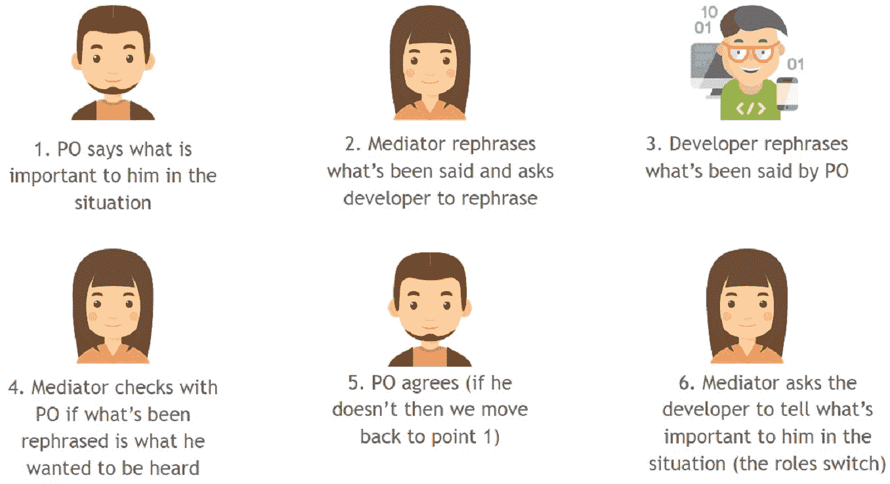

# 使用非暴力沟通解决团队中的冲突

> 原文：<https://www.stxnext.com/blog/resolve-conflicts-your-teams-using-nonviolent-communication/>

 不久前，我听到一位开发人员分享他的智慧:“解决技术问题比解决个人问题要容易得多。”

听到这件事很令人吃惊。我不认为这是一个流行的说法，尤其是一个有编程背景的人。另一方面，这听起来像是一件很自然的事情:技术问题是合理的，我们可以使用我们的推理技能来解决它们。唯一的问题是，你是否有能力用抽象的术语来思考，以找到解决方案。

个人问题，或者让我们称之为冲突，是独特的。它们往往不合逻辑，没有简单的模式来解决它们，而且我认为，我们没有受过处理它们的训练。 

#### 冲突对话的一个例子

让我们看看下面这个团队冲突的例子。假设人们在会议上的行为方式存在一个持续的问题。在每次会议中，通常有 2-3 个人很活跃，还有 2-3 个人大部分时间什么都不说，他们一直在使用手机。

典型的冲突对话可能是这样的:

**人甲:** 嘿！你能停止偷懒，开始为会议做贡献吗？我讨厌你用电话不尊重我们。

如果我们讨论一些有意义的事情，我会更积极。这些会议很愚蠢，没有带来任何价值，而且数量太多。我们可以做些真正的工作。

**人甲:** 如果你认为你能比我们做得更好，为什么不组织下一次会议呢？我们会看到你的会议有多聪明。

**人 B:** 组织会议不是我的工作。如果你叫我来，那么至少给我一些尊重，让我们讨论一些不愚蠢的事情。否则我不会在你身上浪费更多的时间。

很容易猜测这将走向何方。我敢打赌，大多数人都有机会目睹这样的对话。 **如果冲突长时间得不到解决，组织一次调解会议可能是有益的。**

为了确保我们的术语定义明确:  [调解](https://en.wikipedia.org/wiki/Mediation) 是一个动态、结构化、互动的过程，其中中立的第三方通过使用专门的沟通和谈判技巧来协助争端各方解决冲突。

然而，传统的调解方法和非暴力沟通激发的调解之间有着明显的区别。我们来看看两者来比较一下。

#### 经典冲突调解

如果我们看看工人在议会前抗议时使用的典型冲突调解，我们会注意到这是一个典型的过程。通常，抗议者首先会向政府提出一系列要求。清单上的要点可能包括加薪、改善社会福利、更好的工作时间等。

**调解人的作用是将这些要求传达给政府代表，并听取他们的反应。**在大多数情况下，政客们会接受列表中的几个点，拒绝其他点。

简单来说，假设在第一轮中，政府接受 30%的需求。下一步是将回应带回给抗议者。

在这一点上，工会会说:“我们知道他们不会接受完整的名单，但我们不准备在只接受 30%的要求的情况下停止抗议。他们接受 80%我们就同意”。

调解人带着新的提议回到政府。谈判一轮又一轮地进行，直到双方达成妥协。在上面这个简化的例子中，我们可以想象最后的结果是 50%的需求被接受。

这种调解背后的目标是让人们接受既定的解决方案。 **目标不是让人们对解决方案感到满意。** 当双方都放下各自 50%的期望时，很有可能他们会对结果相当沮丧，即使他们接受了。

#### 非暴力沟通激发的调解(NVC)

与传统方法不同，非暴力沟通将调解定义为一个旨在建立共识的过程，而不是冲突双方的妥协。

调解人的作用是让人们真正听到对方的需求是什么。NVC 的缔造者马歇尔·罗森博格(Marshall Rosenberg)说过, **如果双方都理解他们视为对手的人民的需求，就有可能在 20 分钟内解决世界上的所有冲突。**

在这种方法中，调解人并不关注其中一方可能提出的最终解决方案。他们应该促进对话，引导对话，让人们敞开心扉去倾听，真正听到别人在说什么。

##### NVC 的调解进程

有一个明确的框架来支持调解人促进各方之间的会面。如果我们想象一个冲突发生在一个 Scrum 团队中，发生在一个产品负责人和一个开发人员之间，那么这个框架应该是这样的:

(好奇产品负责人在成功的产品开发中扮演的角色？根据资历了解更多关于[产品负责人职责](http://bit.ly/stxpowner)的信息。上图中的图标由 [Flaticon](https://www.flaticon.com/) 提供。)

框架就是这样。让我们试着用一个对话的例子来说明它:

**调解员:** 嗨约翰(阿宝)！你能说说在这种情况下什么对你来说是重要的吗？

**阿宝:确定。对我来说最重要的是让这个家伙准时参加每日的比赛。他经常迟到，打乱了我们的计划。**

据我所知，准时参加会议对你来说很重要。是这样吗？

**PO:当然，我就是这个意思。**

**M:** Mark(开发者)，您能重复一下您刚刚听到的对约翰很重要的内容吗？

开发商: 我听说他希望人们准时开会。

约翰，这是你想听到的吗？

**PO:对，就是它。**

**M:**马克，该你了。你能告诉我们在这种情况下什么对你来说是重要的吗？

**D:确定。我希望人们理解我有孩子，我需要在早上开车去学校，我无法预测交通会如何影响我的工作方式。有时候又好看又顺滑。其他日子很糟糕，然后我每天都迟到。我希望人们表现出一些同情心，而不是生我的气。**

马克，我听说你每天早上都送孩子去上学，因此很难预测交通状况会对你的乘车时间产生多大影响。我还听说你希望人们理解你协调你的职责有多困难，并给你一些同情。是这样吗？

**D:**对，就是它。终于有人听到我在说什么了。

约翰，你能重复一下对马克来说什么是重要的吗？

你已经可以看到这个过程是如何进行的。

你可能会问自己，如果我们不就此打住，这场对话会如何进行下去。说实话，它可能会向许多方向移动。

但重要的是，约翰和马克已经重复了对他们每个人都重要的事情，让他们彼此更亲近。调解过程可能会持续一段时间，直到双方都明白对方要说什么。

至关重要的是，调解人试图将对话转移到需求层面，并考虑人们可能有的策略。如果 John 和 Mark 了解了他们各自的需求，他们很可能会自然而然地找到解决问题的策略。他们可以开始建立共同点，而不是将精力投入到持续的斗争中。

#### 摘要

这是关于使用非暴力沟通调解的基础知识。请记住:调解的主要目标是让双方清楚地了解对方的需求，不要有不必要的判断或偏见。

如果你将来需要的话，我希望你能记住上面的框架。你会惊讶于 NVC 是如何帮助化解一些非常紧张的分歧的。

然而，有些冲突是可以很容易避免的。你所要做的就是采取适当的步骤做好准备，例如在项目启动时。我已经在另一篇文章中讲述了 [如何组织一个伟大的项目启动](http://bit.ly/stxkickoff) ，以及 PDF 格式的 **免费样本议程和启动清单。** 点击链接，了解如何以尽可能少的冲突开始你的项目。

在可预见的未来，这可能是我在 STX Next 博客上的最后一篇文章。我希望你喜欢它！如果您有任何问题，请务必[通过 LinkedIn](http://bit.ly/2xwHEf7) 与我联系，让我们继续对话。回头见！

