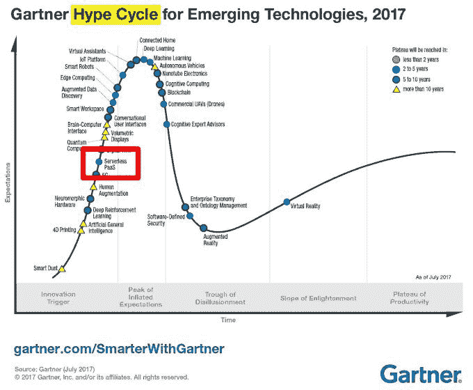
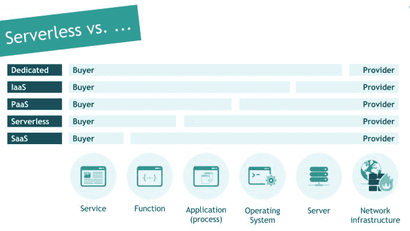
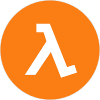

# 无服务器计算说明:与 SaaS、IaaS、PaaS 比较功能和价格

> 原文：<https://www.stxnext.com/blog/serverless-computing-explained-comparing-features-and-pricing-saas-iaas-paas/>

 当你考虑托管你的应用程序时，你希望它尽可能的简单。

毕竟，你已经踏上了[创造软件](https://stxnext.com/ebooks/what-is-python-used-for/)的道路，这将改变你的组织、你的社区——甚至可能是整个世界。(此处无需谦虚！)

在通往伟大的道路上，没有容忍挫折的余地。

每个人都希望有一个易于快速部署特性的托管解决方案。它还应该具有成本效益，让您的底线满意，并释放资源用于开发。

这正是我们想要向您介绍无服务器的原因。我们在格但斯克的服务交付负责人 Wojtek Lichota 最近在这个令人兴奋的问题上启发了我。我在这里分享我所学到的。

**在本文中，我们将解释:**

*   **无服务器到底是什么；**
*   **与 PaaS、IaaS 等其他托管解决方案相比如何；**
*   **您何时能从无服务器定价模式中获益。**

**** 

#### 为什么您应该关心无服务器？

这是最迫切需要回答的问题，因为 Serverless 要来了。对它的宣传越来越多。

调查 IT 市场的主要分析公司 Gartner 发布了他们的年度新兴技术炒作周期报告。你可以看看这张图片，看看接下来会发生什么:

炒作周期是如何运作的？在图中，无服务器被许多其他技术包围着，每种技术都处于周期的不同阶段。简而言之:

1.  第一，炒作增长；
2.  然后，达到峰值；
3.  然后，人们开始看到问题并提出批评；
4.  最后，他们找到了让它工作的方法——技术成熟了。

以区块链为例，它已经过了峰值。现在，对区块链的炒作正达到顶峰。几乎每一家我们与之交谈的科技公司都想了解区块链。深度学习和物联网也是如此。

对于无服务器计算，宣传才刚刚开始，这意味着你可以早点参与进来。

公平地说，无服务器计算模式并不是一个全新的想法，至少已经有 3-4 年的历史了。但直到最近，它还只是在技术专家、开发人员和 DevOps 专业人员之间讨论。

**现在，无服务器开始进入更广泛的 IT 对话。** 你该如何反应？

至少，你应该明白每个人很快会想到什么。但更重要的是，您可能希望在项目中实现无服务器架构。

因此，要了解最新信息，您应该了解无服务器。

如果你正在寻找一种不需要 DevOps 技能就能轻松创建应用的方法，你尤其应该继续读下去。

#### 什么是无服务器模式？

##### **无服务器之路**

无服务器这个名称可能会有点误导。当我们谈论无服务器时，我们不仅仅是在谈论服务器，而是在谈论整个云生态系统。

解释无服务器最简单的方法是从历史的角度来看。

很久以前，你主要与 **专用服务器** **打交道。**要托管您的应用程序，您必须购买一整台服务器，将其放置在服务器机房中。整个服务器都是你的，你有责任让它正常工作。

可以想象，这有点麻烦，尤其是当你真正想要的是构建你的应用，而不是花时间更新和维护你的服务器的时候。

作为对此的回应，——或基础设施即服务——诞生了。在 IaaS 中，服务器不再是你的了；是提供商的。你所要担心的就是设置操作系统、应用程序本身、它的功能和服务。IaaS 解决方案的一个例子是 **AWS EC2** (或亚马逊 Web 服务弹性计算云)。[new able Business Finance](https://stxnext.com/portfolio/newable/)是我们有机会在实践中应用 IaaS 的一个项目。

但是如果你和我一样，在你的 DevOps 中听起来还是太多了。

所以下一步是平台即服务: **PaaS 。**在这里，操作系统站在了提供商一边。你所要做的就是创建应用程序，而提供商则担心操作系统的更新和安全问题。一个例子是  **谷歌应用引擎、**，我们已经使用它们与客户端合作，例如[key ingredient](https://stxnext.com/portfolio/keyingredient/)。

##### **无服务器架构:从应用级到功能级**

现在我们进入  **无服务器**的下一个逻辑步骤。

当你的软件使用无服务器架构时，你不必创建整个应用程序。相反，您只创建应用程序的单个功能，而管理功能的应用程序层位于提供者一侧。

这意味着提供商处理缩放，并确保应用程序不同部分之间的正确信息交换，因此您不必担心这一点。在无服务器中，您和您的开发人员只关心创建功能。这难道不应该是发展的全部吗？

##### **无服务器与软件即服务(SaaS)**

最后，镜像上的最后一个模型是****【SaaS】****或者软件即服务。在这里，整个软件都在提供者一方。作为购买者，你得到的是服务，也就是软件实际做的事情。****

 ****SaaS 应用程序现在非常受欢迎，你可能正在使用其中的一些。想想 Dropbox、Salesforce、网飞、Google Apps 等等；如果你为他们付费，你只能得到他们提供的服务。

然而，我们需要在这里对使用 应用程序的 **和构建** 应用程序的 **进行重点区分。**

从用户的角度来看，网飞可能会被 SaaS 打败——毕竟，你只是想看  *更陌生的东西*。

但是当你建立一个像网飞这样的服务时，你至少需要使用一个无服务器的模型来为应用程序增加更多的功能。如果你想对应用程序的构建和托管有更多的控制，你可以使用 PaaS 或 IaaS。

让我们考虑一个不同的例子: [Foodpanda](https://www.foodora.com/) 。从用户的角度来看，这是一个典型的软件即服务:服务帮助你点餐。但是在构建它时，您可以:

*   在像 Django 这样的框架中创建整个服务，然后在一个  **专用服务器，**上托管它
*   用 Django 写，用一个虚拟的**IaaS**服务器，
*   将操作系统留给提供商，使用类似谷歌应用引擎的东西，即  **PaaS 、**或
*   以  **无服务器** 的方式编写函数，并通过例如 Amazon Lambda 托管它。

但是请记住:作为 Foodpanda 的用户，你并不关心。你只想要服务。

 

##### **无服务器与其他型号的扩展**

现在，让我们考虑一下您的成本将如何在每个模型中扩展。

Foodpanda 有一系列的功能:你列出餐馆，根据你的口味过滤，选择你的菜，选择额外的配料，最后处理你的付款。

借助 PaaS/IaaS，您可以构建一个拥有所有功能的应用程序:列表、菜单和订购。

有了无服务器，你可以把它分解成几个功能(或者是 Amazon Lambda 的 Lambdas)。你不把它们组合成一个 app，而是分别发给提供商，提供商构建 app。

提供商还处理缩放。如果经常使用菜单功能，但订购并没有看到那么多请求，**提供商可以单独缩放每个功能** **。**因此，流行菜单功能将获得更大的处理能力，但订购仍将保持相同的水平。

而在 PaaS/IaaS 中，您负责配置应用程序来处理负载并具有可扩展性。不同之处在于，为了确保适当的扩展，您需要 DevOps 人员在您身边，而在无服务器中，像 Amazon 这样的提供商处理所有这些。

**TL；DR:无服务器架构允许您关注应用程序的代码，而不是代码在服务器上如何执行。**

##### 如果我外包，我应该关心无服务器吗？

当然，我们不能不提外包的场景。作为客户，你雇佣一家软件公司来为你处理软件创作。在某些情况下，您可能会要求软件公司也处理开发运维，即配置服务器、将应用部署到服务器、持续集成等。

**有了无服务器，DevOps 就不在话下了**—你的软件公司再也不用这么做了。不过，你为什么要在乎呢？

因为在某些时候，你可能想把开发工作转移回内部，你的员工也不需要做开发工作。

但最重要的是，你应该关心，因为在内部和外包场景中，无服务器往往是经济高效的解决方案，尤其是对于没有大量用户的应用程序。接下来我们来谈谈这个。****  ****#### 定价:无服务器如何为您省钱

考虑无服务器的最后一个原因是其灵活的定价模式。

在 IaaS/PaaS 中，你需要为你的应用程序工作并提供给用户的时间付费。如果你拥有 Foodpanda，并希望它 24/7 可用，那么你需要为它在线和等待用户连接的每个小时付费。重要的是，不管服务器/应用程序是否在使用，你都要继续付费。要进行扩展，您必须添加新的虚拟机(IaaS)或创建新的应用程序实例(PaaS)。

对于 Foodpanda 来说，这很好；该网站可能每天每分钟都有人在使用。

但是如果你的应用还不是人气俱乐部的主席呢？

在无服务器模式下，如果 Foodpanda 有半个小时没人用，你不用为此付费。更实际的情况是，你可以拥有一个员工通常在工作时间使用的办公应用。这会让你整晚“无聊地坐着”，但对于那些在凌晨 2 点迫切需要查看一些东西的员工来说，这仍然是可行的。在这种情况下，无服务器是理想的，因为你只需为你的应用程序实际使用量付费。

我说的“应用程序的使用量”是什么意思？使用无服务器模式，你需要为应用程序收到的请求量以及 CPU 和 RAM 工作的毫秒数付费。

##### **AWSλ**

我们以亚马逊的 AWS Lambda 为例进行定价。

Lambda 是目前最流行的无服务器解决方案。对我们(和你的 Python 项目)来说重要的是，Lambda 兼容 Python 2.7 和 3.6。

那么 AWS Lambda 的定价是多少呢？以下是直接来自官方  [AWS Lambda 页面](https://aws.amazon.com/lambda/pricing/)的概述:

##### **AWS Lambda 定价**

*   大约 100 毫秒。
*   每月前 1，000，000 个请求是免费的。
    *   之后，你需要为每个请求支付 0.0000006 美元。
*   前 400，000 GB 秒是免费的。
    *   之后，你需要为每 GB 秒支付 0.00005001 美元。

请特别注意“自由层”使用 Lambda，您的前 1，000，000(也就是 100 万)个请求和前 400，000 GB 秒是完全免费的。之后，你的应用程序使用的每一个请求和每一个 GB 秒都会被计算在内——你只需为此付费。

这个限制每个月都会重新设置。相当慷慨，不是吗？

##### **比较 Lambda 和 EC2 (IaaS)之间的成本**

当然，无服务器并不是适合所有情况的解决方案。在某些情况下，像 EC2 这样的 IaaS 解决方案可以为您提供更好的服务。这取决于你的应用获得的关注度。

无服务器 vs IaaS 的断点在哪里？看看这个表格，基于安迪·沃松的中期文章 [AWS Lambda 定价:与 EC2](https://www.trek10.com/blog/lambda-cost/) : 的比较

| **功能执行
记忆&时间** | **请求每小时所需的λ成本等于
EC2 (m4.large)成本** | **每秒请求数** |
| **100 毫秒@ 128 MB** | **29.5 万** | **81.9** |
| **200 毫秒@ 512 兆字节** | **64000** | **17.8** |
| **200 毫秒@ 1 GB** | **34000** | **9.4** |
| **1gb 时 1 秒** | **7100** | **2.0** |

最重要的部分在最右边:如果你的应用每秒收到超过 81.9 个请求(24/7)，那么 IaaS 成为首选解决方案。如果比这更低，Lambda 的性价比更高。

让我们计算一下。以第一行为例，其中每个请求需要 100 ms 和 128 MB RAM 来处理。每天，你需要平均每秒 81.9 个请求，乘以一分钟 60 秒，乘以一小时 60 分钟，乘以 24 小时…

*81.9 * 60 * 60 * 24 = 7，076，160 个每日请求*

**基于这些假设，您的应用程序每天需要超过 700 万个无服务器请求，比 IaaS 更昂贵。**

换句话说，你的应用需要真的，  *真的*受欢迎，因为 Lambda 是一个糟糕的选择。即使普通用户通常每次访问都会发出多个请求，您仍然需要成百上千的用户来达到这个数字。

让我们最后一次以 Foodpanda 为例。作为典型用户:

*   你访问这个网站，
*   列出你附近的餐馆，
*   查看 5-10 家餐厅，
*   也许过滤它们，
*   也许检查他们的定价，
*   在购物车里放几个菜单项，
*   输入地址，
*   点餐并付款。

给予或接受，你必须执行 100 个点午餐的请求。假设这样一个平均值，您仍然需要超过 71，000 个日常用户来达到无服务器/IaaS 断点。对于 Foodpanda 来说，这可能不是一个很大的数字，但对于初创公司和更多小众应用来说， **你最好考虑一下无服务器应用。**

**** 

#### 无服务器架构如何影响供应商锁定

无服务器计算是一种在云中运行应用程序的方式，由云提供商管理所有需要的服务器。但是对于运行在无服务器上的应用程序，你必须以一种特定的方式构建它——它必须构建在无服务器架构中。

**构建在无服务器架构中的应用强烈依赖于第三方服务。** 照这样，你可能会害怕小贩套牢；一旦决定了，就再也回不去了。

直接引用沃伊泰克的话:“没那么糟糕。”

应用程序的业务逻辑位于其功能中，可以很容易地转移到另一个无服务器的提供商。

然而，应用程序不仅仅由函数组成。它还包括其他组件，如数据库、文件存储或搜索引擎。在无服务器模式下，你不能在你的虚拟机上运行数据库——你必须使用云供应商提供的服务。

但即使在这里，您也可以通过选择使用通用标准的非专有组件来降低供应商锁定的风险。例如，您可以使用 Amazon RDS，即 SQL 数据库。在这种情况下，转换供应商或者将主机转移到你自己的服务器上会容易得多。

#### 关于无服务器的最终想法

那么有哪些要点呢？以下是无服务器值得关注的原因:

*   炒作越来越多。无服务器在未来几年很可能会流行起来。 值得比竞争对手更早考虑这个选项。
*   只关注功能。  **使用 Serverless，您可以构建 app** 的单个功能，并让提供商完成组合和托管它们的工作。
*   更平滑的缩放。  **无服务器让您可以逐个功能扩展，而不是创建额外的虚拟机或应用程序实例。**
*   “现收现付。”没有为闲置的服务器付费，使用无服务器，你只需花费你的用户实际使用应用的费用。

希望这能帮助你了解无服务器给你带来的机会。如果你有任何问题，我们很乐意在评论中回答。

一如既往，非常感谢 Wojciech Lichota 在 STX Next 博客上再次分享他的知识。以下是他的几篇文章，你可能会喜欢:

*   [Go Go Python Rangers！比较 Python 和 Golang](https://stxnext.com/blog/2017/09/27/go-go-python-rangers-comparing-python-and-golang/)
*   [Python 框架入门](https://stxnext.com/blog/2017/03/22/beginners-introduction-python-frameworks/)
*   [【雇佣高影响力软件开发人员的终极指南，第一部分](https://stxnext.com/blog/2017/08/16/ultimate-guide-hiring-high-impact-software-developers-part-one/)

如果你喜欢这个，并想从我们的新帖子中了解更多，为什么不订阅我们的时事通讯呢？ 使用右边的方框(桌面上)或向下滚动(手机上)加入我们的核心圈子。

****