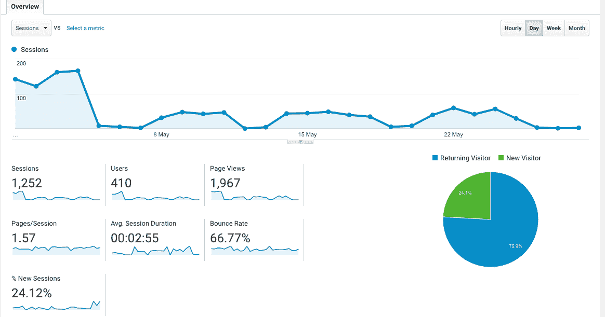
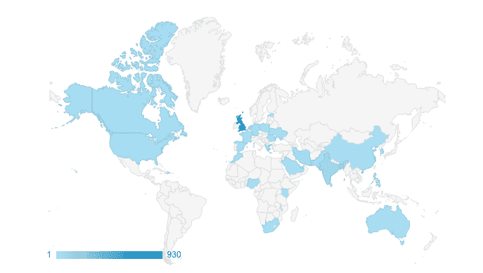
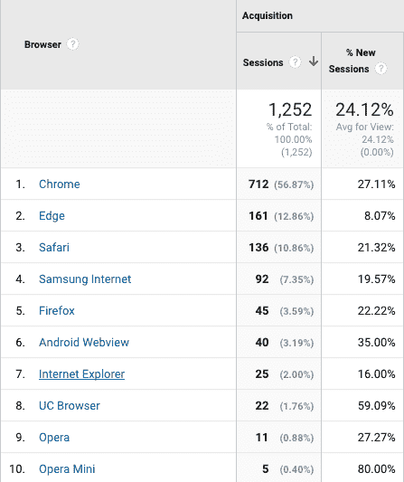
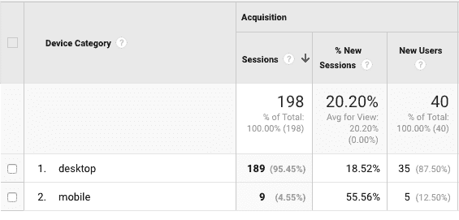
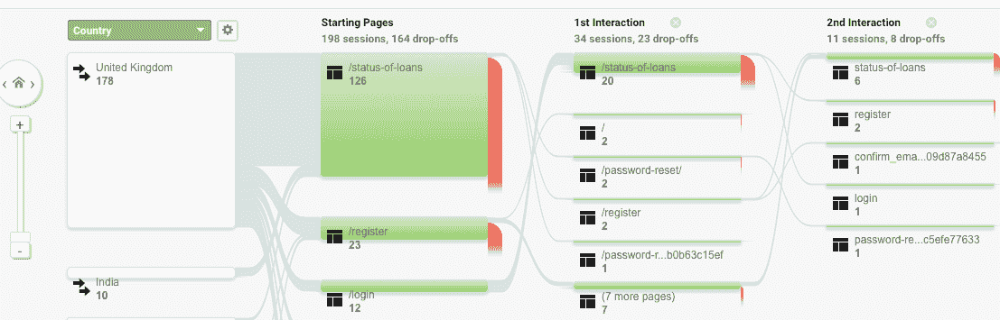
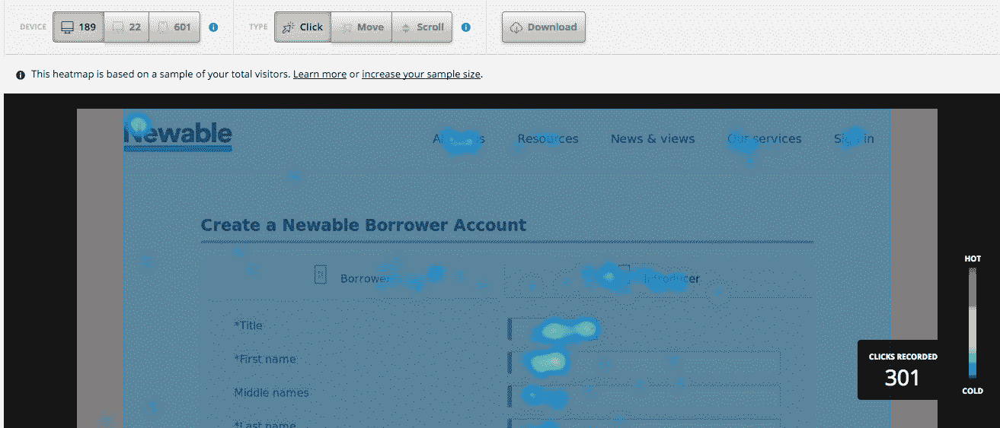
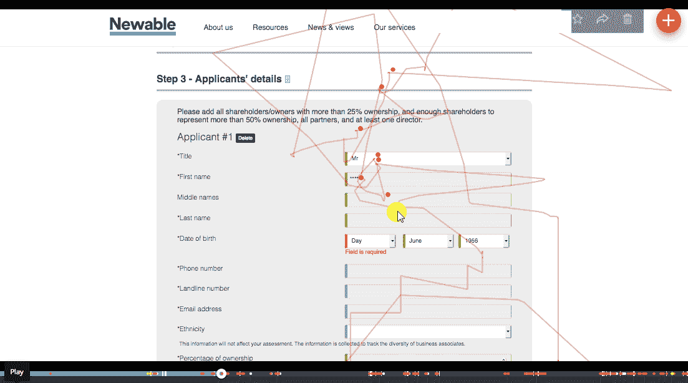
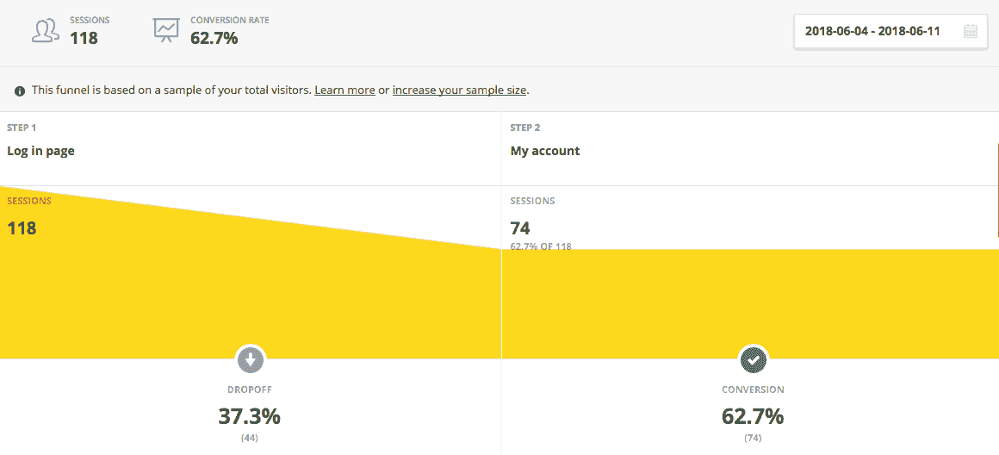
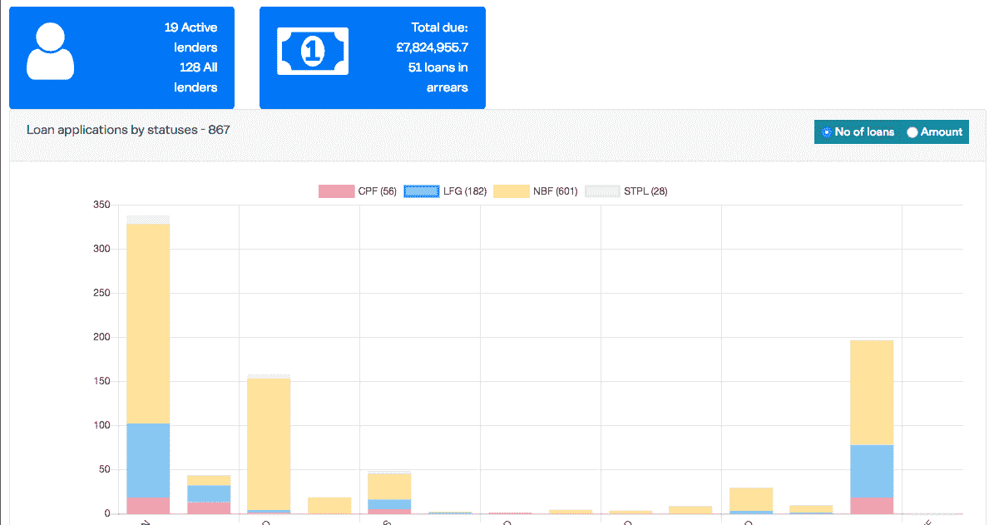

# 软件产品分析:Google Analytics 和 Hotjar 入门

> 原文：<https://www.stxnext.com/blog/software-product-analytics-tools/>

 假设你有一个工作产品，越来越多的客户，以及许多关于新特性的。

太好了！现在怎么办？

开始行动是一回事，继续前进完全是另一回事。你需要为未来制定一个计划，而且要快，否则你的好运很快就会结束。

那么你从哪里开始呢？你首先做什么？

两个字:  **产品分析。使用产品分析工具以正确的方式开发你的软件产品。**

互联网上充斥着各种分析工具，可以帮助你一路前行，并找出你的下一步行动。在本文中，我将重点介绍其中的两个:  **Google Analytics 和 Hotjar。**

列出这两个工具的所有有用特性会花费很多时间，所以我会尽量简短。我们将只关注它能帮助您解决的最重要的问题以及它能帮助您做出的决策。 

#### 1.谷歌分析

[谷歌分析](https://analytics.google.com/analytics/web/) 可能是最受欢迎的分析工具。 它给你很多细节，甚至可以让你创建自己的追踪路径。

这些是谷歌分析的基本特征:

##### a)观众

您应该始终牢记的关键信息是您的  **应用趋势。** 它们是这类问题的答案:

*   **你有多少客户？**
*   **他们使用你的应用花了多少时间？**
*   **其中有多少是新用户？**
*   **需要选择架构吗？**
*   您需要多大的数据库？

经常检查这些细节是有好处的。

另外，注意你的  **会话持续时间**。 差别很大，取决于你提供的产品种类。问问你自己:

“4 分钟是购买产品的合适时间，而且在购买过程中不会感到沮丧吗？也许我们应该以某种方式减少这个时间？”

或者这根本不是问题所在。可能是您的身份验证令牌不够长，不足以维持会话，您的客户会很生气，因为他们需要在此过程中登录几次。

无论你在纠结什么，你的“观众”都可以给你指出新的解决方案。

##### b)语言和位置

你知道你的顾客来自哪里吗？

你确定你真的打动了你的目标观众吗？

也许你应该考虑再开发一个语言版本？

或者，从一个完全不同的角度来看，也许有必要检查一下是否有人向你发送垃圾邮件或者试图入侵你的应用程序？

问题从未停止，但是每一点信息帮助你找到更多的答案。

##### c)行为

你已经知道你有多少客户了，这很好。你现在应该做的是专注于区分它们，并据此对它们进行分类。他们是新顾客还是回头客？

**决定此刻两个群体中哪个对你更重要。** 可能是时候创建一个入职流程，并考虑为新员工提供福利了。反过来说，也许你的大部分投资回报率来自那些已经知道并使用你的产品的客户。

但这并不是“行为”能为你做的全部。很容易深入了解每次会话的客户数量或他们在您的网站上花费的时间。

##### d)技术

在测试期间，了解你的客户使用的浏览器是有好处的。 这样，你就知道应该额外关注哪个浏览器了。

你甚至可以检查与你相关的浏览器的特定版本，例如在试图重现某个 bug 的过程中。

想象一下，你的某个浏览器的某个版本经常出现问题，但你的客户中很少有人真正使用它。在这种情况下，最聪明的解决方案可能是添加一个免责声明，说明您的网站不支持该浏览器，并且您建议使用不同的浏览器。

##### e)手机

***移动优先*和*移动专用*都是值得牢记的选项。**

确保您的 web 应用程序在移动设备上看起来也不错，这一点很重要。然而，在开发新功能的同时，不要忘记检查移动流量。这些数据将使你更容易决定你愿意在  [优秀的手机设计上花费多少时间和金钱。](https://stxnext.com/services/product-design/)

您甚至可以更彻底地检查客户使用的特定设备，以确保应用程序在这些设备上运行良好。这样的尽职调查总是有回报的。

如果您注意到应用程序的某些部分的移动流量超过了 50%,那么这绝对值得您关注。最高的移动流量往往出现在你的应用和注册过程的第一页。

##### f)用户流量

你不想知道你的客户通过你的应用程序的旅程吗？

如果是这样，“用户流量”是你的标签。

**“用户流量”主要有两个功能:**

1.  **它向你展示你的应用中最重要的页面；**
2.  它能告诉你很多关于你的顾客的一般行为。

前者帮助你决定在哪里投放广告，而后者设定你的优先顺序(或者至少应该如此)。

然后是“网站内容”标签。选项卡使您更容易跟踪应用程序中最流行的页面和子页面。

对于任何特定的广告、入职流程或保持用户参与服务的想法，您还应该查看“登录页面”和“退出页面”选项卡。

如果这些标签显示一个对你很重要的页面实际上是看不见的，或者对你的客户来说很难到达，考虑把它移到其他地方，或者在更受欢迎的页面上添加一些链接。

##### g)交通

在你的产品的所有潜在营销活动中，流量是非常重要的。在发起活动之前，研究一下你的客户来自互联网的哪个部分。

是有机搜索，推荐，还是不同的来源？

如果你已经有一些正在进行的活动，你也可以查看付费搜索带来了多少流量。此外，您可以获得更多关于流量来源的详细信息。

##### h)现场速度

**网站加载速度对你的用户很有帮助。** 如果你的网站加载时间太长，客户可能会认为页面不起作用，离开，再也不会回来。你不想那样，是吗？

我想是的。为了防止这种情况发生，检查加载时间，并与你的团队讨论你可以做些什么来加速你的网站。

您还可以检查每个浏览器的网站速度，以了解可能遇到延迟的客户的确切数量。

##### I)实时交通

谷歌分析还允许你查看实时交通细节。

随着时间的推移，看着你的用户来来往往地浏览你的网站是很迷人的。  **观察这个会让你意识到你的站点非常有活力。**

##### j)其他

我们上面所涵盖的只是你可以在谷歌分析中找到的基本统计数据，没有任何额外的动作或实现。

自然，GA 提供给你的还有很多:  **实验要计划，目标要设定，活动和广告词要跟踪。**

你也可以用它来更细致地分析你的受众:  **按年龄，性别，或者兴趣。**

##### k)外卖

谷歌分析很容易实现——你只需要在你的网站上插入一个特殊的代码来跟踪所有的流量。

此外，不要忘记削减您的测试/沙盒环境，以确保您在 GA 中看到的细节是由真实的客户生成的，而不是由您检查新功能生成的。在实现 GA 时，最好使用  [谷歌标签管理器](https://www.google.com/analytics/tag-manager/) 来实现这个目的，然后通过 GTM 打开 GA。

通过 GTM，您可以轻松访问其他 Google 工具，这些工具可能会帮助您进一步开发您的产品。

#### 2.热罐

一旦你从定量研究中获得了所有的信息，你可能会对更深入地分析你的客户的行为以及你如何改善他们对你的产品的体验感兴趣。

**[Hotjar](https://www.hotjar.com/) 可以帮你做到。这是对你的谷歌分析数据的一个很好的补充。**

下面你会发现 Hotjar 的主要特性。

##### a)热图

热图是联系定量和定性细节的好地方。

在页面的顶部，你可以看到总共有多少用户访问了你的网站，以及他们使用了什么样的设备。更重要的是，您可以看到客户点击、移动鼠标或滚动页面的所有地方。

这些信息在  **它也给你一个清晰的画面，哪些点和链接对你的观众来说是重要和有趣的，哪些是不必要的。**

试着改变你放东西的位置和原因。 如果你重新安排你的一些服务或选项，你就给了你的用户一个在他们之间做出新选择的机会。这反过来帮助你决定你应该更多地发展什么。

检查你的用户在网站上向下滚动了多远也是值得的。通常相对容易找到“死亡”区域，在那里他们很少或没有活动。

这告诉你不应该把任何重要的信息放在哪里，或者把它上移。然而，如果你想让你的访问者与这样一个区域互动，实现一些引导他们到那里的功能可能是一个好主意。

##### b)录音

录音是跟踪你的客户在给定页面上的行为的最佳方式。

你可以清楚地看到你的客户在努力的所有地方。无论是消除问题还是一般的调试，观看这些记录都是一个很好的指示，告诉你应该从哪里开始，以及哪些问题应该优先处理。

观看整个录像也很有用，而不是只关注点击。 自然，咔嚓声很重要，但不亚于所有的动作。

如果您的应用程序依赖于您的用户需要在其他地方检查的信息，很容易注意到他们切换到另一个窗口或转向物理文档的确切时刻。这一时刻非常重要——记下他们将光标放在哪里，因为那很可能是投放广告的最佳位置。

还有，别忘了查看填写申请表的平均时间。一旦您设置授权令牌的过期时间，这可能是一条关键信息。

##### c)漏斗

你可以很容易地建立自己的漏斗。  **他们的目的是检查你失去客户过程中的各个阶段。**

重要的是在给定的页面上有多少步骤。检查下降幅度最大的地方将有助于您选择应该首先关注的流程阶段。

请记住，流程的复杂性可能不是访问者的唯一障碍。除了他们的理解之外，你可能还在处理一个妨碍你的客户继续工作的错误。

##### d)反馈

Hotjar 还提供了几个工具来帮助您从客户那里收集反馈。

然而，收集定性数据是另一篇文章的主题。我在这里只是把它作为 Hotjar 提供的更多特性的一个例子。

#### 3.你自己的统计数据

**在使用外部工具为公司收集最重要的分析数据时，记得创建自己的仪表盘。** 您的客户总数、页面浏览量等。都包含大量信息，但也可能有一些您需要控制的特定于您的业务的数据。

例如，如果你申请的目的是帮助客户获得商业贷款，那么你应该知道有多少客户申请了贷款，以及你发放了多少贷款。这将有助于你了解你未来的用户在申请和获得资金之间可能遇到的障碍。

您可以将所有必要的信息放在您自己的仪表板上，并在制定项目开发决策时使用这些信息。如果您想将 Slack 与您的应用程序连接起来，以列出一些最相关的数据，您也可以这样做。

**关于团队工作的统计数据也可能对你的工作产生重大影响。** 这可能意味着一大堆事情——从团队速度到工作可预测性——但这是另一个值得单独写一篇文章的大话题。

#### 最后的想法

以下是关于产品分析工具最重要的一点:  **不要把它们当作“必须拥有的东西”，而是当作“必须拥有的东西”**

没有分析，你根本不可能有足够的数据来做出好的决策，设定合理的目标，并选择正确的方向。

至少从谷歌分析入手，了解一下你网站的流量。对用户与你的网站互动的方式有一个基本的了解就足以开始做出明智的决定和提前计划。  **游客意味着流量，流量意味着金钱。**

Hotjar 也非常有用，但是如果您没有足够的时间从一开始就使用它，那么您可以暂时将它的实现放在次要位置。只是不要等太久才开始使用它，因为它也会给你带来很多有价值的信息。

相信我，当我告诉你开始使用 Google Analytics 和 Hotjar 真的一点也不费力。  **你只需要在你的网站上设置它们，并在你的应用程序中添加几行代码。其余的将接踵而至，这一小小的投资回报将是无价的。**

我很确定我已经说过了，但为了以防万一，我将重复一遍，给你留下一个实际的提示:不要忘记检查你是否只是从真实环境中，从你的真实客户那里收集数据。如果这些数据与测试数据混在一起，你将无法做出任何可行的预测。

* * *

非常感谢你阅读我的文章！如果您有任何问题，请在下面的部分留下您的评论，我保证会尽快回复您。

如需 STX Next 的更多更新，请使用右边(或下方，如果您使用手机)的整洁框 **订阅我们的新闻简报**。如果您想了解更多我们提供的服务，请点击  [。](https://stxnext.com/services/)

