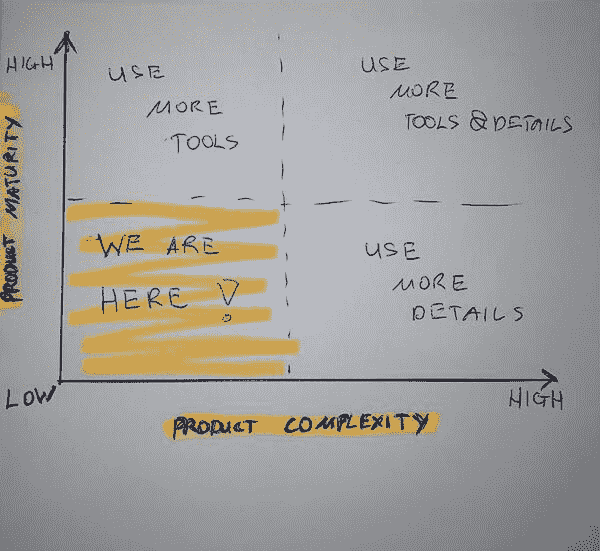
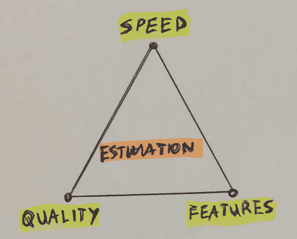
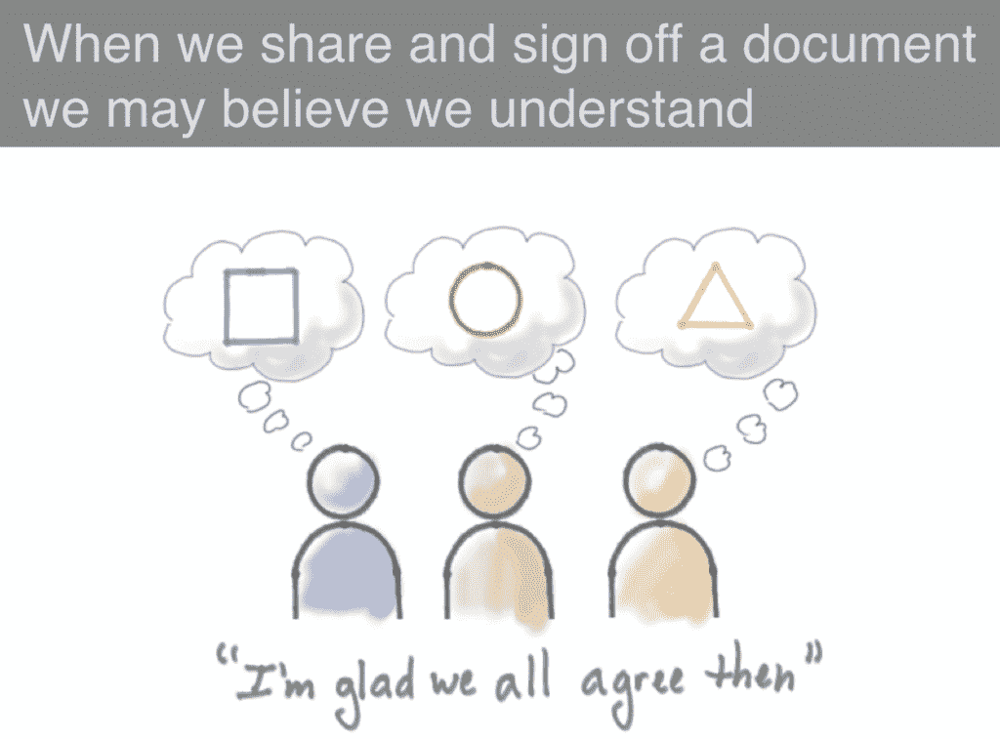

# 软件产品需求:如何编写像样的高级项目规格说明书的完整指南(里面有样本规格说明书)

> 原文：<https://www.stxnext.com/blog/software-product-requirements-high-level-project-specifications-guide>

 所以这一天到来了。

你对产品有了极好的想法。你肯定顾客会喜欢它，投资者会非常乐意把他们的钱给你用于产品开发——你会让世界变得更好。

你不能在晚上睡觉，探索各种不同的场景，你的产品将如何被使用。您在头脑中与客户群打交道，为将来的版本创建信封背面的功能列表。

你现在唯一需要做的就是用 MVP 来验证你的假设，以确保你建造的正是这个世界所需要的。

但是俗话说，没有执行，想法什么都不是。所以你工作中最困难的部分现在开始了。

我假设你和我一样:一个以增长为导向的产品经理，但是没有强大的技术工具包。你可能需要有人来帮助你构建你的产品。可能有多种情况:

1.  你在一家大型组织中工作，需要向你的 CTO/tech 部门“推销”你的愿景，以获得一些估计，并决定是否投资于它，
2.  你希望在友好的开发人员的帮助下创建产品，但是你仍然需要与他们分享你的好主意，解释你需要构建什么，
3.  你决定使用 [软件公司团队](/services/) 来构建它，你需要给他们输入信息，以便他们可以准备一个高水平的评估。

(顺便说一句，如果你碰巧属于第三种情况，我们有一个关于如何比较软件供应商和的评估的完整指南。)

在所有这些情况下，你需要一个有形的人工制品。这是一种媒介，它可以让你向他人解释你的产品是什么，以及它必须具备哪些特征才能征服市场(和世界)。

**所以你需要一个高层次的产品规范。这本循序渐进的手册会帮你准备好(不用花太多时间)。**

澄清一下:这篇博文不是关于开发过程、敏捷冲刺长度、发布节奏、沟通设置、工具等等。简单来说就是创造产品需求。 

#### 这本指南是给谁的？

我希望这些内容对 1)不太复杂，2)处于早期成熟阶段的产品最有用。如果你能把你的产品放在下面的图表上，这个指南应该对你有帮助。即使不适合，我也会在本文后面提供一些复杂/成熟产品的额外技巧。

#### 起点:如何检查你实际上有一个产品想法

你说你有了一个产品的想法。这意味着你做了工作，你感受到了你正在解决的实际问题的痛苦，对吗？

我想你可能会:

*   通过对一小群潜在客户的调查，验证了这个想法，并得到了一些数据，
*   在和你的朋友喝酒的时候讨论过几次，他们都同意这是一个“杀手级的想法”，
*   了解你的潜在客户群，知道他们有多大，
*   使用 [精益画布](https://leanstack.com/leancanvas) 、 [摩尔的愿景陈述](https://martinfowler.com/articles/lean-inception/write-product-vision.html) ，或者甚至是 [由我们自己的 Paul Jurdeczka](https://www.linkedin.com/pulse/how-convey-essence-your-product-less-than-2-minutes-paul-jurdeczka/) 创建的 2 分钟框架来写下这一切。

如果以上是真的，太好了。你可以直接进入下一部分。

如果不是…这就是你必须后退一步的地方。很抱歉告诉你这个，但是如果你对你的产品没有一个高层次的概述，你就没有准备好准备高层次的项目规格。

引用一位大师罗曼·皮克勒的话:

如果你不能自信地说出为什么人们会使用你的产品，这些人是谁，是什么让你的产品脱颖而出，以及为什么你的企业值得开发和提供该产品，那么你就无法构建实际的解决方案。相反，继续发现工作(坚持或转向)，或者停下来，转向另一个产品创意。

 *如果你正在与一家软件公司合作，你很幸运——他们可能会为你举办[探索研讨会](/services/discovery-workshops/)来帮助你回答这些问题。

如果你没有与软件公司合作，你可以先看看我们的指南 [如何自己经营探索工作室](/blog/software-product-discovery-workshops/) 。

构建产品愿景本身就是一个很好的练习，它将允许您为高级项目规范的进一步工作创建工件。但更重要的是，它将帮助你组织这一切，并确保你的商业想法没有盲点。它只是“粘着”而已。

当然，愿景可能会随着时间的推移而改变，但是当您有一个有形的工件时，您至少可以跟踪那些变化，并看到愿景的演变。

我最喜欢的工具是**精益画布**。描述产品全貌的单页，以及:

*   要解决的问题，
*   客户群，
*   解决方案，
*   收入来源，
*   潜在成本。

简而言之，画布包括了您想要通过构建 MVP 来验证的所有假设。

瘦画布的一个示例如下所示:

[点击此处下载精益画布示例。](/hubfs/STX%20Next%202020/blog/lean-canvas-example.pdf)

但是这篇文章并不是关于创建一个精益画布，而是关于在你已经拥有它之后下一步该做什么。创造你的产品愿景是一个整体的主题，单独的帖子，所以如果你需要一个，请 [发 tweet us @ stx next](https://twitter.com/STXNext)；我很乐意准备一份。

注意:不要太专注于形式。如果你不知道或者不喜欢这个工具，你可以不用精益画布。

只要记住目标，就是写下:

*   你的产品目标，
*   它将解决的问题，
*   用户将执行的工作/任务，
*   产品将创造的利益，
*   以及您的用户角色/细分市场(以及他们的主要兴趣和目标)。

一个简单的**描述**在**任何书面形式**解释**你想建什么**和**给谁，**就行了。

准备好你的薄帆布(或等效物)了吗？那我们继续吧！*  *#### 你的规范中应该包括什么取决于你是为谁写的

在你开始写规范之前，问问你自己谁会阅读它。您的目标受众是决定您应该在这个高级项目规范中包含什么的一个重要因素。

**如果你正在为你的首席技术官或你组织内部的技术团队写规格说明**，他们可能已经知道你所谈论的内容的背景。他们了解用户、领域和您想要构建/扩展的产品。

在这种情况下，他们所需要的只是你下一个“增长引擎”的简单需求列表。此外，如果您能够指出所设计的解决方案将如何影响您现有的生态系统(可能会有额外的流量，产品可能需要与现有系统集成或改变周围的技术)和业务(可能会有更多的客户支持请求询问新产品，可能需要营销等)，这将非常有用。

**如果你正在为你的领域之外的外部方**准备一份高水平的项目规范——你的开发伙伴、外部技术团队、软件公司——或者**如果你的产品高度专业化**(空间站或胃肠肿瘤软件等)。)那你可能需要更详细一点。

对于这种情况，请尝试提供更详细的业务上下文描述，并添加一个简单的术语表来解释该领域中常见的业务对象和术语。当有疑问时，更安全的做法是假设你要介绍的人对该领域的了解比你想象的要少。任何解释“101 级”基础知识的文档或资料都将非常有帮助。

#### 高层次的项目规格说明书应该有多复杂和详细？

无论你准备的规格是为了得到一个非常精确的估计还是一个大概的估计，记住要定义最终数字的接受标准。你要求的越精确，你需要提供的细节就越多，需要更多的时间让别人来分析所有的细节并准备最终的评估。

这是一个典型的“金三角”类型的情况:你要么很快得到你的估计(但会不太精确)，要么等待更长时间的详细估计。

但是无论它有多精确，你都需要记住它只是一个估计。不要把你的房子/马/生命押在上面。

#### 我们开始吧！准备高级项目规范的逐步过程

##### 1.开始创造东西

拿起你填好的精益画布(或等效的工件)，拿起核心功能列表，开始写作。把它分成单独的**东西**。称之为需求、史诗、用户故事、屏幕、流程、特性，随你喜欢；但我会称它为**那些东西**。

在这个阶段，想办法把复杂的问题/解决方案分成更小的部分。任何可以用来进一步推动讨论的项目都应该是一个东西，并且应该一个一个地对这些东西进行评估。但是要小心不要陷入“超细节化”的深渊。尽量让它或多或少保持在**岩面**。

****

*图片被我的朋友无耻地从一副牌上偷走[保罗·尤尔德茨卡](https://pl.linkedin.com/in/pawel-jurdeczka)*

为了保持清单的完整性，试着从你的特定用户群开始，想象他们的旅程和与你的产品在时间线上的特定互动。他们首先要做什么？之后需要做什么？一旦你把所有列出的东西都开发出来并能正常工作，他们能解决他们的问题吗？

你可以或多或少地以用户故事的形式展示每一件事，就像这样:

“作为[你画布上的人物角色]，我想[在你的产品中做点什么]，这样我就可以[满足我的业务目标]。”

一个简单的例子是:“作为一个下订单的好主妇，我想在 2 人餐和 4 人餐之间选择一份餐，这样我就可以为我和我的家人点餐了。”

你可能还会发现“全局”的东西(也称为非功能性需求)，比如“我希望整个**系统是安全的，”“整个**系统应该能够支持 5k 并发用户”或者“API 和**所有的**基本功能都应该有文档”。如果你找到其中的一个，把它作为一个单独的东西添加进去。****

##### 2.把这些东西分组

把这些东西分成不同的组；让我们称它们为**特性集**。每个集合应该集中于更广泛的功能(处理索赔，发送支出，等等)。)、业务对象(客户、订单、支付等。)或者至少在网站区域(主页、新闻、博客、联系方式等。).

你可以尝试在一开始就创建一个集合或业务领域的列表，例如使用一个 [思维导图工具](https://app.mindmup.com/map/new) 。但是根据我的经验，当你创造更多的东西时，群体会自然地出现。更应该把它看作是一个持续的分析和综合过程，而不是一开始就定义一个大致的领域，然后再添加一些细节。定义组时，随波逐流。

##### 3.给这些东西一个活下去的理由

你清单上的每一项都应该是有原因的。如果没有原因，你可能不需要那个东西。你放在列表上的东西应该对用户、企业、开发团队或其他特定的人有价值。

如果你是产品专家，使用 [投资框架](https://en.wikipedia.org/wiki/INVEST_(mnemonic)) 。是一套提炼故事/史诗的规则。投资后，你需要确保故事/史诗:

*   **I** 不依赖(对其他项目没有内在依赖性)，
*   **N** egotiable(有篇幅讨论)，
*   **V** 有价值(对用户或企业而言)，
*   **E** stimable(一个很好的近似值)，
*   **S** mall(以便适合迭代)，
*   estable(原则上，即使还没有测试)。

不要试图对它超级精确(除非你有世界上所有的时间)。重点是 v。

##### 4.记住你的用户

在编写功能集/史诗时，使用精益画布、产品愿景或问题/解决方案中的人物角色。角色和用户群将:

*   帮助您组织功能以适应客户群/角色，
*   帮助技术团队理解在系统中何处放置特性。

##### 5.检查列表是否完整

当你的清单上写满了项目，你应该多看几遍，确保没有空白。

例如，如果你想让**用户**为**的订单**付款，他们应该可以让**先创建订单**，对吗？

当你的清单完成后，你可以进入下一步，也是最困难的一步，那就是…

##### 6.分清事情的轻重缓急

从最重要/最有价值的项目开始，按正确的顺序排列这些项目。

您可以通过向列表中的项目添加一个版本号，或者通过项目的顺序来指示优先级(列表中的位置越高，优先级越高)。

在你对项目进行了一次优先排序后，再次进行优先排序。

当你认为清单是完整的，想象你必须删除其中的一半，再一次进行优先排序。砍掉不重要的东西，如果只剩下“重要”的东西——开始降低重要事情的优先级。

如果您想要比基于您的规范的粗略估计更详细的东西(例如，您的目标是一个长期的路线图)，您可以向列表中添加更多的项目，并将它们分配给以后的版本。创建评估的技术团队将不得不在这上面花费更多的时间，但是他们应该能够提供“一些数字”给你来决定未来。

对你的产品进行优先排序是另一篇文章的主题，所以如果你需要，请发微博给我们@ stx nextT3。

##### 7.如果可以的话，使用图片

**如果您有任何形式的视觉内容，请使用它**。包括任何思维导图(可能是上面第二点中的那个)，用户界面模型，图像，图表，图纸等等。“一幅画胜过千言万语”，所以要付诸实践。

如果你没有这类神器，也不用担心；功能是最重要的部分，“技术人员”可以自己想象视觉细节。然而，有一个风险，它可能是一个不同的形象，从你的想法...

*杰夫·巴顿的插图[杰夫·巴顿&联合公司](https://www.jpattonassociates.com/)，基于[ThoughtWorks](https://www.thoughtworks.com/)T5 的卢克·巴雷特的一个概念*

所以，如果你有一些**期望**、**例子**或**灵感**，把它们作为链接放在一个专门的部分，或者把它们作为单独的东西写下来。例如，您可以创建一个故事，如“作为买家，我想通过点击地图选择我的地址**(像在谷歌地图中)**，这样我就可以……”

你也可以分享你想使用的 UI 框架风格(引导，语义，材料 UI，Ant 设计等等。)或者至少是你对产品的一些设计灵感:你喜欢的网页的链接，竞争对手的链接，或者只是像“让它看起来像脸书，但没有那些喜欢和表情符号”这样的评论。会有帮助的。很多。

##### 8.迭代，再迭代，然后再迭代一些。

试着从简单的事情开始，尽可能快地填写清单，并在此基础上重复至少 2-3 次。不要试图从一开始就创建完美的项目，因为在创建高级项目规范的过程中，您的想法和范围可能会发生变化。

尽量保持简短，因为“技术人员”不喜欢阅读冗长的文档。

#### 最终的规范应该是什么样的？下载我们的示例

如果你遵循上面的提示，你应该会得到这样的结果:

[下载范例规范。](https://www.stxnext.com/hubfs/STX%20Next%202020/blog/finished-specification-example.xlsx)

如果你的看起来相似；干得好！您已经有了一个高层次的项目规范。

现在，正如承诺的那样，如果你的项目更复杂或更成熟，这里有一些准备高水平规格的额外技巧。

#### 对于更复杂的产品:使用更多的细节(也就是如何给你的高级项目规范添加额外的调料)

如果您有相关信息，请记住包括以下内容:

*   **规模:**预期的用户数量、订单数量、销售项目数量或任何其他需要由您的产品处理的业务对象数量；
*   **其他非功能性需求:**安全性、可用性、可访问性、文档等。；
*   **首选技术体系和部署环境:**如果您有什么具体想法，请写下来并附上理由；这将是技术人员进一步对话的重要输入；
*   **高层业务架构:**正如我的架构师朋友总说的“世界上没有不能画成两个长方形和一个圆柱体的系统”；
*   特定集成:如果你马上知道你需要什么集成，在高级项目规范中指出来；
*   你正在处理的任何艰难的最后期限:如果你受到来自投资者的压力，或者有一个重要的商业事件即将到来，记得包括这些信息；这将有助于技术团队理解紧迫性。

#### 对于更成熟的产品:使用更多的工具(只要你有时间和适当的技能)

我希望以上所有看起来像是一个简单的任务，你会喜欢。如果您有更多的时间和更高级的技能，您可以使用像故事映射这样的工具，准备一个简单的业务架构图，或者在技术文档方面更深入地研究。

您可以尝试准备以下 UML 图之一，例如*:

*   用例图显示系统涉及的用户类型、他们使用的不同功能以及这些功能如何相互作用/互补；
*   显示产品中重要业务对象、其基本属性以及它们之间关系的对象图；
*   显示产品外部环境和集成的组件图，以及由解决方案使用/公开的接口；
*   以可视化方式显示复杂业务工作流程的活动图。

你不需要特别使用统一建模语言，这是给更“技术”的人的建议。

#### 最后的想法

希望这本手册能帮到你。如果你是一个“创建者”类型的人，准备一个高水平的项目规范的过程应该既有趣又简单。

关于这个主题的一些最终提示:

*   这个过程的结果应该是一个独立的工件，它将有助于加速与 CTO、技术团队或软件公司的对话，并降低不准确评估的风险。
*   请记住，没有任何文档比对话更好。在您准备并发出一份高级规格说明后，请务必强调，如果对方对范围和解决方案有任何疑问，请联系您。
*   如果你不想创建一个规范，你总是可以外包出去，并从知道如何准备的人那里得到帮助。例如，您可以使用我们的 [探索研讨会或雇佣我们的探索/设计团队。](https://stxnext.com/services/product-design/)

如果你觉得这篇文章有趣和/或有用，需要一些关于特定主题的进一步指导，或者只是想分享你自己关于高层次项目规范的经验， [在 LinkedIn 上 ping 我](https://www.linkedin.com/in/bartoszbabinski/) 或者发推特给我们@STXNext。

祝您成功构建您的产品！*