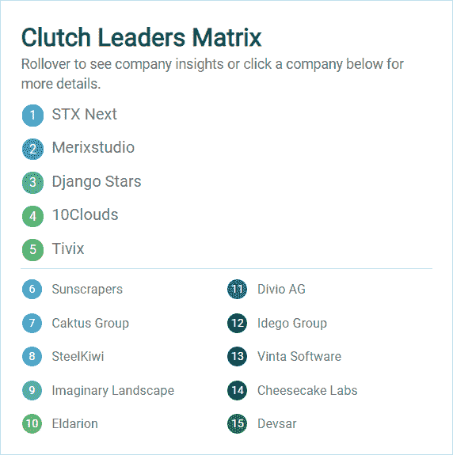

# STX 的下一个特点是作为全球领导者，使离合器 1000

> 原文：<https://www.stxnext.com/blog/stx-next-global-leader-clutch-1000/>

 每年，Clutch 都会在其年度全球领导者名单中表彰多个行业的杰出公司。该榜单列出了在各自平台上表现出色的顶级企业。

2018 年，离合器推出了一项新的专属荣誉:离合器 1000。拥有最高“交付能力”分数的公司出现在这份名单上。

我们自豪地宣布，STX Next 被选为领先公司之一。 

#### 全球领导者

离合器是一个发布  [验证客户端评论](https://stxnext.com/portfolio/)的平台。他们与我们过去的客户交谈，以获得关于我们的流程和交付成果的反馈。

除了客户访谈，离合器分析师进行市场研究，看看我们如何与我们的竞争对手相比。

这些见解使我们在全球范围内被公认为“网络开发”和“[软件开发](https://clutch.co/developers/poland)”领域的领先公司。

关于获得这些奖项的意义，离合器业务分析师 Sara Philibotte 评论道:

> “开发是 Clutch 最具竞争力的领域，因此成为一家领先的开发公司需要专业的技术知识、适应能力，以及与各行各业、各种背景的客户保持良好的关系。这些公司有能力在一个饱和、快速增长的全球市场脱颖而出，值得称赞。”

#### 顶级 Python 和 Django 开发者

我们最欣赏《离合器》的是其评论的客观性。

这里是  [离合首领矩阵](https://clutch.co/developers/python-django/research) 之巅[Python](https://stxnext.com/ebooks/what-is-python-used-for/)&[Django](/services/django-development/)开发者:

事实不言自明。

#### 我们的评级

自从我们在 2014 年加入 Clutch 以来，他们已经从我们的客户那里收集了 41 条正面评价。这为我们赢得了近乎完美的五星(满分 5 分)平均评论分数。下面重点介绍了今年的几款新离合器:

“STX 接下来花时间真正了解我们想要实现的目标，以及我们对产品的设想。”*—安全公司 CFO*

“他们非常友好、诚实、平易近人。”*—Zappi 有限公司创始人&首席执行官*

**“他们对我们的流程形式化非常有帮助。”***—首席运营官，信号套件*

在我们总结 2018 年的时候，我们感到自豪的是，我们不仅被列入了离合器 1000，而且还被列入了离合器的姐妹网站 Manifest，成为波兰  [顶级网络开发公司](https://themanifest.com/pl/web-development/companies) 的合作伙伴之一。

#### 谢谢你

我们为这些成绩感到非常高兴，并期待在未来的一年里作为团队取得更大的进步。

非常感谢 Clutch、Manifest 和  [我们的客户](https://stxnext.com/portfolio/) ，他们帮助我们脱颖而出，成为一家顶级开发机构，不仅在波兰，而且在全球都是如此。

我们迫不及待地想看看 2019 年为我们准备了什么！

