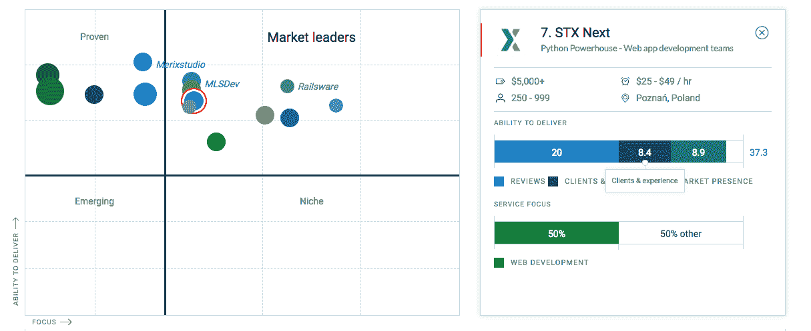

# STX 接下来提名了离合器行业的领导者

> 原文：<https://www.stxnext.com/blog/stx-next-named-industry-leader-clutch/>

#### STX 接下来提名了离合器行业的领导者

我们是欧洲的 Python 发电站，人们已经开始注意到我们了！STX Next 很高兴地宣布，Clutch 最近在其最新的研究报告中认可了我们公司，突出了波兰和乌克兰的顶级服务提供商。

Clutch 是一家位于华盛顿特区的独立评级和评论公司，研究全球数千家 B2B 公司。他们的分析师会找出在工作质量和客户服务水平方面领先的公司。

超过 500 家公司出现在他们的最新报告中，所有这些公司都是根据客户反馈、工作质量、提供的服务和市场占有率进行评估的。

STX Next 目前被 Clutch 列为波兰顶级网络开发商之一，同时也是一家领先的定制软件开发公司。

他们的波兰名录上有超过 380 家网络开发公司，我们很荣幸被列为领先公司。以下由 Clutch 发布的领导者矩阵突出了我们作为市场领导者的地位。该矩阵根据服务提供商的行业重点和交付能力列出了服务提供商。

我们才华横溢的团队致力于日复一日地提供最高质量的服务。强有力的沟通、项目效率和专业精神只是我们关注每个项目的一些品质。以下是我们的一些客户对 STX Next 在 Clutch 上的合作所说的话:

*STX 接下来使用复杂的技术工具成功制造并交付了几个复杂的产品。他们将每个组件无缝集成到一个尖端平台中。高效、专业的团队为项目的每个阶段配备专家，以提供端到端的解决方案。"*

–金融市场平台董事总经理

“他们真的很好地维持了关系，工作也很专业。”

–Wunderman Fluid 首席技术官

另一位客户说，  *“我觉得我可以随时联系他们，询问问题、修改或澄清。”*

我们期待在未来听到更多来自客户的正面评价。要查看我们所有的客户反馈并阅读更多关于我们各种项目的细节，请访问我们的离合器  [简介](https://clutch.co/profile/stx-next) (或查看我们的  [投资组合](https://stxnext.com/portfolio/))。

你也可以在 Clutch 的姐妹网站 Manifest 上了解更多关于我们公司的信息，在那里我们还可以自豪地说，STX Next 被评为 [波兰前 10+网络开发公司](https://themanifest.com/pl/web-development/companies#stxnext) ！