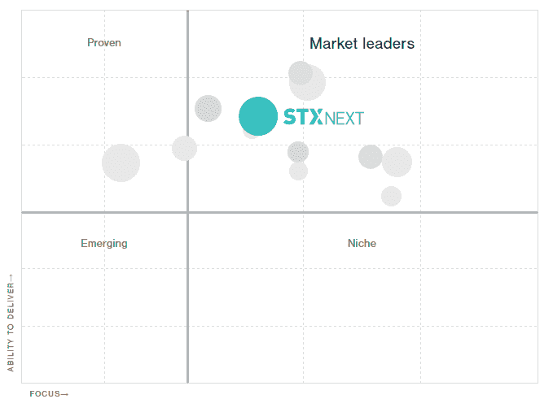

# STX 接下来被评为 2017 年波兰顶级开发商之一

> 原文：<https://www.stxnext.com/blog/stx-next-recognised-one-top-developers-poland-2017/>

 STX Next 刚刚被 Clutch.co评为 2017 年波兰顶级开发商之一。

在发布本年度更新之前，考虑了大量定量和定性因素。离合器分析师收集了重要行业经验的证据，评估了相关的企业数字资产，并对当前和过去的客户进行了深入采访。

这些工作实时生成业务绩效的快照，帮助买家更好地了解供应商在动态市场中的能力和局限性。

> *“That Poland has some of the most talented developers and technologists in Eastern Europe is not all that surprising. More surprising is how rapidly companies in the region are advancing in terms of cultural alignment with a Western clientele.”*
> 
> *Joshua Margolin，离合器公司首席分析师*

Clutch 一直在努力突出最优秀的网络和软件开发人员，该公司鼓励任何拥有卓越客户服务历史的公司申请加入未来的研究。

15 家被确认为市场领导者的公司:

Eleks、Merixstudio、SoftwareMill、N-iX、10Clouds、STX Next、Monterail、XSolve、MLSDev、Netguru、SoftServe、Droptica、Sunscrapers、Railsware 和适马软件。 

#### 关于离合器

Clutch 是一家 B2B 研究公司，位于 DC 市中心。它将您与能够帮助您提升业务并实现目标的代理机构和软件解决方案联系起来。他们的方法是根据消费者评论、提供的服务类型和工作质量来规划代理和软件解决方案。

#### 关于 STX 接下来

我们雇佣了 150 多名开发人员，是欧洲最大的 Python 和敏捷软件公司。在过去的 12 年里，我们为美国、欧洲和中东的领先品牌交付了 200 多个项目，帮助我们的客户进行网络和移动开发。

*对  [外包软件开发](https://stxnext.com/software-development-outsourcing-guide/)感兴趣？下载我们的* [近视指南](https://stxnext.com/ebooks/c-level-guide-to-software-development-nearshoring/) *。*