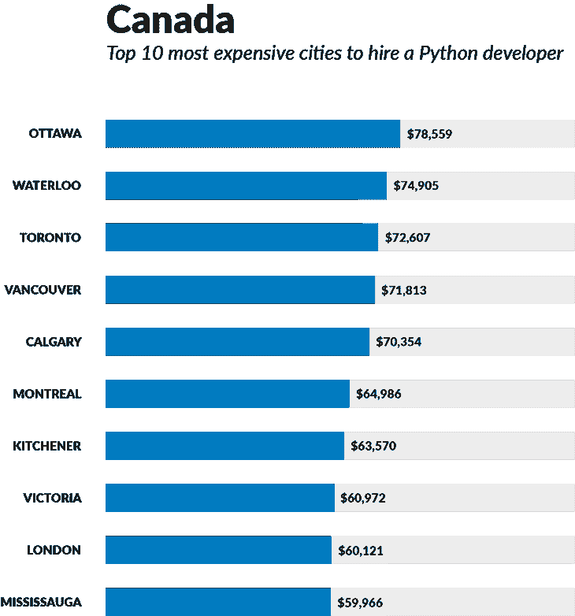

# 美国和加拿大雇佣 Python 开发者最贵的 10 个城市

> 原文：<https://www.stxnext.com/blog/top-10-most-expensive-cities-hire-python-developers-us-canada/>

 对熟练软件开发人员的需求每天都在增长，如果想避免代价高昂的错误，希望雇佣新开发人员的公司需要考虑这一点。

如果你是一名首席技术官、副总裁/工程主管，或者是一家正在寻找能够完成工作的程序员的初创公司创始人，以下是你需要知道的。

IT 招聘领域的竞争越来越激烈。开发人员可以要求的工资将继续增长。这意味着吸引、雇佣和留住高质量的内部 it 人才的成本越来越高。

薪水是雇佣决定的重要因素之一。你所在城市的薪水越高，你的软件开发外包就越有吸引力，越划算。想想内部员工与自由职业者、分包商和软件开发公司。

下面，我们列出了雇佣 Python 开发者最昂贵的 10 个城市(在美国和加拿大)。你的城市排名如何？

(如果你想要一步一步的计算内部开发真实成本的指南，[请阅读我们的免费电子书](https://stxnext.com/ebooks/true-cost-hiring-inhouse-developer/)。)

**平均工资 =通用软件开发人员平均工资**

**拥有 [Python](https://stxnext.com/ebooks/what-is-python-used-for/) 技能 =拥有 Python 技能的开发人员的平均报告工资**

(对其他地区好奇？阅读 [欧洲十大最贵国家雇佣 Python 开发者](/stx-new-blog/top-10-most-expensive-countries-europe-hire-python-developer/) ) 

#### 美国:雇佣 Python 开发者最昂贵的十大城市

##### #10.佐治亚州亚特兰大

*   平均工资:85000 美元

##### #9.俄勒冈州波特兰市

*   平均工资:9 万美元

##### #8.德克萨斯州奥斯汀

*   平均工资:9 万美元
*   拥有 Python 技能:80010 美元

##### #7.北卡罗来纳州罗利

*   平均工资:9 万美元

##### #6.加利福尼亚州萨克拉门托

*   平均工资:9.2 万美元

##### #5.威斯康星州麦迪逊

*   平均工资:9.5 万美元

##### #4.马萨诸塞州波士顿

*   平均工资:10 万美元
*   拥有 Python 技能:85234 美元

##### #3.华盛顿州西雅图

*   平均工资:113242 美元
*   拥有 Python 技能:99224 美元

##### #2.加利福尼亚州旧金山

*   平均工资；12 万美元
*   拥有 Python 技能:115840 美元

##### #1.加利福尼亚州圣何塞

*   平均工资:12.25 万美元
*   拥有 Python 技能:115922 美元

#### 加拿大:雇佣 Python 开发者最贵的 10 个城市

##### #10.米西索加

*   平均工资:59966 加元

##### #9.伦敦

*   平均工资:60121 加元

##### #8.维多利亚

*   平均工资:60972 加元

##### #7.蒙特利尔

*   平均工资:62769 加元
*   拥有巨蟒技能:64986 加元

##### #6.厨灶

*   平均工资:63570 加元

##### #5.温哥华

*   平均工资:65034 加元
*   拥有巨蟒技能:C $ 71813

##### #4.多伦多

*   平均工资:66806 加元
*   拥有巨蟒技能:C $ 72607

##### #3.滑铁卢(比利时城镇)

*   平均工资:67832 加元
*   拥有 Python 技能:C $ 74905

##### #2.卡尔加里

*   平均工资:68264 加元
*   拥有巨蟒技能:C $ 70354

##### #1.渥太华

*   平均工资:68361 加元
*   拥有 Python 技能:C $ 78559

#### 内部开发将花费你多少钱？

需要帮助计算新开发人员的真实成本吗？

提示:  **不要光靠工资！**

在雇佣和维持员工的过程中，有许多经常被忽视的成本没有反映在工资中。  **对一个公司来说，一个开发者永远、永远、永远比他的工资更贵。**

这就是为什么我们把这个 [简短、有用的指南](https://stxnext.com/ebooks/true-cost-hiring-inhouse-developer/) 放在一起，向你展示如何计算开发者的真实成本。如果你想要更低的成本、更舒适的预算职位和更高的利润率， [下载我们的免费电子书](https://stxnext.com/ebooks/true-cost-hiring-inhouse-developer/) ，确保你在未来的招聘决策中得到正确的信息。

##### **统计资源**

美国薪资和排名: [Glassdoor:软件工程师薪资最高的 25 个城市](https://www.glassdoor.com/blog/25-best-paying-cities-software-engineers/)

美国 Python 技能工资:[工资等级:技能平均工资:Python(美国)](http://www.payscale.com/research/US/Skill=Python/Salary#by_City)

加拿大工资:[工资等级:软件开发人员工资(加拿大)](http://www.payscale.com/research/CA/Job=Software_Developer/Salary)

加拿大 Python 技能工资:[工资等级:技能平均工资:Python(加拿大)](http://www.payscale.com/research/CA/Skill=Python/Salary#by_City)

##### **推荐**

*   [欧洲雇佣 Python 开发人员最昂贵的 10 个国家](/blog//top-10-most-expensive-countries-europe-hire-python-developer/)

