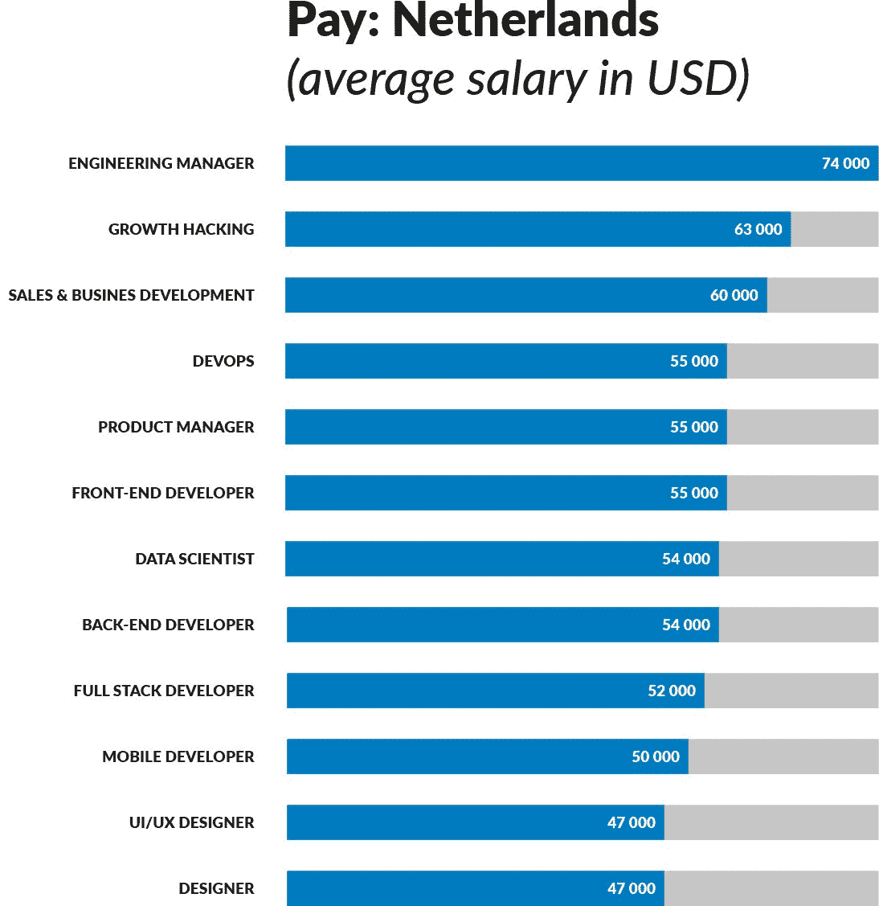
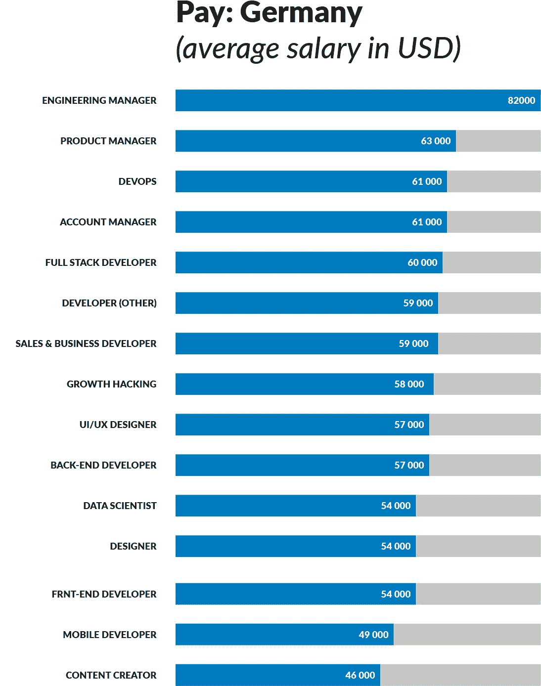
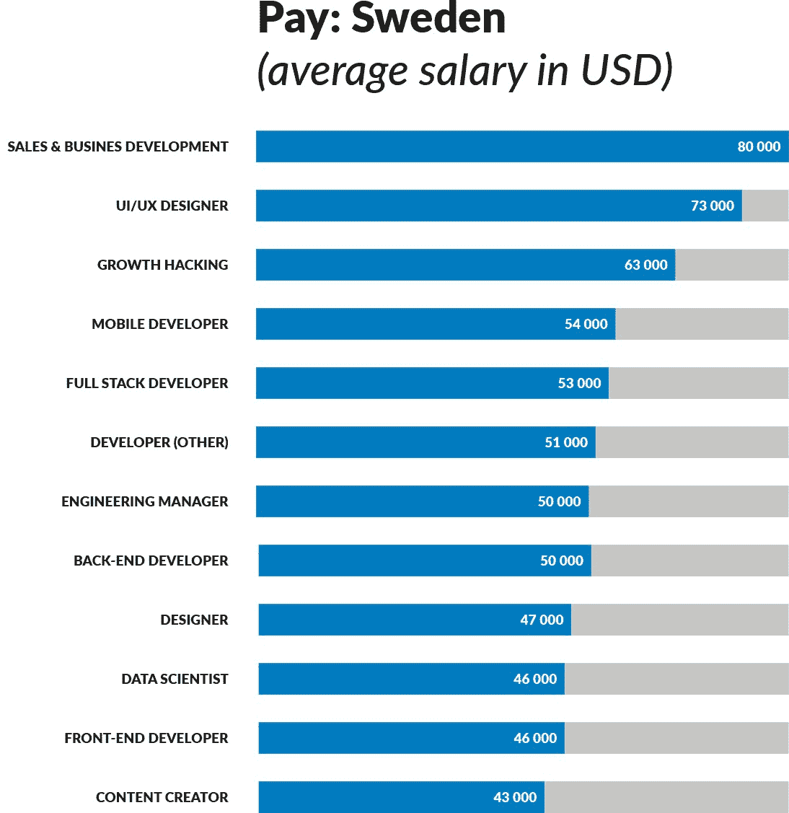
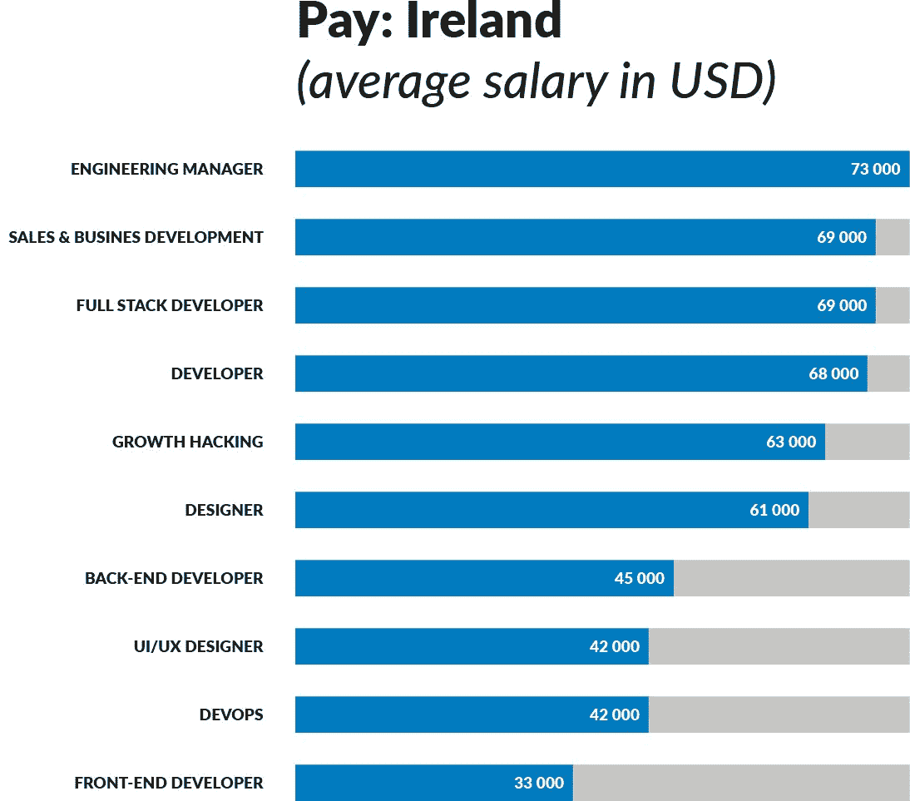
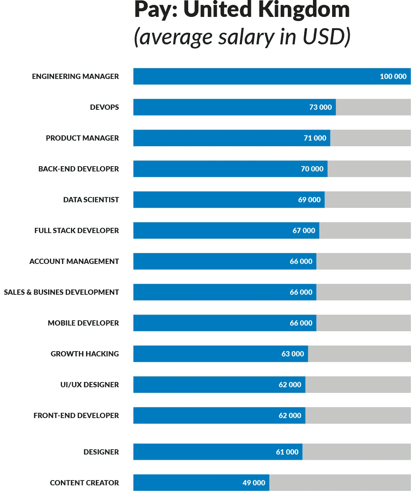
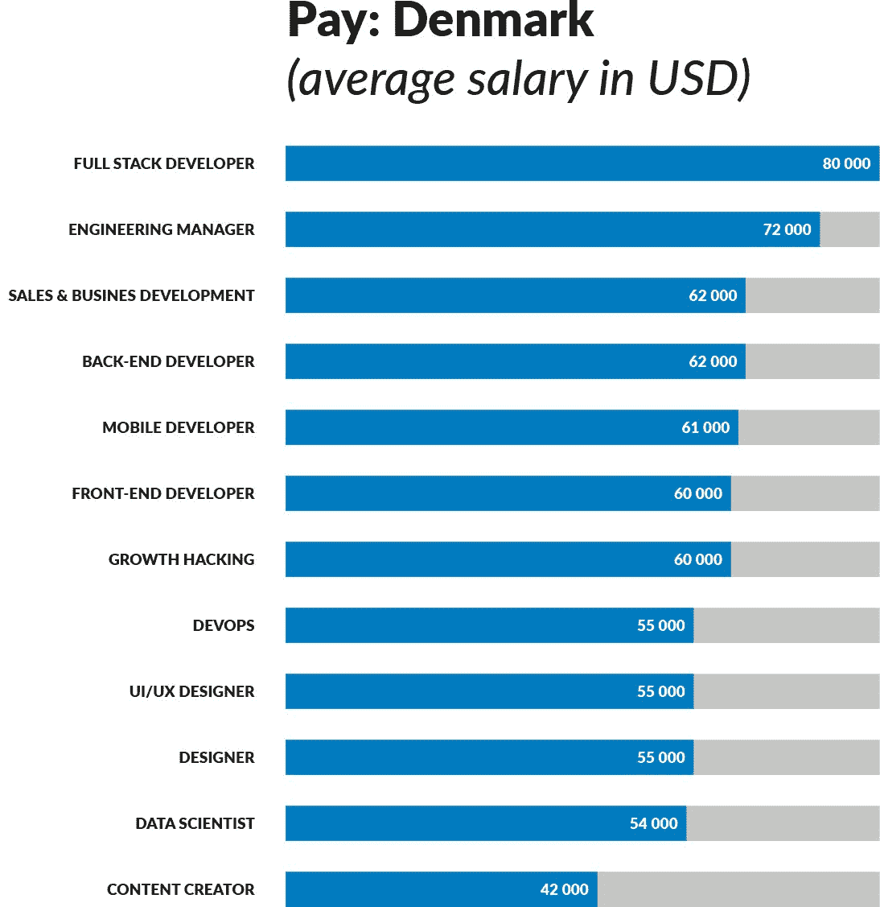
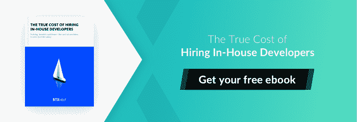

# 欧洲雇佣 Python 开发人员最昂贵的 10 个国家

> 原文：<https://www.stxnext.com/blog/top-10-most-expensive-countries-europe-hire-python-developer/>

 欧洲的科技初创企业正在扩张，这不是什么新闻。为了保持相关性，公司正在将越来越多的数字服务添加到他们的产品中。

因此，对熟练开发人员的需求正在显著增长。这对于那些希望在不倾家荡产的情况下雇佣新开发人员的公司来说意义重大。

在最近一项关于 2016 年欧洲科技人才状况的研究中，工程职位(包括开发人员)被列为最难填补的职位，43%的受访者表示这是因为缺乏专业或技术技能。

根据研究，虽然开发人员普遍对自己的工作满意，但他们还是会定期跳槽。20%到 41%的开发人员在过去的一年里换了工作。

寻求新机会的最常见原因是职业发展(46%)和更高的薪水(36%)。

下面，我们来看看雇佣一名 [Python 开发者](https://stxnext.com/services/python-js-development/)最贵的 10 个国家。在适用的情况下，我们会提供特定职业的薪资水平的更详细信息。你的国家排名第几？

(对不同的地区感兴趣？阅读[美国雇佣 Python 开发者最贵的 10 个城市&加拿大](https://stxnext.com/blog/2017/01/18/top-10-most-expensive-cities-hire-python-developers-us-canada/) ) 

#### #10.奥地利

*   平均工资:51148 美元(40083 英镑)
*   28%的开发人员在去年换了工作。

#### #9.芬兰

*   平均工资:51186 美元(40112 英镑)
*   赫尔辛基是欧洲第 11 大 IT 创业城市。
*   24%的开发人员在去年换了工作。

芬兰 Python 开发人员薪资最高的三个城市是:

1.  赫尔辛基 49599 美元(€46552 英镑)
2.  埃斯波，48265 美元(€45300 英镑)
3.  奥卢，41661 美元(€39102 英镑)

#### #8.荷兰

*   平均工资:53889 美元(42213 英镑)
*   阿姆斯特丹在欧洲 IT 创业城市中排名第四。
*   29%的开发人员在去年换了工作。

荷兰 Python 开发人员薪资最高的三个城市是:

1.  阿姆斯特丹:50002 美元(€:46930 英镑)
2.  鹿特丹，4.4749 万美元(€4.2 万英镑)
3.  乌得勒支，43850 美元(€41156 英镑)

#### #7.德国

*   平均工资:58176 美元(45596 英镑)
*   柏林是欧洲第二大 IT 创业城市。慕尼黑排名第 12。
*   25%的开发人员在去年换了工作。

德国 Python 开发人员薪资最高的三个城市是:

1.  法兰克福，56469 美元(€53000 英镑)
2.  杜塞尔多夫，56256 美元(€52800 英镑)
3.  慕尼黑 55234 美元(€51841 美元)

#### #6.瑞典

*   平均工资:59011 美元(46251 英镑)
*   斯德哥尔摩是欧洲第七大 IT 创业城市。
*   28%的开发人员在去年换了工作。

瑞典 Python 开发人员薪资最高的三个城市是:

1.  链接购买，61，355 美元
2.  斯德哥尔摩，59657 美元
3.  哥德堡，59388 美元

#### #5.爱尔兰共和国

*   平均工资:66522 美元(52145 英镑)
*   都柏林是欧洲第八大 IT 创业城市。
*   37%的开发人员在去年换了工作。

爱尔兰 Python 开发人员薪资最高的三个城市是:

1.  戈尔韦，57624 美元(€54084 美元)
2.  利默里克，55670 美元(€52250 美元)
3.  都柏林，52298 美元(€49085 英镑)

#### #4.联合王国

*   平均工资:70500 美元(55263 英镑)
*   伦敦是欧洲 IT 创业公司排名第一的城市，也是希望出国工作的开发人员最青睐的目的地。
*   32%的开发人员在去年换了工作。

英国 Python 开发人员薪资最高的三个城市是:

1.  伦敦，53023 美元(41756 英镑)
2.  剑桥，49745 美元(39175 英镑)
3.  牛津大学，45514 美元(35843 英镑)

#### #3.丹麦

*   平均工资:75758 美元(59285 英镑)
*   哥本哈根在欧洲 IT 创业城市中排名第九。
*   31%的开发人员在去年换了工作。

#### #2.挪威

*   平均工资:86042 美元(67445 英镑)
*   20%的开发人员在去年换了工作。

#### #1.瑞士

*   平均工资:90524 美元(70958 英镑)
*   苏黎世在欧洲 IT 创业城市中排名第 15 位。
*   20%的开发人员在去年换了工作。

瑞士 Python 开发人员薪资最高的三个城市是:

1.  苏黎世，101360 美元(102409 瑞士法郎)
2.  巴登，95066 美元(96050 瑞士法郎)
3.  洛桑，80049 美元(80878 瑞士法郎)

#### 这对首席技术官、副总裁和工程主管意味着什么？

这意味着 It 招聘领域正变得越来越具有挑战性和竞争性。开发人员可以要求的工资将继续增加。如果你打算很快做出重要的招聘决定，这种薪资因素应该被考虑在内，尤其是在比较内部招聘与  [外包](https://stxnext.com/software-development-outsourcing-guide/)时。

在决定是雇佣内部开发人员还是外包开发人员时，工资通常是衡量标准，这方面的失误会让你付出代价。事实上，企业内部员工在雇佣、维持和终止雇佣关系时会产生大量的、经常被忽视的成本，这些成本并没有反映在工资中。

法则一:**一个开发者永远、永远、永远比他们的工资贵。**

如果你想要更低的成本、更舒适的预算状况和更高的利润率，计算内部软件开发的真实成本是必不可少的。这就是为什么我们制作了一个简短的  [，一个有用的指南](https://stxnext.com/ebooks/true-cost-hiring-inhouse-developer/) ，告诉你到底该怎么做。

下载免费电子书，今天就开始做出更好的招聘决定。

##### 统计资源:

国家排名&平均工资- [商业内幕:欧洲开发者收入最高的 15 个国家](http://www.businessinsider.com/countries-where-developers-get-paid-most-in-europe-2016-12/#11-france-47213-37002-5)

城市创业排名&人才景观事实: [欧洲人才景观报告](https://talent.balderton.com/European_Tech_Talent_Landscape.pdf)

[Python](https://stxnext.com/ebooks/what-is-python-used-for/) 薪资排名分城市: [薪资等级](http://payscale.com/)

##### 被推荐的

*   [美加雇佣 Python 开发者最贵的十大城市](https://www.stxnext.com/blog/top-10-most-expensive-cities-hire-python-developers-us-canada/)

