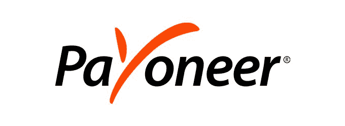
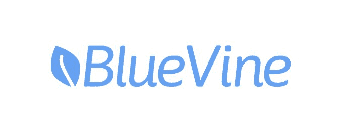
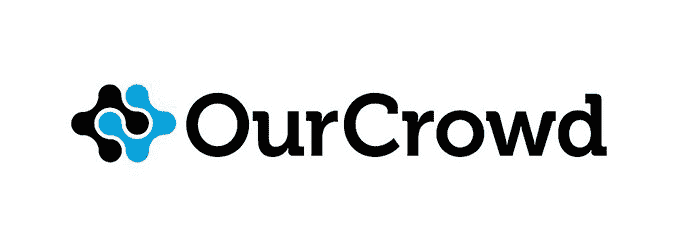
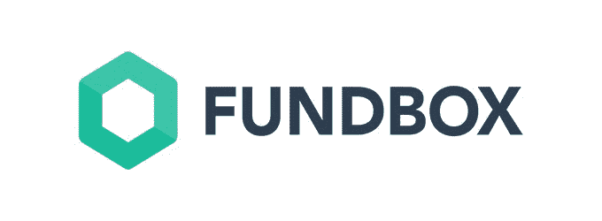

# 2019 年值得关注的五大以色列金融科技公司

> 原文：<https://www.stxnext.com/blog/top-5-israeli-fintech-companies/>

 有超过 600 家创业公司，以色列金融科技行业正在蓬勃发展。

以色列已经被公认为全球高科技强国，该行业的增长速度超过了当地的人才供应。当地市场经常被以色列金融科技企业家用作进入更广阔市场(特别是美国)的跳板，在该国创造的解决方案已被领先的全球金融机构采用。

快速增长吸引了源源不断的投资，使该国成为全球金融科技创新的前沿，并赢得了“创业国家”的绰号。创业公司的高度集中也使特拉维夫成为举办行业活动的好地方。

即将到来的[fin tech Junction](https://www.fintechjunction.com/)会议将吸引约 1500 名与会者，包括行业领袖。我们的一些同事也将出席，我们非常期待更多地了解是什么让以色列金融科技行业如此繁荣。

我们编制了这份名单，以帮助你更加熟悉一些最具影响力的以色列金融科技，在 2019 年密切关注。 

#### 1.行贿者

[https://www.payoneer.com/](https://www.payoneer.com/)

##### 他们是谁？

Payoneer 是一家总部位于以色列的跨境支付平台。该公司成立于 2005 年，迄今已在全球 17 个地方开设了办事处，包括香港、印度、英国和西班牙。

该公司雇佣了 1200 名员工。迄今为止，Payoneer 已经筹集了 2.45 亿美元，其投资者包括中国最大的保险公司中国平安保险集团有限公司、总部位于门洛帕克的私募股权公司 TCV 和总部位于北京的 CBC Capital。

Payoneer 为 Airbnb、亚马逊、Upwork 和 Getty Images 等平台提供数字支付服务。

##### 他们是做什么的？

Payoneer 的在线转账和数字支付服务使用户能够通过多种方式在全球范围内支付和接收资金，包括信用卡和借记卡、电子钱包和银行转账。该平台支持 200 多个国家的 150 多种货币。

Payoneer 的平台为自由职业者和小企业提供了一种直接获得工作报酬的方式，无需使用任何第三方服务。

开立 Payoneer 账户是免费的，可以在世界任何地方进行，通常只需要几个工作日。

账户通过验证后，用户将收到一张 ATM 借记卡，可用于从任何接受万事达卡的 ATM 机上取款，无需当地银行账户。如果用户有银行账户，他们也可以通过银行转账取回资金。

##### 他们为什么伟大？

3G 和 4G 互联网连接的可用性不断增加，使得生活在发展中经济体的人们更容易从事全球自由职业，在这些经济体中，有意义的职业机会可能很少。

Payoneer 的总经理 Eyal Moldovan 表示，该公司正在见证“越来越多的新人加入这个生态系统并抓住机遇。”

然而，实现跨境支付的技术并没有跟上步伐，这使得许多自由职业者疲于应付高昂的银行费用，并阻止他们寻求超越国界的任务。

Payoneer 提出了一个系统，使全球的自由职业者和小企业主能够在他们的职业中取得成功，并在他们所在的地方谋生，而无需移居国外。到目前为止，它已经服务了超过 400 万客户。

#### 2.蓝藤

[https://www.bluevine.com/](https://www.bluevine.com/)

##### 他们是谁？

BlueVine 成立于 2013 年。它为美国的中小企业提供快速信贷。

该公司的总部设在红木城，在泽西城有一个办事处，在特拉维夫有一个开发中心。它雇佣了大约 270 名员工。

创始人兼首席执行官 Eyal Lifshitz 对经营小企业的来龙去脉并不陌生——他的祖父和父亲都是小企业主。

##### 他们是做什么的？

通过其在线平台，该公司通过三种产品提供商业信贷:信用额度、定期贷款和发票保理。

任何产品的申请过程都很简单，并提供近乎即时的结果。例如，BlueVine 的定期贷款和按需信用额度的审批时间可以短至 10 分钟。

该公司首创的在线发票保理服务提供高达 500 万美元的保理额度，提前一天通知即可使用。

##### 他们为什么伟大？

根据摩根大通的  [研究，美国一半的小企业只有足够的现金支持 27 天的日常资金流出。因此，许多人被迫向银行贷款，以维持他们的经营。](https://www.jpmorganchase.com/content/dam/jpmorganchase/en/legacy/corporate/institute/document/jpmc-institute-small-business-report.pdf)

自六年前成立以来，BlueVine 已经为中小企业提供了 20 亿美元的融资。

BlueVine 使用复杂的技术来简化融资产品的交付。它让传统实体银行没有资格获得信贷的小企业也能获得信贷。

Lifshitz 决定将他的公司命名为 BlueVine，因为葡萄树是一种正在生长的植物，他希望他的公司能够帮助其他人生长。蓝色象征着金融服务和信誉。

用 Lifshitz 自己的话来说，公司的使命是帮助他人“成功和发展”

#### 3.我们的世界

[https://www.ourcrowd.com/](https://www.ourcrowd.com/)

##### 他们是谁？

our crowd[被冠以](https://www.apnews.com/Business%20Wire/69ccfe728a5245bcb658976d22ea1272) “以色列最活跃的风险投资者”，由资深企业家、以色列领先的风险投资家之一乔恩·梅德韦德(Jon Medved)于 2013 年创办。

这家总部位于耶路撒冷的公司是全球投资平台和股权众筹的领导者，已经筹集了超过 10 亿美元，投资了 170 家投资组合公司和 18 只基金。

其社区由来自 150 多个国家的近 30，000 名合格投资者组成。

仅在 2018 年，该平台就筹集了约 4 亿美元，投资了 80 家公司。截至 2018 年 8 月，OurCrowd 是以色列最活跃的基金。

##### 他们是做什么的？

OurCrowd 是一个众筹平台，收集和展示对全球不同领域的初创公司和公司的公开投资，从技术和网络安全到农业和医疗保健。除了经认可的投资者，我们的公司还向每一个风险企业投资自有资本。

该公司聘请主题专家，通过尽职调查和讨论对公司进行评估。然后，他们选择机会与我们的投资者社区分享。许多入选的初创公司致力于帮助解决世界上最紧迫的问题，如气候变化或人工智能的使用。

OurCrowd 的投资规模相对较小，但其广泛的合格投资者网络以及合作项目的多样性使其成为以色列风险投资领域的重要参与者。

##### 他们为什么伟大？

OurCrowd 的创始人乔恩·梅德韦德(Jon Medved)表示，在过去的半个世纪里，风险投资行业的运作方式大致相同。尽管它对其他行业产生了颠覆性和变革性的影响，但它本身几乎没有改变。

梅德韦德  [成立了金融科技公司](https://en.globes.co.il/en/article-ourcrowd-is-an-investment-supermarket-it-has-everything-1001272540) “振兴这个行业，让它变得更民主一点。”他意识到，许多投资者主要感兴趣的是如何对以色列的高科技初创公司进行小额到中等规模的投资，因此决定创建一个平台，让他们能够做到这一点。

OurCrowd 在世界各地组织会议和活动，吸引了成千上万的人，使首席执行官和投资者能够建立联系。

Medved 的精力和激情是公司背后的关键驱动力。“我沉迷于交易，并从中获得能量。当你每天坐在年轻投资者面前，他们告诉你他们的梦想，你可以帮助他们实现这些梦想，这就像内啡肽一样。

#### 4.基金盒

[https://fundbox.com/](https://fundbox.com/)

##### 他们是谁？

Fundbox 是一家在线贷款公司，为美国的小型企业提供贷款、循环信用额度和发票融资。

Fundbox 由 Eyal Shinar、Yuval Ariav 和 Tomer Michaeli 共同创建。在看到经营一家小企业的母亲为未付发票而苦苦挣扎后，Shinar 意识到市场存在缺口，并决定建立自己的企业来解决这一问题。

该公司成立于 2013 年，迄今已为 70，000 多名客户提供服务。它已经从硅谷的主要投资者那里筹集了超过 1 亿美元的资金，如科斯拉风险投资公司、通用催化剂伙伴公司和火花资本公司。

##### 他们是做什么的？

Fundbox 自己的研究显示，美国中小企业平均被拖欠 84，000 美元的未付发票。该公司旨在帮助这些企业在等待逾期付款时保持现金流。

Fundbox 分析其客户的会计数据，以确定正确的信用额度，然后支付企业选择的未付发票。然后可以在 12 或 24 周内偿还。它的系统集成了最流行的会计软件，包括 QuickBooks、FreshBooks 和 PayPal。

Fundbox 还提供平均需要 3 分钟审批的信用额度，最快可在下一个工作日到达客户的银行账户。

##### 他们为什么伟大？

2008 年金融危机后，许多传统银行减少了对中小企业的贷款以限制风险。因此，许多此类公司难以获得信贷。

Fundbox 的创始人意识到，评估小企业信贷资格的标准程序不再符合市场快速变化的要求。

他们提出了小企业图表——一个向在其他地方没有资格获得融资的小企业提供融资的简化流程。该流程通过绘制和分析客户与他们自己的客户、供应商和合作伙伴的关系，帮助 Fundbox 获得客户的实时、整体视图。

这个公式帮助 Fundbox 的贷款产品实现了不到 1%的损失率。

“我们有公司试图模仿我们产品的历史，但这是非常独特的，”  [希纳尔说](https://www.forbes.com/sites/amyfeldman/2017/09/26/fundboxs-big-opportunity-in-changing-the-way-small-businesses-get-paid)。“如果你没有花过去四年时间来建设能力，就不可能模仿。”

2018 年，Fundbox 获得了享有盛誉的以色列最佳金融科技初创企业 Atlas 奖。

#### 5.柠檬汁

[https://www.lemonade.com/](https://www.lemonade.com/)

##### 他们是谁？

Lemonade 是一家财产保险公司，使用高科技解决方案即时报价和评估索赔。它适用于美国 23 个州的房主和租房者。

金融科技在最近的一轮融资中筹集了 3 亿美元，目前估值超过 20 亿美元。

它是由以色列人丹尼尔·施雷伯(Daniel Schreiber)和 Shai Wininger(Fiverr 的联合创始人)于 2015 年成立的。

##### 他们是做什么的？

柠檬水提供负担得起的财产保险，租金最低为每月 5 美元，房主为 25 美元。

申请保单的过程又快又简单。它由一个名为 Maya 的聊天机器人组成，通过一系列问题来帮助用户定制他们的覆盖范围，以满足他们的独特需求。对政策的任何更改都可以通过柠檬水 app 进行，并立即生效。

该公司采用简单透明的定价模式:收取固定费用，并且每一步的条款和条件都有清晰的解释。

##### 他们为什么伟大？

长期以来，传统财产保险行业的特点是根深蒂固、过时的政策，以及保险公司与其客户之间固有的利益冲突。柠檬水凭借其无争议的创新方法以及使用高科技解决方案，如  [机器学习](https://stxnext.com/services/machine-learning/)，已经能够扰乱市场。

柠檬水客户体验主要基于应用程序，但也可以通过其易于导航的网站访问。

请求报价、注册和提交索赔的整个流程已经过简化，尽可能简单、直观和透明。

但真正让柠檬水在竞争中脱颖而出的不是时尚的移动应用或对千禧一代友好的营销，而是其独特的商业模式。公司保留四分之一的保险费，以支付管理费用和潜在利润。其余 75%用于客户索赔、再保险以及任何税费。任何剩余资金都将捐赠给投保人选择的慈善机构。

这意味着柠檬水没有兴趣拒绝或拖延合法的索赔。事实上，该公司会立即审核索赔，并在不到三秒钟的时间内支付其中四分之一的款项。

柠檬水也是 A 级，完全受监管，并由伦敦劳埃德银行等巨头再保险。

#### 最后的想法

以上仅仅是对充满活力的以色列金融科技行业的介绍。

整个行业正在全球范围内经历快速转型，随着投资者资金的增加，有很多东西值得期待。

如果你想更多地了解这个新兴行业，为什么不看看我们以前的作品呢？

*   [为什么 Python 应该是您的金融科技的技术选择](/stx-new-blog/web-app-speed-website-performance/)
*   [将 Python 纳入其技术堆栈的前 17 家金融科技公司](/stx-new-blog/top-15-fintech-companies-include-python-their-tech-stack/)

在 STX Next，我们热衷于帮助金融科技公司实现他们的目标。看看  [目前为止我们合作过的一些客户](https://stxnext.com/portfolio/#fintech) 。

如果你经营一家金融科技公司，  [，我们希望听到你的声音](https://stxnext.com/contact-us/)。

