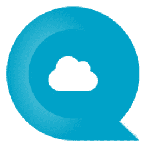
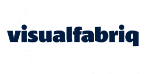
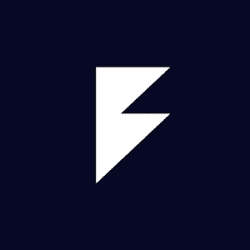
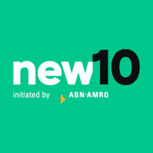
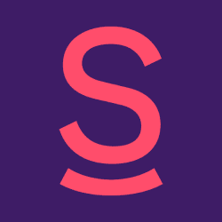
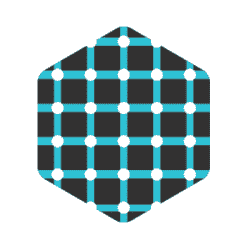
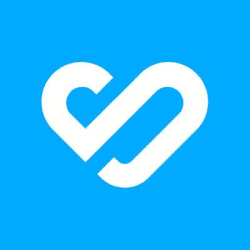
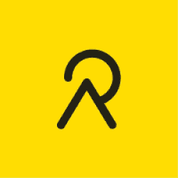
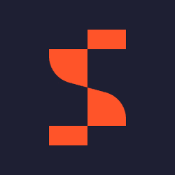

# 2023 年荷兰最值得关注的 12 家科技公司

> 原文：<https://www.stxnext.com/blog/top-companies-netherlands/>

 2020 年，荷兰的科技生态系统估值为[€2320 亿](https://www.datocms-assets.com/34494/1622453421-techleap-stateofdutchtech-24.pdf) ，成为欧洲第三大科技生态系统。今天，这个国家继续展示令人印象深刻的技术创新、采用和增长。

在本文中，我们将重点介绍 12 家最令人兴奋、发展最快的公司，它们引领着荷兰的科技行业。请继续阅读，了解哪些荷兰企业登上了我们的榜单，以及为什么它们在 2023 年值得关注！ 

#### 1。[QuandaGo](https://www.quandago.com/)

*   **成立时间:2019 年**

*   **总部:鹿特丹**

*   **跟随 QuandaGo 上**[**LinkedIn**](https://www.linkedin.com/company/quandago)

QuandaGo 由 Arthur Nederlof 和 Arnoud Munneke 创建，是一个云联络中心，帮助企业自动化工作流程，简化知识管理，并从单点无缝管理所有客户交互。

在短短三年内，该公司取得了令人印象深刻的成功，这证明了他们的领导素质和客户至上的服务交付。他们最近连续第三次入围德勤科技快速 50 强名单。此外，Nigroeit 还将他们评为荷兰 250 强成长型公司之一。

QuandaGo 是 VANAD 集团的子公司之一，VANAD 集团是一家领先的跨国企业，在全球范围内拥有 1，500 多名员工，包括比利时、澳大利亚、英国和美国。

#### 2。[visual fabriq](https://visualfabriq.com/)

*   **成立时间:2013 年**

*   **总部:马尔森**

*   **关注 Visualfabriq 上的**[**LinkedIn**](https://www.linkedin.com/company/visualfabriq)

在消费品行业漫长而成功的职业生涯中，Carst Vaartjes 和张博·布鲁斯意识到消费品行业有一个巨大的问题:缺乏对大数据的访问。

因此，他们着手解决这个问题。其结果是 visual fabriq——将相关数据转化为即时、有意义的见解的首选平台。

在短短八年多的时间里，Visualfabriq 已经成为领先的人工智能驱动的收入增长管理平台，适用于欧莱雅、喜力和 Arla 等一些全球最大的消费品公司。

2020 年，该公司连续第三年获得五项 POI“最佳”奖。

#### 3。 [斯图多库](https://www.studocu.com/)

*   **成立时间:2013 年**

*   **总部:阿姆斯特丹**

*   **关注 StuDocu 上**[**LinkedIn**](https://www.linkedin.com/company/studeersnel.nl/)

StuDocu 由四名学生创建，他们想要一种简单而协作的方式来一起学习，交换学习材料，并获得更好的成绩。

今天，来自全球 11，000 多所大学的 1，500 多万人依靠该平台访问高质量的教育资源。2021 年 5 月，该公司从法国风险投资公司 Partech 融资 5000 万美元。

Partech 的普通合伙人 Bruno Crémel 在接受 TechCrunch 采访时谈到了他们资助 StuDocu 的决定，他说:“当我们在 StuDocu 遇到这个团队时，他们的数据驱动文化以及学生们对使用他们的服务的热爱给我们留下了深刻的印象。StuDocu 是一个已经在帮助全球数百万学生的平台，我们很高兴能与这个才华横溢的团队合作，共同完成让所有人都能接受教育的使命。”

#### 4。 [第四线](https://www.fourthline.com/)

*   **成立时间:2017 年**

*   **总部:阿姆斯特丹**

*   **跟随 Fourthline 上**[**LinkedIn**](https://www.linkedin.com/company/fourthline-kyc/)

每年，全球因洗钱而损失的 GDP为 2-5%，总额在 8000 亿美元到 2 万亿美元之间。

Fourthline 等公司正在帮助传统银行等金融机构和现代金融科技公司 轻松防止欺诈并实现一体化合规。

Fourthline 采用顶级的 KYC 技术，在整个客户生命周期中监控和筛选用户。这限制了身份盗窃和其他非法金融活动的发生。

该公司已经从鲁道夫·布克(Rudolf Booker)和芬奇资本(Finch Capital)等投资者那里筹集了总计 2030 万美元的资金。在他们的 2022 年季度 [全球市场报告](https://www.gpbullhound.com/news/news/sector-updates-q322/) 中，GP Bullhound 将 Fourthline 列为改变金融科技领域的领先公司之一。

#### 5。[new 10](https://new10.com/)

*   **成立时间:2017 年**

*   **总部:阿姆斯特丹**

*   **关注 new10 上**[**LinkedIn**](https://www.linkedin.com/company/new10/)

申请商业贷款通常是一件麻烦事。你必须来回处理大量复杂的文书工作和文件，然后等待几天，如果不是几周，贷款审批决定。New10 正在改变荷兰企业的所有这一切。

New10 是一个数字借贷平台，使中小企业能够快速方便地获得贷款。申请过程结束后，您将在 15 分钟内获得申请状态的更新，不再需要漫长的等待时间！

New10 是荷兰第三大银行 ABN AMRO 银行的子公司。

#### 6 号。笑脸

*   **成立时间:2020 年**

*   **总部:阿姆斯特丹**

*   **跟随微笑者上** [**领英**](https://www.linkedin.com/company/smiler/)

Smiler 是一个摄影市场，将 9，000 多名专业摄影师与旅游景点和难忘场所的人们联系起来。

用户可以在这个平台上付费预约一名专业摄影师，帮助他们进行随机的现场摄影。

Smiler 在竞争中脱颖而出，因为与 Fiverr 或 Upwork 等其他受欢迎的市场相比，他们为摄影师提供了更高的收入机会。此外，这是一个利基平台，保证了潜在客户的高水平的专业性。

2021 年，Smiler 是伦敦塔 的独家摄影合作伙伴。同年，该公司获得了由 Mosaic Ventures 牵头的 800 万美元种子资金。

#### 7。

 

*   **成立时间:2017 年**

*   **总部:阿姆斯特丹**

*   **在**[**LinkedIn**](https://www.linkedin.com/company/amberscript/)上连接 Amberscript

Amberscript 由彼得-保罗·德·勒乌、托马斯·迪斯特和提莫·伯伦斯创建，是一种易于使用的专业转录服务，允许用户轻松地将音频和视频转换为文本。该公司的使命是让每个人都能听到所有的声音。

到目前为止，该公司已经筹集了两轮资金。2021 年 11 月，他们从 Endeit Capital 获得了€870 万美元的首轮融资，以进一步开发他们的技术并扩大他们的业务。

2022 年，Amberscript 获得德勤科技 50 强竞赛提名。他们还获得了青年商业奖决赛的资格，这是荷兰最大的创业竞赛。  #### 8。

 

*   **成立时间:2015 年**

*   **总部:阿姆斯特丹**

*   **关注**[**LinkedIn**](https://www.linkedin.com/company/aidence/)

六年多来，爱登堡一直致力于通过人工智能 改善医疗诊断，尤其是肺癌、 [。他们的使命是“提供智能软件，使医疗保健和制药专业人员能够提供更快、更精确的诊断和治疗。”](/services/machine-learning/)

Aidence 与一些最大的全球性组织合作，以改善疾病的预防、管理和治疗。例如，在 2021 年，它是英国国民保健服务系统(NHS)有针对性的肺部健康检查(一项肺癌筛查计划)的首选合作伙伴。他们的其他合作伙伴包括阿斯利康、荷兰癌症研究所和 Quantib。

2020 年，艾登斯获得美国国家卫生研究院 AI in Health and Care 奖。在此之前，2019 年，该公司入围了 UCSF 数字健康奖，被誉为“实现更好的精神和行为健康和健康的最佳数字健康产品或服务”  #### 9。 [比德尔](https://www.bynder.com/en/)

*   **成立时间:2013 年**

*   **总部:阿姆斯特丹**

*   **关注**[**LinkedIn**](https://www.linkedin.com/company/bynder/)

2013 年，克里斯·霍尔需要一种更好的方式在他的代理公司 Label A 和他的客户之间共享数字资产。这就是为什么他创建了 by nder——一个数字资产管理平台，允许内容团队无缝地组织和共享创意资产。

如今，Bynder 是发展最快的 SaaS 公司之一，在全球拥有超过 170 万用户和近 4000 名客户。

从 2013 年到 2016 年，该公司的年度经常性收入达到了 1000 万美元。同样在 2016 年，他们获得了由 Insight Ventures Partners 领投的 2200 万美元 A 轮融资。

#### 10。 [重温](https://www.relive.cc/?hl=en)

*   **成立时间:2016 年**

*   **总部:鹿特丹**

*   **跟随重温上** [**领英**](https://www.linkedin.com/company/relive.cc/)

重温开始于 2016 年在特内里费岛的一次骑行假期。他们的创始人——乔里斯·范·克鲁伊森、莱克斯·丹尼尔斯和优素福·艾尔·达迪里——想要一种捕捉一天中美丽瞬间的方式，于是“重温”的想法诞生了。今天，这个想法已经成为一个超过 900 万用户分享独特户外体验的社区。

Relive 允许您使用在骑自行车和徒步旅行等户外活动中收集的 GPS 和卫星成像数据来创建个性化的 3D 视频故事。到目前为止，该公司已经筹集了大约 120 万€的资金。

#### 11。 [不拘一格](https://www.eclecticiq.com/)

*   **成立时间:2014 年**

*   **总部:阿姆斯特丹**

*   **追随不拘一格上** [**领英**](https://www.linkedin.com/company/eclecticiq)

EclecticIQ 由 Joep Gommers 和 Raymon van der Velde 创建，是一个全球威胁情报平台，面向一些全球领先的网络安全公司，如 Flashpoint 和 Splunk。

到目前为止，该公司的经营业绩令人印象深刻。2016 年和 2017 年，他们分别获得了€550 万美元的 A 轮融资和€1400 万美元的 B 轮融资。

后来，在 2020 年，他们在由 Ace Capital Partners 牵头的 C 轮融资中为€筹集了 2000 万美元。他们还从欧洲投资银行 [和荷兰安全技术基金](https://www.eclecticiq.com/news/31-august-2021-dutch-scale-up-eclecticiq-receives-15-million-in-eu-financing-to-boost-development-of-next-gen-cyber-security-platform) 获得了额外的资助。

EclecticIQ 于 2020 年 5 月收购了领先的端点检测和响应技术提供商 PolyLogyx，以增强其技术和服务产品。

#### 12。

 

*   **成立时间:2015 年**

*   **总部:莱顿**

*   **关注萨莫蒂奇**[**LinkedIn**](https://nl.linkedin.com/company/samotics)

Samotics 以前被称为 Semiotic Labs，是一个人工智能驱动的预测性维护系统，其任务是消除交流电机和旋转设备的计划外停机时间。他们的技术被 Nobian、Anglian Water 和其他行业领导者所采用。

据 [Crunchbase](https://www.crunchbase.com/organization/semiotic-labs/company_financials) 报道，Samotics 已经从 ABB 和 83North 等投资者那里筹集了总计 3260 万美元的资金。他们最近的一次融资是在 2022 年 9 月 22 日，从一轮公司融资中筹集的。  #### 关于 2023 年荷兰最值得关注的 12 家科技公司的最终想法

荷兰科技行业才刚刚开始加快步伐。在不久的将来，荷兰仍有许多增长、创新和激动人心的产品发布的机会。

这正是我们将密切关注上述公司以及该国整个科技生态系统进一步发展的原因——我们认为你也应该这样做！

我们感谢您通读我们的列表。如果您喜欢这篇文章，下面是一些有用的资源:

*   [英国排名前 19 的金融科技和保险科技公司](/blog/top-fintech-insurtech-companies-uk/)
*   [2022 年 Fintech CTOs 们担心的具体挑战有哪些？](/blog/fintech-cto-challenges/)
*   [2022 年最值得关注的 9 家英国金融科技创新公司](/blog/most-innovative-uk-fintech-startups/)
*   [专家对机器学习(和 Python)的未来有什么看法？](/blog/future-of-machine-learning-and-python-expert-opinions)
*   [北欧 16 大金融科技和 SaaS 公司](/blog/top-fintech-saas-companies-nordics/)

在 STX Next，我们与快速增长的科技公司合作，帮助他们实现前所未有的增长水平。请随意 [看看我们能为您做些什么](/services/) ，如果您希望将您的业务提升到全新的高度，请继续前进并 [联系我们](/hire-us) ！