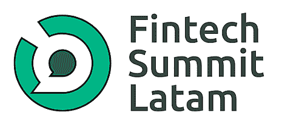
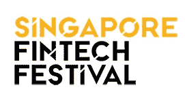

# 亡羊补牢:2021 年你仍可以参加的顶级金融科技会议

> 原文：<https://www.stxnext.com/blog/top-fintech-conferences-you-can-still-attend-in-2021/>

 如果说什么时候是参加金融科技会议的最佳时机，那就是现在。

几个月来，我们的大部分注意力都集中在内部——身体上，因为封锁，精神上，因为许多意想不到的挑战——现在是时候超越我们自己思想的安全地带，从最新的市场趋势中获得灵感。

建立关系网，发现新的机会，了解最新动态:这些只是你从参加会议中获得的一些好处，无论会议是以虚拟方式、现场方式还是混合方式举行。

幸运的是，我们发现了大量提供不同参与方式的活动，因此您可以感到安全，同时获得最大收益。

因此，如果你是一名金融科技爱好者，并准备好接受启发，请查看我们列出的 2021 年下半年吸引你注意力的精彩活动。 

#### 1.钱 20/20

****

**地点:**杂交

*   虚拟的
*   阿姆斯特丹
*   拉斯维加斯

**日期:**

*   虚拟，2021 年 7 月 20 日至 23 日
*   阿姆斯特丹，2021 年 9 月 21 日至 23 日
*   2021 年 10 月 24 日至 27 日，拉斯维加斯

**网址:[http://money2020.com/](http://money2020.com/)**

Money 20/20 不是一个而是三个事件，都位于不同的地区。根据你的居住地，你可以选择是在阿姆斯特丹、拉斯维加斯还是完全在线参加。

万一你预订了一张票，但后来发现由于旅行限制你不能参加，你可以用它换下一年的入场券。

今年的 [议程](https://europe.money2020.com/agenda) 中有许多有趣的内容，包括一个关于设计智能环境的会议。某些小组，如 rise up ----全球商界女性计划----是经常性的，并且出现在每一期的议程上。

在你等待会议开始的时候，你可以在 Money 20/20 的 YouTube 频道上观看往期的一些鼓舞人心的基调。

#### 2.拉美金融科技峰会

**地点:**虚拟

**日期:**2021 年 8 月 25 日—26 日

**网址:**[【https://www.fintechsummitlatam.com/】](https://www.fintechsummitlatam.com/)

顾名思义，Fintech Summit Latam 的重点是拉丁美洲。今年，会议将围绕适应数字银行和新金融经济的到来展开。

尽管该活动是在线举行的，但组织者声称这不仅仅是另一场静态网络研讨会。借助基于人工智能的 [Swapcard 应用](https://www.linkedin.com/company/swapcard/) 等工具，利用配对和一对一会议，会议体验变得更加丰富。重要的是，该活动面向英语和西班牙语使用者。

售票即将开始，在此之前，您可以在线探索去年的。

#### 3.FinovateFall

**地点:**杂交种

*   虚拟的
*   纽约

**日期:**2021 年 9 月 13 日—15 日

**网址:**[【https://informaconnect.com/finovatefall】](https://informaconnect.com/finovatefall/?utm_medium=email&utm_source=fintechweeklycom)

2021 年金融科技活动的最大好处之一是，其中许多活动让我们有机会在世界任何地方亲自或在线参与。这适用于今年的 FinovateFall。如果你不能去纽约，你仍然可以在你舒适安全的家中跟随它。

本次活动的日程安排充满了鼓舞人心的主题演讲、演示会议和交流机会。今年安排了许多有趣的小组讨论，如关于疫情如何加速数字化转型以及它对公司文化、业务和客户有何影响的会议。

我们期待的另一个小组是“七人七组”，七位专家演讲人每人有七分钟时间讨论金融科技目前最关键的一些问题。

#### 4.香港金融科技周

**地点:**杂交

*   虚拟的
*   香港

**日期:**2021 年 11 月 1 日—5 日

**网址:**[【https://www.fintechweek.hk/】](https://www.fintechweek.hk/)

香港金融科技周对于希望在亚洲扩张的金融科技公司来说是一个绝佳的机会。其中一个项目“全球快速通道 2021”致力于帮助 B2B 和 B2C 公司向零售银行、商业银行、支付、个人金融、资本市场、insurtech、regtech、数字资产和 ESG 领域的区域行业高管推介其项目。如果这听起来像是你想做的事情，你可以在 9 月 10 日之前提交申请。

会议还拥有一个令人印象深刻的发言者名单。易纲、雷伊·达里奥、阿德娜·弗里德曼、 [机器人索菲亚](https://www.hansonrobotics.com/sophia/) 只是今年你将听到的众多专家中的一部分。

#### 5.LendIt Fintech Nexus

****

**地点:**迈阿密

**日期:**2021 年 9 月 1 日–2 日

**网址:**[【https://www.lendit.com/nexus/2021/】](https://www.lendit.com/nexus/2021/)

Nexus 是一个与列表中所有其他事件完全不同的事件，因为在议程上没有任何小组讨论或主题演讲。相反，它挤满了会议和网络活动。

Nexus 旨在成为一个高端的合作活动，只有数量有限的与会者可以参加。其组织者确保每个参与者将有至少 10 次会议来联系潜在的未来商业伙伴。

#### 6.金融科技的未来

**地点:**杂交

*   虚拟的
*   纽约

**日期:**2021 年 10 月 5 日至 6 日

**网址:**[【https://events.cbinsights.com/future-of-fintech】](https://events.cbinsights.com/future-of-fintech)

新技术、新威胁、新市场:简而言之，这就是你在 Fintech 2021 的未来中所能听到的。今年的重点将是技术如何帮助金融服务更好地为客户服务，传统的商业模式如何改变，以及我们如何从不同地区的创新中学习。

虽然议程还没有最终确定，但你可以肯定组织者认真对待安全问题:只有完全接种疫苗的参与者才能参加面对面的会议。

另一个伟大的事情是，在 9 月初之前，逾期取消将被接受，没有任何罚款。

#### 7\. Sibos

**地点:**虚拟

**日期:**2021 年 10 月 11 日–14 日

**网站:**[https://www.sibos.com/](https://www.sibos.com/?utm_medium=email&utm_source=fintechweeklycom)

在 2020 年之前，Sibos 是一个你可以在阿姆斯特丹参加的金融科技会议。去年，它被搬到网上，取得了巨大的成功。注册人数破纪录，有来自 180 多个国家的 23，000 人注册。

由于今年的议程尚未公布，您可以前往活动的 [网站](https://www.sibos.com/conference/hub) 观看往年的视频或 ...为比赛做准备。

2021 年，你可以参加 *发现完美 Pitc h，* 形容为 “有转折的挑战”作为参赛者，你可以从三个类别的九个类别中进行选择:领导力、社会&可持续性和伙伴关系&协作。

如果你有资格，向评估你视频的行业专家推销你的想法。如果你的作品在九个最佳作品中脱颖而出，你将有机会在 Sibos 周现场展示你的作品。

#### 8.无缝的

**地点:**杂交

*   虚拟的
*   迪拜

**日期:**2021 年 9 月 20 日至 30 日

**网址:**[https://www . terra pinn . com/exhibition/seamless-middle-east/index . STM](https://www.terrapinn.com/exhibition/seamless-middle-east/index.stm)

如果你决定参加无缝寻找有趣的金融科技讲座，你不会失望。在今年的议程 上有七个不同的主题类别可供选择。

如果你想体验一下你所期待的，可以去看看 ContentHub 网站:它有大量过去版本的资料。更重要的是，如果你在迪拜，你还可以和该地区的创新创业公司一起参加科技博览会。

#### 9\. Fintech Devcon

**地点:**丹佛

**日期:**2021 年 9 月 7 日–9 日

**网址:**【https://fintechdevcon.io/】T4

敌无双金融科技展是为金融科技开发者设计的为期两天的活动。该会议是一个很好的机会，可以了解业内最大的品牌如何克服一些重大的技术挑战，并了解当今金融科技开发人员使用的工具和最佳实践。

此次活动将主要关注三个领域:支付、金融和贷款，以及监管和合规。有关更多详情，您可以查看 [议程](https://fintechdevcon.io/agenda/2021.pdf) 中的特定主题演讲和专题讨论。

#### 10.帝国创业公司

**地点:**纽约

**日期:**2021 年 10 月 19 日

**网址:**[【https://empirestartups.com/】](https://empirestartups.com/)

该活动只进行一天，但它充满了突破性的想法，鼓舞人心的小组和有趣的演示。

你可能会立即注意到一些有趣且吸引人的会议标题，如“RegTech 的真正主妇(丈夫和伴侣)”、“挑战者银行来了，挑战者银行来了”或“如何不被收购”。来自战壕的恐怖故事。”

我不知道你怎么想，但他们从一开始就说服了我。

#### 11.巴黎金融科技论坛

**地点:**虚拟

**日期:**各种日期

**网址:**[【https://www.parisfintechforum.com/】](https://www.parisfintechforum.com/)

如果你觉得很难参加一个会议，因为它发生在一个特定的日期或一个遥远的地方，巴黎金融科技论坛可能是最适合你的活动。

关于它的一个伟大的事情是会议在全年的不同日期举行。例如，下一次会议将于 10 月 12 日至 13 日举行，重点是支付问题。

此外，当你在平台上注册的时候，你就可以访问所有之前在这个版本中所做的演示。

#### 12.金融科技枢纽

**地点:**杂交

*   虚拟的
*   以色列

**日期:**2021 年 7 月 28 日

**网址:**【https://www.fintechjunction.com/ 

Fintech Junction 不仅仅是一次年度会议。该活动还辅以双月会议和在线会议，旨在使企业保持相关性。

除了精彩的主题演讲之外，大会还包括创业大赛，你有可能赢得美国 Merage Institute 领导力项目的邀请。

#### 13.BanTech 论坛

**地点:**虚拟

**日期:**2021 年 7 月 28 日–29 日

**网址:**[https://banktechforum . io](https://banktechforum.io)

风险管理峰会只关注银行业。今年将是该会议的第一届，但它似乎已经是一个非常有前途的事件。

在 BanTech 论坛上，您可以了解到诸如减少风险评估时间、情景规划和分析，或使银行政策与法规保持一致等问题。

想知道这次活动的杰出演讲者名单以及如何报名的详细信息，请访问本次活动的 [网站](https://banktechforum.io/risk/) 。

#### 14.金融科技世界论坛

**地点:**虚拟

**日期:**2021 年 8 月 16 日—17 日

**网址:**[【https://fintechconferences.com/】](https://fintechconferences.com/)

组织一次会议最重要的方面是什么？我们的猜测是你召集的人。而且阵容绝对是 Fintech 世界论坛 2021 最大的优势。

在演讲者和小组成员中，您可以找到来自 IBM、华为、OneSpan 等领先公司的行业专家。此外，通过购买贵宾票，你可以获得今年所有演讲的录音。

#### 15.新加坡金融科技节

**地点:**新加坡

**日期:**2021 年 8 月 8 日至 12 日

**网址:****[【https://www.fintechfestival.sg/】](https://www.fintechfestival.sg/)**

如果没有新加坡金融科技节(Singapore Fintech Festival)，这份清单就不完整。该节日有 1600 名演讲者和超过 60000 名参与者，号称是“世界上最大的金融科技盛会”。

为了了解在新加坡的那几天里你能学到什么，请查看以前版本的录音。我们发现特别有趣的是从 2020 年开始，在 [人工智能是否应该在金融服务](https://www.youtube.com/watch?v=lfg3d3Vf1OU) 中受到监管。

#### 关于 2021 年顶级金融科技事件的最终想法

令人惊讶的是，即使今年已经过去了 6 个多月，你仍然可以参加大量的金融科技活动。虽然我们只强调了其中的 15 个，但是这个列表还可以继续下去。

当谈到年度活动时，他们有些上线，有些留在线下，有些被推迟，但他们没有放弃。你也不应该。

尽管有无数的封锁、新的安全措施和旅行限制，但找到一个令人鼓舞的活动比以往任何时候都更容易。我希望这个列表已经帮助你为自己挑选了一个。

如果你想加深对金融科技的了解，可以看看我们博客上的文章:

*   [Python 是金融的好选择吗？](/blog/is-python-a-good-choice-for-finance)
*   [2021 年你应该在 Twitter 上关注的顶尖金融科技影响者](/blog/top-fintech-influencers-you-should-follow-on-twitter-in-2021)
*   [2021 年 10+值得关注的英国保险科技公司和初创公司](/blog/10-noteworthy-uk-insurtech-companies-and-startups-to-look-out-for-in-2021/)
*   [2021 年的 Insurtech:化挑战为机遇](/blog/insurtech-2021-challenges-and-opportunities-stuart-kelly-zego)

如果您正在开发 fintech 产品并需要帮助，请随时联系我们 。我们很乐意与您分享我们的 fintech 专业技术，帮助您的公司充分发挥潜力。