# 北欧 16 大金融科技和 SaaS 公司

> 原文：<https://www.stxnext.com/blog/top-fintech-saas-companies-nordics/>

 在过去的 20 年里，北欧人一直站在将现代技术应用于我们日常生活的最前沿，引进了 Spotify 或 Skype 这样的巨头。直到今天，他们还是欧洲最令人印象深刻的蓬勃发展的科技生态系统的主人。

这启发我们更仔细地看看他们在高科技解决方案方面到底给市场带来了什么。

[这些解决方案包括金融科技(fintech)](/services/fintech-development/) 改善和自动化使用金融服务，以及 SaaS(软件即服务)，支持交付在线应用，使其易于访问和管理。

为了帮助你了解北欧国家是如何为金融科技和 SaaS 的发展设定步伐的，我们编制了一份提供最具变革性想法和前瞻性解决方案的前 16 家公司的名单。请继续阅读，查看它们！ 

#### 1。 [克拉纳](https://www.klarna.com/pl/)

作为欧洲市值最高的私人金融科技公司，Klarna 与超过 400，000 家零售商合作，正在重新定义数百万客户的购物体验。

它提供网上商店支付和直接支付，但它也因一种新的购物后支付方式而闻名。作为一个“现在购买，以后支付”的服务提供商，Klarna 为他们的客户提供了一个轻松的信用卡替代品:作为结账过程的一部分，购物时可以赊账。

他们现在提供直接付款、交货后付款和分期付款选项，以及“立即付款”服务，允许您立即向支持该公司的任何在线零售商全额付款。Klarna 是网上购物领域的一名梦想家，他努力让网上购物变得更加直观和愉快。

#### 2。 [叮叮](https://tink.com/)

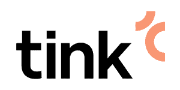

Tink 是欧洲领先的开放式银行公司之一，连接着 3，400 多家银行和机构，客户超过 2.5 亿。他们支持开发数据驱动金融服务的银行、金融科技公司和初创公司。

Tink 的平台可能用于访问汇总的财务数据和构建个人财务管理工具，尽管它也允许您发起支付。他们的单一 API 充当了整个欧洲所有财务数据的单一访问点。

每年超过 100 亿笔交易使他们成为现代银行市场的主要参与者之一。

#### 3。[Pleo](https://www.pleo.io/en)

Pleo 是一家总部位于哥本哈根的初创公司，已经简化了 20，000 多家公司的簿记工作。他们提供智能数字或实体公司信用卡，帮助员工购买工作所需的一切——同时控制公司的支出。

Pleo 的智能手机应用程序和自动化费用报告工具使购买变得简单和易于管理。Pleo 的所有卡都是有消费限额的预付费商业万事达卡，数字卡兼容 ApplePay 和 Google Pay。

#### 4。 [深信不疑](https://www.trustly.net/)

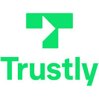

Trustly 是一种开放的银行支付方式，结合了您一直希望此类服务拥有的所有功能:快速、安全、易于使用，并且免费。

顾客、零售商和银行都使用它，它允许你直接从你的银行账户进行支付。您不需要注册或输入您的卡的详细信息。

Trustly 简化了银行转账退款和分期付款，使其更加直观。没有费用限制使它成为执行高价值交易的完美工具。

Trustly 向脸书、ePay 或 PayPal 等客户提供服务，有效地帮助了全球超过 5 亿消费者。

#### 5。 [漏斗](https://funnel.io/)

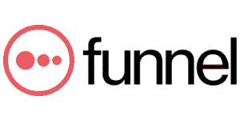

总部位于斯德哥尔摩的漏斗公司创建的数据平台拥有所有正确的功能，成为营销人员不可或缺的工具。如今，成功的业务运营在很大程度上基于数据分析，而漏斗通过收集广告、分析和 CRM 数据来帮助您做到这一点。

它将所有的数据放在一起，并向您展示其背景，从而让您全面了解您的营销策略的有效性。通过实时管理和协调数据，漏斗帮助您将营销工作引向您希望的方向。

多亏了漏斗，数据分析师和技术团队终于可以专注于更高价值的活动，将基本的数据分析留给一个方便的工具。

#### 6。 [农历](https://www.lunar.app/)

Lunar 是一家来自丹麦的独立、受监管且获得许可的数字银行。您可以将它用作支付和投资工具以及财务管理平台，而无需离开您的旧银行。

Lunar 的目标是“从根本上改变我们感知、谈论和处理金钱的方式。”他们为你提供最好的丹麦一体化银行应用程序、公平的价格和透明的条款。

有了 Lunar，您无需担心访问物理分支机构或联系众多顾问。此外，与许多其他北欧公司一样，Lunar 也是环保和道德的。

Google Play、脸书和 Trustpilot 只是 50 万月球用户中的一部分，他们认为这是一种现代的银行服务方式。

#### 7 .。

 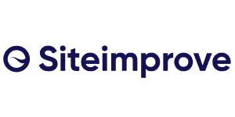

Siteimprove 是一家 SaaS 公司，是创建基于云的网站管理和优化工具和服务的专家。他们的软件产品将帮助你自动寻找漏洞，从而使你的网站工作更有效率。

Siteimprove 是一个拥有大量工具的平台，你可以使用这些工具来分析你的网站性能并优化其数字可访问性。作为万维网联盟(W3C)的成员，万维网联盟是制定国际 web 标准的领导组织，Siteimprove 知道如何根据全球 web 内容可访问性指南来帮助您提高 Web 可访问性。  #### 8。

 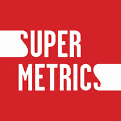

Supermetrics 被公认为 G2 列出的 100 个最佳软件产品之一，这是有充分理由的。它从脸书或谷歌广告等营销平台获取你需要的任何数据，并将其放入你的分析和存储平台。

它可以是一个数据湖、一个数据仓库、一个 BI 工具或一个电子表格——任何能让你看到干净的数据并做出正确结论的东西。

Supermetrics 节省了营销人员通常处理简历和复制/粘贴的时间。它只是接管你通常会做的工作，帮助你毫不费力地、快速地做出关于你的公司的更好的基于数据的决策。  #### 9。 [日志点](https://www.logpoint.com/en/)

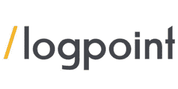

Logpoint 总部位于哥本哈根，是一家国际公司，开发了屡获殊荣的 SIEM(安全信息和事件管理)软件，并在 UEBA、SOAR 和 SAP security 领域取得了成功。

Logpoint 使用机器学习支持的高级分析来提供网络安全解决方案。得益于专为实时数据分析而构建的安全分析引擎，您可以快速检测到任何数据泄露或网络攻击。然后，您可以立即对这些威胁做出响应，并通过用户友好的界面进行报告。

Logpoint 作为最具创新性和用户友好的网络安全平台的创造者，其效率和声誉在与空客、波音或柯尼卡等公司的合作中得到了最好的证明。

#### 10。 [阿滕西](https://attensi.com/)

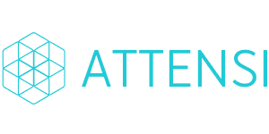

企业培训的游戏化是传统培训的一种令人兴奋的替代方式。您的员工通过沉浸在真实的场景中、体验现实的工作流程以及与其他人互动来学习。

这正是 Attensi 作为 3D 游戏化模拟培训的世界领导者为您提供的，旨在让人们“边做边学”基于人工智能的游戏化模拟的各种应用，从健康安全培训到入职员工，使 Attensi 的平台成为培训、教学和吸引员工的多功能工具。

Attensi 的 3D 模拟汇集了先进的建模和人类心理学知识。它们已经得到了 100 多个国家使用 50 种不同语言版本的公司的赞赏。

#### 11。[Happeo](https://www.happeo.com/)

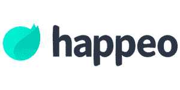

Happeo 是一家开发内部网软件的初创公司，该软件将员工与公司工具联系起来，并将他们需要的所有信息汇集在一起，以最好地完成工作。正如公司的联合创始人 Perttu Ojansu 所说，“[Happeo]让团队和人们围绕项目和共同利益创建渠道和页面。”

有了 Happeo，您可以比以往任何时候都更快地启动您的内部网——只需 6 到 8 周，而不是平均 1.2 年。它还易于使用，允许许多不同的贡献者创建内容。也可以和 Google Workspace、微软 365 整合。

Happeo 还为您提供了帮助您了解平台数据的工具，让您看到的不仅仅是页面访问和喜欢。通过 Happeo 丰富的分析，您可以了解整个平台的参与度以及您的用户在寻找什么样的内容。

一些市场领先的公司，如迪卡侬、Pinterest 或 Doctolib，已经认识到 Happeo 是克服信息混乱的有效工具。

#### 12。[one flow](https://oneflow.com/)

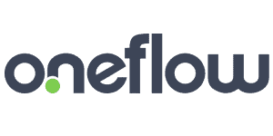

有没有想过将您的传统合同转换为数字合同，使其易于创建、签署和存储？Oneflow 是一个可以做到这一点甚至更多的平台。

您不必将合同附加到电子邮件中并保存在不同的文件中，而是可以不费吹灰之力地组织、分类和查找您的数字文档。

编辑它们也很简单——您可以只迭代一个版本的合同，并实时编辑它。由于无需重新发送，您可以确保所有内容都在一个地方。

您还可以使用 Oneflow 模板创建合同，并同时签署合同。该公司为您提供 14 天的试运行，向您展示这种现代合同自动化流程的所有优点。

#### 13。

 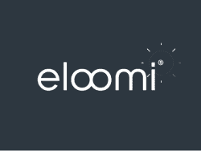

8 年来，eloomi 一直为人力资源组织提供解决方案，帮助提高员工参与度和工作效率。该公司的目标是在不影响自动化和效率的情况下，专注于员工的体验。

由于去除了 10 多种通常用于人力资源管理的工具，eloomi 使您能够轻松地创建、导入和管理内容，衡量成功，并跟踪员工的发展。

他们的平台允许您查看个人、部门或组织级别的统计数据，并帮助您构建自己的在线培训内容。确保持续发展使 eloomi 成为中型企业的顶级员工体验平台。  #### 14。 [钞票图](https://billogram.com/en)

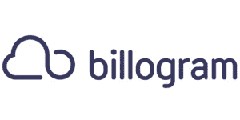

如果您经营一家经常性支付的公司，并且处理大量发票，Billogram 将为您提供易于使用的功能性计费服务，并改善您客户的支付体验。

使用 Billogram，您可以以透明的方式开具发票，并通过不断增加的不同渠道分发发票，以方便客户。

该公司提供的数字化工具可以帮助您将纸质发票转换为数字发票，并改善您对催款和收债的控制。

Billogram 提供多种快捷安全的支付方式，以满足客户的需求并改善贵公司的现金流。Billogram 是一款最新、用户友好的发票和支付工具，拥有您所能期待的一切。

#### 15。[Documaster](https://www.documaster.com/en/)

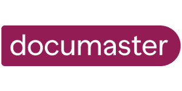

Documaster 是一家总部位于挪威的公司，它深知有效管理文档对于企业的重要性。他们开发了一个工具，可以让你考虑替换共享文件夹和云文件夹。

Documaster 简单且可扩展，是一个安全的平台，可以帮助您组织重要的数据和文档，无论它们有多少。该平台符合文档存储的国际标准，并提供智能提醒，帮助您满足任何数据保护要求。

这意味着你不必担心你的档案的安全。您可以使用该平台进行合同管理，并从您不再使用的系统中迁移文档。

#### 16。[Qred](https://www.qred.se/)

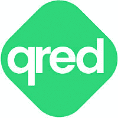

Qred 是一家 B2B 融资公司，已经帮助超过 25，000 家公司获得融资，并利用短期资本发展业务。Qred 是一个前沿的贷款平台，让您有可能申请贷款，而不必使用传统的银行服务。

该平台基于全自动信贷系统，使借款和贷款偿还变得简单高效。该系统也是透明的——你每月支付固定的金额，不需要担心任何隐藏的费用。

这种灵活、方便企业家的银行申请替代方案只能由企业家自己设计。由于非常了解经营企业的困难和挑战，他们想出了一个解决所有这些需求的主意。

#### 关于北欧 16 大金融科技和 SaaS 公司的最终想法

让我们的生活更轻松、工作更有条理的多样化解决方案表明，北欧金融科技和 SaaS 公司的世界是所有创新的异常肥沃的温床。

我们希望我们的列表能激励你考虑在你的企业中实施这些工具——或者更好，探索你自己的突破性想法。

在 STX Next， [我们了解最新的行业发展](/blog) ，并跟踪最有前途的公司，打造尖端解决方案。以下是类似这样的列表的几个其他示例:

*   [2021 年 Paytech:改变支付市场的十大+英国公司](/blog/uk-paytech-companies/)
*   [使用 Python 的 9 大英国公司](/blog/top-9-noteworthy-uk-companies-using-python/)
*   德国 10+家领先企业推动创新

我们还可以帮助您将您的产品想法变成现实，无论是在 [fintech 和 SaaS](/services/fintech-development/) 还是 [任何其他垂直](/services/) 。只需 [联系我们](/hire-us) ，我们会看看我们能为您做些什么！