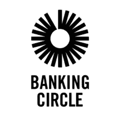
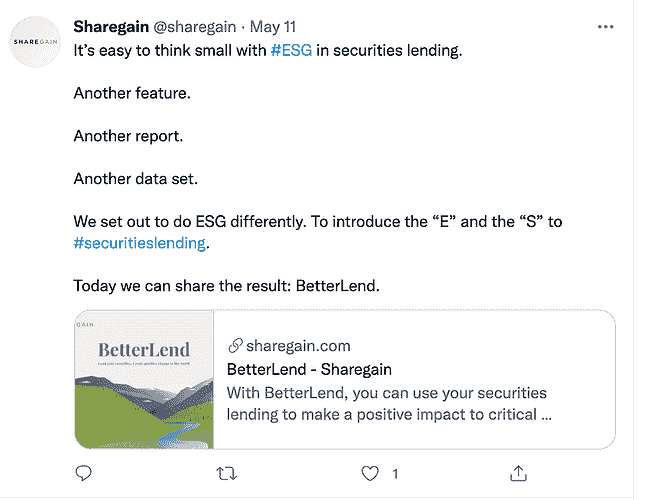
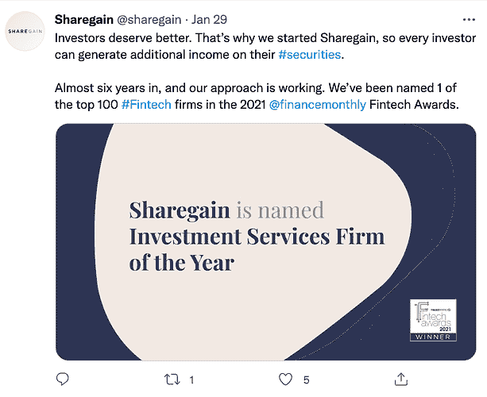
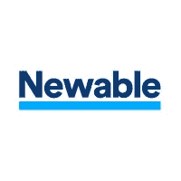
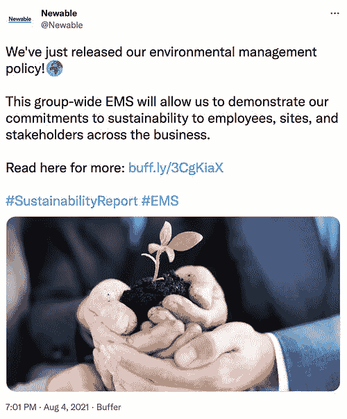
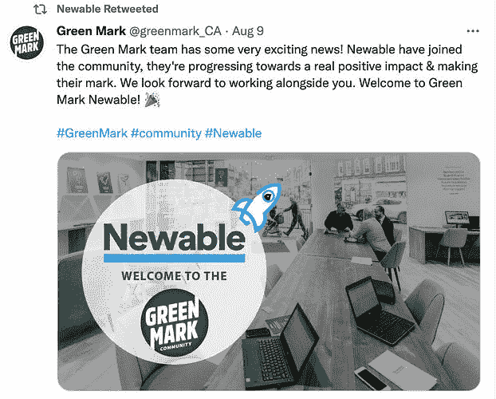

# 2021 年英国十大金融科技贷款公司

> 原文：<https://www.stxnext.com/blog/top-uk-fintech-lending-companies/>

 金融科技革命开始了！借贷生态系统正以极快的速度发展。尤其是在新冠肺炎疫情期间，人们正在所有可能的领域寻找数字解决方案。金融服务业也不例外。

我们也不只是在谈论网上银行。根据 2020 年爱德曼信托晴雨表，客户对机器人顾问和 P2P(点对点)贷款的信任正在增长。在线解决方案变得越来越个性化，这带来了卓越的用户体验。所有这些都让金融科技贷款公司迎来了一个非常激动人心的时刻。

我们精心挑选了 10 名游戏规则改变者，我们认为他们处于英国金融科技贷款的最前沿。阅读我们的列表，找出我们选择它们的原因！ 

#### 1.银行圈

****

*   **成立于:** 2013 年
*   **位于:**卢森堡
*   **访问他们的** [**网站**](https://www.bankingcircle.com/) **或关注他们的** [**LinkedIn**](https://www.linkedin.com/company/bankingcircle/)

##### 你为什么能指望他们？

Banking Circle 是一家获得全面许可的银行，提供值得您信赖的金融基础设施。该公司专注于金融包容性。信守这些承诺，它们允许银行在国内或全球交易中支持客户，而无需在自己的内部基础设施上花一分钱。增长、盈利和速度——这是银行业的口头禅。

根据 [UKTN](https://www.uktech.news/fintech/5-reasons-why-banking-circle-is-a-cutting-edge-payment-bank-20210629) 的说法，银行圈通过利用人工智能提供了一个更安全、更完美的支付流程。

##### 他们如何帮助您？

Banking Circle 通过一个安全的银行平台为银行和金融科技公司提供全球支付、结算和全球外汇功能。

成为 Banking Circle 的成员意味着开立多种货币的 IBAN 账户、定制和低成本外汇交易，以及使用 SWIFT、SEPA 或 CHAPS 等解决方案。

这个令人印象深刻的服务列表允许实体优化供应链、控制业务风险和提高效率。

##### 谁信任他们？

他们与 Valitor、Stripe、PaySafe 或 Nuevo 等公司合作。你也不能错过他们的多个商业奖项，包括 2020 年最佳跨境支付基础设施，这真的很棒！

有兴趣了解更多吗？花点时间看看他们关于金融科技的 [博客](https://www.bankingcircle.com/category/insights) 。

#### 2.费率设定者

****

*   **成立于:** 2010 年
*   **总部位于:**伦敦
*   **关注他们上** [**领英**](https://www.linkedin.com/company/ratesetter-com/about/) **或** [**推特**](https://twitter.com/RateSetter)

##### 你为什么能指望他们？

在我们 10 家值得关注的英国金融科技贷款公司中，我们不得不提到 RateSetter。它们是著名的获奖地铁银行的一部分。他们的专业是提供市场领先的个人贷款，目标只有一个:“让金融公平。”

想知道 RateSetter 给我们留下的其他印象吗？聪明的理财人，最值得信赖的金融服务点评平台， [给他们评分 4.9/5 分](https://smartmoneypeople.com/ratesetter-reviews) ！那是相当大的成就。

##### 他们如何帮助你？

你可以找到汽车和个人贷款以及债务合并在他们的报价。这一过程简单、个性化，并根据客户的需求量身定制。他们敬业的客户服务团队将很乐意为您提供帮助！

根据 [Trustpilot](https://uk.trustpilot.com/review/ratesetter.com) 的感言，这家公司的优势在于快速便捷的申请、透明的流程、极大的简单性以及高质量的客户服务。

##### 谁信任他们？

查看他们网站上的 [统计](https://www.ratesetter.com/invest/statistics) 部分。令人印象深刻的利息和资本覆盖率甚至比个人证明更能说明问题。只要看一下借出的总额就知道了，超过 40 亿英镑！除此之外，超过 87，000 名投资者和 706，000 名借款人已经信任 RateSetter 的解决方案。

最近，他们还获得了 2021 年消费者信贷奖最佳贷款提供商类别的提名。嗯，我们一定会为他们祈祷的！

#### 3.约博塔

****

*   **成立于:** 2016 年
*   **总部位于:**伦敦
*   **关注他们上** [**领英**](https://www.linkedin.com/company/yobota/) **或** [**推特**](https://twitter.com/YobotaPlatform)

##### 你为什么能指望他们？

Yobota 平台是基于云的传统银行业的替代品。它提供 API，使金融机构能够创建创新产品并以独立的方式运行它们。他们的使命是提供智能、灵活、以客户为中心的金融服务。

Yobota 满足领先的核心银行解决方案的所有要求:它是云原生的、灵活的、安全的。此外，该公司毫不犹豫地在他们的社交媒体上让全世界知道这件事。

##### 他们如何帮助你？

Yobota 平台是一个很好的方式，可以节省时间，并通过他们为客户量身定制的解决方案专注于更大的图景。你可以从小处着手，观察它是如何工作的，测试所有的功能，然后推向市场。

您的公司可以尝试新的加载项并对其进行修改，而无需额外费用。Yobota 的模拟器引擎可以为你提供新产品影响你投资组合的可能场景。这里的关键是灵活性——这正是金融科技的精神所在。

我们发现他们在 Vimeo 上的演示非常有趣。 [自己看](https://vimeo.com/yobotaplatform) ！

##### 谁信任他们？

由于与 LiveLend、Better Borrow、Smart Save、Fronted 或 Chetwood 等企业的合作，他们一直很忙。

Yobota 在 Trustpilot 上也有超过 3000 个五星评级！

#### 第四节

*   **成立于:** 2011 年
*   **总部位于:**伦敦
*   **关注他们上** [**领英**](https://www.linkedin.com/company/iwoca/) **或** [**推特**](https://twitter.com/iwoca)

##### 你为什么能指望他们？

又到了改变游戏规则的时候了。首先，我们爱上了 iwoca 的 LinkedIn 描述:“在 iwoca，我们相信金融应该感觉像一个超级大国，而不是一个令人头疼的问题。”太酷了！

该公司主要服务于英国的小企业。iwoca 的核心是快速、灵活、轻松的贷款。他们的贷款系统非常清晰、简单、快捷——忠实于他们的“触手可及的金融”方法。

##### 他们如何帮助你？

该公司提供两种主要产品:灵活贷款和网络支付。高达 20 万英镑的贷款速度很快，而且没有任何费用。你可以通过他们的网站申请，只需几个步骤。只需要一分钟左右！

有了 iwocaPays，您可以更快地获得发票付款。无论您的客户选择现在付款还是以后付款，您都可以提前拿到钱。

iwoca 定期发布中小企业专家指数。它每隔一个月发布一次，提供推动中小企业借贷的洞察。这个指数是疫情之后市场变化的完美视角。

##### 谁信任他们？

iwoca 是 Xero 值得信赖的合作伙伴，也一直与 Time Assist Limited、企业家圈和 Arfon Consulting 合作。看看他们网站 上的 [的推荐书。](https://www.iwoca.co.uk/) [Trustpilot](https://uk.trustpilot.com/review/iwoca.co.uk) 给他们打了 4.6 分。

#### 5.借贷投资

*   成立于: 2008 年
*   **总部位于:**伦敦
*   **关注他们上** [**领英**](https://www.linkedin.com/company/lendinvest/) **或** [**推特**](https://twitter.com/lendinvest/)

##### 你为什么能指望他们？

我们正处于英国著名金融科技贷款公司名单的中间点，这些公司每天都在改变金融世界，LendInvest 肯定是其中之一。他们的服务是为中介、房东和开发商设计的。到目前为止，LendInvest 的贷款总额超过 30 亿英镑。

##### 他们如何帮助你？

他们的产品分为我们上面刚刚提到的三组。LendInvest 专门从事过渡性贷款和开发贷款，既有低成本的，如住宅过渡性贷款，也有高成本的，如抵押贷款。对于投资者来说，LendInvest 已经准备好了基于房地产抵押贷款的产品。一切都是为了满足顾客的需求和计划。

##### 谁信任他们？

其中，信任 LendInvest 的大公司有花旗集团、摩根大通和澳大利亚国民银行。LendInvest 在金融类别中获奖超过 50 次，并在 [Trustpilot](https://uk.trustpilot.com/review/lendinvest.com) 中获得了非常高的评级(4.5)。

同样值得注意的是，最近 LendInvest 开始与两家银行巨头合作: [巴克莱和汇丰](https://www.cityam.com/londons-newly-listed-lendinvest-scores-150m-partnership-with-barclays-and-hsbc/)。这对公司是一个重大的推动。

#### 6.兰德贝

*   **成立于:** 2013 年
*   **总部位于:**伦敦
*   **关注他们上** [**领英**](https://www.linkedin.com/company/landbay/) **或** [**推特**](https://twitter.com/landbayuk)

##### 你为什么能指望他们？

LANDBAY 是一个 100%的在线经纪平台。截至目前，他们实现了 8.92 亿英镑的贷款总额。其中大部分涉及大伦敦的房产。

他们的报价是针对中间商的。LANDBAY 相对于竞争对手的主要优势是直接联系承销商、原则上即时决策，以及从 DIP 到完成的无纸化流程。

##### 他们如何帮助你？

LANDBAY 的核心服务是购买出租抵押贷款中的 P2P 贷款。该公司为投资者提供直接获得贷款的途径。

此外，LANDBAY 使用 [亚马逊网络服务](https://aws.amazon.com/solutions/case-studies/landbay/) ，是首批为投资者提供创新金融 ISA(个人储蓄账户)一系列好处的平台之一。

LANDBAY 的平台还允许将新的抵押贷款产品以令人难以置信的速度推向市场，甚至可以在短短 72 小时内完成。

##### 谁信任他们？

LANDBAY 与众多网络、包装商和俱乐部合作。这个庞大的集团包括 Primis、Connect Mortgages、Tenet、RHL、CommercialTrust、Synergy Commercial Finance 和 TMA。

该公司在《金融时报》第五届年度欧洲增长最快公司排行榜 中 排名第六德勤 2020 年 50 强排名 和 [第十一。](https://www.ft.com/content/8b37a92b-15e6-4b9c-8427-315a8b5f4332)

#### 7.分享收益

*   **成立于:** 2015 年
*   **总部位于:**伦敦
*   **关注他们上** [**领英**](https://www.linkedin.com/company/sharegain/) **或** [**推特**](https://twitter.com/sharegain/)

##### 你为什么能指望他们？

现在是时候将金融科技解决方案引入证券业务，并通过根据客户的确切需求进行定制来改变其黑白现实，使其更加丰富多彩。没有人比 Sharegain 更适合做这件事。

他们的目标是基金经理、私人银行、在线经纪人和数字财富管理公司。Sharegain 的工作是让您的证券更有价值，并帮助您以透明和简单的方式获得新的收入。

##### 他们如何帮助你？

Sharegain 有三项核心服务:数字代理借贷(DAL)、证券借贷即服务(SLaaS)和证券借贷技术(SLT)。更重要的是，他们已经开发了一个投资组合分析器，可以让你了解你管理的证券和交易所交易衍生品的全部潜力。

当然，我们忍不住提出了 [更好的解决方案](https://sharegain.com/betterlend/) ，这里的指导原则是 ESG:环境、社会和公司治理。但是等等，证券和环保行动？对，没错！

BetterLend 是一项服务，投资者可以将贷款投入到清洁水、可再生能源或无障碍教育等社会和环境问题中。这就是我们喜欢的金融科技。

##### 谁信任他们？

Sharegain 是国际证券借贷协会的一部分。媒体不会对他们保持沉默！你可以在《银行家》、《每日电讯报》、 [《金融时报》](https://www.ft.com/content/48bde0f0-3495-397f-9cfd-2d9a509ed9bd) 、或 [《证券借贷时报》](https://www.securitiesfinancetimes.com/securitieslendingnews/industryarticle.php?article_id=224833&navigationaction=industrynews&newssection=industry) 中了解 Sharegain。

而他们的奖项呢？其中，Sharegain 被《金融月刊》评为 2021 年金融科技奖 100 强金融科技公司之一。

#### 8.可更新的

*   成立于: 1982 年
*   **总部位于:**伦敦
*   **关注他们上** [**领英**](https://www.linkedin.com/company/newable/) **或** [**推特**](https://twitter.com/Newable)

##### 你为什么能指望他们？

Newable 基于三大支柱帮助中小企业部门蓬勃发展:资金、建议和工作空间。每年，Newable 通过提供商业或商业贷款、抵押贷款、专业支持或为企业提供新的灵活工作空间来帮助超过 43，000 家公司。

他们的使命是“通过帮助其他企业蓬勃发展来获得可持续的利润”，此外还有对 ESG 的坚定承诺。信守这些话，Newable 最近发布了[EMS](https://newable.co.uk/newables-environmental-management-policy/)——环境管理系统。

##### 他们如何帮助你？

Newable 的服务范围令人印象深刻，从人寿保险和金融开始，如商业抵押贷款或过渡性贷款。他们也有专门面向中小企业和投资者的广泛的服务组合。

与 Newable 做生意意味着加入一个由 500 多名投资者组成的团体，该团体最近被评为英国排名第一的天使网络。他们的投资集中在医疗技术、人工智能、太空、机器人和 4IR 公司。有鉴于此，Newable 的未来看起来确实很光明。

Newable 还提供公正的建议，帮助您的企业在市场上取得成功。他们可以帮助处理与商业建模、知识产权、投资推介相关的事务——这只是他们众多服务中的一小部分。

##### 谁信任他们？

最近，他们在 Dancerace 进行了第一笔投资，他们是绿色标志社区的一部分。他们的 [Trustpilot](https://uk.trustpilot.com/review/newable.co.uk) 评级为 4.8。

然而，与我们公司非常相关的是，他们信任 STX Next！Newable Business Finance 是 [我们的客户之一](/portfolio/newable) ，我们对此深感自豪。

#### 9.迪维多

*   **成立于:** 2014 年
*   **总部位于:**伦敦
*   **关注他们上** [**领英**](https://www.linkedin.com/company/divido/) **或** [**推特**](https://twitter.com/divido)

##### 你为什么能指望他们？

Divido 是一个白色标签零售平台，旨在将贷款人、零售商和渠道合作伙伴联系起来，同时始终牢记合作伙伴关系和信任关系。这是一种控制和配置付款的创新方法。他们在销售点提供选择、速度和一流的 UX。

##### 他们如何帮助你？

该公司创建的功能是独特定制的，考虑了销售渠道中所有三个目标群体的需求和角色。

Divido 提供了一个全渠道、多地区和白标平台，该平台完全可配置以满足快速变化的客户需求。所有这一切都有一个值得信赖的、市场知名的专家团队来指导客户完成发布和扩展。

对贷款人有什么好处？快速进入市场，通过透明定价增加收入，贷款组合多样化，以及中和品牌进入市场的威胁。

对于零售商来说，与 Divido 的合作将带来更高的接受率和对客户旅程的控制。

##### 谁信任他们？

Divido 与法国巴黎银行、Nordea、Nectar 和 lastminute.com 合作。该公司在 2021 年技术创新者奖上获得了 最佳灵活零售金融平台。

#### 10.阿塞茨资本公司

*   **成立于:** 2012 年
*   **总部位于:**曼彻斯特
*   **关注他们上** [**领英**](https://www.linkedin.com/company/assetz-capital/) **或** [**推特**](https://twitter.com/assetzcapital)

##### 你为什么能指望他们？

最后但并非最不重要的一点是，阿塞茨资本自称为“聪明钱之家”。P2P 贷款专家，他们的平台拥有超过 40，000 名投资者，总收益约为 1.62 亿英镑，在撰写本文时 lendings 达到 13 亿英镑。

在基于公平交易、个性化服务和为我们的社会建设更美好明天的使命的推动下，Assetz Capital 相信贷款人和借款人将拥有一个更加公正的世界。

##### 他们如何帮助你？

Assetz Capital 是一个拥有各种账户的平台，这取决于你的需求。它的目标是投资者、贷方和中介。他们的贷款产品主要是商业抵押贷款和面向房东的购买出租贷款。

他们还投资于过渡性融资和住宅翻新贷款。他们做的每一件事都以一种清晰的方式呈现，这使得理解所有的风险变得很容易。

##### 谁信任他们？

让我们快速浏览一下 Assetz Capital 的合作伙伴和客户。与英国商业投资和给他们 5 星评价的 Defaqto 合作，印象相当深刻。另外，他们的 [Trustpilot](https://uk.trustpilot.com/review/assetzcapital.co.uk?utm_medium=trustbox&utm_source=Mini) 评分为 4.2——这也是不容小觑的。

最后一点，Assetz Capital 借款人是 2021 年苏格兰抵押贷款奖年度专业贷款类别的提名人！

#### 关于英国顶级金融科技贷款公司的最终想法

感谢您浏览我们列出的 10 家总部位于英国、我们认为特别值得关注的 fintech 贷款机构。我们希望您发现它对您未来的业务努力有用。

金融垂直行业的创新性和前瞻性令人惊叹。我们在这里提到的所有公司都提供尖端的解决方案，满足令人印象深刻的一系列客户需求——从过渡性贷款到证券行业。金融科技是金融界的一场真正的革命，我们很高兴能成为这场变革的一部分。

如果您在构建金融产品、贷款或其他方面需要任何支持，我们自己提供 [金融科技开发服务](/services/fintech-development/) 。只需 [联系我们](/hire-us) ，我们将非常乐意为您提供帮助！