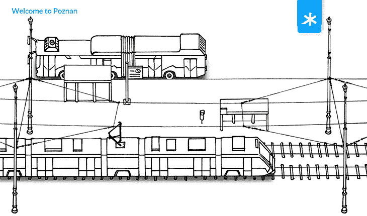

# 公交通行证走向移动:一款公交一卡通应用的 UI/UX 设计

> 原文：<https://www.stxnext.com/blog/ui-ux-public-transportation-app/>

 公共交通。我们大多数人一生中至少用过一次。很难找到对城市公共汽车和有轨电车没有意见的人，从“它们还能用”一直到“我这辈子再也不坐公共汽车了。”

但是公共交通也有它好的一面。又环保，又便宜，还省了你找停车点的麻烦。

问题是，公共部门通常落后于科技潮流。 几年前效果良好的解决方案并不总是(如果不是通常)像好酒一样陈年。

我们总部所在城市波兹南的公共交通系统也面临同样的问题。虽然它在不断现代化，但仍有许多不足之处。

考虑到这一点，我们的产品设计师组成了一个专门团队，对我们的旧公交卡进行了一点改造，使其更适合移动时代。

在本文中，我们将带您了解我们 PD 团队的整个工作流程。 你可以亲眼看到他们是如何处理问题、寻求解决方案以及执行他们的愿景的。

 

#### 行动纲要

*   我们产品设计团队的两名成员对 PEKA 公共交通卡进行了概念重新设计，并提出了一个移动版本的想法。
*   他们选择 PEKA 是因为它是本地的、熟悉的，并且通常被认为不方便使用。
*   他们进行了最初的研究，绘制了用户旅程，集思广益，设计了一个原型，进行了 UX 游击测试，根据反馈进行了修改，并准备了一个案例研究。
*   这个过程是一个有用的练习，给了我们的设计师一个机会来执行整个 UX 设计过程，并让他们测试他们的技能。
*   您可以查看 Behance 上的[案例研究。](https://www.behance.net/gallery/87375885/PEKA-Mobile-Everyday-commuting-made-easier)

#### 为什么选择 PEKA 进行重新设计？

你可能想知道为什么我们的产品设计团队决定重新设计 PEKA，特别是。

项目背后的团队成员——为了简单起见，我们称他们为“PEKA 团队”——解释说这是因为他们想帮助解决当地社区的问题。 由于我们公司总部位于波兹南，他们觉得应该回馈一些东西。这样做有一个非常方便的副作用:给他们的投资组合增加了一个很好的小东西。

对于我们客户的项目来说，这并不总是可能的。虽然具有挑战性和发人深省，但它们也非常具体，有时甚至是机密的。我们的设计师想做一些对每个人都有关联和可及的东西。

嗯，每个人都至少听说过公共交通，所以这是一个完美的组合。

设计者知道 PEKA 系统的来龙去脉，他们周围的大多数人也知道。对他们来说，很容易就能了解到人们希望改进什么。

此外，PEKA 是波兹南的重要组成部分。它在我们所有人心中有着特殊的位置，所以做一些有益于这座城市的事情是一个很有吸引力的前景。

最后，从实用的角度来看，重新设计是展示设计师技能的最佳方式。没有什么比一个设计更能说明“我能让你的 UX 提升十倍”，你可以很容易地将其与不那么迷人的设计相比较。

****

#### 产品设计团队是如何交付项目的？

##### 1.初步研究

出于上述原因选择了项目主题后，PEKA 团队需要做一些研究。

首先，他们必须可视化波兹南公共交通乘客的整个用户旅程。为此，他们查阅了 PEKA 网站和自己的经验。

然后，他们考虑了一个普通的波兹南市民如何在这座城市中穿行。从那时起，设计手机版 PEKA 卡的想法开始成形。

目前，拼车和电动滑板车租赁应用在波兹南越来越受欢迎。这是一个明显的迹象，表明使用手机寻找通勤选择是一种常见的做法。

PEKA 团队也做了一点自我反省。作为公共交通用户，他们问自己当前的解决方案最让他们困扰的是什么。然后，他们咨询他们的朋友和同事，问他们同样的问题。

##### 2.绘制用户旅程

当 PEKA 团队收集了所有必要的信息后，就到了绘制用户旅程的时候了。

便利贴有时被认为被高估了，但我们的产品设计师知道如何正确使用它们。在他们手中，笔记极大地帮助了创作过程。

**PEKA 团队将用户旅程分为以下几类:**

*   行动(人们在使用 PEKA 时采取的行动)，
*   位置(用户执行动作的地方，物理的和虚拟的)，
*   痛点，
*   机遇。

##### 3.头脑风暴

当整个用户旅程展现在他们面前时，PEKA 团队开始头脑风暴。

事实很快证明，PEKA 用户体验可以通过许多不同的方式得到改善。例如，接收卡的提交只能在物理 PEKA 点提交。  **把手续搬到网上可以加快整个流程，减少柜台前的长队。**

这一观察足以激发另一个项目。目前，PEKA 团队专注于另一个紧迫的问题:PEKA 卡仅以其物理、塑料形式存在的事实，这可能会导致许多悲惨的结果:

*   很容易把卡放错地方；
*   你可以把它放在另一条裤子里；
*   你可能会把它丢在早晨的车流中，当你寻找它的时候，人们会踩在你的手指上；
*   如果你丢失了它，你就麻烦大了:你必须去 PEKA 点申请一张新卡，这需要很长时间才能发行，迫使你使用更贵、更环保的纸质车票旅行。

至于其他不便之处:

*   您无法访问您的旅行历史；
*   你无法实时监控你的支出；
*   你不能以任何方式跟踪你的城市游览。

让我们面对现实:我们已经远远超越了塑料卡乱扔钱包的时代。

PEKA 团队以最初的草稿支持他们的想法，灵感来自 Apple Pay、拼车应用和汽车或摩托车租赁应用。

最后， **集思广益会议以 PEKA 团队选择设计一款移动版的公共交通卡—** 而告终，这是一款简单易用的解决方案，令人惊讶的是，该城市还没有推出这款卡。

##### 4.设计原型

在 PEKA 团队坐下来设计原型之前，其中一名平面设计师必须绘制一些草图。他基于 PEKA 的视觉识别和前面提到的拼车和代步车租赁应用程序中使用的概念。

然后，PEKA 团队在 Adobe XD 中设计了一个  [可点击的原型——自己去看看吧。最初的设计只包括几个样本元素:城市地图、公共交通旅程的起点和终点、菜单和卡的可视化。刚好能代表真实的东西能做什么。](https://xd.adobe.com/view/0a7cf821-61b5-45a8-5b5e-7f916a7082ae-7c4d/)

 

##### 5.在野外测试解决方案

##### a)游击式可用性测试——那是什么？

现在 PEKA 团队已经准备好了他们完美的可点击原型，只剩下一件事要做:游击式可用性测试。

对于那些不熟悉产品设计领域的人来说，游击式可用性测试是一种常用的实践，正如它的名字所暗示的那样。给定产品的设计师随机找一些人，让他们花几分钟时间与他们的原型互动。

这种方法很受欢迎，因为它既便宜又真实(用户没有任何预先存在的期望)，而面对面的交流让设计师可以观察人们如何使用应用程序以及他们的本能反应。您还可以收集即时反馈。

##### b)进行测试

佩卡队处于进行游击试验的最佳位置。由于我们的办公室就在市中心，所以我们只需要走到外面，在公交车站周围和一些人搭讪。银盘上的相关用户群！

原型中显示的地图有目的地与最近的停靠点的周围环境相对应。由于这一点，测试用户可以很容易地想象他们实际上在使用该产品。

**PEKA 团队向几个路人展示了这款应用，并让他们与之互动。** 场景:街车快到了，他们上车，过了几站后下车。

设计师观察了乘客如何使用该应用程序——它是否容易理解、快速、方便使用，最重要的是，它比物理 PEKA 卡更好地服务于其目的。

**在使用应用程序后，测试人员被问了几个问题:** 如果应用程序存在，他们会下载它吗，它有多直观，他们会对它做什么改变。除此之外，他们还被问及是否使用移动支付和拼车应用，以及在当前的 PEKA 系统中还有什么困扰着他们。

##### c)反馈和结论

游击可用性测试表明，波兹南的年轻一代已经准备好接受移动解决方案。他们热情地欢迎将卡转移到手机上的想法。

PEKA 团队还高兴地注意到，他们采访的人都渴望参与测试，提供反馈，并回答问题。

根据 PEKA 团队的说法，无论何时你在当地做一些事情，走出去四处打听是正确的做法。  **早期用户评论是无价的**。 他们帮助你从局外人的角度看待项目，迅速纠正任何错误。

##### d)出版

游击式可用性测试帮助我们的产品设计团队根据反馈进行修改，尽管他们没有听到很多负面的评论。事实证明，波兹南的人们对这个想法非常热情，他们没有发现多少改进的余地。

在最后阶段，剩下唯一要做的事情就是将他们创造和学习的一切变成案例研究，并包含在产品设计文件夹中。

**你可以在他们的行为简介上看到产品的介绍(还有一些搞笑的动画)[。](https://www.behance.net/gallery/87375885/PEKA-Mobile-Everyday-commuting-made-easier)**

****

#### 项目成果

PEKA 移动应用原型不是一个商业产品。

因此，你可能会问自己:我们从中得到了什么？

PEKA 团队可以列举出很多好处。

首先，这是一次有益的锻炼，也是团队获得更多经验的独特机会，两者都是无价的。因为这个案例离我们的设计师如此之近，无论是字面上还是象征性的，他们有完美的条件来计划它，准备一个用户旅程的综合地图，进行研究，并进行可用性测试。

这让我想到了我的下一个观点:这个项目是一个很好的机会来完成整个 UX 进程，而不需要匆忙通过任何一个阶段。

**商业项目往往专业性很强，意味着测试机会有限。** 有时候因为项目涉密，设计师无法沿途收集反馈。或者，时间压力如此之大，以至于绘图和头脑风暴的过程不得不大幅削减…或者以上所有情况。

最重要的是，对于产品设计师来说，重新设计现有的解决方案是证明他们能够应对任何挑战的绝佳方式——并且比他们的前辈做得更好。

谁知道呢，有了积极的反馈，也许这个项目最终会重见天日？如果 PEKA 团队中有人在读这封信，你知道在哪里可以找到我们！

#### 最后的想法

我们希望这篇文章对我们的产品设计团队如何工作以及他们如何解决 UX 问题有所启发。

我们希望这篇文章对我们的产品设计团队如何工作以及他们如何解决 UX 问题有所启发。

毕竟，  **最终用户只关心一件事:你的应用程序是可用的。** 而高质量的代码只是实现这一结果所需的组成部分之一。同样重要的是，你的用户本能地知道点击哪个按钮。

在合适的产品设计专业人士的帮助下，你的产品不仅是一件好的科技产品，还会让人们的生活变得更加轻松。就像 PEKA Mobile 一样！

要了解更多关于产品设计的信息，我们推荐我们的其他文章:

*   [UX 设计:Q & A 与 STX 的产品设计负责人接下来](/stx-new-blog/ux-design-q-and-a-head-product-design-stx-next/)
*   [如何利用 UX 分析进行数据驱动的产品设计](/stx-new-blog/how-leverage-ux-analytics-data-driven-product-design/)
*   [软件产品设计:好的 UX 投资回报率是多少？](/stx-new-blog/software-product-design-roi-good-ux/)

如果你想与我们才华横溢的设计师团队合作，请访问他们的  [网站](http://design.stxnext.com/)！

