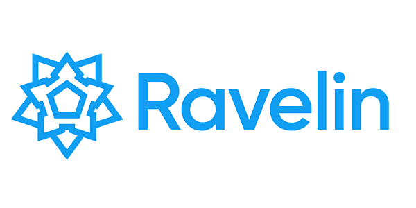
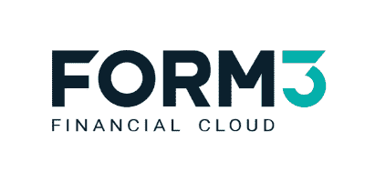
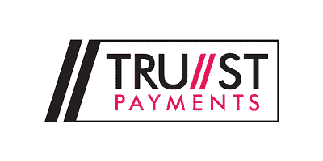
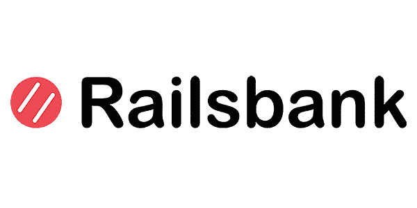
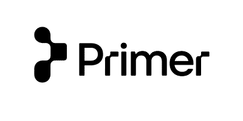
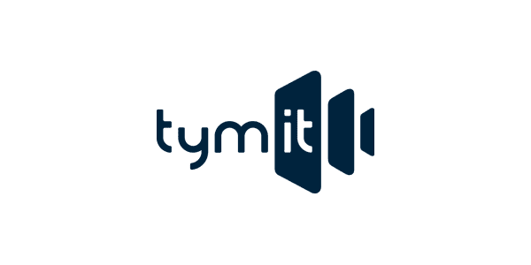
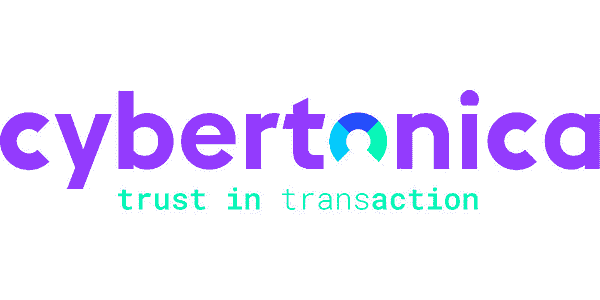

# 2021 年的 Paytech:改变支付市场的十大英国公司

> 原文：<https://www.stxnext.com/blog/uk-paytech-companies/>

 很难想象没有支付技术的世界。如今，我们都在定期使用它的许多形式:非接触式支付、在线钱包、转账、信用卡等等——仅举几例。无论是在商业还是私人生活中，这都是我们现实生活的重要组成部分。

一些公司试图让支付世界变得更加透明和人性化。因为，你可能已经注意到了，尽管支付技术无处不在，但它远非完美。

我们仔细研究了英国顶尖的 paytechs，选出了 11 家帮助初创公司、企业和个人用户进行更安全、更顺畅交易的公司。如果你想了解英国支付的未来，请继续阅读！ 

#### 1.无卡

当你经营一家企业时，你必须做出许多艰难的决定，如何处理你的付款是其中之一。找到一个适合你的选择可能会很复杂和令人困惑。这就是第一个用于定期支付的全球应用程序 GoCardless 可以提供帮助的地方。

GoCardless 为从小型企业到大型企业的 50，000 家客户提供服务，每年处理超过 130 亿美元的交易。2020 年，该公司筹集了 9500 万美元，以加速开放银行业务的融资，这项技术通过即时确认支付和一次性支付的即时可见性来加速现金流。

使用 [开放式银行](https://gocardless.com/guides/posts/open-banking/) 不仅方便客户和企业，也有助于最大限度地减少支付失败和降低成本。

#### 2.三角堡

“Ravelin”是一个用于防御建筑的术语，指一种旨在保护城门最薄弱点的堡垒。考虑到这一点，还会有更好的防欺诈公司名称吗？

这家总部位于英国的公司受到了许多全球巨头的信任，包括 Glovo、Flixbus 和 Booking，其投资组合继续增长。Ravelin 为客户提供两种主要产品:欺诈解决方案和支付认证。

该公司的数据科学家通过更有效地识别欺诈威胁，帮助企业分析数字，做出更明智的选择，并通过优化支付路线，最大限度地提高汇款的成功率。你可以在他们的 [博客文章](https://www.ravelin.com/blog/why-we-have-our-investigations-team) 中找到 Ravelin 是如何描述它的。

#### 3.表格 3

简单点比较好。这是 Form3 背后的座右铭，form 3 是一家英国支付科技公司，专门为银行和受监管的金融科技公司等金融机构提供解决方案。

Form3 提供了一个基于云的平台，通过单一 API 实现完整的支付服务。他们提供不同类型的转账，包括 SEPA、SWIFT、FSP 以及其他支付形式。

该公司的端到端支付服务使其客户能够将更多精力放在服务客户需求上，而不是管理支付基础设施，这证明了支付技术运营既先进又流畅。

#### 4.信托付款

Trust Payments 于 2019 年推出，通过促进快速、无缝的支付，帮助中小企业优化销售和客户体验。该公司的服务逐步覆盖客户的旅程，从创建更快的路线到数字支付，再到选择 POS 和支付安全。

Trust Payments 的首席执行官 Daniel Holden 最近被列为 50 位全球领导者之一，他们在许多小公司不得不进行首次数字化转型的时候，通过促进安全支付，为世界带来了积极的变化。[50 位全球领袖网站上的一个短视频](https://50globalleaders.com/helping-merchants-in-the-new-digital-world/) 更详细地解释了信托支付公司的业务。

#### 5.铁路银行

金钱本身不会让世界变得更美好——但让金融更具包容性是实现这一目标的重要一步。

Railsbank 似乎也有这种想法，它是一家专门为银行提供 API 的英国支付技术公司。该公司在银行平台(BaaP)和金融服务平台(FSaP)领域提供创新解决方案。最近，Railsbank 筹集了 7000 万美元的新股权资金，并计划将其用于进一步发展。

Railsbank 声称，其目标是让将金融嵌入应用程序和客户旅程“像拖放功能一样简单”，并帮助客户在不到两个小时的时间内建立他们的第一个原型。

#### 6.底漆

Primer 成立于 2020 年，但它已经引起了业界的关注。它出现在《福布斯》2021 年 100 云冉冉升起的明星排行榜 上，并在 [《金融科技时报》](https://thefintechtimes.com/primer-launches-first-open-app-framework-for-payments/) 以及许多其他出版物中被提及(你可以关注他们的 [LinkedIn](https://www.linkedin.com/company/primerapi/) 个人资料以了解最新信息)。

该公司为支付提供了一个开放的自动化平台，使你能够建立他们所谓的“地球上最好的结账体验” 如果你对如何发展业务和提高客户满意度感兴趣，那绝对值得关注它们。

#### 7.约洛

Yoello 是一家屡获殊荣的支付技术公司，专注于酒店行业，为移动点餐提供解决方案。使用该系统，所有支付都可以通过移动设备完成，无需人工干预——这正是过去一年半以来世界所需要的。

Yoello 的目标是通过使用开放银行立法(PSD2)打破现有的支付系统，消除对中间商的需求，并因此拉近商家和客户的距离。

此外， [Yoello 的网站](https://www.yoello.com/) 上有大量关于英国酒店市场和餐饮服务的资源，例如提高餐桌服务效率的指南、餐饮服务的未来，或者更多关于如何在 2021 年重建业务的一般性建议。

#### 8.通量系统

扔掉报纸，拯救地球！每天，难以想象数量的收据被打印和浪费。举个例子来描述一下，仅在英国，每年就有 1120 亿份文件被打印出来，这就产生了 28000 吨二氧化碳。仅仅为了这个目的，就砍伐了 20 万棵树，使用了 16 亿升水。

大多数收据从来没有被看过，几乎立即就被扔掉了。同样重要的是，它们不适合回收。

注意到这个问题后，Flux Systems 将减少浪费作为自己的使命，将收据和忠诚度积分直接发送到买家的智能手机上，因此没有必要将它们打印在纸上。

Flex Systems 还通过 [教育日常支付的碳足迹](https://www.beatthereceipt.co.uk/) 并推出无纸化承诺(Paperless Pledge)，零售商承诺让纸质收据的打印变得可选。如果这项事业对你很重要，你可以在 [Beat 收据网站](https://www.beatthereceipt.com/paperless) 上签署一份致英国超市的请愿书。

#### 9.泰米

信用卡和商店贷款可能有点模糊。隐性成本、最低支付金额、混乱的规则……所有这些都会导致金融提供商和不满意的客户之间的信任问题。这正是 Tymit 想要阻止的。在他们的 [宣言](https://tymit.com/manifesto) 中，该公司指出了更公平的信用卡应该是什么样的，所有费用都提前显示，还款计划明确，没有隐藏费用。

Tymit 的另一个伟大之处是公司的可持续发展方式。例如，今年，泰米特宣布它已经实现碳中和。这就是我们所说的未来支付技术！

#### 10.赛博托尼卡

在过去的一年中，由于新冠肺炎疫情 [导致购买模式的改变，导致互联网欺诈增加了 70%](https://www.telegraph.co.uk/news/2021/05/13/online-fraud-70-per-cent-covid-pandemic/) 。Cybertonica [将统计数据与病毒本身进行比较](https://cybertonica.com/payment-fraud-is-like-a-virus/) 并为他们的客户提供市场上最强的药物。

该公司借助先进的机器学习模型，防止欺诈并监控风险，以创建安全的身份认证和顺畅的用户旅程。它声称，这项服务可以将公司的收入提高 25%，并有助于抵御机器人攻击、账户接管、购物篮丢失等等。

#### 11\. Taptap Send

如今，大多数跨洲汇款既昂贵又缓慢。一项金融业务可能需要几天时间才能完成，最终成本可能高得令人望而却步，具体取决于地点和转账金额。Taptap Send 的目标很简单:降低向亚洲和非洲汇款的成本。

因此，Taptap Send 有助于由大型服务提供商主导的汇款行业民主化，以支持来自服务水平低下的市场的人们。值得注意的是，Taptap Send 已经 [实现了联合国 2030 年](https://www.taptapsend.com/about-us) 降低跨境汇款成本的可持续发展目标。

#### 关于值得关注的英国 playtech 公司的最终想法

毫无疑问，支付是每个人日常生活的重要组成部分，无论你是购买商品和服务的消费者，还是为生产这些商品和服务的大型企业工作。我们上面列出的 11 个英国 paytechs 就是活生生的例子，证明了技术是一个强大的工具，可以让世界变得更好。

我们希望你能从他们的工作、他们实施的技术解决方案中获得一些灵感，最重要的是，在一个长期停滞和过度监管的行业中以不同方式做事的勇气。

如果你也想通过创造突破性的项目有所作为，并需要一个技术合作伙伴来支持你，请不要犹豫 [联系我们](/hire-us) 。我们很乐意帮助你。

要获得更多灵感，请随意查看我们博客上关于金融科技的其他文章:

*   [2021 年 10+值得关注的英国保险科技公司和初创公司](/blog/10-noteworthy-uk-insurtech-companies-and-startups-to-look-out-for-in-2021/)
*   [英国前 9 大公司使用 Python](/blog/top-9-noteworthy-uk-companies-using-python/)
*   [最佳英国 Proptech 公司及其科技栈](/blog/top-uk-proptech-companies-tech-stack/)