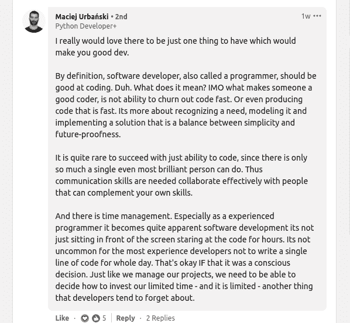
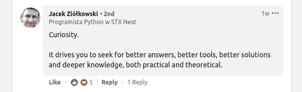

# 是什么造就了一个伟大的 Python 开发者？

> 原文：<https://www.stxnext.com/blog/what-makes-a-great-python-developer>

 它是通用的、强大的、简单的和富于表现力的:Python。它也是世界上第二流行的语言，仅次于 JavaScript。

谁用 Python？研究人员，数据科学家，AI 和 [机器学习开发者](https://www.stxnext.com/services/machine-learning/) ，定制软件开发者， [web 开发者](https://www.stxnext.com/services/) ， [软件测试人员](https://www.stxnext.com/services/software-testing-and-quality-assurance/) ，有时只是想 [自动化部分工作的人](https://automatetheboringstuff.com/2e/chapter0/) 。

然而，知道如何用 Python 编码并不会自动使一个人成为优秀的 Python 开发者。尤其是在商业或研究项目中，风险很高。

在这篇文章中，我们将探索是什么造就了一个伟大的 Python 开发者。如果你需要 [雇佣 Python 开发者](https://www.stxnext.com/services/python-development/) ，或者如果你自己想成为一名受欢迎的 Python 开发者，了解这一点可能会对你有所帮助。 

#### 方法、沟通、专业精神——通常的疑点

所有伟大的专家都有一套特定的技能。积极的、面向解决方案的方法。理解他人和让自己被理解的扎实的沟通技巧。在期限内交付任务，工作过程透明，即成为专业人士。

这些技能对于软件开发来说至关重要。由于这种语言的性质和目的，Python 开发人员经常需要与不同专业的多个项目干系人合作:

*   商业分析师，
*   数据科学家，
*   前端开发者，
*   DevOps 专家，
*   其他 Python 开发者，

...诸如此类。Python 经常被用于软件的任务关键部分，像 Instagram 的服务器(" [)数百万行的 Python 怪物](https://www.zdnet.com/article/programming-languages-how-instagrams-taming-a-multimillion-line-python-monster/) ")，或者 [Exscientia 的用于药物发现的 AI 系统](https://www.stxnext.com/blog/most-interesting-companies-using-python/) 。在这样的项目中，一个人是否是专业人士，能够交流他们的想法，并与他人达成妥协，这真的很重要。

时间管理对软件开发人员来说是一件大事。最好的开发人员知道如何组织他们的工作，以便不断推动项目向前发展，而不是由于组织能力差而造成瓶颈。

所以，一个伟大的 Python 开发者是一个沟通大师，一个面向解决方案的专业人士。但是，这仅仅是开始。还有什么？

#### Python 开发人员的硬技能——计算机科学、编程基础、Python 环境

让我们总结一下 Python 开发人员的常用技能。请记住，对于一个伟大的 Python 开发人员来说，并非所有这些技能都是必要的。适合您项目的开发人员档案取决于您正在做的工作类型。与 ERP 系统项目相比，人工智能项目可能需要不同的技能组合。

我们将从全面有用的通用软件开发技能开始，接下来我们将专注于 Python 特有的技能。

##### 一般软件开发技能

*   数据结构
*   版本管理和与 Git 的协作
*   容器与坞站或库服务器之间的相互作用；容器与坞站或库服务器之间的相互作用；容器与坞站或库服务器之间的相互作用；容器与坞站或库服务器之间的相互作用；容器与坞站或库服务器之间的相互作用
*   软件设计模式
*   干净代码原则
*   软件架构原则
*   编程范例(面向对象、函数式等。)
*   云计算(AWS，Azure，Netlify 等。)
*   对象关系映射
*   SQL (MySQL，MongoDB 等。)熟练程度

这些绝不是初级水平的技能。如果有人知道以上所有内容，他们就是顶级专家。我甚至认为不可能把那些东西都背下来。但是，优秀的开发人员应该能够快速学习新事物，并根据项目的需要改变他们的编程风格。

然而，有一些 Python 特有的硬技能是所有优秀的开发人员都应该知道的。它们是什么？

##### Python 特有的硬技能

*   掌握 Python 语法
*   能够用 Python 编写复杂的业务逻辑
*   单元测试
*   排除故障
*   了解 Python 的局限性
*   数据可视化技术

每种编程语言都有其独特之处，以及自己特定的做事方式。Python 对于初学者来说学起来很简单，但是掌握起来肯定不容易。

每种编程语言的很大一部分都是生态系统，尤其是库(框架)。

##### Python 库，取决于项目类型:

*   **AI / [机器学习](/blog/getting-started-machine-learning-python/) /科学** : Scikit-learn、Tensorflow、Keras、Pandas、Numpy、Matplotlib、PyTorch
*   **Web 开发** : Django，Flask，Web2py
*   移动开发:不适用(有一些专门用于移动开发的 Python 库，但是除了业余爱好者，几乎没有人会用 Python 开发移动应用——除非我们讨论的是应用的服务器，就像 Instagram 的情况一样)
*   **定制软件开发** : Python 标准库(Python 自带 [海量现成模块](https://docs.python.org/3/library/) )、PyPI ( [Python 包索引](https://pypi.org/) )

目前，最受欢迎的 Python 库是那些用于人工智能、机器学习和科学的库。对于 Python web 开发人员来说，Django 简直是必须的。移动开发很少使用 Python，所以在这个领域命名任何合适的库是没有意义的。

最后，对于任何类型的定制软件开发，大量的标准 Python 库和社区构建的包都是很好的资源。在这里，优秀的 Python 开发人员不需要知道所有可用的包，但是他们应该知道如何找到他们需要的包。

#### 一个伟大的 Python 开发者是做什么的？我们专家的建议

我们团队中的一名 Python 开发专家 Maciej Urbań ski， [说，](https://www.linkedin.com/posts/stx-next-python-experts_developer-skills4future-questionsworthasking-activity-6770298931055255552-_CYT/) 成为一名优秀的软件开发人员意味着“认识到一种需求，对其建模，并实现一个在简单性和未来保障之间取得平衡的解决方案。”

没有一个软件开发人员仅仅因为编程技能而成功——这是关于他们如何应用这些技能来驱动特定的结果。

所以，你可能不会看到伟大的 Python 开发者吹嘘他们对 Python 语法的复杂性有多了解。相反，他们会展示他们参与的已完成的项目。

优秀的开发人员可以毫不费力地找到有趣的项目来做。正如我们团队的亚采克·齐奥科夫斯基所写的那样， [他们被好奇心](https://www.linkedin.com/posts/stx-next-python-experts_developer-skills4future-questionsworthasking-activity-6770298931055255552-_CYT/) 所驱使。

伟大的开发人员有两个主要的区别:

*   参与开源项目，
*   业余时间做兼职项目。

它可以是一个或另一个，有些开发人员两者都做。当开发人员不能停止构建东西时，通常意味着他们热爱编程。众所周知，当人们热爱自己的工作时，他们会取得更大的成就。

现在，对于许多人想知道的事情:一个伟大的 Python 开发者应该挣多少钱？

#### 一个伟大的 Python 开发者能挣多少钱？

你可能想知道你应该给 Python 开发者多少钱，或者如果你正在学习 Python，你能挣多少钱。

简答——看情况，但一般不低于每年 4 万美元，平均每年 9 万美元左右(根据你查的是哪个来源，我们试了[glass door](https://www.glassdoor.com/Salaries/python-developer-salary-SRCH_KO0,16.htm)[PayScale](https://www.payscale.com/research/US/Skill=Python/Salary)和 [确](https://www.indeed.com/career/python-developer/salaries) )。

更长的答案——任何开发人员的工资都有许多可变因素:

*   经验水平，
*   专业化，
*   项目风险，
*   大量必要的辅助技能，
*   责任范围，
*   地理位置，
*   等等。

一个专门从事 web 开发的位于旧金山的 Python 开发人员将比一个拥有类似技能但位于东欧的开发人员挣得多得多。市场就是这样运作的。

这使得进一步分析 Python 开发人员的收入变得毫无意义。另外，关于这个话题几乎没有任何高质量的数据。一旦你试图定义任何范围或平均值，它很快就会脱离现实。

#### Python 开发者的未来:不仅仅是 ML/AI 语言

Python 将何去何从？它在学术界和科学界一直很受欢迎，因为它是研究人员的首选语言(也因为许多 STEM 大学课程的课程中有 Python)。

这是 Python 构建方式的自然结果。Python 的创始人 Guido Van Rossum， [在 1999 年](https://computerhistory.org/profile/guido-van-rossum/#:~:text=In%20a%201999%20report%2C%20Van,can%20contribute%20to%20its%20development.) 为 Python 概述了四个目标:

*   简单直观，但与竞争语言一样强大。
*   开源，所以任何人都可以添加。
*   Python 代码应该和普通英语一样容易理解。
*   它应该在日常任务中有用，允许开发人员和非开发人员自动化工作。

今天，Python 不仅如此，还有更多的功能。然而，有人担心它到底有多普遍。

一些 Python 专家 [担心](https://www.zdnet.com/article/programming-language-python-is-a-big-hit-for-machine-learning-but-now-it-needs-to-change/)Python 正走向成为人工智能/机器学习的专门语言。毕竟，web 和移动是由 JavaScript 主导的，很多开发人员更喜欢用其他语言进行定制软件开发，但在人工智能和机器学习方面，Python 没有竞争对手。

这些担心有点夸张。2020 年第三季度有[900 万活跃的 Python 软件开发者](https://www.zdnet.com/article/programming-language-popularity-javascript-leads-5-million-new-developers-since-2017/#:~:text=Programming%20language%20popularity%3A%20JavaScript%20leads%20%E2%80%93%205%20million%20new%20developers%20since%202017,-To%20all%20JavaScript&text=JavaScript%20remains%20by%20far%20the,SlashData's%20latest%20survey%20of%20developers.) 。这只比最流行的语言 JavaScript 少 300 万。

Python 在 AI /机器学习中很受欢迎，因为它非常适合处理大量数据和执行复杂的计算。当 Python 处于科学和计算的交叉点时，它似乎处于最佳状态。

然而，许多领先的非科学公司使用 Python 以不同的方式推动他们的业务。像 [Zapier、Udemy、Spotify](https://www.stxnext.com/blog/most-interesting-companies-using-python/) 等等，不一而足。很明显，Python 能够像产生新的科学发现一样推动 ROI。

因此，我们的预测是:Python 只会越来越受欢迎，并将继续为公司和研究机构创造巨大的价值。

#### 摘要

让我们结束这一切。伟大的 Python 开发者:

*   是沟通方面的高手，是解决型的专业；
*   具备一般软件开发技能，如 Git、云计算、软件设计模式、SQL 等。；
*   拥有 Python 特有的技能，比如掌握 Python 语法、编写复杂业务逻辑的能力、数据可视化等。；
*   知道正确的 Python 库。

任何优秀的 Python 开发人员的具体技能都会因他们所从事项目的专业和类型而异。

好了，这就是我们对如何成为一名伟大的 Python 开发者的总结。希望你学到了新东西！

如果您想更深入地探索 Python 的世界，请查看以下文章:

*   [在奔跑中学习成为更好的开发者:Python 播客和启发性有声读物](https://www.stxnext.com/blog/learning-be-better-developer-run-python-podcasts-and-enlightening-audiobooks/)
*   [【最好的 Python IDEs 和代码编辑器(根据我们的开发者和 Python 社区)](https://www.stxnext.com/blog/best-python-ides-code-editors/)
*   [如何学习 Python:顶级网站和课程，从初学者到专业](https://www.stxnext.com/blog/learn-python-top-sites-courses/)