# 来自 Python 世界的新闻:重大更新，重要的 3.7、3.8 和 3.9 变更

> 原文：<https://www.stxnext.com/blog/whats-new-python-updates/>

 我们喜欢了解 Python 生态系统的最新动态。今天，我们将与您分享过去几个月中一些最重要的 [Python](/services/python-development/) 新闻。

新版本的 Python 语义提供了很多快捷方式，了解它们只会让你的代码更好。随着语言的发展，它可以做更多的事情并提供更好的性能。越早了解如何更新代码以利用 Python 的技术改进，对您和您的团队越有利。

**在本文中，我们将分析 Python 3.7、3.8 和 3.9 带来的基本变化和新特性。**

在我们开始之前，我们还将快速浏览一下 Python 生态系统中的变化，因为有几项发展影响了整个 Python 社区。

在本文的第一部分，我们快速回顾了 Python 基础知识。如果不需要，可以直接进入“[来自 Python 生态系统的关键新闻](https://stxnext.com/blog/2020/04/10/whats-new-python-updates/#key-news)”。

 

#### 快速回顾—Python 基础知识

##### 1.Python 是什么？

Python 是一种面向对象的编程语言，由吉多·范·罗苏姆于 1991 年开发。

Python 的管理原则被概括在 Python 的禅中。事实上，你可以用“import this”命令调用它们，这是一个小复活节彩蛋。从[PEP 20-Python 的禅](https://www.python.org/dev/peps/pep-0020/)开始就收录在 Python 里了。它包含 19 条谚语，本质上是编写影响 Python 设计模式的软件的原则列表。

该集合包含一般陈述，例如“复杂比复杂更好”，以及“特例不会特殊到违反规则”。但是也有一些非常具体的陈述，例如“应该有一种——最好只有一种——显而易见的方式来做这件事。

尽管这种方式一开始可能并不明显，除非你是荷兰人。

pep 是什么？

pep 是 Python 增强提案。pep 有三种类型:

*   **标准**
    对 Python 代码库提出修改。
*   **信息化**
    告知 Python 社区，聚合重要信息。
*   **流程**
    暗示 Python 生态系统的广泛变化，如决策方式、开发路径等。

pep 必须由 Python 的核心开发人员之一共同编写。如果你想提交一个 PEP，但不与 Python 核心开发者合作，你需要让他们中的一个成为你的“赞助商”。他们的角色本质上是引导你通过 PEP 审查的复杂过程。

指导委员会是一个由最高级别的 Python 创作者和专家组成的精选小组，拥有决定批准哪些 pep 的最终权力。更多关于 PEP 的信息可以在  [PEP 1](https://www.python.org/dev/peps/pep-0001/) 中找到。

当您阅读 PEP 1 时，可能会感到困惑的一点是，PEP 的主要受众是“CPython 参考解释器的核心开发人员和他们选出的指导委员会，以及 Python 语言规范的其他实现的开发人员”。CPython？

##### 2.CPython 是什么？

这很令人困惑，因为当你想到 Python 时，你不会想到  *CPython* 。但事实证明，没有 CPython 就没有 Python。至少不考虑其他 Python 实现的话。

编程语言不只是“存在”，它们必须以某种方式被机器解释。Python 的主要解释器，即吉多·范·罗苏姆用 C 编程语言创建的解释器，是 CPython 实现。

其他实现包括 Jython(用 Java)和 PyPy(用 RPython，这是 Python 的一个子集)。但是 CPython 是 Python.org 上 Python 下载包附带的原始实现。

##### 3.谁是吉多·范·罗苏姆？

一位来自荷兰的专业程序员，他甚至在创建 Python 之前就对这个行业做出了很大贡献。  [他之前的成就](https://en.wikipedia.org/wiki/Guido_van_Rossum) 包括为 BSD Unix 贡献了一个 glob()例程，合作开发了编程语言 ABC。

Python 于 1991 年 2 月首次发布，两年后 Guido 开始将它作为一个附带项目。2019 年，在放弃 Python 仁慈的终身独裁者(BDFL)称号一年后，van Rossum 从他充满非凡编程成就的职业生涯中退休。

##### 4.Python:名字的由来

传说吉多·范·罗苏姆很幽默，作为英国喜剧的粉丝，他从巨蟒剧团借用了这个名字。

 

#### 来自 Python 生态系统的重要新闻

##### 1.Python 版本

**Python 版本中最大的变化之一是人们期待已久的 Python 2 、**的终结，以及核心 Python 开发团队不再添加新更新(包括安全更新)的最后期限。版本 2 新更新的发布于 2020 年 1 月 1 日结束。更多详情见  [PEP-0373](https://www.python.org/dev/peps/pep-0373) 。

这意味着 Python 开发者需要迁移到 Python 3 版本之一(比如 3.8 stable)——至少是那些依赖官方 Python 开发团队升级的人。

自 2006 年以来，Python 团队一直同时维护 Python 2 和 Python 3，但今年标志着那个时代的结束。它被推迟到 2015 年，那时  [对 Python 2 的官方支持应该结束](https://www.python.org/doc/sunset-python-2/)。

Python 3 和 Python 2 不兼容，刚发布的时候其实比 Python 2 还慢。这些复杂因素阻止了许多人在 2008 年迁移，他们中的许多人甚至在 2015 年也没有这样做。现在，如果他们想受益于官方对该语言的支持，除了迁移到 Python 3，他们别无选择。

##### 2.Python 的 BDFL 下台了

经过多年努力说服开发人员转向 Python 3，同时维护两个版本的 Python 来满足每个人，Python 开发团队已经受够了。

让我们面对它，在这一点上它变得有点傻。停止支持 Python 的日期已经被推迟了。本来是计划 2015 年的。

另一个一年前爆发但可能并不广为人知的大新闻是，Python 的创始人吉多·范·罗苏姆辞去了 Python 仁慈的终身独裁者的职务。

现在，指导委员会不得不在 30 年来第一次没有圭多的情况下凑合。但是，  [正如他在公告中所说](https://discuss.python.org/t/steering-council-nomination-guido-van-rossum-2020-term/2657/11)，有很多优秀的候选人来接替他的位置。

感谢你所做的一切，圭多！

#### Python 的新特性-版本 3.7、3.8 和 3.9

##### 1.Python 3.7 重要的新功能和变化

**a)[PEP 553](https://www.python.org/dev/peps/pep-0553/)—内置断点()**

`breakpoint()` 功能可用于调试正在运行的应用程序或脚本。它在被放置的地方进入调试器。

**直到 3.7，标准的 Python 调试器是 pdb:**

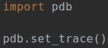

**从 3.7 开始，可以用断点()代替:**

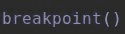

这是给谁的？问题是你已经可以在你的 IDE 中自动设置它了。所以如果你使用，比如，PyCharm，这对你来说不会是革命性的。

然而，主要的好处是，使用  `breakpoint()`，Python 开发团队能够解决以前调试器 pdb 的几个缺点。新功能只是更好，它简化了很多事情。

**b)[PEP 564](https://www.python.org/dev/peps/pep-0564/)—新增纳秒级分辨率的时间函数**

为了理解这种改进的影响，我们需要看一看 Python 中的纳秒问题。

Python 的  `time.time()` 依靠 64 位二进制浮点数进行精度。但是这有一个严重的缺点。104 天后,“浮动”型开始失去纳秒。

看一看 PEP 中的例子。将 int 纳秒转换为 float 秒，然后再转换回 int 纳秒，这是一个很好的可视化问题的方法:

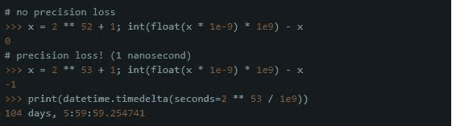

为了帮助解决可能由此产生的问题，增加了六个新功能:

*   `time.clock_gettime_ns(clock_id)`
*   `time.clock_settime_ns(clock_id, time: int)`
*   `time.monotonic_ns()`
*   `time.perf_counter_ns()`
*   `time.process_time_ns()`
*   `time.time_ns()`

不同的函数为开发人员提供了更高的精确度。它们以 Python int 的格式返回若干纳秒。有了这些替代方法，开发人员可以避免使用有问题的 time.time()函数。

**c)[PEP 557](https://www.python.org/dev/peps/pep-0557/)—数据类**

这个 PEP 引入了一个新的数据类，可以使用`@dataclass` decorator 来应用它，所以开发人员不需要做任何修改——除非是需要特殊逻辑的情况。

`@dataclass` 是一种包含其他函数或类的包装器。这里有一个例子:

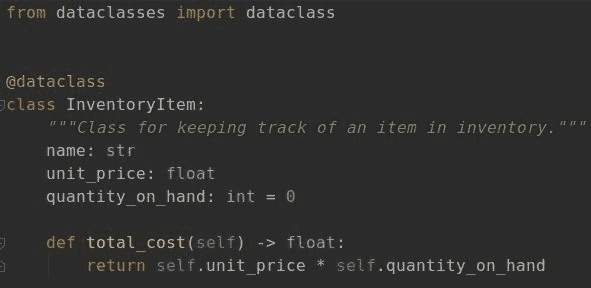

`@dataclass` 装饰器为我们创建了特殊的“dunder”(双下双奇迹)函数，它们是:

*   `__init__ - constructor`
*   `__repr__ - string object representation`
*   `__eq__ - object comparison method using the == operator`
*   `__ne__- object comparison method using the != operator`
*   ` __lt__- object comparison method using the < operator`
*   `__le__- object comparison method using the <= operator`
*   `__gt__- object comparison method using the > operator`
*   `__ge__- object comparison method using the >= operator`

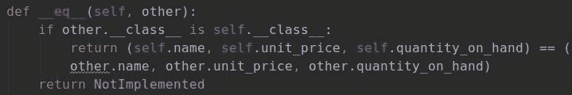

最酷的是  `@dataclasses` 自己比较字段，不需要更多东西。

**d) importlib.resources**

3.7 引入了 importlib.resources 库。它被用作打开包并从中读取数据的简单方法。它使得从非 Python 文件中提取数据变得简单。

看看 3.6 中的这个例子:

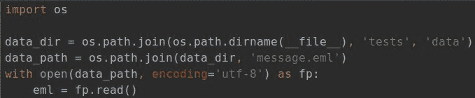

使用 PKG 资源:

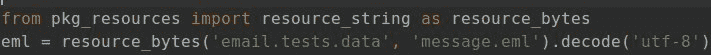

现在，Python 3.7 和 importlib:

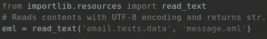

如果您使用的是 Python 3.6 或更低版本，可以查找 importlib_resources 库，它是这个函数的反向端口。

**e)[PEP 563](https://www.python.org/dev/peps/pep-0563/)—延期评估注解**

这里介绍一个特殊的  `_annotations_` 模块。最重要的是，该模块用于保存函数和变量注释的字符串表示。而不是在定义函数时对它们求值，它们变成了存储在  `_annotations_`中的字符串。

看看 3.6 中的一个类似函数:

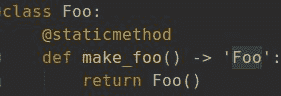

在 3.7 中，它不再是字符串表示，而是在注释中计算的类名:

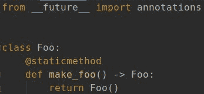

从 3.7 开始，第一行(`from __future__ import annotations`)是必需的。如果不把它添加到文件的顶部，编译器会抛出一个 NameError 异常，就好像这个特性不存在一样。

根据 PEP，这个注释在 4.0 中将是默认的。你为什么需要它？

一个很好的例子是使用样式检查器用注释中的数据来验证函数/变量输出数据。可以像这样使用 MyPy 进行静态代码分析。此外，这一功能的设计考虑到了它的前身(意为  [PEP484](https://www.python.org/dev/peps/pep-0484/) 和  [PEP0526](https://www.python.org/dev/peps/pep-0526/) )，它使那些打字执行速度比以前快 7 倍。

**f)[PEP 567](https://www.python.org/dev/peps/pep-0567/)—上下文变量**

这是一种管理上下文变量的新机制。PEP 将此解释为简化异步编程中变量管理的附加元素(例如，当您使用 asyncio 时)。

引入了两个新类别:

*   `contextvars.Context`
*   `contextvars.ContextVar`

使用  `.Context`，您可以从同一个上下文变量中提取各种数据，这对于异步作业中的数据交换是足够的。

要使用上下文变量，PEP 建议声明一个  `ContextVar`对象，作为在特定上下文中存储数据的一种键。然后，您可以使用“get”来接收当前值，并使用“set”来修改变量值。

**这里有一个简单的例子，展示了使用 `contextVar` 与使用普通变量的不同之处:**

**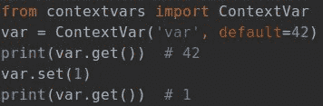**

**关于`Context.run`的复杂例子，看看这个:**

**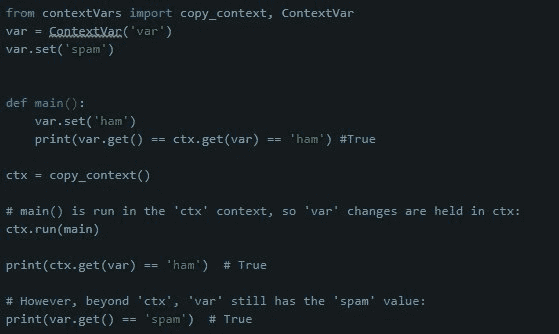**

首先，就像这个简单的例子一样，我们创建一个上下文变量。

然后我们定义 main 函数，在这个函数中，我们使用“set”来更改上下文变量。

接下来，我们复制尚未调用的 main 函数范围之外的上下文。asyncio 环境中的任何上下文复制都会转换成略有不同的数据，称为“弱引用”。

我们在上下文中运行 main 函数。如您所见，它接受新的参数，这些参数在 run 中交换。

这不是关于上下文的唯一有趣的事情，如果你想了解更多，分析一下  [PEP](https://www.python.org/dev/peps/pep-0567/) 。

##### 2.Python 3.8 重要的新功能和变化

**a)F-Strings—自记录表达式(调试)**

这使您能够打印出变量的值。它是在 3.6 版本中引入的，支持打印和格式化文本(而不是  `.format`)。在 3.8 中，F-strings 增加了一个调试选项。

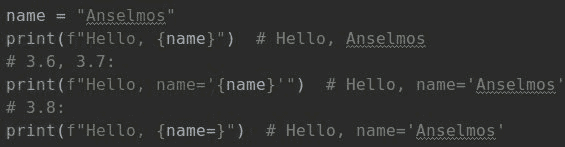

可以看到，这里还有  `‘name’ to ‘name=’` 的变化。它支持变量的调试打印，因为它打印变量的值和名称。

**b)[PEP 572](https://www.python.org/dev/peps/pep-0572/)—赋值表达式:=(臭名昭著的海象)**

这是 Python 3.8 中最有争议的变化。它引入了一种新的赋值符号，它就是  `:=`。

它被昵称为“海象”,因为这个符号有点像动物的尖牙和眼睛。这种新的符号可以在创建不同的表达式时赋值，例如列表理解。

海象实际上是吉多·范·罗苏姆辞去 Python 的 BDFL 角色的重要原因之一(如果你不知道 BDFL 是什么意思，可以查看本文的  [快速回顾—Python 基础知识](https://stxnext.com/blog/2020/04/10/whats-new-python-updates/#quick-recap) 部分)。

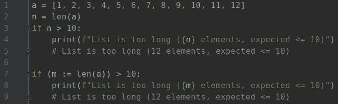

您可以在“if”语句中声明一个变量。不需要在函数前声明。

**c) [PEP 570](https://www.python.org/dev/peps/pep-0570/) —Python 仅位置参数**

在 Python 中有位置参数和关键字参数。这就造成了混乱。

为了帮助您避免这种混淆，本 PEP 引入了新的语法。它添加了一个斜杠“/”，可用于将参数设置为仅位置参数。

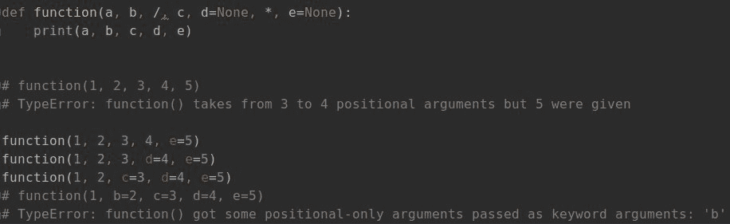

##### 3.Python 3.9 重要的新功能和变化

3.9 版本仍处于 alpha 阶段，并且仅用于测试。这意味着您不应该将它用于您的生产代码库。有很多小的变化，还没有新的功能，只有优化和错误修复。以下优化是最重要的:

**a) [过时的解析器模块](https://docs.python.org/3.9/library/parser.html#module-parser)替换成了[的 ast 模块](https://docs.python.org/3.9/library/ast.html#module-ast)**

`parser` 模块用于从 Python 文件中提取数据，本质上是用 Python 来解析 Python。现在已经过时了，Python 开发团队建议不要使用  `parser`，在新版本中将会移除。现在用  `ast`为宜。

`Ast` 接手  `parser`的角色大概是 3.2 版本的时候，不过现在它的角色在增加。感谢  *ast* ，我们可以在 Python 代码内部分析 Python 代码，提取出你导入某个模块的次数等信息。

示例:

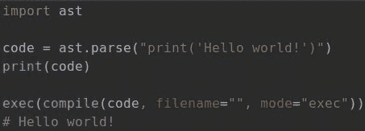

b) [多行 ast.dump()](https://bugs.python.org/issue37995)

`ast.dump` 函数收到了一个新参数:“缩进”。当将解析的 Python 代码的内容移动到控制台时，它附带了添加多行的选项。

示例:

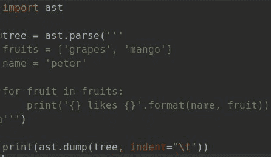

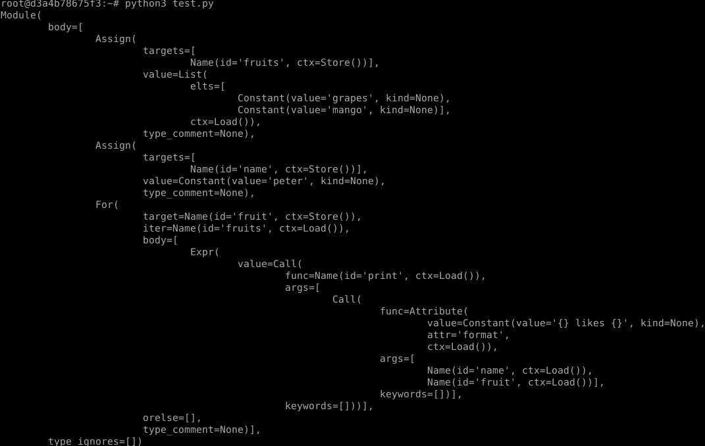

在分析这个特性的时候，我碰到了一个叫[as pretty](https://github.com/asottile/astpretty)的包，也是启用多行的。它做的事情和 ast.dump 一样，没有缩进和制表。

**这里的命名略有不同 :**

**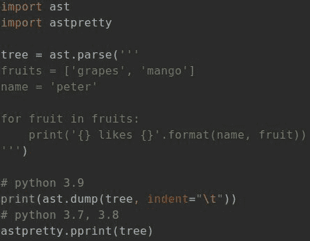**

**c)运行 Python 3.9 alpha 版本**

启动 alpha 有三种主要方式:

*   **使用 Docker**

Docker 是一个用于虚拟化和容器化的套件，你可以在系统库之外运行你的应用。要启动 Python 3.9，您需要获得 Docker:

*docker 拉 python:3.9.0a4*

然后运行它:

*docker run-it python:3 . 9 . 0 a4/bin/python*

*   **使用 PyENV**

首先根据 GitHub 上的  [说明安装 PyENV。](https://github.com/pyenv/pyenv)

接下来，您将能够通过 PyENV 安装 3.9，包括:

*pyenv 安装 3.9-dev*

但这还不是全部。您需要添加插件才能创建虚拟环境:

*git 克隆[【https】:/github。com/【pyenv】/【pyenv】虚拟环境【git】](https://github.com/pyenv/pyenv-virtualenv.git)$(pyenv root)/plugins/pyenv-virtualenv*

然后你创建了 virtualenv:

*pyenv virtualenv 3.9-dev venv 3.9*

最后，激活 virtualenv:

*pyenv 激活 venv3.9*

*   **使用 Ubuntu/Debian PPA**

最后一个选择是 PPA 的 Ubuntu。

您可以使用 apt-get 和 add-apt-repository 安装 Python 3.9:

*sudo apt-get install-y software-properties-common*

*sudo add-apt-repository PPA:dead snakes/nightly*

*须藤 apt 更新&须藤 apt 安装 python3.9*

#### 最后的想法

Python 一直在发展，Python 开发人员社区最近面临着几个大的变化。

既然最初的创造者已经从他作为所有 Python 事物的全能仲裁者的角色退休了，事情会有所不同吗？

Python 一直是一个非常受社区驱动的项目，并且很可能会以这种精神继续下去。除了吉多·范·罗苏姆下台之外，技术和生态系统的实施流程没有任何变化。

告别 Python 2 之后，新 Python 版本的开发可能会更快。但这只是猜测，我们还得拭目以待。

同时，如果你渴望更多高质量的分析，我们的博客上有大量关于 Python 的文章。我们认为您可能会对这些特别感兴趣:

*   [Python 2.7 到 3。x 迁移指南:如何从 Python 2 移植到 Python 3](/blog/python-3-migration-guide/)
*   [您应该从 Python 2 迁移到 Python 3 的 5 个理由](/blog/why-migrate-from-python-2-to-python-3/)
*   [最好的 Python IDEs 和代码编辑器(根据我们的开发人员和 Python 社区)](/blog/best-python-ides-code-editors/)
*   [如何学习 Python:顶级网站和课程，从初学者到专业人员](/blog/learn-python-top-sites-courses/)

最后但同样重要的是，如果您有任何问题，请随时与  [联系](https://stxnext.com/contact-us/)！我们希望收到您的来信。

